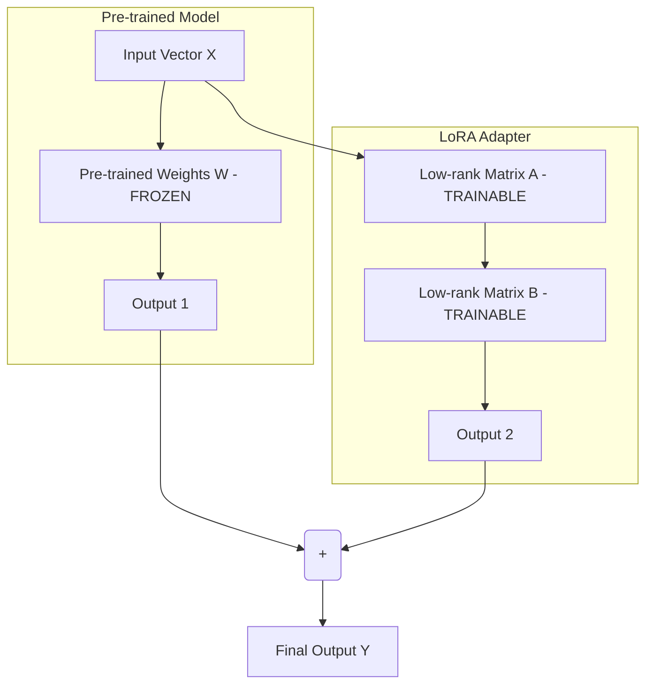

# Nghệ thuật mài giũa AI: Đi sâu vào thế giới Fine-tuning

Khi bắt đầu làm việc với các Mô hình Ngôn ngữ Lớn (LLM), bạn sẽ nhanh chóng nhận ra rằng dù chúng rất thông minh nhưng đôi khi lại giống như những "học giả biết tuốt" — cái gì cũng biết một chút nhưng lại thiếu đi sự sâu sắc và đặc thù mà doanh nghiệp của bạn thực sự cần. Lúc này, bạn đứng trước một quyết định quan trọng: Chấp nhận sử dụng các kỹ thuật viết prompt phức tạp, hay tiến hành tác động trực tiếp vào "não bộ" của mô hình. Quá trình tác động và huấn luyện lại đó được gọi là **Fine-tuning** (Tinh chỉnh mô hình).

## Khi "học giả biết tuốt" đi học lớp chuyên ngành

Về mặt kỹ thuật, Fine-tuning là quá trình lấy một mô hình AI đã được huấn luyện trên một lượng dữ liệu khổng lồ (Pre-trained Foundation Model) và tiếp tục huấn luyện nó trên một tập dữ liệu nhỏ hơn, mang tính đặc thù của một lĩnh vực cụ thể (domain-specific data). Mục tiêu cốt lõi ở đây là điều chỉnh các trọng số (weights) của mô hình để cải thiện hiệu suất cho một tác vụ chuyên biệt, dạy cho nó một giọng điệu (tone/style) mới, hoặc tích hợp các kiến thức nghiệp vụ sâu mà không cần phải chi hàng chục triệu USD để huấn luyện lại một mô hình từ con số 0.

Nếu giải thích dưới góc độ học máy (Machine Learning), Fine-tuning chính là ứng dụng thực tế của **Transfer Learning (Học chuyển giao)**. Thay vì khởi tạo ngẫu nhiên các trọng số của mạng nơ-ron, chúng ta tận dụng bộ trọng số đã hội tụ từ một mô hình lớn (như Llama 3, Qwen hoặc BERT) vốn đã hiểu sâu sắc về ngữ pháp, cú pháp và thế giới quan chung. Tiếp theo, ta sử dụng thuật toán lan truyền ngược (backpropagation) cùng với tập dữ liệu chất lượng cao của riêng mình để cập nhật lại bộ trọng số này, giúp mô hình nhanh chóng trở thành một "chuyên gia" trong ngách hẹp.

## Tại sao chúng ta cần Fine-tuning?

Mặc dù các mô hình nền tảng ngày càng mạnh mẽ ở khả năng Zero-shot và Few-shot, các kỹ sư trong doanh nghiệp vẫn thường tìm đến Fine-tuning để giải quyết ba bài toán lớn:

1. **Thích ứng với ngôn ngữ và kiến thức chuyên biệt**: Các thuật ngữ y khoa chuyên sâu, biệt ngữ pháp lý, hay thậm chí là cấu trúc của các tệp log nội bộ công ty thường không xuất hiện nhiều trên Internet công cộng. Fine-tuning giúp mô hình làm quen và xử lý các loại dữ liệu dị biệt này một cách trơn tru.
2. **Định hình hành vi và cấu trúc đầu ra**: Nếu bạn muốn chatbot luôn trả lời bằng phong cách lịch thiệp của một giao dịch viên ngân hàng (Brand Voice), hoặc bắt buộc phải xuất ra dữ liệu định dạng JSON lồng nhau phức tạp, việc chỉ dựa vào Prompt Engineering đôi khi sẽ cho ra kết quả phập phù. Fine-tuning sẽ biến các quy luật này thành bản năng của mô hình.
3. **Tối ưu hóa chi phí vận hành (Inference Cost)**: Để LLM hiểu được ngữ cảnh mà không cần fine-tune, chúng ta phải nhồi nhét rất nhiều ví dụ (Few-shot) vào prompt. Việc này làm tăng đáng kể số lượng token đầu vào trong mỗi yêu cầu. Bằng cách "nướng" (bake) trực tiếp các ví dụ mẫu này vào trọng số của mô hình thông qua Fine-tuning, bạn có thể rút gọn prompt của mình và tiết kiệm một khoản chi phí API khổng lồ ở pha vận hành thực tế.

## Con đường tối ưu hóa: Full Fine-tuning hay PEFT?

Khi tiến hành tinh chỉnh, thách thức lớn nhất của các kỹ sư là làm sao để mô hình học được kiến thức mới mà không bị mất đi những khả năng suy luận logic cơ bản sẵn có — một hiện tượng trong học máy gọi là **Catastrophic Forgetting (Quên thảm khốc)**.

Hiện nay, có hai trường phái Fine-tuning chính:

1. **Full Fine-tuning (Tinh chỉnh toàn bộ)**: Chúng ta cho phép thuật toán cập nhật lại toàn bộ 100% tham số của mô hình. Cách làm này đòi hỏi tài nguyên tính toán (GPU) cực kỳ khủng khiếp, thời gian huấn luyện lâu và tiềm ẩn rủi ro cao khiến mô hình bị mất đi tính tổng quát.
2. **PEFT (Parameter-Efficient Fine-Tuning)**: Một phương pháp thông minh hơn nhiều. Chúng ta đóng băng (freeze) phần lớn các trọng số gốc của mô hình nền tảng và chỉ huấn luyện một số lượng tham số bổ sung cực kỳ nhỏ (thường dưới 1%). Kỹ thuật PEFT nổi tiếng và được áp dụng rộng rãi nhất hiện nay chính là **LoRA (Low-Rank Adaptation)**.

## Kiến trúc và Cơ chế hoạt động của LoRA

Vì chi phí phần cứng cho việc tinh chỉnh toàn bộ mô hình quá đắt đỏ, LoRA đã trở thành tiêu chuẩn công nghiệp khi các kỹ sư muốn tự tinh chỉnh các mô hình ngôn ngữ lớn (LLM).

Nguyên lý hoạt động của LoRA rất trực quan:
1. **Đóng băng trọng số gốc**: Giữ nguyên ma trận trọng số gốc ($W$) của mô hình pre-trained và không cập nhật chúng.
2. **Chèn ma trận rank thấp**: Chèn song song với ma trận gốc $W$ hai ma trận nhỏ hơn nhiều (gọi là ma trận $A$ và $B$).
3. **Huấn luyện tiết kiệm**: Trong quá trình lan truyền ngược, chỉ có các tham số của ma trận $A$ và $B$ được phép học và cập nhật. Vì chiều (rank) của chúng rất nhỏ, số lượng tham số cần huấn luyện giảm đi tới $10,000$ lần. Điều này cho phép bạn tinh chỉnh các mô hình hàng chục tỷ tham số ngay trên các dòng card đồ họa phổ thông (như RTX 3090/4090) thay vì các cụm máy chủ A100 đắt đỏ.
4. **Gộp trọng số (Merging)**: Khi đưa mô hình ra chạy thực tế (inference), ta chỉ cần nhân ma trận $A$ và $B$ lại rồi cộng trực tiếp vào ma trận gốc ($W_{new} = W + A \times B$). Nhờ vậy, mô hình sau khi fine-tune không hề phát sinh thêm độ trễ (latency) khi phản hồi.

Sơ đồ dưới đây minh họa cách LoRA hoạt động song song với mô hình gốc:



## Thực hành: Cấu hình Fine-tuning với Hugging Face Trainer

Dưới đây là đoạn code Python mẫu sử dụng thư viện `transformers` và `peft` để thiết lập tinh chỉnh mô hình ngôn ngữ lớn bằng kỹ thuật LoRA (PEFT):

```python
from transformers import AutoModelForCausalLM, AutoTokenizer, TrainingArguments, Trainer
from datasets import load_dataset
from peft import LoraConfig, get_peft_model

# 1. Tải mô hình nền tảng và Tokenizer
model_id = "meta-llama/Meta-Llama-3-8B-Instruct"
tokenizer = AutoTokenizer.from_pretrained(model_id)
tokenizer.pad_token = tokenizer.eos_token

model = AutoModelForCausalLM.from_pretrained(
    model_id,
    device_map="auto",
    load_in_8bit=True # Tải mô hình dưới dạng lượng tử hóa 8-bit để tiết kiệm VRAM
)

# 2. Cấu hình LoRA (PEFT Adapter)
lora_config = LoraConfig(
    r=8,                       # Rank của ma trận (càng cao càng chi tiết nhưng tốn bộ nhớ)
    lora_alpha=16,             # Hệ số tỷ lệ (scaling factor)
    target_modules=["q_proj", "v_proj"], # Các module chú ý (attention modules) cần tinh chỉnh
    lora_dropout=0.05,
    bias="none",
    task_type="CAUSAL_LM"
)

# Bọc mô hình gốc với adapter LoRA
model = get_peft_model(model, lora_config)
model.print_trainable_parameters() # Hiển thị số lượng tham số có thể huấn luyện

# 3. Chuẩn bị tập dữ liệu huấn luyện
dataset = load_dataset("json", data_files={"train": "dataset_train.json"})

# 4. Định nghĩa các tham số huấn luyện (Training Arguments)
training_args = TrainingArguments(
    output_dir="./lora_results",
    per_device_train_batch_size=4,
    gradient_accumulation_steps=4,
    learning_rate=2e-4,
    logging_steps=10,
    max_steps=100,
    fp16=True,                  # Sử dụng Mixed Precision Training 16-bit
    optim="paged_adamw_8bit"    # Optimizer tối ưu hóa bộ nhớ GPU
)

# 5. Khởi tạo Trainer và tiến hành tinh chỉnh
trainer = Trainer(
    model=model,
    train_dataset=dataset["train"],
    args=training_args,
    data_collator=lambda data: tokenizer([d["text"] for d in data], padding=True, return_tensors="pt")
)

trainer.train()
```

---

## Sai lầm thường gặp và Best Practices

### Best Practices
* **Chất lượng đánh bại số lượng (Quality beats Quantity)**: Bạn không cần tới hàng trăm ngàn mẫu dữ liệu. Đối với nhiều tác vụ chuyên biệt, đôi khi chỉ cần 500 đến 1000 mẫu dữ liệu được dán nhãn thủ công một cách chuẩn xác, sạch sẽ, không lỗi chính tả và đồng nhất định dạng là đã đủ để mang lại kết quả vượt trội.
* **Tuân thủ nghiêm ngặt Chat Template**: Hãy đảm bảo dữ liệu huấn luyện của bạn sử dụng đúng cấu trúc định dạng prompt (Chat Template) của mô hình gốc (ví dụ: ChatML hoặc Llama-3-Instruct template). Bất kỳ sự sai lệch nào ở bước này cũng khiến mô hình hiểu sai ngữ cảnh khi chạy thực tế.
* **Bắt đầu với LoRA trước**: Đừng vội vàng nghĩ đến Full Fine-tuning trừ khi bạn đang cố gắng dạy cho mô hình một ngôn ngữ tự nhiên mới hoàn toàn. LoRA luôn là điểm khởi đầu kinh tế và an toàn nhất.

### Sai lầm thường gặp (Common Pitfalls)
* **Không theo dõi hiện tượng Overfitting (Học vẹt)**: Nếu hàm Loss trên tập huấn luyện liên tục giảm sâu nhưng Loss trên tập kiểm thử (validation) lại đi ngang hoặc tăng lên, mô hình của bạn đang rơi vào tình trạng "học vẹt". Hãy áp dụng kỹ thuật dừng sớm (Early Stopping) hoặc tăng tỷ lệ Dropout để điều chỉnh.
* **Catastrophic Forgetting (Quên thảm khốc)**: Quá trình tinh chỉnh quá mức trên một tập dữ liệu ngách mới sẽ bị suy giảm mạnh mẽ hoặc mất hẳn các năng lực suy luận logic tổng quát và kiến thức nền tảng ban đầu. Để giảm thiểu rủi ro này, hãy chèn thêm một phần nhỏ dữ liệu tổng quát phổ thông vào tập dữ liệu tinh chỉnh mới (Data Mixing).

---

## Ưu nhược điểm và Đánh đổi (Pros & Cons)

### Ưu điểm (Pros)
* **Hiệu năng vượt trội trong ngách hẹp**: Một mô hình nhỏ (khoảng 8B tham số) được tinh chỉnh tốt hoàn toàn có thể vượt mặt một mô hình khổng lồ (70B tham số) chưa qua tinh chỉnh ở một tác vụ cụ thể.
* **Tiết kiệm chi phí suy luận**: Việc loại bỏ các ví dụ dài dòng trong prompt giúp giảm thiểu lượng token đầu vào, tối ưu chi phí API về lâu dài.
* **Bảo mật thông tin tối đa**: Doanh nghiệp có thể tải các mô hình mã nguồn mở về hạ tầng nội bộ (On-premise) để fine-tune mà không lo sợ rò rỉ dữ liệu nhạy cảm ra ngoài Internet.

### Nhược điểm & Đánh đổi (Cons & Trade-offs)
* **Dữ liệu mang tính tĩnh**: Kiến thức học được qua Fine-tuning bị khóa chặt tại thời điểm huấn luyện. Nếu bạn muốn mô hình trả lời về những sự kiện thời sự diễn ra vào ngày hôm sau, Fine-tuning sẽ bất lực (đây là lúc RAG phát huy thế mạnh).
* **Chi phí chuẩn bị dữ liệu đắt đỏ**: Việc xây dựng một bộ dữ liệu huấn luyện chất lượng cao đòi hỏi sự tham gia trực tiếp của các chuyên gia trong ngành để viết và kiểm định các câu trả lời mẫu.
* **Nguy cơ mất khả năng tổng quát**: Nếu không được kiểm soát tốt, mô hình có thể quá tập trung vào tác vụ mới mà quên đi các năng lực logic cơ bản khác.

---

## Khi nào nên dùng và khi nào không?

**Nên dùng khi:**
* Bạn muốn định hình lại phong cách trò chuyện, cá nhân hóa giọng điệu của chatbot một cách nhất quán.
* Hệ thống của bạn yêu cầu đầu ra là các cấu trúc dữ liệu phức tạp (như XML lồng sâu hoặc các câu lệnh truy vấn SQL đặc thù).
* Bạn muốn chắt lọc (distill) kiến thức từ các mô hình lớn, đắt tiền xuống các mô hình nhỏ gọn, tự host để chạy trên các thiết bị có tài nguyên hạn chế.

**Không nên dùng khi:**
* Mục tiêu của bạn chỉ là cập nhật thông tin, kiến thức mới, hoặc cho phép mô hình truy xuất tài liệu nội bộ công ty thay đổi theo ngày. Hãy chọn giải pháp **RAG (Retrieval-Augmented Generation)** vì việc nhồi nhét dữ liệu động vào trọng số mô hình bằng Fine-tuning vừa cực kỳ tốn kém vừa dễ gây ra ảo giác (hallucination).
* Bạn đang xây dựng một chatbot đa dụng (General Chatbot) phục vụ mọi chủ đề mà không có một tập dữ liệu chuyên sâu cụ thể nào.

---

## Góc phỏng vấn: Vượt qua các câu hỏi hóc búa

### 1. Sự khác biệt cốt lõi giữa RAG và Fine-tuning là gì? Khi nào nên chọn giải pháp nào?
* **Mục đích câu hỏi**: Kiểm tra tư duy thiết kế hệ thống GenAI và khả năng tối ưu hóa chi phí/hiệu năng của ứng viên.
* **Gợi ý trả lời**:
  * RAG giống như việc bạn cho phép học sinh mang **"sách giáo khoa hoặc tài liệu nội bộ"** vào phòng thi. Học sinh chỉ cần đọc tài liệu và trả lời câu hỏi. RAG cực kỳ mạnh trong việc cập nhật kiến thức thời gian thực, có nguồn gốc rõ ràng để giảm ảo giác và không cần huấn luyện lại.
  * Fine-tuning giống như việc bạn đưa học sinh đến một khóa học chuyên sâu để rèn luyện một **"kỹ năng mới hoặc ngôn ngữ mới"**, làm thay đổi cách tư duy ngay trong não bộ (cập nhật trọng số).
  * *Khi nào dùng RAG*: Khi dữ liệu thay đổi liên tục, cần độ chính xác cao về mặt thông tin thực tế.
  * *Khi nào dùng Fine-tuning*: Khi cần thay đổi hành vi, phong cách nói chuyện hoặc định dạng đầu ra của mô hình.
  * *Giải pháp tối ưu*: Sự kết hợp giữa hai thế giới. Chúng ta fine-tune một mô hình nhỏ để nó có khả năng đọc hiểu và tổng hợp tài liệu từ hệ thống RAG tốt hơn.

### 2. Hãy giải thích cơ chế của LoRA (Low-Rank Adaptation) và tại sao nó lại tiết kiệm tài nguyên tính toán?
* **Mục đích câu hỏi**: Đánh giá kiến thức sâu về mặt toán học và tối ưu hóa phần cứng của ứng viên.
* **Gợi ý trả lời**: Khi huấn luyện các mô hình lớn, việc cập nhật ma trận trọng số gốc $W$ kích thước $(d \times d)$ yêu cầu dung lượng bộ nhớ GPU khổng lồ để lưu trữ các trạng thái tối ưu hóa (optimizer states) và gradients. LoRA giải quyết bài toán này bằng cách đóng băng ma trận $W$ và chèn song song hai ma trận có rank thấp là $A$ kích thước $(d \times r)$ và $B$ kích thước $(r \times d)$ với giá trị rank $r$ cực kỳ nhỏ ($r \ll d$, ví dụ $r=8$ hoặc $16$). Trong suốt quá trình huấn luyện, chúng ta chỉ cập nhật trọng số cho ma trận $A$ và $B$. Điều này cắt giảm số lượng tham số cần tối ưu hóa lên tới hàng ngàn lần, giúp giảm thiểu đáng kể dung lượng VRAM cần thiết và cho phép chạy fine-tune trên các dòng GPU phổ thông.

### 3. Hiện tượng Catastrophic Forgetting (Quên thảm khốc) là gì và làm thế nào để giảm thiểu rủi ro này?
* **Mục đích câu hỏi**: Đánh giá kinh nghiệm thực tế của ứng viên trong việc giám sát và tinh chỉnh quá trình training mô hình.
* **Gợi ý trả lời**: Quên thảm khốc là hiện tượng mô hình sau khi được huấn luyện quá mức trên một tập dữ liệu ngách mới sẽ bị suy giảm mạnh mẽ hoặc mất hẳn các năng lực suy luận logic tổng quát và kiến thức nền tảng có được từ giai đoạn pre-training. Để hạn chế điều này, chúng ta có thể:
  1. Sử dụng tỷ lệ học tập (Learning Rate) nhỏ để tránh làm thay đổi quá mạnh các trọng số cũ.
  2. Áp dụng phương pháp pha trộn dữ liệu (Data Mixing): Chèn thêm một phần nhỏ dữ liệu tổng quát phổ thông vào tập dữ liệu tinh chỉnh mới.
  3. Sử dụng các phương pháp PEFT như LoRA, vì việc đóng băng ma trận trọng số gốc giúp bảo tồn nguyên vẹn các tri thức nền tảng của mô hình.

---

## Đọc thêm và Tài liệu tham khảo

1. [RLHF (Huấn luyện phản hồi từ con người)](/concepts/genai-ml/rlhf/) - Cơ chế tinh chỉnh mô hình dựa trên phản hồi của con người.
2. [RAG (Retrieval-Augmented Generation)](/concepts/genai-ml/rag/) - Cơ chế kết xuất thông tin động hỗ trợ sinh văn bản.
3. [Prompt Engineering (Kỹ nghệ gợi ý)](/concepts/genai-ml/prompt-engineering/) - Thiết kế các mẫu chỉ thị để hướng dẫn mô hình.
4. **"Language Models are Few-Shot Learners"** - Brown et al. (OpenAI, 2020) (Nghiên cứu gốc giới thiệu khái niệm In-Context Learning cùng GPT-3).
5. **"Chain-of-Thought Prompting Elicits Reasoning in Large Language Models"** - Wei et al. (Google Brain, 2022).
6. **Anthropic / OpenAI API Best Practices** - Các hướng dẫn kỹ thuật chính thức từ nhà sản xuất.

---

## English Summary

Fine-tuning is a transfer learning technique in which a pre-trained Foundation Model is further trained on a smaller, domain-specific dataset. This process updates the model's internal weights to adapt to specialized tasks, adhere to strict output formats, or adopt a specific brand voice, going beyond the capabilities of zero-shot prompt engineering. While Full Fine-tuning updates all parameters and is highly resource-intensive, modern approaches primarily utilize Parameter-Efficient Fine-Tuning (PEFT) methods like LoRA (Low-Rank Adaptation). LoRA freezes the original weights and injects trainable low-rank matrices, dramatically reducing memory and computational costs. Fine-tuning excels at altering model behavior and tone but is inferior to RAG for injecting constantly changing factual knowledge.
