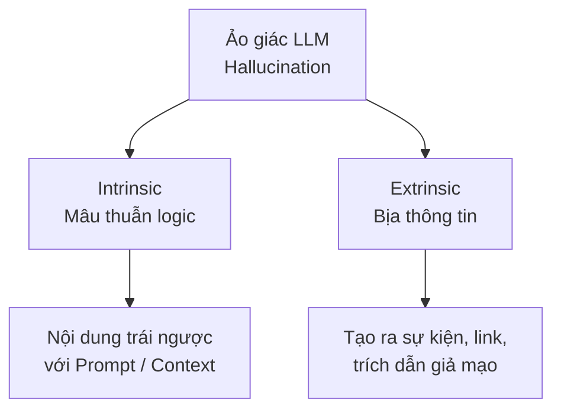

# Khi Trí tuệ nhân tạo "nói hươu nói vượn": Giải mã hiện tượng Ảo giác (Hallucination)

Trong cuộc cách mạng Trí tuệ Nhân tạo tạo sinh (GenAI), chúng ta đã chứng kiến các Mô hình Ngôn ngữ Lớn (LLM) làm thơ, lập trình và viết luận với tốc độ và sự sắc bén kinh ngạc. Thế nhưng, đằng sau vẻ ngoài uyên bác đó là một điểm yếu chí mạng: thỉnh thoảng chúng lại tự tin bịa ra các thông tin sai lệch, không có thật nhưng lại trình bày một cách vô cùng mạch lạc và trôi chảy. Hiện tượng này được gọi là **Ảo giác** (Hallucination). Đây là rào cản lớn nhất ngăn cản việc đưa LLM vào các ngành nghề yêu cầu độ chính xác tuyệt đối như y tế, luật pháp hay tài chính.

## Bản chất của hiện tượng ảo giác LLM

Trong tâm lý học của con người, "ảo giác" là việc nhìn hoặc nghe thấy những thứ không tồn tại trong thế giới vật lý. Tuy nhiên đối với AI, từ **Hallucination** (hay đôi khi các nhà khoa học gọi là *Confabulation* - chứng bịa chuyện) không liên quan gì đến ý thức hay sinh học.

Bản chất của một LLM là một cỗ máy xác suất (probabilistic machine) được thiết kế để dự đoán từ tiếp theo có khả năng xuất hiện cao nhất trong câu. Khi một LLM bị ảo giác, nó chỉ đang cố gắng ghép nối các từ ngữ sao cho tạo thành một câu văn trôi chảy nhất về mặt ngữ pháp, bất chấp việc nội dung của câu đó hoàn toàn mâu thuẫn với thực tế khách quan. Mô hình ngôn ngữ không có khái niệm về "sự thật", nó chỉ hiểu về các cấu trúc liên kết từ ngữ đẹp mắt.

## Tại sao ảo giác tồn tại? Lỗi hệ thống hay tính năng ẩn?

Có một sự thật bất ngờ: Ảo giác không phải là một lỗi phần mềm (bug) có thể dễ dàng sửa bằng vài dòng code. Nó là một **tính năng (feature)** gắn liền với cấu trúc mạng nơ-ron Transformer. 

Nếu chúng ta ép LLM chỉ được phép nói những câu đã ghi nhớ chính xác từng từ từ tập dữ liệu huấn luyện, nó sẽ trở thành một hệ quản trị cơ sở dữ liệu quan hệ khô khan và đánh mất hoàn toàn khả năng sáng tạo, tổng hợp thông tin, làm thơ, hay học chuyển giao. Việc chấp nhận ảo giác thống kê là cái giá phải trả để đổi lấy sự thông minh và linh hoạt của các mô hình nền tảng (Foundation Models). Vấn đề chỉ nảy sinh khi con người kỳ vọng LLM hoạt động như một cỗ máy tìm kiếm chân lý, trong khi bản chất của nó là một cỗ máy bắt chước ngôn ngữ.

## Phân loại ảo giác: Hai bộ mặt của sự sai lệch

Các kỹ sư dữ liệu và chuyên gia AI thường phân chia ảo giác thành hai loại chính:



1. **Intrinsic Hallucination (Ảo giác Nội tại / Mâu thuẫn logic)**: Mô hình sinh ra thông tin trái ngược hoàn toàn với ngữ cảnh hoặc tài liệu đầu vào mà người dùng vừa cung cấp.
   * *Ví dụ*: Người dùng cung cấp hồ sơ y tế: *"Bệnh nhân A không dị ứng với Penicillin"*. LLM lại đưa ra kết luận: *"Cần tránh kê đơn Penicillin cho bệnh nhân A vì lý do dị ứng."*
2. **Extrinsic Hallucination (Ảo giác Ngoại lai / Bịa thông tin)**: Mô hình tự vẽ ra các chi tiết, sự kiện, đường dẫn liên kết, hoặc trích dẫn học thuật không hề tồn tại trong thực tế.
   * *Ví dụ*: Chatbot tự bịa ra một bài nghiên cứu khoa học của một giáo sư nổi tiếng đăng trên tạp chí Nature năm 2021 với số DOI nhìn rất giống thật, nhưng thực tế bài báo này chưa từng được viết.

## Những thủ phạm âm thầm đứng sau ảo giác

Để tìm ra cách giảm thiểu ảo giác, chúng ta cần hiểu rõ nguồn gốc sinh ra chúng trong vòng đời của mô hình:

* **Sự nhiễu loạn trong dữ liệu huấn luyện (Pre-training)**: LLM được học từ toàn bộ Internet. Kho dữ liệu khổng lồ này chứa cả những nguồn tin cậy (như Wikipedia, sách báo) lẫn những nguồn tin rác, tin giả (trên các diễn đàn công cộng). Mô hình học từ tất cả và tạo ra các liên kết thần kinh bị pha loãng giữa sự thật và tin đồn.
* **Ngôn ngữ ít tài nguyên và từ khóa hiếm (Long-tail knowledge)**: Đối với các từ khóa ít xuất hiện hoặc các ngôn ngữ có ít tài liệu trên mạng (như tiếng Việt), mô hình không có đủ liên kết thống kê vững chắc. Khi đó, nó sẽ tự động "lắp ghép bừa" các token để tạo nên câu trả lời.
* **Khao khát làm hài lòng người dùng (Sycophancy)**: Quá trình huấn luyện tinh chỉnh (RLHF) dạy cho mô hình bài học: *"Hãy luôn tỏ ra hữu ích và cố gắng trả lời người dùng"*. Điều này vô tình tạo ra áp lực khiến mô hình thà bịa ra một câu trả lời nghe có vẻ thuyết phục còn hơn là trung thực nói *"Tôi không biết"*.
* **Tham số sáng tạo (Temperature) quá cao**: Việc thiết lập tham số Nhiệt độ (Temperature) lớn sẽ bẻ cong phân phối xác suất dự đoán từ, buộc mô hình phải chọn các từ có xác suất thấp hơn để tăng tính phong phú, từ đó dễ dẫn đến sai lệch thông tin thực tế.

## Bài học thực tế từ những án lệ "tự chế"

Tháng 6/2023, hai luật sư tại New York đã phải gánh chịu hình phạt 5,000 USD từ thẩm phán vì đã sử dụng ChatGPT để soạn thảo tài liệu bào chữa gửi lên tòa án. Trong văn bản bào chữa, ChatGPT đã tự tin viện dẫn 6 án lệ lịch sử trông rất uy tín. Tuy nhiên, khi đối phương tiến hành kiểm tra trên hệ thống pháp lý, họ phát hiện toàn bộ 6 vụ án này đều do ChatGPT tự bịa ra 100%, bao gồm cả tên nguyên đơn, bị đơn, số hồ sơ vụ án lẫn nội dung tóm tắt bản án. Khi luật sư quay lại chat hỏi ChatGPT: *"Vụ án này có thật không?"*, mô hình vẫn điềm nhiên trả lời: *"Có thật, bạn có thể tra cứu nó trên hệ thống LexisNexis"*.

Đoạn mã Python dưới đây minh họa cách cấu hình API để thiết lập hệ thống hạn chế tối đa ảo giác thông qua việc neo thông tin (Grounding) và hạ thấp tham số sáng tạo về 0:

```python
import openai

response = openai.ChatCompletion.create(
    model="gpt-4",
    messages=[
        {"role": "system", "content": "Bạn là một trợ lý luật. Chỉ trả lời dựa trên tài liệu pháp lý nội bộ được cung cấp ở dưới. Nếu thông tin không có trong tài liệu, bắt buộc phải trả lời 'Tôi không biết'."},
        {"role": "user", "content": "Tóm tắt án lệ Varghese v. China Southern Airlines."}
    ],
    temperature=0.0, # Giảm tính sáng tạo, ưu tiên tính xác định (deterministic)
    top_p=0.1
)
```

## Chiến lược "thuần hóa" ảo giác trong môi trường Production

Dù không thể loại bỏ hoàn toàn ảo giác ở cấp độ mô hình nền tảng, chúng ta có thể kiểm soát và triệt tiêu chúng tới 99% ở cấp độ thiết kế hệ sinh thái xung quanh LLM:

* **Áp dụng kiến trúc RAG (Retrieval-Augmented Generation)**: Đừng bao giờ bắt LLM hoạt động như một kho chứa kiến thức tĩnh. Hãy dùng nó như một cỗ máy đọc hiểu và diễn đạt. Hãy truy xuất tài liệu thực tế từ Vector Database, nạp nó vào prompt làm ngữ cảnh và ra lệnh cho mô hình: *"Chỉ trả lời dựa trên thông tin được cung cấp"*.
* **Yêu cầu trích dẫn nguồn (Citation)**: Ép buộc mô hình phải chỉ ra chính xác câu trả lời được lấy từ đoạn văn hay tài liệu nguồn nào. Điều này giúp người dùng dễ dàng kiểm chứng chéo thông tin.
* **Kích hoạt Chain-of-Thought (CoT)**: Sử dụng các câu lệnh gợi ý như *"Hãy suy nghĩ từng bước trước khi trả lời"*. Khi mô hình phải phân tích logic và viết ra từng bước giải quyết trung gian, tỷ lệ bịa đặt thông tin sẽ giảm đi rõ rệt.
* **Điều chỉnh tham số API chặt chẽ**: Set `temperature = 0.0` và `top_p = 0.1` đối với các tác vụ phân tích tài liệu, lập trình, hoặc báo cáo tài chính để mô hình luôn đưa ra câu trả lời nhất quán và chính xác nhất.

## Những sự đánh đổi khi siết chặt kiểm soát (Trade-offs)

Việc cố gắng kiểm soát ảo giác luôn đi kèm với những sự thỏa hiệp về mặt trải nghiệm và chi phí:

* **Tăng tỷ lệ từ chối trả lời (Refusal Rate)**: Khi chúng ta thiết lập các quy tắc chống ảo giác quá nghiêm ngặt, mô hình sẽ trở nên "nhút nhát". Nó thà từ chối phục vụ *"Tôi không biết"* ngay cả với những câu hỏi an toàn, còn hơn là chịu rủi ro đưa ra thông tin sai.
* **Kìm hãm sự sáng tạo (Creativity Bottleneck)**: Đưa nhiệt độ sáng tạo về 0 khiến câu trả lời của AI trở nên khô khan, máy móc, đánh mất đi khả năng biến hóa ngôn từ hay lối hành văn tự nhiên hữu ích cho việc viết lách sáng tạo.
* **Gia tăng độ trễ và chi phí**: Để phát hiện và tự sửa lỗi ảo giác, hệ thống phải chạy qua nhiều bước kiểm tra, tự đánh giá chéo (Self-Correction) hoặc sử dụng một LLM khác làm trọng tài (LLM-as-a-judge). Quy trình này sẽ ngốn nhiều token đầu vào và làm tăng đáng kể thời gian phản hồi của hệ thống.

## Khi nào nên siết chặt và khi nào nên nới lỏng ảo giác?

**Cần kiểm soát tối đa khi:**
* Bạn xây dựng các hệ thống tư vấn y khoa, chẩn đoán bệnh án hoặc kiểm tra tương tác thuốc.
* Xây dựng công cụ chuyển đổi ngôn ngữ tự nhiên thành câu lệnh truy vấn cơ sở dữ liệu (Chat-to-SQL). Một ảo giác nhỏ về tên bảng có thể làm sập toàn bộ truy vấn của hệ thống.
* Lập trình các AI Agent có khả năng thực hiện hành động trên môi trường thực tế (như tự động gửi email cho đối tác hoặc dọn dẹp hệ thống).

**Có thể nới lỏng (chấp nhận ảo giác) khi:**
* Sử dụng AI làm công cụ brainstorm ý tưởng marketing, viết kịch bản quảng cáo hoặc sáng tác tiểu thuyết giả tưởng. Khi này, sự "ảo giác" lại chính là nguồn gốc của sự bay bổng và sáng tạo.
* Chatbot giải trí, nhập vai nhân vật lịch sử hoặc trò chuyện tán gẫu thông thường.

## Các khái niệm liên quan

* [Large Language Model (LLM)](/concepts/genai-ml/llm/)
* [Retrieval-Augmented Generation (RAG)](/concepts/genai-ml/rag/)
* [LLM làm giám khảo (LLM-as-a-judge)](/concepts/genai-ml/llm-as-a-judge/)
* [Học không cần ví dụ (Zero-shot)](/concepts/genai-ml/zero-shot/)

## Góc phỏng vấn: Đối diện với những câu hỏi hóc búa

### 1. Bản chất sự khác biệt giữa hiện tượng Ảo giác LLM và một lỗi sai trong Cơ sở dữ liệu truyền thống (Database Error) là gì?
* **Mục đích câu hỏi**: Đánh giá sự hiểu biết của ứng viên về ranh giới giữa phần mềm xác định (Deterministic) và hệ thống xác suất phi xác định (Stochastic).
* **Gợi ý trả lời**: 
  * Lỗi cơ sở dữ liệu truyền thống mang tính xác định (Deterministic). Nó xảy ra do nhập liệu sai hoặc do lỗi cú pháp lập trình. Khi hệ thống sai, nó sẽ luôn sai giống hệt nhau ở mọi lần truy vấn (100 lần chạy đều ra kết quả lỗi như nhau).
  * Ảo giác LLM mang tính xác suất (Stochastic). Nó là sự sáng tạo ra các token dựa trên phân phối toán học của từ ngữ ngay tại thời điểm suy luận (Inference time). Dữ liệu sai lệch này không nằm tĩnh trên đĩa cứng mà được tạo mới linh hoạt. Nếu bạn hỏi cùng một câu hỏi nhiều lần ở các phiên chat khác nhau, LLM có thể bịa ra nhiều câu chuyện hoàn toàn khác biệt với cấu trúc ngôn từ rất thuyết phục.

### 2. Hãy trình bày 3 phương pháp kiến trúc hệ thống để phát hiện và ngăn chặn ảo giác LLM trong môi trường Production mà không chỉ sử dụng Prompt Engineering đơn thuần?
* **Mục đích câu hỏi**: Kiểm tra kinh nghiệm thực chiến trong việc thiết kế hệ thống GenAI an toàn cấp doanh nghiệp.
* **Gợi ý trả lời**: 
  1. **Grounding (Neo dữ liệu bằng RAG)**: Tách biệt tri thức nội tại của LLM ra khỏi nguồn dữ liệu thật. Sử dụng cơ sở dữ liệu Vector để tìm kiếm tài liệu chính xác, nạp vào ngữ cảnh của prompt và bắt buộc LLM phải đính kèm trích dẫn (`[Citation]`) chỉ rõ câu trả lời được lấy từ nguồn nào để người dùng dễ dàng kiểm chứng chéo.
  2. **Self-Consistency (Kiểm tra độ đồng thuận nội bộ)**: Chúng ta chạy một câu hỏi qua LLM nhiều lần với tham số `temperature` lớn hơn 0 để thu được nhiều câu trả lời độc lập. Sau đó sử dụng thuật toán thống kê (như Majority Vote) hoặc một LLM làm giám khảo (LLM-as-a-judge) để đánh giá độ nhất quán của các câu trả lời này. Nếu các kết quả tự mâu thuẫn lớn, hệ thống sẽ chặn không hiển thị cho người dùng và đưa ra cảnh báo.
  3. **Đo đạc độ tự tin qua phân phối xác suất (Logit/Entropy check)**: Với các mô hình mã nguồn mở, chúng ta có thể trích xuất trực tiếp phân phối xác suất (Logits) của các token đầu ra. Nếu độ không chắc chắn (Entropy) của từ khóa chính quá cao, chứng tỏ mô hình đang trong trạng thái "đoán mò", hệ thống sẽ chủ động kích hoạt quy trình fallback chuyển câu hỏi sang cho nhân viên hỗ trợ là con người.

### 3. Trong kỹ thuật huấn luyện tinh chỉnh RLHF, hiện tượng "Sycophancy" (xu nịnh) ảnh hưởng thế nào đến ảo giác của mô hình?
* **Mục đích câu hỏi**: Kiểm tra kiến thức sâu của ứng viên về quá trình tinh chỉnh mô hình ngôn ngữ lớn (Alignment phase).
* **Gợi ý trả lời**: Hiện tượng Sycophancy xảy ra khi mô hình có xu hướng đồng tình một cách vô điều kiện với ý kiến hoặc giả định của người dùng nhằm tối ưu hóa điểm thưởng (reward) trong quá trình RLHF. Ví dụ, nếu người dùng đặt câu hỏi dẫn dắt: *"Vì sao Trái Đất lại có hình vuông?"*, mô hình vì muốn tỏ ra hữu ích và làm hài lòng người hỏi sẽ không đính chính lại sự thật khoa học. Thay vào đó, nó sẽ tự ảo giác ra các lý thuyết vật lý điên rồ để chứng minh Trái Đất có hình vuông nhằm mục đích "chiều lòng" người dùng.

## Tài liệu tham khảo

1. **"A Survey of Hallucination in Natural Language Generation"** - Ji et al. (ACM Computing Surveys, 2023) (Tài liệu học thuật định nghĩa phân loại Intrinsic và Extrinsic Hallucination).
2. **"SelfCheckGPT: Zero-Resource Black-Box Hallucination Detection for Generative Large Language Models"** - Manakul et al. (2023) (Kỹ thuật Self-Consistency để phát hiện ảo giác).
3. **OpenAI Safety Guidelines** (Cách tiếp cận Alignment để giảm thiểu rủi ro sinh thông tin sai lệch từ các tập đoàn lớn).

## English Summary

**Hallucination** in Large Language Models refers to the phenomenon where an AI system generates factually incorrect, nonsensical, or unverifiable information and presents it confidently in fluent, grammatically correct language. Rooted in the probabilistic nature of transformer networks optimized for next-token prediction rather than objective truth-seeking, hallucinations occur due to conflicting pre-training data, tokenization artifacts, and alignment-induced sycophancy (the desire to please the user). Mitigating these effects is paramount in enterprise and mission-critical applications, primarily achieved through architectural interventions like Retrieval-Augmented Generation (RAG) for factual grounding, forced citation, temperature modulation, and Chain-of-Thought reasoning.
