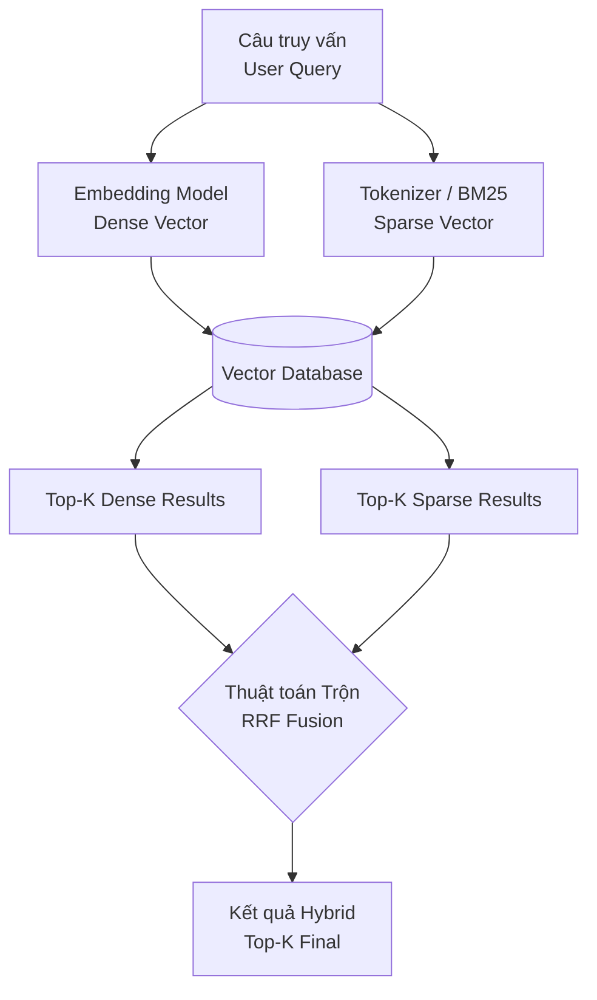

Trong các hệ thống hỗ trợ hỏi đáp bằng trí tuệ nhân tạo (RAG - Retrieval-Augmented Generation) hiện nay, việc tìm kiếm và truy xuất thông tin chính xác từ kho tài liệu khổng lồ là yếu tố quyết định chất lượng câu trả lời của LLM. Tuy nhiên, nếu chỉ sử dụng tìm kiếm thông thường hoặc tìm kiếm bằng vector, bạn sẽ sớm nhận ra những hạn chế lớn. Để giải quyết triệt để bài toán này, các kỹ sư dữ liệu đã kết hợp hai phương pháp tìm kiếm tưởng chừng như đối nghịch nhau thành một giải pháp ưu việt: **Tìm kiếm kết hợp** (Hybrid Search).

## Sự hòa quyện giữa ngữ nghĩa và từ khóa

Tìm kiếm kết hợp (Hybrid Search) là phương pháp truy xuất thông tin kết hợp đồng thời sức mạnh của hai trường phái tìm kiếm: **Tìm kiếm từ khóa chính xác (Keyword/Sparse Search)** và **Tìm kiếm ngữ nghĩa (Semantic/Dense Vector Search)**. Bằng cách hòa trộn và xếp hạng lại điểm số từ cả hai phương pháp này, Hybrid Search giúp khắc phục điểm yếu của từng kỹ thuật riêng lẻ, mang lại kết quả tìm kiếm chính xác và toàn diện nhất.

Trong các hệ thống tìm kiếm tài liệu hiện đại, chúng ta luôn có sự hiện diện của hai trường phái này:
1. **Tìm kiếm Dày (Dense / Vector Search)**: Đại diện bởi các cơ sở dữ liệu Vector và các mô hình Embeddings. Phương pháp này có khả năng thấu hiểu ngữ nghĩa và các từ đồng nghĩa (ví dụ: nó hiểu từ "chó" và "cún" có mối liên hệ mật thiết với nhau).
2. **Tìm kiếm Thưa (Sparse / Keyword Search)**: Đại diện bởi các thuật toán thống kê văn bản truyền thống như TF-IDF hoặc **BM25** (vốn là trái tim của Elasticsearch hay OpenSearch). Nó tập trung vào việc tìm kiếm các ký tự trùng khớp chính xác 100%.

Hybrid Search sẽ chạy song song một câu truy vấn của người dùng qua cả hai công cụ Dense và Sparse, lấy ra hai danh sách kết quả độc lập, sau đó sử dụng một thuật toán trộn (Fusion Algorithm) để hợp nhất chúng thành một danh sách kết quả tốt nhất trước khi gửi cho LLM xử lý.

## Tại sao Vector Search không thể hoàn toàn thay thế tìm kiếm từ khóa?

Khi công nghệ Vector Search ra đời, nhiều người từng nghĩ rằng thuật toán BM25 truyền thống sẽ sớm đi vào quên lãng. Tuy nhiên, khi triển khai các hệ thống RAG trong môi trường doanh nghiệp thực tế, các kỹ sư nhận ra Vector Search có một "gót chân Achilles" chí mạng: **Nó xử lý rất tệ các truy vấn chứa từ khóa đặc thù**.

Hãy lấy một ví dụ thực tế khi người dùng gõ câu hỏi: *"Đánh giá hiệu năng của bộ vi xử lý Intel Core i7-13700K trong năm 2023"*.
* **Vector Search** sẽ phân tích ngữ nghĩa và hiểu rằng người dùng đang tìm kiếm các bài viết đánh giá về vi xử lý máy tính. Do đó, nó có thể trả về bài viết về chip "AMD Ryzen 9" hoặc "Intel Core i5" vì trong không gian vector, các khái niệm này rất gần nhau. Tuy nhiên, nó lại bỏ qua cụm từ khóa cực kỳ quan trọng là mã sản phẩm "i7-13700K" vì cụm từ đó bị loãng ngữ nghĩa.
* **Keyword Search (BM25)** dù hoàn toàn không hiểu "hiệu năng" là cái gì, nhưng nó sẽ bám chặt lấy chuỗi ký tự "i7-13700K" và "2023" để bốc ra chính xác tài liệu chứa đúng các mã SKU này.

Trong thực tế doanh nghiệp, có đến 80% truy vấn của nhân viên hoặc khách hàng chứa các thông tin đặc thù như mã sản phẩm (SKU), tên riêng, từ viết tắt, email hoặc mã số định danh. Đây là những thông tin yêu cầu khớp chữ hoàn hảo. Do đó, Keyword Search là không thể thay thế. Hybrid Search ra đời chính là để lấy điểm mạnh của phương pháp này bù đắp cho điểm yếu của phương pháp kia.

## Giải mã thuật toán RRF: Công bằng trong việc hòa trộn điểm số

Thách thức lớn nhất của Hybrid Search là: Làm sao để cộng điểm số của hệ thống BM25 (thường là một số thực không giới hạn, ví dụ từ 0 đến 100) với điểm số của Vector Search (thường là Cosine Similarity nằm trong khoảng từ -1 đến 1)? Vì hai thang đo này không cùng hệ quy chiếu, việc cộng trực tiếp sẽ là một thảm họa toán học.

Để giải quyết, thuật toán phổ biến nhất hiện nay không nhìn vào điểm số tuyệt đối, mà nhìn vào **Thứ hạng (Rank)** của tài liệu trong từng danh sách kết quả. Thuật toán này có tên là **Reciprocal Rank Fusion (RRF)**.

Công thức tính điểm RRF cho một tài liệu được định nghĩa như sau:

$$\text{RRF Score} = \frac{1}{k + \text{Rank}_{\text{dense}}} + \frac{1}{k + \text{Rank}_{\text{sparse}}}$$

*(Trong đó $k$ là một hằng số phạt, thường được mặc định bằng 60 để làm trơn điểm số).*

Nhờ công thức này, một tài liệu vừa nằm ở top đầu của danh sách tìm kiếm vector, vừa nằm ở vị trí cao trong danh sách tìm kiếm từ khóa sẽ được cộng hưởng điểm số và tự động đẩy lên vị trí số 1 trong kết quả cuối cùng.

## Quy trình hoạt động của Hybrid Search dưới góc nhìn kiến trúc

Dưới đây là luồng xử lý truy vấn trong một Vector Database hỗ trợ tìm kiếm kết hợp (như Qdrant, Milvus hay Pinecone):



### 1. Giai đoạn Lập chỉ mục (Indexing)
* Dữ liệu văn bản thô được cắt nhỏ thành các phân đoạn (chunks).
* Mỗi phân đoạn đi qua Embedding Model để tạo ra Dense Vector (mảng số thực, ví dụ 768 chiều).
* Đồng thời, phân đoạn cũng đi qua bộ Tokenizer của thuật toán BM25 để tạo ra Sparse Vector (mảng thưa biểu diễn tần suất xuất hiện của từ).
* Cả hai định dạng Vector này được lưu trữ đồng thời vào cơ sở dữ liệu.

### 2. Giai đoạn Tìm kiếm (Searching)
* Khi người dùng gửi câu hỏi, hệ thống sẽ chuyển đổi câu hỏi đó thành cả Dense Vector lẫn Sparse Vector.
* Cơ sở dữ liệu thực hiện hai luồng truy vấn song song dưới nền.
* Thu về `Danh sách kết quả Vector (Top 20)` và `Danh sách kết quả Keyword (Top 20)`.
* Thuật toán RRF thực hiện trộn hai danh sách này lại.
* *Lưu ý*: Một số hệ thống cho phép tùy chỉnh tham số `Alpha` (từ 0.0 đến 1.0). Nếu $Alpha = 1.0$, hệ thống sẽ chạy thuần Vector Search. Nếu $Alpha = 0.0$, hệ thống chạy thuần Keyword Search. Thiết lập $Alpha = 0.5$ mang lại sự cân bằng 50/50 giữa hai phương pháp.

## Ứng dụng thực tế và Đoạn code triển khai nhanh

Hãy tưởng tượng bạn đang xây dựng hệ thống RAG để tra cứu văn bản pháp luật.

Người dùng đặt câu hỏi: *"Điều kiện bồi thường khi thu hồi đất nông nghiệp theo Nghị định 47/2014"*.
* **Sparse Search (BM25)** sẽ tìm kiếm và bốc ra các tài liệu chứa chính xác cụm từ *"Nghị định 47/2014"*.
* **Dense Search (Vector)** sẽ nắm bắt ngữ nghĩa của cụm *"điều kiện bồi thường đất nông nghiệp"* để tìm kiếm trong các luật sửa đổi mới (dù có thể các luật này không ghi trực tiếp số hiệu 47).
* **Hybrid Search** sẽ kết hợp cả hai và ưu tiên đưa tài liệu đáp ứng được cả hai tiêu chí (vừa liên quan đến đền bù đất nông nghiệp, vừa thuộc Nghị định 47/2014) lên vị trí đầu tiên để nạp vào LLM.

Đoạn code dưới đây minh họa cách cấu hình Hybrid Search bằng thư viện Client của Weaviate:

```python
response = (
    client.query
    .get("PhapLuat", ["noi_dung", "nghi_dinh"])
    .with_hybrid(
        query="Điều kiện bồi thường khi thu hồi đất nông nghiệp theo Nghị định 47/2014",
        alpha=0.5 # Alpha = 0.5 là cân bằng 50/50 giữa Vector Search và Keyword Search
    )
    .with_limit(3)
    .do()
)
```

## Cẩm nang thiết kế hệ thống tìm kiếm hiệu quả

* **Đặt Hybrid Search làm tiêu chuẩn mặc định cho RAG**: Bất kể bạn đang xây dựng ứng dụng RAG cho lĩnh vực nào, hãy cấu hình Hybrid Search ngay từ đầu thay vì chỉ dùng mỗi Vector Search. Các nghiên cứu đánh giá hiệu năng (như BEIR benchmark) đều chỉ ra rằng Hybrid Search giúp cải thiện độ chính xác tìm kiếm (chỉ số mAP) từ 15% đến 30%.
* **Điều chỉnh tham số Alpha linh hoạt theo loại tài liệu**: Nếu kho dữ liệu của doanh nghiệp chứa nhiều mã lỗi kỹ thuật, log hệ thống, SKU sản phẩm, hãy cấu hình Alpha thiên về Keyword Search (ví dụ Alpha = 0.3). Nếu tài liệu mang tính chất văn xuôi, blog, sáng tạo, hãy tăng Alpha về phía Vector Search (ví dụ Alpha = 0.7).
* **Ưu tiên sử dụng cơ sở dữ liệu hỗ trợ Native Hybrid**: Tránh việc dựng một server Elasticsearch riêng và một server Vector DB riêng rồi tự viết code Python để kéo dữ liệu về trộn. Việc này làm tăng độ trễ mạng và chi phí vận hành. Hãy chọn các cơ sở dữ liệu hỗ trợ lưu trữ và tính toán song song cả Dense và Sparse Vector trên cùng một node (như Milvus, Qdrant, Weaviate, Pinecone).

## Những cạm bẫy dễ vấp phải

* **Bỏ quên bộ tách từ (Tokenizer) tiếng Việt cho BM25**: Thuật toán BM25 dựa trên việc đếm tần suất xuất hiện của các từ đơn lẻ. Trong tiếng Anh, các từ cách nhau bằng khoảng trắng. Nhưng tiếng Việt là ngôn ngữ đơn tiết, các từ ghép như *"học sinh"* hay *"đất đai"* gồm hai âm tiết. Nếu bạn dùng bộ Tokenizer mặc định của tiếng Anh, nó sẽ cắt nát từ ghép thành các từ đơn lẻ *"học"*, *"sinh"*, làm giảm đáng kể hiệu quả của Keyword Search. Hãy tích hợp các công cụ tách từ tiếng Việt (như VnCoreNLP hoặc pyvi) trước khi đưa dữ liệu vào BM25.
* **Nhầm lẫn giữa Re-ranking và Hybrid Search**: Nhiều kỹ sư nghĩ rằng việc sử dụng các mô hình xếp hạng lại như Cohere Rerank ở bước cuối cùng đã là Hybrid Search. Thực chất, Reranker chỉ làm nhiệm vụ sắp xếp lại những kết quả *đã được tìm thấy*. Nếu ở bước truy xuất đầu tiên (Retriever), hệ thống Vector Search của bạn bị trượt và không bốc được tài liệu chứa mã sản phẩm cần tìm, thì Reranker ở bước sau cũng không có dữ liệu để sắp xếp. Bạn bắt buộc phải dùng Hybrid Search ngay từ tầng truy xuất đầu tiên.

## Được và mất khi chọn giải pháp Hybrid (Trade-offs)

### Điểm cộng
* **Độ bao phủ dữ liệu tối đa (High Recall)**: Giải quyết tốt cả bài toán hiểu ngữ nghĩa mơ hồ lẫn bài toán tìm kiếm mã số chính xác tuyệt đối.
* **Độ ổn định hệ thống cao**: Nếu mô hình Embedding của bạn hoạt động chưa tốt ở một lĩnh vực chuyên môn sâu, thuật toán BM25 sẽ đóng vai trò bệ đỡ kéo lại độ chính xác cho kết quả.

### Điểm trừ
* **Tiêu tốn dung lượng lưu trữ**: Cơ sở dữ liệu bắt buộc phải duy trì hai bộ chỉ mục (index) khác nhau, làm tăng dung lượng đĩa cứng và RAM lên gấp rưỡi hoặc gấp đôi.
* **Tăng nhẹ độ trễ truy vấn (Latency)**: Do phải thực hiện hai câu truy vấn song song và chạy thuật toán trộn điểm RRF, thời gian phản hồi của hệ thống sẽ chậm hơn vài chục mili-giây so với truy vấn đơn lẻ.

## Các khái niệm liên quan

* [Cơ sở dữ liệu Vector (Vector Database)](/concepts/genai-ml/vector-database/)
* [Retrieval-Augmented Generation (RAG)](/concepts/genai-ml/rag/)
* [Large Language Model (LLM)](/concepts/genai-ml/llm/)

## Góc phỏng vấn: Trả lời tự tin trước nhà tuyển dụng

### 1. Tại sao chúng ta không thể cộng trực tiếp điểm số Cosine Similarity của Vector Search và điểm số của thuật toán BM25 với nhau?
* **Mục đích câu hỏi**: Đánh giá kiến thức nền tảng toán học và xử lý số liệu của ứng viên trong hệ thống tìm kiếm thông tin.
* **Gợi ý trả lời**: Chúng ta không thể cộng trực tiếp vì hai điểm số này nằm trên hai thang đo hoàn toàn khác nhau. Điểm Cosine Similarity luôn được chuẩn hóa và giới hạn trong khoảng từ -1 đến 1 (trên thực tế thường dao động từ 0.7 đến 1.0). Trong khi đó, điểm BM25 là một con số mở không có giới hạn trên, phụ thuộc vào độ dài văn bản và tần suất xuất hiện từ khóa (có thể là 5, 20 hoặc 150). Nếu cộng trực tiếp, điểm BM25 sẽ lấn át hoàn toàn điểm Cosine, khiến luồng tìm kiếm Vector trở nên vô dụng. Để giải quyết, chúng ta phải sử dụng thuật toán xếp hạng thứ tự như Reciprocal Rank Fusion (RRF) hoặc chuẩn hóa đưa hai điểm số về cùng một dải giá trị trước khi thực hiện phép cộng.

### 2. Hãy giải thích ý nghĩa của công thức RRF và vai trò của hằng số $k$ (thường bằng 60) trong việc hòa trộn kết quả?
* **Mục đích câu hỏi**: Kiểm tra mức độ hiểu sâu về thuật toán trộn thứ hạng của Hybrid Search.
* **Gợi ý trả lời**: RRF tính toán điểm số của tài liệu bằng cách lấy nghịch đảo thứ hạng của nó trong từng danh sách tìm kiếm: $1 / (k + \text{Rank})$. Hằng số $k$ đóng vai trò làm trơn đường cong điểm số (Smoothing). Nếu không có $k$ (tức $k=0$), khoảng cách điểm số giữa vị trí số 1 ($1/1 = 1.0$) và vị trí số 2 ($1/2 = 0.5$) là quá lớn, khiến tài liệu đứng đầu ở một danh sách tìm kiếm sẽ chiếm ưu thế tuyệt đối. Việc thêm $k=60$ giúp điểm số của vị trí số 1 ($1/61$) và số 2 ($1/62$) không bị chênh lệch quá nhiều, từ đó tạo cơ hội cho các tài liệu xuất hiện ở vị trí cao ở cả hai luồng tìm kiếm có cơ hội cộng hưởng điểm số và vượt lên dẫn đầu.

### 3. Trong một hệ thống RAG quy mô lớn, việc sử dụng kết hợp cả Hybrid Search (Dense + Sparse) và Cross-Encoder (Reranker) có bị coi là lãng phí tài nguyên không?
* **Mục đích câu hỏi**: Đánh giá tư duy thiết kế hệ thống tìm kiếm thông tin nhiều tầng (Multi-stage Retrieval) trong môi trường doanh nghiệp.
* **Gợi ý trả lời**: Việc kết hợp này hoàn toàn không lãng phí, trái lại đây là kiến trúc chuẩn mực (State-of-the-art) được gọi là **Truy xuất hai giai đoạn** (Two-Stage Retrieval):
  * *Giai đoạn 1 (Lọc thô - Retriever)*: Từ hàng triệu tài liệu trong cơ sở dữ liệu, chúng ta sử dụng Hybrid Search để nhanh chóng bốc ra Top 50 hoặc Top 100 tài liệu tiềm năng nhất. Giai đoạn này ưu tiên tốc độ xử lý nhanh để giảm thiểu lượng ứng viên.
  * *Giai đoạn 2 (Lọc tinh - Reranker)*: Chúng ta đưa Top 50 tài liệu này cùng câu hỏi của người dùng đi qua mô hình Cross-Encoder để chấm điểm mối liên quan một cách cực kỳ chi tiết. Do Cross-Encoder tính toán rất sâu nên tốc độ chậm và tốn GPU, việc chỉ chạy nó trên 50 tài liệu là cực kỳ tối ưu. Kết quả cuối cùng chọn ra Top 5 tài liệu tốt nhất để nạp vào LLM.
  Sự kết hợp này giúp hệ thống vừa đáp ứng được quy mô dữ liệu lớn ở tầng lọc thô, vừa đảm bảo chất lượng ngữ cảnh ở tầng lọc tinh để hạn chế tối đa ảo giác của AI.

## Tài liệu tham khảo

1. **"Reciprocal Rank Fusion outperforms Condorcet and individual Rank Learning Methods"** - Cormack et al. (2009) (Nghiên cứu gốc về tính hiệu quả của RRF).
2. **Pinecone Documentation: Sparse-dense hybrid search** (Tài liệu triển khai thực tế giải thích cơ chế Sparse vector SPLADE + Dense vector).
3. **Elasticsearch / Lucene Docs on Hybrid Retrieval** (Cách BM25 và KNN hoạt động song song trong Lucene engine mới).

## English Summary

**Hybrid Search** in the context of vector databases and RAG systems refers to the parallel combination of **Dense Vector Search** (semantic matching via embeddings) and **Sparse Keyword Search** (exact lexical matching via BM25/TF-IDF). Because vector embeddings often struggle to accurately retrieve specific names, IDs, or acronyms, hybrid search leverages algorithms like **Reciprocal Rank Fusion (RRF)** to blend the ranked results from both paradigms. This two-pronged approach ensures high retrieval recall, capturing both the nuanced contextual meaning and the exact critical keywords, forming the gold standard first-stage retriever architecture for production-grade GenAI applications.
