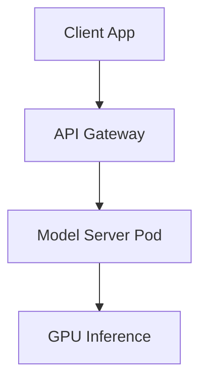

Sau khi dành nhiều tuần liền để xử lý dữ liệu và huấn luyện mô hình Machine Learning hay Generative AI, kết quả cuối cùng bạn thu được thường chỉ là một tệp tin chứa ma trận trọng số tĩnh (ví dụ: file `.pkl` của Scikit-Learn, tệp `.onnx`, hay thư mục chứa các file `.safetensors` của Hugging Face). 

Một file tĩnh nằm cô độc trên đĩa cứng thì không thể tự tương tác với ứng dụng Web, Mobile App hay các đường ống dữ liệu của doanh nghiệp. Để biến tệp ma trận vô tri đó thành một dịch vụ phần mềm thực sự hữu ích, có khả năng tiếp nhận yêu cầu từ người dùng và trả về kết quả dự đoán (suy luận - inference) theo thời gian thực, chúng ta cần đến quy trình **Model Serving (Phục vụ mô hình)**.

## Tại sao không thể gọi mô hình như một hàm lập trình thông thường?

Nhiều người mới bắt đầu thường nghĩ đơn giản: chỉ cần viết một API bằng Flask hoặc FastAPI, load mô hình lên mỗi khi có request và gọi hàm `model.predict(data)` để trả về kết quả. Tuy nhiên, cách làm này sẽ nhanh chóng thất bại thảm hại trong môi trường thực tế (production) vì ba lý do cốt lõi:

1. **Gánh nặng bộ nhớ (Memory Management)**: Các mô hình AI hiện đại, đặc biệt là các mô hình ngôn ngữ lớn (LLM), cực kỳ nặng. Chúng cần phải được tải nguyên khối vào bộ nhớ RAM hoặc VRAM của GPU **một lần duy nhất** khi máy chủ khởi động. Nếu bạn load lại mô hình trong mỗi request của người dùng, server của bạn sẽ lập tức bị treo hoặc báo lỗi Out of Memory (OOM) chỉ sau vài giây.
2. **Xung đột phần cứng (Concurrency Control)**: GPU được thiết kế để thực hiện các phép nhân ma trận song song cực nhanh, nhưng nó lại rất tệ trong việc chia sẻ tài nguyên cho nhiều yêu cầu nhỏ lẻ gửi đến đồng thời từ các luồng (threads) khác nhau.
3. **Mối quan hệ phụ thuộc phức tạp (Dependency Hell)**: Các mô hình Python rất nhạy cảm với phiên bản của các thư viện đi kèm (như PyTorch, CUDA, NumPy). Bạn cần một môi trường chạy biệt lập để đảm bảo mô hình hoạt động ổn định và đưa ra kết quả chính xác y hệt như lúc huấn luyện.

Hạ tầng Model Serving sinh ra để xây dựng các hàng rào kiến trúc phần mềm giải quyết triệt để các bài toán hóc búa này.

---

## Ý tưởng cốt lõi của Model Serving hiện đại

Về bản chất, Model Serving là việc tối ưu hóa và bao bọc hàm số toán học dự đoán $y = f(x)$ thành một dịch vụ mạng (API REST hoặc gRPC). Để đạt được hiệu năng cao nhất, các Inference Server chuyên dụng sẽ quản lý các kỹ thuật sau:

* **Dynamic Batching (Gom nhóm động)**: Đây là tính năng quan trọng nhất. Thay vì gửi ngay từng yêu cầu đơn lẻ của từng người dùng vào GPU (gây lãng phí năng lực tính toán), Server sẽ thông minh chờ đợi trong một khoảng thời gian cực ngắn (chỉ vài mili-giây) để gom nhiều yêu cầu từ nhiều người dùng khác nhau thành một ma trận lớn (Batch). GPU sau đó sẽ xử lý ma trận này trong một chu kỳ tính toán duy nhất, giúp tăng thông lượng (throughput) của hệ thống lên hàng chục lần.
* **Chuẩn hóa dữ liệu (Serialization & Deserialization)**: Tiếp nhận dữ liệu đầu vào (như chuỗi JSON chứa text hoặc mảng số), tự động chuyển đổi chúng thành cấu trúc Tensor (ma trận đa chiều) để đưa vào mô hình, rồi chuyển đổi ngược kết quả đầu ra thành định dạng JSON hoặc dạng Stream để trả về cho Client.
* **Quản lý phiên bản (Model Versioning & Rollout)**: Hỗ trợ triển khai song song nhiều phiên bản mô hình khác nhau (ví dụ chạy song song v1 và v2) để phục vụ cho các chiến dịch kiểm thử A/B Testing hoặc Shadow Deployment mà không làm gián đoạn dịch vụ.

---

## Luồng xử lý một Request trong hệ thống Model Serving

Dưới đây là sơ đồ mô tả cách một yêu cầu suy luận di chuyển từ ứng dụng client qua API Gateway đến Server phục vụ mô hình:



1. **Ingress (Tiếp nhận)**: Ứng dụng khách gửi yêu cầu (ví dụ: đoạn văn bản cần dịch) tới API Gateway qua giao thức HTTP hoặc gRPC.
2. **Preprocessing (Tiền xử lý)**: Dữ liệu thô được chuyển đổi, làm sạch (ví dụ: băm nhỏ chữ viết thành các [token](/concepts/genai-ml/token/) số hoặc resize hình ảnh).
3. **Inference (Suy luận)**: Đưa các Tensor số vào Engine suy luận (như TensorRT, ONNX Runtime, vLLM) để thực hiện các phép tính toán ma trận trên GPU.
4. **Postprocessing (Hậu xử lý)**: Kết quả dạng xác suất số thực từ GPU được dịch ngược lại thành nhãn phân loại hoặc văn bản thô.
5. **Response (Phản hồi)**: Trả kết quả JSON về cho ứng dụng khách. Đối với GenAI (LLM), kết quả thường được truyền về dưới dạng luồng dữ liệu liên tục (Streaming - Server-Sent Events) để tạo cảm giác AI đang gõ phím từng chữ một.

---

## Trải nghiệm thực tế: Triển khai Llama-3 với vLLM

Khi làm việc với các mô hình ngôn ngữ lớn (LLM), việc tự viết code để quản lý bộ nhớ VRAM là cực kỳ phức tạp. Thay vào đó, chúng ta có thể sử dụng **vLLM** — một framework chuyên dụng cho GenAI.

Chúng ta có thể dễ dàng khởi chạy một máy chủ suy luận tối ưu cho Llama-3-8B bằng lệnh Docker sau:

```bash
docker run --runtime nvidia --gpus all \
    -v ~/.cache/huggingface:/root/.cache/huggingface \
    -p 8000:8000 \
    --ipc=host \
    vllm/vllm-openai:latest \
    --model meta-llama/Meta-Llama-3-8B-Instruct \
    --max-model-len 4096
```

Lệnh này sẽ thiết lập một Inference Server giả lập hoàn toàn cấu trúc API của OpenAI trên cổng `8000`, tự động áp dụng thuật toán PagedAttention để tối ưu hóa bộ nhớ KV Cache, cho phép hàng chục người dùng trò chuyện đồng thời trên cùng một chiếc card GPU mà không bị tràn bộ nhớ.

Dưới đây là đoạn code Python phía Client để tương tác với server vLLM vừa dựng:

```python
import openai

# Trỏ thư viện OpenAI client về server vLLM local của bạn
client = openai.OpenAI(
    base_url="http://localhost:8000/v1",
    api_key="empty" # vLLM không yêu cầu API key mặc định
)

response = client.chat.completions.create(
    model="meta-llama/Meta-Llama-3-8B-Instruct",
    messages=[
        {"role": "user", "content": "Giải thích Model Serving là gì trong 2 câu."}
    ]
)
print(response.choices[0].message.content)
```

---

## Cân nhắc ưu nhược điểm và kinh nghiệm thực chiến

### Những ưu điểm vượt trội (Pros)
* **Kiến trúc lỏng (Decoupling)**: Ứng dụng web/mobile của bạn hoàn toàn độc lập với các thư viện học máy nặng nề (như PyTorch hay CUDA). Chúng chỉ cần biết gửi dữ liệu dạng JSON qua API và nhận về kết quả.
* **Khả năng mở rộng độc lập**: Khi lượng truy cập tăng đột biến, bạn chỉ cần scale thêm các bản sao (Replica Pods) của Model Server trên Kubernetes để chia tải mà không cần động vào mã nguồn của app chính.
* **Tối ưu hóa tài nguyên phần cứng**: Tận dụng tối đa công suất của các dòng card GPU đắt tiền nhờ cơ chế Dynamic Batching và compile mô hình.

### Những hạn chế cần lưu ý (Cons)
* **Độ trễ do truyền tải qua mạng (Network Latency)**: Việc tách biệt mô hình ra một cụm máy chủ riêng đồng nghĩa với việc bạn phải chịu thêm thời gian truyền tải dữ liệu qua lại giữa các máy chủ.
* **Yêu cầu kỹ năng DevOps chuyên sâu**: Việc cấu hình Kubernetes kết hợp với driver GPU NVIDIA CUDA và quản lý storage chia sẻ là một thử thách không hề nhỏ đối với các đội ngũ vận hành.
* **Hội chứng khởi động lạnh (Cold Start)**: Khi hệ thống tự động scale-down số lượng server về 0 để tiết kiệm chi phí lúc không có khách truy cập, request đầu tiên của khách hàng tiếp theo sẽ phải chờ đợi từ vài chục giây đến vài phút để mô hình được tải lại vào VRAM GPU.

### Kinh nghiệm xương máu khi triển khai (Best Practices)
* **Tuyệt đối tránh tự viết API chay cho GPU**: Đừng dùng FastAPI hay Flask để làm server phục vụ mô hình trực tiếp nếu bạn có GPU. Hãy chuyển sang các framework chuyên nghiệp như **Triton Inference Server** (của NVIDIA), **Ray Serve**, **TorchServe**, hoặc **vLLM/TGI** (cho LLM).
* **Biên dịch mô hình trước khi deploy (Model Compilation)**: Thay vì serve trực tiếp code PyTorch thô, hãy biên dịch mô hình sang các định dạng tối ưu như **ONNX** hoặc **TensorRT**. Quá trình này sẽ rút gọn đồ thị tính toán của mô hình, giúp tăng tốc độ suy luận lên nhiều lần.
* **Sử dụng gRPC cho dữ liệu lớn**: Nếu mô hình của bạn xử lý các file nặng như ảnh độ phân giải cao hoặc file âm thanh, hãy sử dụng giao thức **gRPC** kết hợp với Protobuf thay cho HTTP/JSON truyền thống để tiết kiệm băng thông và tối ưu hóa tốc độ truyền tải.
* **Tách riêng bước tiền xử lý**: Nếu việc biến đổi dữ liệu thô (như cắt ghép, xoay ảnh) tốn nhiều tài nguyên CPU, hãy tách nó ra một microservice chạy riêng trên CPU. Đừng bắt GPU phải dừng lại chờ đợi CPU xử lý dữ liệu thô (GPU Starvation).

---

## Khi nào nên và không nên áp dụng Model Serving?

### Nên chọn khi:
* Bạn cần tích hợp các tính năng AI thông minh vào ứng dụng thực tế và yêu cầu kết quả trả về ngay lập tức (Real-time Inference) cho người dùng cuối.
* Cần phục vụ số lượng lớn yêu cầu truy vấn đồng thời một cách ổn định và tiết kiệm chi phí phần cứng.

### Không nên chọn khi:
* Bạn chỉ đang ở giai đoạn nghiên cứu, phân tích dữ liệu (R&D) hoặc chạy thử nghiệm trên Jupyter Notebook.
* Các tác vụ phân tích không cần tính tức thời (ví dụ: chạy mô hình dự đoán tỷ lệ khách hàng rời bỏ vào cuối tháng để gửi email). Với trường hợp này, hãy sử dụng **Batch Processing / Offline Serving** (chạy một script Python hàng giờ trên Data Warehouse để xử lý hàng loạt dữ liệu rồi lưu kết quả vào Database) sẽ rẻ và an sau hơn nhiều.

---

## Khái niệm liên quan

* MLOps
* [LLM (Large Language Models)](/concepts/genai-ml/llm/)
* [Low-Rank Adaptation (LoRA)](/concepts/genai-ml/lora/)

---

## Góc phỏng vấn: Câu hỏi thường gặp

### 1. Phân biệt sự khác nhau giữa Online/Real-time Serving và Offline/Batch Serving. Cho ví dụ thực tế?
* **Mục đích của người phỏng vấn**: Đánh giá tư duy tối ưu hóa kiến trúc hệ thống và quản trị chi phí hạ tầng của bạn.
* **Gợi ý trả lời**:
  * **Online/Real-time Serving**: Mô hình luôn được tải sẵn trên VRAM GPU/RAM và chạy liên tục dưới dạng một web service để phản hồi các yêu cầu ngay lập tức (độ trễ tính bằng mili-giây). Phương pháp này tốn chi phí hạ tầng cao do phải duy trì server chạy 24/7. *Ví dụ*: Hệ thống chatbot AI, hệ thống phát hiện giao dịch gian lận ngân hàng, hệ thống gợi ý kết quả tìm kiếm.
  * **Offline/Batch Serving**: Mô hình không cần chạy thường trực. Định kỳ (ví dụ 2 giờ sáng mỗi ngày), một công cụ lập lịch sẽ khởi động máy chủ, đọc hàng triệu dòng dữ liệu từ Data Warehouse để đưa qua mô hình xử lý hàng loạt, lưu kết quả dự đoán vào Database, sau đó tắt máy chủ để tiết kiệm tiền. *Ví dụ*: Hệ thống tính toán điểm tín dụng của khách hàng vào cuối ngày, hệ thống gợi ý danh sách sản phẩm khuyến mãi gửi qua email marketing hàng tuần.

### 2. Tại sao các web framework như FastAPI hay Flask lại không phải là lựa chọn tốt nhất để phục vụ trực tiếp các mô hình AI chạy trên GPU?
* **Mục đích của người phỏng vấn**: Đánh giá hiểu biết của bạn về cơ chế hoạt động của GPU và cách quản lý luồng dữ liệu I/O.
* **Gợi ý trả lời**:
  * FastAPI hay Flask rất tốt để làm web server xử lý các logic ứng dụng thông thường. Tuy nhiên, chúng không được thiết kế để quản lý tài nguyên tính toán chuyên sâu (compute-bound) của GPU.
  * Khi hàng trăm request đồng thời đổ vào, FastAPI sẽ tạo ra nhiều thread/process độc lập cùng lúc tranh giành quyền đẩy dữ liệu vào GPU. Điều này dễ dẫn đến hiện tượng nghẽn cổ chai bộ nhớ và gây lỗi sập server (Out of Memory). 
  * Ngoài ra, các web framework này không có sẵn cơ chế **Dynamic Batching** để tự động gộp các request nhỏ lẻ thành một ma trận lớn trước khi đẩy vào GPU. Do đó, chúng ta cần sử dụng các Inference Server chuyên nghiệp như Triton hoặc TorchServe để quản lý việc xếp hàng và lập lịch tối ưu cho GPU.

### 3. Giải thích chiến lược Shadow Deployment trong Model Serving và lợi ích của nó?
* **Mục đích của người phỏng vấn**: Kiểm tra kinh nghiệm thực tế của bạn trong việc triển khai và kiểm thử phần mềm an toàn trên production.
* **Gợi ý trả lời**:
  * **Shadow Deployment** là chiến lược triển khai bóng ma. Khi chúng ta phát triển xong mô hình phiên bản mới (V2) và muốn kiểm tra hiệu năng thực tế của nó nhưng không muốn mạo hiểm gây ảnh hưởng đến trải nghiệm của người dùng.
  * Hệ thống load balancer sẽ nhân đôi (duplicate) mọi yêu cầu thực tế của người dùng và gửi song song đến cả mô hình V1 (đang chạy ổn định) và mô hình V2. Tuy nhiên, ứng dụng sẽ chỉ sử dụng kết quả trả về từ V1 để hiển thị cho người dùng. Kết quả dự đoán của V2 sẽ chỉ được ghi nhận lại vào hệ thống log để các kỹ sư phân tích, so sánh độ chính xác và khả năng chịu tải. Khi V2 chứng minh được sự vượt trội và ổn định, chúng ta mới chính thức thăng cấp cho nó thay thế hoàn toàn V1.

---

## Tài liệu tham khảo

1. [Designing Machine Learning Systems](https://www.oreilly.com/library/view/designing-machine-learning/9781098107956/) - Cuốn sách của tác giả Chip Huyen về thiết kế hệ thống học máy thực tế.
2. [NVIDIA Triton Inference Server Documentation](https://docs.nvidia.com/deeplearning/triton-inference-server/user-guide/docs/index.html) - Tài liệu hướng dẫn sử dụng máy chủ phục vụ suy luận Triton của NVIDIA.
3. [vLLM: Efficient Memory Management for Large Language Model Serving with PagedAttention](https://arxiv.org/abs/2309.06180) - Bài báo nghiên cứu giới thiệu thuật toán PagedAttention và thư viện vLLM.
4. [Ray Serve Documentation](https://docs.ray.io/en/latest/serve/index.html) - Tài liệu hướng dẫn triển khai và phục vụ mô hình học máy phân tán bằng Ray Serve.
5. [Hugging Face Text Generation Inference (TGI)](https://github.com/huggingface/text-generation-inference) - Mã nguồn mở và tài liệu của Hugging Face phục vụ tối ưu hóa suy luận cho LLM.

---

## English summary

Model Serving is the critical infrastructure layer in MLOps that transitions a trained machine learning model from a static artifact into a robust, scalable production service. It wraps mathematical prediction logic within an API or stream processor, handling complex tasks such as request serialization, GPU memory management, and concurrent scaling. Key techniques like Dynamic Batching group independent requests together to maximize hardware throughput. For modern GenAI applications, specialized serving frameworks (e.g., vLLM, Triton Inference Server) are essential to mitigate memory bottlenecks like KV cache management, ensuring models deliver high throughput, low-latency predictions reliably to end-user applications.
