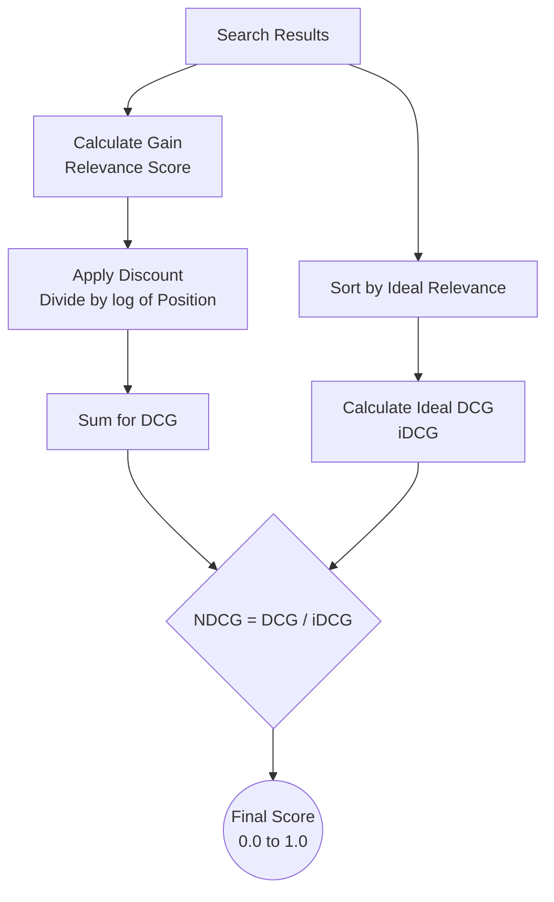

Khi xây dựng một công cụ tìm kiếm (Search Engine), hệ thống gợi ý (Recommender System) hay bước tái xếp hạng (Reranking) trong kiến trúc RAG, các chỉ số đo lường truyền thống như Precision (Độ chính xác) hay Recall (Độ bao phủ) thường không đủ để đánh giá chất lượng trải nghiệm của người dùng. 

Lý do rất đơn giản: Precision và Recall chỉ quan tâm đến việc kết quả trả về là Có liên quan hay Không (nhị phân). Tuy nhiên, trong thế giới thực, chúng ta đối mặt với hai bài toán phức tạp hơn nhiều:
1. **Mức độ liên quan khác nhau**: Tài liệu này có thể "rất liên quan", trong khi tài liệu khác chỉ "hơi liên quan".
2. **Yếu tố thứ hạng**: Tài liệu tốt nhất **bắt buộc phải xuất hiện đầu tiên**. Người dùng rất ít khi kiên nhẫn cuộn xuống cuối trang để đọc kết quả.

Để giải quyết bài toán này, các kỹ sư dữ liệu sử dụng một chỉ số nâng cao gọi là **Normalized Discounted Cumulative Gain (NDCG)**. Chỉ số này phản ánh chính xác hiệu suất xếp hạng của mô hình với thang điểm từ 0 đến 1 (1 là trạng thái hoàn hảo).

## Bóc tách công thức toán học của NDCG

Để hiểu được ý nghĩa toán học của NDCG, chúng ta hãy cùng phân tích từng từ cấu thành nên chỉ số này từ phải qua trái:

### 1. Gain (G - Lợi ích)
Đây là điểm số thể hiện mức độ liên quan của một tài liệu đối với câu hỏi của người dùng. Chúng ta tự đặt ra thang điểm (ví dụ: 3 điểm là hoàn hảo, 2 điểm là liên quan nhiều, 1 điểm là liên quan ít, 0 điểm là hoàn toàn sai lệch).

### 2. Cumulative Gain (CG - Lợi ích tích lũy)
Là tổng điểm Gain của top $K$ tài liệu được trả về. Ví dụ, nếu hệ thống trả về 3 tài liệu có mức độ liên quan lần lượt là [3, 2, 0] thì $CG = 3 + 2 + 0 = 5$. 
* *Hạn chế*: CG bị một điểm yếu là nó coi giá trị của tài liệu xuất hiện ở vị trí số 1 hay số 3 đều ngang nhau, không quan tâm đến thứ tự.

### 3. Discounted Cumulative Gain (DCG)
Để đưa yếu tố thứ tự vào, chúng ta áp dụng cơ chế "Discount" (phạt thứ hạng). Tài liệu nằm càng xa vị trí đầu tiên sẽ càng bị phạt nặng bằng cách chia điểm Gain cho logarit của vị trí của nó:

$$DCG_p = \sum_{i=1}^{p} \frac{rel_i}{\log_2(i + 1)}$$

Trong đó:
* $p$: Số lượng kết quả đang xét (ví dụ: xét Top 3).
* $rel_i$: Điểm liên quan của kết quả ở vị trí thứ $i$.
* $\log_2(i + 1)$: Hàm phạt giảm dần. Ở vị trí số 1, mẫu số là $\log_2(2) = 1$ (không bị phạt). Ở vị trí số 3, mẫu số là $\log_2(4) = 2$ (điểm Gain bị chia đôi). Cơ chế này ép thuật toán phải tìm mọi cách đẩy kết quả xịn nhất lên đỉnh.

### 4. Normalized (N - Chuẩn hóa)
Số lượng kết quả đúng của mỗi câu hỏi trên thực tế là khác nhau. Có câu hỏi chỉ có đúng 1 tài liệu liên quan trong database, có câu lại có tới hàng trăm tài liệu liên quan. Để có thể so sánh và tính trung bình hiệu năng của hệ thống trên toàn bộ các câu truy vấn khác nhau, chúng ta phải đưa điểm số về cùng một thang đo $[0, 1]$. 

Chúng ta thực hiện việc này bằng cách chia DCG thực tế cho điểm DCG của một danh sách được xếp hạng lý tưởng nhất (iDCG - Ideal DCG):

$$NDCG = \frac{DCG}{iDCG}$$

---

## Quy trình tính toán NDCG trong thực tế

Để hình dung cách NDCG được tính toán, chúng ta có quy trình tổng quan sau:



Hãy cùng làm một ví dụ thực tế với câu truy vấn: *"Sửa máy tính không lên nguồn"*. 

Giả sử chúng ta đã chấm điểm dữ liệu chuẩn (Ground Truth) theo thang: 0 (Sai), 1 (Hơi liên quan), 2 (Giải quyết triệt để vấn đề). 
Hệ thống của bạn trả về 3 kết quả đầu tiên có điểm liên quan thực tế lần lượt là: **D1 (rel=1), D2 (rel=2), D3 (rel=0)**.

### Bước 1: Tính DCG thực tế
* Vị trí 1 ($i=1, rel=1$): Điểm phạt = $\log_2(2) = 1 \rightarrow$ Điểm đóng góp = $1 / 1 = 1.0$
* Vị trí 2 ($i=2, rel=2$): Điểm phạt = $\log_2(3) \approx 1.585 \rightarrow$ Điểm đóng góp = $2 / 1.585 \approx 1.26$
* Vị trí 3 ($i=3, rel=0$): Điểm đóng góp = $0$
* Tổng **DCG = 1.0 + 1.26 + 0 = 2.26**

### Bước 2: Tính Ideal DCG (iDCG)
Để đạt kết quả lý tưởng nhất, hệ thống lẽ ra phải sắp xếp các tài liệu theo thứ tự giảm dần của độ liên quan: **D2 (rel=2), D1 (rel=1), D3 (rel=0)**.
* Vị trí 1 ($i=1, rel=2$): Điểm đóng góp = $2 / \log_2(2) = 2.0$
* Vị trí 2 ($i=2, rel=1$): Điểm đóng góp = $1 / \log_2(3) \approx 0.63$
* Vị trí 3 ($i=3, rel=0$): Điểm đóng góp = $0$
* Tổng **iDCG = 2.0 + 0.63 + 0 = 2.63**

### Bước 3: Tính NDCG
* **NDCG@3** = $\frac{DCG}{iDCG} = \frac{2.26}{2.63} \approx \textbf{0.859}$

Hệ thống của bạn đạt hiệu suất xếp hạng khoảng **86%** so với trạng thái lý tưởng trong top 3 kết quả đầu tiên.

---

## Triển khai đánh giá với Python

Trong thực tế, bạn không cần phải tự viết lại các phép tính logarit này. Thư viện `scikit-learn` đã hỗ trợ sẵn hàm `ndcg_score` để đánh giá mô hình:

```python
from sklearn.metrics import ndcg_score
import numpy as np

# Điểm relevance thực tế (Ground Truth) của 3 tài liệu
true_relevance = np.asarray([[2, 1, 0]]) # D2=2, D1=1, D3=0

# Điểm số mô hình search của bạn dự đoán cho 3 tài liệu
# Mô hình rank D1 cao nhất, D2 thứ hai, D3 bét
predicted_scores = np.asarray([[0.8, 0.5, 0.1]]) 

# Tính NDCG@3
ndcg = ndcg_score(true_relevance, predicted_scores, k=3)
print(f"NDCG@3 Score: {ndcg:.3f}")
# Output: NDCG@3 Score: 0.859
```

---

## Cân nhắc ưu nhược điểm và lưu ý khi sử dụng

### Những ưu điểm vượt trội (Pros)
* **Sát với hành vi thực tế**: Phản ánh chính xác tâm lý của người dùng khi sử dụng các hệ thống tìm kiếm (chỉ tập trung vào các kết quả đầu tiên).
* **Đánh giá đa cấp độ**: Khác với Precision/Recall chỉ có đúng/sai, NDCG cho phép chấm điểm chi tiết mức độ tốt của từng kết quả.

### Những hạn chế cần lưu ý (Cons)
* **Chi phí gán nhãn dữ liệu rất cao**: Việc yêu cầu con người ngồi đọc và đánh giá dữ liệu theo thang điểm nhiều cấp độ (1, 2, 3, 4) tốn nhiều thời gian và dễ mang tính chủ quan của người gắn nhãn hơn nhiều so với việc chỉ chọn Có/Không.
* **Bỏ qua các tài liệu bị bỏ sót**: NDCG chỉ tập trung đánh giá chất lượng của danh sách kết quả trả về. Nếu một tài liệu cực tốt bị hệ thống bỏ lọt hoàn toàn (không lôi ra được khỏi DB), NDCG của top đầu vẫn có thể cao. Do đó, bạn nên báo cáo NDCG song song với chỉ số **Recall** để có cái nhìn toàn diện.

### Lời khuyên xương máu khi triển khai (Best Practices)
* **Xử lý lỗi chia cho 0**: Khi tính toán iDCG cho các câu truy vấn mà tất cả tài liệu trả về đều có độ liên quan bằng 0, iDCG sẽ bằng 0. Hãy viết code bẫy lỗi để gán NDCG = 0 trong trường hợp này, tránh làm sập chương trình.
* **Lựa chọn giá trị K phù hợp**: Hãy chọn $K$ dựa trên hành vi thực tế của người dùng thiết bị. Ví dụ, với giao diện điện thoại, người dùng chỉ nhìn thấy 3 kết quả đầu tiên (nên dùng NDCG@3), còn trên giao diện web máy tính có thể dùng NDCG@5 hoặc NDCG@10.

---

## Khi nào nên và không nên chọn NDCG?

### Nên chọn khi:
* Đánh giá chất lượng của mô hình **Reranking** trong các hệ thống tìm kiếm nâng cao hoặc hệ thống RAG GenAI.
* Đánh giá hiệu năng của các hệ thống gợi ý sản phẩm/nội dung (như đề xuất video, bài hát).
* Dùng làm hàm tối ưu hóa (Loss function) để huấn luyện các mô hình xếp hạng Learning-to-Rank (LTR).

### Không nên chọn khi:
* Bài toán của bạn là bài toán phân loại nhãn (Classification - ví dụ: phân biệt email spam hay không). Với trường hợp này, F1-Score hay Accuracy sẽ phù hợp hơn.
* Bạn chỉ có dữ liệu đánh giá nhị phân (chỉ biết người dùng Click hay Không Click). Khi đó, sử dụng chỉ số **MRR (Mean Reciprocal Rank)** sẽ đơn giản và hiệu quả hơn.

---

## Khái niệm liên quan

* [Reranking](/concepts/genai-ml/reranking/)
* [Recall](/concepts/genai-ml/recall/)

---

## Góc phỏng vấn: Câu hỏi thường gặp

### 1. Sự khác biệt cốt lõi giữa hai chỉ số xếp hạng NDCG và MRR là gì?
* **Mục đích của người phỏng vấn**: Đánh giá sự hiểu biết của bạn về các loại metric đánh giá xếp hạng khác nhau trong Information Retrieval.
* **Gợi ý trả lời**:
  * **MRR (Mean Reciprocal Rank)** chỉ quan tâm đến vị trí của kết quả đúng **đầu tiên** trong danh sách. Nó hoạt động trên dữ liệu nhị phân (Đúng/Sai). Nếu kết quả đúng đầu tiên nằm ở vị trí số 1, điểm là 1. Nằm ở vị trí số 3, điểm là 1/3. Thường dùng cho các hệ thống hỏi đáp (Q&A) chỉ cần duy nhất một câu trả lời chính xác.
  * **NDCG** quan tâm đến **tất cả** các kết quả trả về trong top K và đánh giá chúng dựa trên thang điểm nhiều cấp độ. Nó phạt nặng nếu tài liệu "rất đúng" bị xếp dưới tài liệu "hơi đúng". Thường dùng cho các hệ thống tìm kiếm thông tin chung hoặc gợi ý sản phẩm, nơi người dùng có xu hướng xem và nhấp chuột vào nhiều kết quả khác nhau.

### 2. Giải thích ý nghĩa của từ "Discounted" trong DCG và cơ chế hoạt động của nó?
* **Mục đích của người phỏng vấn**: Kiểm tra xem bạn có nắm vững bản chất toán học của công thức tính toán không.
* **Gợi ý trả lời**:
  * "Discounted" (Chiết khấu / Giảm phạt) thể hiện việc giảm dần giá trị đóng góp của tài liệu khi vị trí xếp hạng của nó đi xuống sâu hơn, mô phỏng đúng tâm lý giảm dần sự kiên nhẫn của người dùng.
  * Về mặt toán học, điểm liên quan của tài liệu sẽ bị chia cho $\log_2(i + 1)$ với $i$ là vị trí xếp hạng. Vì hàm logarit tăng dần theo vị trí, mẫu số sẽ ngày càng lớn, làm cho giá trị đóng góp thực tế của các tài liệu xếp hạng thấp bị giảm đi đáng kể.

### 3. Tại sao trong công thức NDCG, chúng ta lại cần bước chia cho iDCG (Normalized)?
* **Mục đích của người phỏng vấn**: Đánh giá tư duy thiết kế chỉ số đo lường nhất quán của bạn.
* **Gợi ý trả lời**:
  * Vì số lượng và chất lượng của các tài liệu liên quan cho mỗi câu truy vấn (Query) thực tế là hoàn toàn khác nhau.
  * Với Query A (chủ đề hiếm), database chỉ có đúng 1 tài liệu liên quan (iDCG tối đa có thể chỉ là 2.0). Với Query B (chủ đề hot), database có hàng chục tài liệu liên quan (iDCG tối đa có thể lên tới 15.0).
  * Nếu không chia cho iDCG để đưa về khoảng $[0, 1]$, chúng ta không thể tính trung bình cộng hiệu năng của hệ thống trên toàn bộ các câu truy vấn một cách hợp lý về mặt thống kê. Bước chuẩn hóa này giúp cào bằng thang đo của mọi query về cùng một hệ quy chiếu.

---

## Tài liệu tham khảo

1. **"Introduction to Information Retrieval"** - Christopher D. Manning.
2. **Scikit-learn Metrics Documentation** - *ndcg_score*.

---

## English summary

Normalized Discounted Cumulative Gain (NDCG) is a foundational metric in Information Retrieval, Recommender Systems, and Reranking pipelines. Unlike binary metrics (Precision/Recall), NDCG evaluates ranked lists using graded relevance, asserting that highly relevant documents are more valuable than marginally relevant ones, and that top-ranked positions are significantly more critical than lower ones. It computes a ranking score by summing the relevance grades of retrieved items, heavily discounting those at lower ranks logarithmically. This sum (DCG) is then normalized against the ideal ranking score (iDCG) to yield a final value between 0 and 1, facilitating robust comparisons across different queries and serving as an optimal target function for Learning-to-Rank models.
