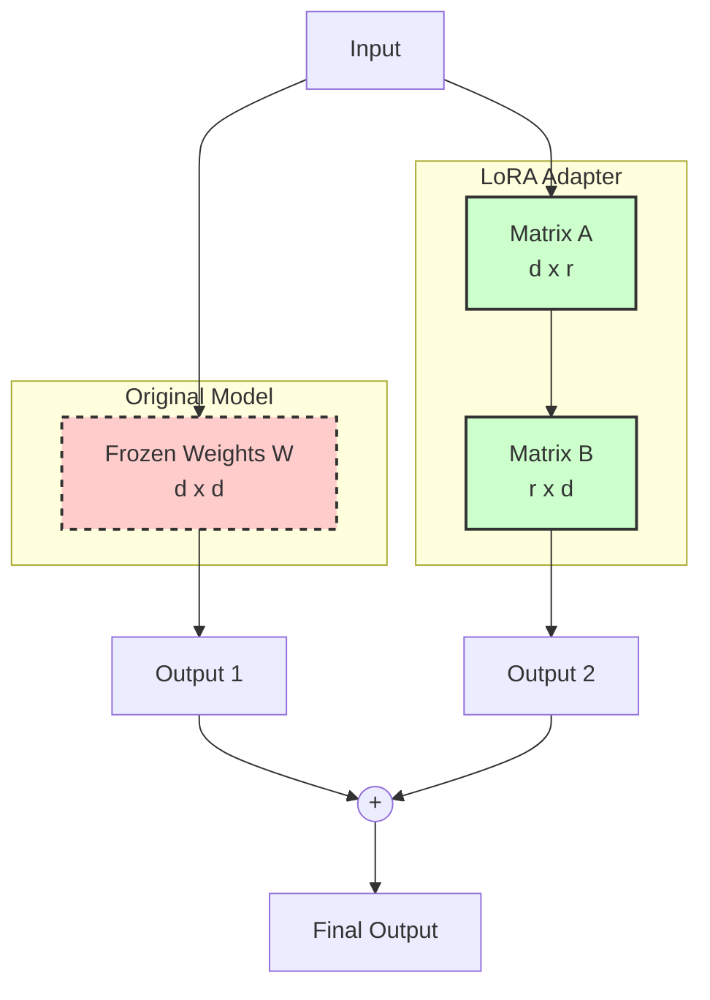

Việc huấn luyện hay tinh chỉnh (fine-tune) các Mô hình Ngôn ngữ Lớn (LLM) từng được coi là cuộc chơi độc quyền của các ông lớn công nghệ sở hữu tiềm lực tài chính khổng lồ cùng hệ thống siêu máy tính hàng nghìn GPU đắt đỏ. Thế nhưng, sự ra đời của **PEFT (Parameter-Efficient Fine-Tuning)** đã thay đổi hoàn toàn cục diện đó. Kỹ thuật này đã dân chủ hóa AI, cho phép bất kỳ kỹ sư hay doanh nghiệp nhỏ nào cũng có thể tinh chỉnh các mô hình hàng tỷ tham số ngay trên chiếc card đồ họa dân dụng của mình với chi phí cực kỳ rẻ.

## Đột phá mang tính cách mạng: PEFT là gì?

Khi các mô hình mã nguồn mở như Llama 3 hay Mistral được công bố, chúng sở hữu lượng kiến thức tổng quát vô cùng phong phú. Tuy nhiên, để những mô hình này thực sự hiểu sâu và làm tốt một công việc chuyên biệt của doanh nghiệp (ví dụ: viết code theo chuẩn riêng của dự án, hoặc phân tích báo cáo tài chính nội bộ), chúng ta cần thực hiện quá trình tinh chỉnh (Fine-tuning).

Phương pháp tinh chỉnh truyền thống gọi là **Full Fine-Tuning**. Cách này yêu cầu bạn tải toàn bộ hàng tỷ tham số (weights) của mô hình vào bộ nhớ, tính toán đạo hàm (gradients) và cập nhật trạng thái của bộ tối ưu hóa (optimizer states) cho tất cả các tham số đó. Để làm được việc này, bạn cần kết nối nhiều card đồ họa chuyên dụng cao cấp như A100 hay H100 80GB VRAM, ngốn hàng chục nghìn USD mỗi lượt huấn luyện.

**PEFT** ra đời để giải quyết triệt để bài toán chi phí này. Triết lý của PEFT rất đơn giản: *"Chúng ta không cần thay đổi cấu trúc bộ não khổng lồ gốc của mô hình. Hãy đóng băng (freeze) nó lại. Chúng ta chỉ cấy thêm một bộ não phụ siêu nhỏ (thường chỉ chiếm chưa tới 1% số lượng tham số gốc) và chỉ tập trung huấn luyện bộ não phụ này mà thôi."*

Trong số các kỹ thuật thuộc họ PEFT, **LoRA (Low-Rank Adaptation)** chính là phương pháp nổi tiếng và đang chiếm ưu thế tuyệt đối nhờ tính hiệu quả vượt trội.

## Tại sao chúng ta cần PEFT/LoRA?

* **Vượt qua rào cản phần cứng (VRAM Bottleneck)**: Huấn luyện một mô hình ngôn ngữ 7 tỷ tham số (7B) theo cách truyền thống đòi hỏi tối thiểu khoảng 100GB+ VRAM – con số vượt quá khả năng của bất kỳ card đồ họa đơn lẻ nào. Nhờ PEFT (đặc biệt với QLoRA - phiên bản lượng tử hóa 4-bit của LoRA), bạn có thể dễ dàng chạy huấn luyện mô hình 7B ngay trên một chiếc card đồ họa RTX 3090 hoặc 4090 24GB thường thấy ở các PC chơi game.
* **Ngăn ngừa hiện tượng "Quên tai hại" (Catastrophic Forgetting)**: Khi tinh chỉnh toàn bộ mô hình (Full Fine-Tuning) trên một tập dữ liệu nhỏ hẹp, các trọng số nguyên bản dễ bị thay đổi quá mức khiến mô hình bị "cháy" và quên mất các khả năng ngôn ngữ tổng quát vốn có. PEFT giải quyết điều này bằng cách giữ nguyên mô hình nền tảng, giúp duy trì trí thông minh cơ bản của mô hình.
* **Tiết kiệm chi phí lưu trữ và triển khai đa nhiệm**: Giả sử doanh nghiệp có 5 dự án khác nhau dựa trên cùng một mô hình 7B. Với Full Fine-Tuning, bạn phải lưu trữ 5 phiên bản mô hình độc lập (mỗi phiên bản khoảng 14GB, tổng cộng 70GB). Với PEFT/LoRA, mỗi dự án (gọi là một Adapter) chỉ nặng khoảng vài chục Megabytes. Bạn chỉ cần lưu trữ duy nhất 1 mô hình gốc 14GB và 5 file adapter siêu nhẹ 50MB. Hơn nữa, bạn có thể dễ dàng thay đổi nóng (swap) các adapter này ngay trong quá trình chạy thực tế (inference) mà không cần khởi động lại mô hình gốc.

## Giải mã toán học đằng sau LoRA (Low-Rank Adaptation)

Ý tưởng cốt lõi của LoRA bắt nguồn từ một khái niệm quen thuộc trong Đại số tuyến tính: **Thứ hạng thấp (Low Rank)**.

Mạng nơ-ron thực chất là các phép nhân ma trận khổng lồ. Giả sử ma trận trọng số ban đầu của mô hình là $W$ (kích thước $d \times d$). Khi học kiến thức mới, ma trận này cần thay đổi một lượng là $\Delta W$ (cũng có kích thước khổng lồ tương đương $W$). Tuy nhiên, các nhà nghiên cứu đã chứng minh rằng các thay đổi này thực chất có "thứ hạng nội tại" rất thấp.

Do đó, thay vì cập nhật trực tiếp ma trận $\Delta W$ lớn, LoRA phân rã ma trận này thành tích của hai ma trận nhỏ hơn nhiều: 
$$\Delta W \approx A \times B$$
Trong đó:
* Ma trận $A$ có kích thước $d \times r$.
* Ma trận $B$ có kích thước $r \times d$.
* Với $r$ (rank) là một số nguyên rất nhỏ (thường chỉ là 8 hoặc 16).

**Hãy làm một phép toán đơn giản**: Thay vì phải huấn luyện $4096 \times 4096 \approx 16.7$ triệu tham số của ma trận gốc, với LoRA ($r=8$), chúng ta chỉ cần huấn luyện $(4096 \times 8) + (8 \times 4096) \approx 65$ nghìn tham số. Khối lượng tính toán đã được giảm thiểu đi hơn 250 lần!

## LoRA hoạt động chi tiết như thế nào?

Sơ đồ dưới đây minh họa cách dữ liệu đi qua mô hình nền tảng được đóng băng song song với adapter LoRA:



### Quy trình huấn luyện:
1. Nạp mô hình ngôn ngữ gốc vào VRAM và khóa toàn bộ trọng số của nó lại (`requires_grad = False`).
2. Chèn các ma trận nhỏ $A$ và $B$ (Adapter) song song với các lớp Attention của mô hình gốc. Ma trận $A$ được khởi tạo với các giá trị ngẫu nhiên, còn ma trận $B$ được khởi tạo bằng $0$ (nhằm đảm bảo ban đầu adapter chưa làm ảnh hưởng đến kết quả gốc).
3. Đưa dữ liệu huấn luyện qua hệ thống, tính toán sai số (Loss).
4. Thực hiện lan truyền ngược (Backpropagation) và chỉ cập nhật giá trị cho các ma trận $A$ và $B$.

### Quy trình triển khai (Inference):
Khi đưa vào sử dụng thực tế, bạn có hai lựa chọn:
1. **Chạy song song**: Giữ riêng biệt Base Model và Adapter. Dữ liệu đi qua cả hai nhánh rồi cộng kết quả lại khi xử lý.
2. **Hợp nhất (Merging)**: Do các phép tính ma trận là tuyến tính, bạn có thể cộng thẳng các tham số đã huấn luyện của adapter vào ma trận gốc: $W_{new} = W + (A \times B)$ rồi lưu lại. Khi đó, mô hình mới sẽ chạy mượt mà như mô hình gốc mà không hề phát sinh thêm bất kỳ độ trễ nào khi truy vấn (zero inference latency).

## Ví dụ thực chiến: chatbot giọng "Cướp biển"

Giả sử bạn cần xây dựng một chatbot nội bộ trả lời theo phong cách "Cướp biển" vui vẻ. Bạn có thể sử dụng kỹ thuật **QLoRA** để tinh chỉnh mô hình Llama-3 8B:

1. Chuẩn bị bộ dữ liệu gồm khoảng 10,000 cặp câu hỏi - câu trả lời mẫu theo đúng giọng văn cướp biển.
2. Sử dụng thư viện `peft` và `trl` từ HuggingFace. Thay vì thuê cụm GPU đắt đỏ, bạn chỉ cần thuê một chiếc GPU A10G trên AWS với giá khoảng 1 USD/giờ.
3. Sau 3 giờ huấn luyện (tiêu tốn vỏn vẹn 3 USD), bạn sẽ thu được một thư mục adapter chỉ nặng khoảng 35 MB chứ không phải là file mô hình khổng lồ 16GB.
4. Khi chạy chatbot, bạn chỉ việc tải mô hình Llama-3 gốc lên và đính kèm file adapter 35MB này vào. Chatbot sẽ lập tức nói chuyện kiểu "Ahoy matey!" cực kỳ tự nhiên.

Dưới đây là đoạn code Python minh họa cách hợp nhất vĩnh viễn trọng số của Adapter vào mô hình gốc:

```python
from peft import PeftModel
from transformers import AutoModelForCausalLM

# 1. Tải mô hình nền tảng gốc (Base Model)
base_model = AutoModelForCausalLM.from_pretrained("meta-llama/Meta-Llama-3-8B")

# 2. Tải LoRA Adapter siêu nhẹ đã huấn luyện
model = PeftModel.from_pretrained(base_model, "./pirate-lora-adapter")

# 3. Hợp nhất vĩnh viễn trọng số Adapter vào Base Model
merged_model = model.merge_and_unload()

# 4. Lưu lại mô hình đã hợp nhất để sẵn sàng triển khai độc lập
merged_model.save_pretrained("./llama-3-pirate-final")
```

## Những lưu ý vàng và sai lầm thường gặp khi tinh chỉnh

### Kinh nghiệm thiết kế (Best Practices)
* **Đặt Rank ($r$) hợp lý**: Thông thường, giá trị $r=8$ hoặc $r=16$ là điểm khởi đầu lý tưởng. Việc tăng rank lên quá cao (như 64 hay 128) không giúp mô hình thông minh hơn mà chỉ làm tăng dung lượng VRAM tiêu thụ và dễ dẫn đến hiện tượng quá khớp (overfitting).
* **Chọn đúng các Module cần tác động**: Mặc định LoRA thường chỉ tác động lên các lớp `q_proj` và `v_proj` trong Self-Attention. Tuy nhiên, các nghiên cứu gần đây chỉ ra rằng việc áp dụng LoRA lên **tất cả** các lớp tuyến tính (bao gồm cả các lớp MLP) sẽ đem lại hiệu quả tối ưu gần tương đương với Full Fine-Tuning nhất.
* **Tận dụng tối đa QLoRA**: Luôn kết hợp lượng tử hóa 4-bit (`bitsandbytes`) với LoRA để nén mô hình, giúp chạy được các mô hình lớn trên các phần cứng phổ thông mà không làm suy giảm đáng kể chất lượng đầu ra.

### Những lỗi sơ đẳng cần tránh
* **Đặt sai hệ số Alpha (`lora_alpha`)**: Hệ số `alpha` dùng để điều chỉnh tầm ảnh hưởng của ma trận LoRA lên trọng số gốc. Một quy tắc thực tế được kiểm chứng là nên đặt giá trị `alpha` gấp đôi giá trị `r` (ví dụ `r=16` thì `alpha=32`). Việc đặt tỷ lệ này không cân đối có thể làm mô hình mất ổn định khi huấn luyện.
* **Cố nhồi nhét "kiến thức thực tế" qua LoRA**: Các kỹ thuật PEFT/LoRA cực kỳ xuất sắc trong việc học **phong cách**, **giọng văn** hoặc **định dạng đầu ra** (JSON, XML). Tuy nhiên, nếu bạn muốn nhồi nhét một khối lượng lớn thông tin thực tế (facts) luôn thay đổi vào mô hình, LoRA không phải là công cụ phù hợp. Hãy sử dụng giải pháp RAG để có kết quả tốt nhất.
* **Đặt tỷ lệ Dropout quá cao**: Đối với các tập dữ liệu nhỏ (vài nghìn ví dụ), bạn chỉ nên giữ tỷ lệ `lora_dropout` ở mức an toàn từ 0.05 đến 0.1 để tránh làm mất thông tin hữu ích.

## Cân nhắc hai mặt: Lợi ích và giới hạn của PEFT

### Lợi ích nổi bật
* **Chi phí phần cứng tối thiểu**: Đưa việc tinh chỉnh mô hình ngôn ngữ lớn đến gần hơn với cộng đồng nhà phát triển cá nhân.
* **Tốc độ phản hồi không bị ảnh hưởng**: Nhờ cơ chế hợp nhất trọng số (merging weights), mô hình sau khi tinh chỉnh không bị chậm đi khi chạy thực tế.
* **Linh hoạt và mô-đun hóa**: Có thể lưu trữ và tải động nhiều adapter phục vụ các nghiệp vụ khác nhau trên cùng một hạ tầng chạy mô hình gốc, giúp tiết kiệm tài nguyên hệ thống đáng kể.

### Điểm hạn chế
* **Giới hạn về khả năng tiếp thu**: Do chỉ tinh chỉnh dưới 1% tham số, PEFT sẽ gặp khó khăn lớn trước các bài toán yêu cầu thay đổi sâu sắc bản chất ngôn ngữ (ví dụ: dạy một mô hình thuần tiếng Anh nói tiếng Việt trôi chảy bằng LoRA thường cho kết quả kém hơn nhiều so với Full Fine-Tuning).
* **Độ phức tạp khi tinh chỉnh siêu tham số (Hyperparameters)**: Người vận hành phải thử nghiệm nhiều lần để tìm ra sự kết hợp tối ưu giữa các thông số như `r`, `alpha`, tốc độ học (learning rate) và các module đích.

## Các khái niệm liên quan

* [Large Language Model (LLM)](/concepts/genai-ml/llm/)
* [Retrieval-Augmented Generation (RAG)](/concepts/genai-ml/rag/)
* [Học qua vài ví dụ (Few-shot Prompting)](/concepts/genai-ml/few-shot/)

## Góc phỏng vấn: Trả lời thông minh về PEFT & LoRA

### 1. Hãy so sánh sự khác nhau giữa Full Fine-Tuning, PEFT (LoRA) và RAG. Khi nào doanh nghiệp nên chọn giải pháp nào?
* **Mục đích của người phỏng vấn**: Đánh giá khả năng tư duy giải pháp tổng thể của một Data Engineer trong các dự án ứng dụng GenAI.
* **Gợi ý trả lời**:
  - **RAG** là lựa chọn hàng đầu khi cần cung cấp **thông tin thực tế (factual knowledge)** chính xác, cập nhật liên tục (như tài liệu nội bộ, thông tin sản phẩm) mà không muốn thay đổi cách hành văn hay định dạng của mô hình gốc.
  - **PEFT/LoRA** phù hợp nhất khi chúng ta muốn mô hình học một **kỹ năng chuyên biệt, phong cách giao tiếp (style/tone)** hoặc tuân thủ một **định dạng đầu ra nghiêm ngặt** (như trả về chuỗi JSON chuẩn). Chi phí vận hành rẻ và chỉ cần GPU trung bình.
  - **Full Fine-Tuning** chỉ nên dùng khi cần thay đổi sâu sắc cốt lõi của mô hình, ví dụ huấn luyện mô hình cho một ngôn ngữ mới hoàn toàn hoặc trong các lĩnh vực đặc thù sâu như y sinh nơi mà bộ từ vựng chung không còn phù hợp. Chi phí giải pháp này đắt nhất và đòi hỏi nhiều tài nguyên.

### 2. Ý nghĩa thực tế của tham số Rank (`r`) trong LoRA là gì? Nếu tăng `r` lên cực lớn (ví dụ 1024) thì điều gì sẽ xảy ra?
* **Mục đích của người phỏng vấn**: Đo lường sự hiểu biết sâu sắc về mặt toán học và các vấn đề thực tế khi huấn luyện LoRA.
* **Gợi ý trả lời**: Tham số Rank (`r`) quyết định độ rộng của hai ma trận phân rã LoRA, tức là dung lượng thông tin tối đa mà adapter có thể tiếp nhận để học. Nếu tăng `r` lên mức quá cao như 1024, số lượng tham số cần huấn luyện sẽ tăng vọt và tiệm cận với Full Fine-Tuning. Việc này sẽ làm mất sạch các lợi thế của PEFT: tiêu hao nhiều VRAM gây lỗi tràn bộ nhớ (OOM), làm chậm quá trình huấn luyện và dễ khiến mô hình rơi vào trạng thái quá khớp (overfitting) trên tập dữ liệu nhỏ.

### 3. Ta có thể chạy đồng thời nhiều adapter LoRA trên cùng một mô hình nền tảng gốc tại thời điểm Inference không?
* **Mục đích của người phỏng vấn**: Kiểm tra kinh nghiệm thiết kế kiến trúc hệ thống phục vụ mô hình (Model Serving) trong môi trường production.
* **Gợi ý trả lời**: Hoàn toàn được. Các framework phục vụ mô hình hiện đại (như vLLM hoặc LoRAX) hỗ trợ tính năng **Multi-LoRA Serving**. Hệ thống chỉ cần nạp duy nhất một Base Model gốc vào VRAM GPU, sau đó tải kèm nhiều adapter LoRA siêu nhẹ chạy song song. Khi có request API gửi đến kèm theo mã định danh của adapter cụ thể, hệ thống sẽ tự động chuyển hướng luồng tính toán qua adapter tương ứng. Giải pháp này giúp tối ưu hóa hiệu năng và tiết kiệm chi phí phần cứng vượt trội so với việc host nhiều mô hình lớn độc lập.

---

## Tài liệu tham khảo

1. [LoRA: Low-Rank Adaptation of Large Language Models](https://arxiv.org/abs/2106.09685) - Bài báo nghiên cứu gốc giới thiệu kỹ thuật LoRA của Microsoft.
2. [QLoRA: Efficient Finetuning of Quantized LLMs](https://arxiv.org/abs/2305.14314) - Bài báo nghiên cứu giới thiệu phương pháp QLoRA tối ưu hóa bộ nhớ khi tinh chỉnh.
3. [Hugging Face PEFT Documentation](https://huggingface.co/docs/peft/index) - Tài liệu chính thức về thư viện Parameter-Efficient Fine-Tuning (PEFT) của Hugging Face.
4. [Parameter-Efficient Fine-Tuning using Hugging Face PEFT](https://huggingface.co/blog/peft) - Bài viết trên Hugging Face Blog hướng dẫn thực hành sử dụng thư viện PEFT.
5. [Efficient Fine-Tuning with LoRA: A Guide to Optimal Parameter Selection](https://www.databricks.com/blog/efficient-fine-tuning-lora-guide-optimal-parameter-selection) - Hướng dẫn từ Databricks về cách chọn tham số tối ưu (như rank và alpha) khi tinh chỉnh với LoRA.

---

## English Summary

**Parameter-Efficient Fine-Tuning (PEFT)** comprises techniques that adapt massive Large Language Models to specific downstream tasks by training only a minuscule fraction of parameters while keeping the original model's weights frozen. **LoRA (Low-Rank Adaptation)** is the most prominent PEFT method, achieving this by injecting trainable low-rank decomposition matrices (A and B) into the transformer architecture. This drastic reduction in trainable parameters (often <1%) slashes hardware constraints (VRAM usage), allows fine-tuning on consumer-grade GPUs, prevents catastrophic forgetting, and enables efficient serving by swapping lightweight adapter modules on top of a single base model.
