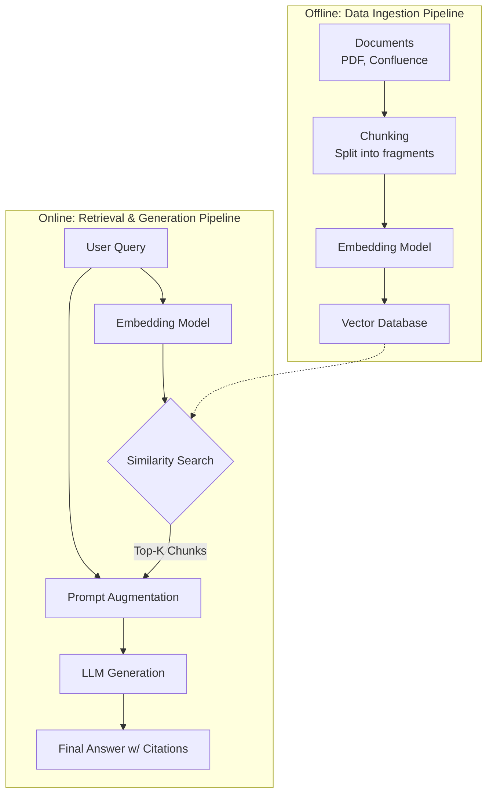

Các mô hình ngôn ngữ lớn (LLM) sở hữu khả năng ngôn ngữ và suy luận logic tốt. Tuy nhiên, trong môi trường doanh nghiệp, các LLM thường gặp hạn chế như tự bịa đặt thông tin (ảo giác - hallucination) hoặc không có quyền truy cập vào tài liệu nội bộ. Để khắc phục vấn đề này mà không cần tốn chi phí huấn luyện lại mô hình, kiến trúc **RAG (Retrieval-Augmented Generation)** được phát triển như một giải pháp thay thế hiệu quả.

## Đưa "sách giáo khoa" cho AI: RAG là gì?

Thay vì bắt LLM phải trả lời câu hỏi hoàn toàn dựa trên trí nhớ có sẵn (vốn được đóng băng sau khi huấn luyện), RAG cung cấp cho mô hình một cuốn "sách giáo khoa" chứa đầy đủ thông tin thực tế ngay tại thời điểm được hỏi. 

Quy trình RAG bao gồm hai giai đoạn chính:
1. **Truy xuất (Retrieval)**: Khi nhận được câu hỏi từ người dùng, hệ thống sẽ tự động tìm kiếm trên kho dữ liệu của doanh nghiệp (sách hướng dẫn, wiki nội bộ, cơ sở dữ liệu) để chọn lọc ra những đoạn văn bản chứa thông tin liên quan nhất.
2. **Tạo lập tăng cường (Augmented Generation)**: Hệ thống ghép các đoạn thông tin tìm được vào câu hỏi gốc của người dùng tạo thành một ngữ cảnh (context) đầy đủ. LLM sau đó chỉ cần đọc kỹ phần ngữ cảnh này và viết ra câu trả lời cuối cùng một cách chính xác, có căn cứ rõ ràng.

## Vai trò của RAG trong việc khắc phục hạn chế của LLM

Dù thông minh đến đâu, các LLM thương mại vẫn phải đối mặt với 3 thách thức lớn khi áp dụng vào thực tế:
* **Ảo giác (Hallucination)**: LLM có xu hướng tự tạo ra thông tin nghe có vẻ rất thuyết phục khi gặp câu hỏi khó hoặc thông tin không có sẵn trong bộ nhớ của nó.
* **Thời điểm đóng băng tri thức (Knowledge Cut-off)**: Mô hình chỉ có thông tin tại thời điểm huấn luyện (knowledge cutoff) và không thể tự cập nhật các sự kiện hoặc tài liệu mới phát sinh.
* **Mất dấu dữ liệu nội bộ (Private Data)**: Rõ ràng, các mô hình công cộng như GPT-4 không thể tiếp cận các báo cáo tài chính bảo mật hay quy chế làm việc nội bộ của riêng công ty bạn.

Trước đây, phương pháp truyền thống để giải quyết vấn đề này là **Fine-tuning** (tinh chỉnh mô hình). Tuy nhiên, phương pháp này đòi hỏi tài nguyên tính toán lớn, quy trình chuẩn bị dữ liệu phức tạp và không thể cập nhật tri thức mới liên tục theo ngày. 

RAG giải quyết các hạn chế này bằng cách cho phép cập nhật dữ liệu mới vào hệ thống lưu trữ ngoài mà không cần thay đổi trọng số (weights) của LLM, đồng thời hỗ trợ trích dẫn nguồn tài liệu (citations) để người dùng kiểm chứng.

## Triết lý thiết kế: Tách biệt tư duy logic và tri thức

Cốt lõi của kiến trúc RAG dựa trên nguyên lý phân tách rõ ràng giữa hai loại bộ nhớ:
* **Bộ nhớ lý thuyết (Parametric Memory)**: Khả năng ngôn ngữ, ngữ pháp, tư duy logic, định dạng văn bản... được mã hóa chặt chẽ trong các trọng số (weights) của LLM. Đây là "khả năng tư duy" của mô hình.
* **Bộ nhớ thực tế (Non-parametric Memory)**: Toàn bộ dữ kiện, số liệu thực tế, tài liệu chính sách của doanh nghiệp... được lưu trữ bên ngoài trong các cơ sở dữ liệu tìm kiếm (như Vector Database hay Elasticsearch). Đây là "kho tri thức" có thể chỉnh sửa, thêm mới dễ dàng theo thời gian thực.

RAG hoạt động giống như việc bạn cử một thủ thư đi lục tìm cuốn sách chứa thông tin phù hợp, sau đó đưa cuốn sách đó cho một giáo sư uyên bác (LLM) để ông ấy đọc hiểu, tổng hợp và trả lời lại bằng giọng văn mạch lạc nhất.

## RAG hoạt động chi tiết như thế nào?

Kiến trúc RAG tiêu chuẩn bao gồm hai luồng quy trình vận hành song song:


### 1. Luồng Lập chỉ mục dữ liệu (Offline Data Ingestion)
Đây là quy trình chạy ngầm để chuẩn bị và số hóa kho tri thức:
1. **Thu thập (Load)**: Trích xuất nội dung từ các nguồn tài liệu thô như file PDF, trang Confluence, Notion hoặc Jira.
2. **Cắt nhỏ ([Chunking](/concepts/genai-ml/chunking/))**: Cắt văn bản dài thành các đoạn nhỏ (chunk) có kích thước tối ưu (ví dụ 512 hoặc 1024 tokens) và có một phần nội dung gối đầu (overlap) để giữ tính liên tục của ngữ cảnh.
3. **Mã hóa (Embedding)**: Chạy các đoạn text nhỏ này qua một mô hình Embedding để chuyển đổi chúng thành các vector toán học đa chiều biểu diễn ngữ nghĩa.
4. **Lưu trữ (Store)**: Lưu các vector này kèm theo siêu dữ liệu (metadata như tên file, đường dẫn URL) vào cơ sở dữ liệu vector (Vector Database).

### 2. Luồng Truy vấn và Tạo lập (Online Retrieval & Generation)
Quy trình này kích hoạt ngay khi người dùng gửi câu hỏi (real-time):
1. **Nhận truy vấn**: Người dùng gửi câu hỏi (ví dụ: *"Chính sách làm việc từ xa của công ty là gì?"*).
2. **Mã hóa truy vấn**: Câu hỏi được chuyển thành vector ngữ nghĩa bằng đúng mô hình Embedding đã dùng ở bước Ingestion.
3. **Tìm kiếm tương đồng (Retrieve)**: Vector Database thực hiện so khớp toán học (như tính Cosine Similarity) để nhanh chóng tìm ra Top-K đoạn văn bản liên quan nhất đến ngữ nghĩa câu hỏi.
4. **Tăng cường Prompt (Augment)**: Hệ thống ghép các đoạn văn bản liên quan vừa tìm thấy vào một tiêu bản prompt được thiết kế sẵn.
5. **Sinh câu trả lời (Generate)**: Prompt hoàn chỉnh được chuyển tới LLM. LLM đọc các thông tin thực tế được cung cấp và viết ra câu trả lời chính xác, kèm theo nguồn dẫn rõ ràng.

## Ví dụ thực tế: Chatbot tài chính thông minh

### Khi không có hệ thống RAG:
* **Người dùng**: *"Dự án Alpha có doanh thu quý 3/2025 là bao nhiêu?"*
* **LLM**: *"Tôi là mô hình ngôn ngữ được huấn luyện với dữ liệu tính đến năm 2024 nên không có thông tin này."* (Hoặc tệ hơn, nó tự đoán bừa ra một con số sai lệch).

### Khi đã cấu hình RAG:
1. Hệ thống tìm kiếm từ khóa và ngữ nghĩa trong Vector DB của doanh nghiệp.
2. DB trả về đoạn tài liệu: *"Báo cáo tài chính tháng 10/2025 chỉ ra dự án Alpha đạt doanh thu 4.5 triệu USD trong Quý 3/2025."*
3. Hệ thống tự động điền thông tin vào prompt mẫu:
   ```text
   Hãy trả lời câu hỏi dưới đây dựa trên dữ liệu được cung cấp trong thẻ <context>. Nếu tài liệu không nhắc tới, hãy trả lời "Tôi không biết".
   
   <context>
   Báo cáo tài chính tháng 10/2025 chỉ ra dự án Alpha đạt doanh thu 4.5 triệu USD trong Quý 3/2025.
   </context>
   
   Câu hỏi: Doanh thu quý 3/2025 của dự án Alpha là bao nhiêu?
   ```
4. LLM xử lý prompt và trả lời: *"Dựa theo báo cáo tài chính tháng 10/2025, doanh thu Quý 3/2025 của dự án Alpha là 4.5 triệu USD."*

Bạn có thể dễ dàng triển khai luồng RAG cơ bản này bằng Python và thư viện LangChain:
```python
from langchain.vectorstores import Chroma
from langchain.embeddings import OpenAIEmbeddings
from langchain.llms import OpenAI
from langchain.chains import RetrievalQA

# 1. Kết nối tới Vector Database đã lưu trữ dữ liệu tài liệu
vector_db = Chroma(persist_directory="./chroma_db", embedding_function=OpenAIEmbeddings())

# 2. Khởi tạo mô hình LLM để tạo câu trả lời
llm = OpenAI(temperature=0)

# 3. Thiết lập chuỗi xử lý RAG (Retrieval + Generation)
rag_chain = RetrievalQA.from_chain_type(
    llm=llm, 
    chain_type="stuff", # Đổ trực tiếp các đoạn văn bản tìm được vào prompt
    retriever=vector_db.as_retriever(search_kwargs={"k": 3}) # Lấy 3 đoạn liên quan nhất
)

# 4. Thực thi truy vấn
answer = rag_chain.run("Dự án Alpha có doanh thu quý 3/2025 là bao nhiêu?")
print(answer)
```

## Những kinh nghiệm thực chiến để tối ưu hóa RAG

### Các nguyên tắc thiết kế quan trọng
* **Chiến lược phân mảnh (Chunking)**: Tránh cắt văn bản theo số ký tự cố định một cách cơ học. Nên áp dụng Semantic Chunking hoặc cắt theo cấu trúc logic của tài liệu (tiêu đề, phân đoạn) để đảm bảo mỗi chunk chứa ý nghĩa trọn vẹn, kết hợp cấu hình khoảng gối đầu (overlap) từ 10% đến 15% để bảo toàn thông tin giáp ranh.
* **Làm sạch dữ liệu nguồn**: Áp dụng nguyên lý "Garbage in, Garbage out", dữ liệu thô cần loại bỏ các thẻ HTML, ký tự nhiễu và định dạng sai trước khi đưa vào mô hình Embedding nhằm tránh làm giảm chất lượng biểu diễn vector.
* **Thiết kế Prompt yêu cầu trích dẫn nguồn**: Yêu cầu LLM chỉ ra tên tài liệu hoặc phân đoạn cụ thể được sử dụng để trả lời nhằm tăng tính minh bạch.
* **Sử dụng mô hình Re-ranking**: Đối với các luồng RAG nâng cao, thay vì gửi trực tiếp kết quả tìm kiếm của Vector DB cho LLM, hệ thống có thể truy xuất số lượng lớn hơn (ví dụ Top 20), sau đó dùng mô hình Re-ranker (Cross-Encoder) để đánh giá lại độ liên quan ngữ nghĩa và chọn ra Top 5 tối ưu nhất.

### Hạn chế và lỗi cần tránh
* **Lạm dụng Tìm kiếm Vector đơn thuần**: Tìm kiếm vector có thể cho kết quả kém chính xác đối với các truy vấn chứa từ khóa đặc thù (mã số, tên riêng, thuật ngữ viết tắt). Cần kết hợp phương pháp tìm kiếm lai (**Hybrid Search**) giữa Vector Search (ngữ nghĩa) và BM25 (từ khóa).
* **Nhồi nhét ngữ cảnh (Context Stuffing)**: Việc đưa quá nhiều chunk vào prompt gây ra hiện tượng "Lost in the middle" (LLM chỉ tập trung vào thông tin ở đầu và cuối prompt, bỏ qua thông tin ở giữa), đồng thời làm tăng chi phí token và độ trễ.
* **Không phân quyền truy cập dữ liệu (Access Control)**: Cần gắn siêu dữ liệu (metadata) phân quyền trên từng chunk trong Vector DB để lọc kết quả truy xuất theo quyền hạn của tài khoản người dùng, tránh rò rỉ thông tin bảo mật.

## Đánh giá trade-off

### Ưu điểm
* **Hạn chế tối đa ảo giác**: Câu trả lời được neo chặt vào các tài liệu thực tế của doanh nghiệp.
* **Tiết kiệm tài chính**: Chi phí triển khai và lưu trữ Vector DB rẻ hơn hàng chục lần so với việc huấn luyện hay fine-tune một LLM riêng.
* **Cập nhật tức thời**: Khi tài liệu thay đổi, bạn chỉ cần sửa đổi file trong Vector DB. Chatbot sẽ lập tức cập nhật kiến thức mới mà không cần bất kỳ công đoạn huấn luyện lại nào.

### Nhược điểm
* **Độ trễ hệ thống tăng lên**: Quy trình RAG đòi hỏi thêm thời gian để mã hóa câu hỏi, truy vấn DB vật lý và ghép nối prompt trước khi LLM thực sự bắt đầu sinh chữ.
* **Độ phức tạp trong vận hành**: Bạn phải quản lý và giám sát đồng thời nhiều thành phần: luồng [data pipeline](/concepts/foundation/data-pipeline/), cơ sở dữ liệu vector, mô hình embedding và mô hình sinh ngôn ngữ.
* **Sự phụ thuộc vào chất lượng truy xuất**: Nếu bộ phận tìm kiếm (Retrieval) lấy sai tài liệu ở bước đầu, LLM chắc chắn sẽ đưa ra câu trả lời sai lệch bất kể nó có thông minh đến đâu.

## Các khái niệm liên quan

* [Cơ sở dữ liệu Vector (Vector Database)](/concepts/genai-ml/vector-database/)
* [Tìm kiếm kết hợp (Hybrid Search)](/concepts/genai-ml/hybrid-search/)
* [Ảo giác LLM (Hallucination)](/concepts/genai-ml/hallucination/)
* [Large Language Model (LLM)](/concepts/genai-ml/llm/)

## Góc phỏng vấn

### 1. RAG giải quyết được những bài toán cụ thể nào mà việc Fine-tuning mô hình không thể thực hiện được hoặc thực hiện rất kém?
* **Gợi ý trả lời**: RAG vượt trội hơn Fine-tuning ở 3 điểm cốt lõi:
  1. *Khả năng cập nhật thông tin theo thời gian thực*: Với các thông tin thay đổi liên tục (như tồn kho, giá cả hàng ngày), việc Fine-tune liên tục là bất khả thi vì chi phí quá đắt đỏ và tốn thời gian. Với RAG, ta chỉ cần cập nhật database trong vài mili-giây.
  2. *Truy vết nguồn gốc thông tin (Citation)*: Fine-tuning nén kiến thức vào trọng số mạng nơ-ron nên mô hình không thể chỉ ra câu trả lời được lấy cụ thể từ dòng nào của tài liệu nào. RAG đính kèm trực tiếp tài liệu rõ ràng vào prompt nên việc dẫn nguồn cực kỳ đơn giản và chính xác.
  3. *Phân quyền dữ liệu (Access Control)*: Ta có thể lọc dữ liệu truy xuất từ database dựa theo quyền của tài khoản người dùng trước khi gửi prompt tới LLM. Trong khi đó, một mô hình sau khi Fine-tune không thể phân tách vùng nhớ xem user nào được phép truy cập kiến thức nào.

### 2. Hiện tượng "Lost in the middle" (Lạc lối giữa dòng) trong RAG là gì và bạn xử lý nó như thế nào?
* **Gợi ý trả lời**: Hiện tượng này xảy ra khi chúng ta nhồi nhét quá nhiều tài liệu ngữ cảnh vào prompt. Các nghiên cứu thực nghiệm chỉ ra rằng LLM có xu hướng chú ý và khai thác thông tin tốt nhất ở phần đầu và phần cuối của prompt, trong khi năng lực suy luận của nó bị sụt giảm nghiêm trọng đối với thông tin nằm ở đoạn giữa.
  Để khắc phục, chúng ta cần:
  1. Giới hạn số lượng Top-K chunk ở mức vừa phải và chất lượng (chỉ lấy 3-5 chunk chất lượng nhất thay vì 15-20 chunk).
  2. Áp dụng mô hình Re-ranking để sắp xếp các tài liệu quan trọng nhất lên đầu tiên hoặc đẩy xuống cuối cùng trong vùng ngữ cảnh.
  3. Sử dụng mô hình Embedding tốt hơn và tối ưu kích thước chunk để giảm thiểu lượng thông tin rác (noise) lọt vào prompt.

### 3. Bạn sẽ thiết kế luồng RAG như thế nào để xử lý các câu hỏi nối tiếp có sử dụng đại từ thay thế (ví dụ: câu 1: "Ai là CEO của công ty?" - câu 2: "Ông ấy sinh năm bao nhiêu?")?
* **Gợi ý trả lời**: Nếu đem câu hỏi thứ 2 *"Ông ấy sinh năm bao nhiêu?"* đi mã hóa vector trực tiếp, Vector DB sẽ không thể tìm thấy tài liệu liên quan vì đại từ *"Ông ấy"* không mang ngữ nghĩa rõ ràng.
  Để giải quyết, ta cần thiết kế thêm một bước gọi là **Query Reformulation (Định hình lại truy vấn)**:
  1. Trước khi truy vấn DB, ta dùng một LLM phụ (nhỏ và nhanh) đọc toàn bộ lịch sử trò chuyện gần nhất và câu hỏi mới của người dùng.
  2. Yêu cầu LLM này viết lại câu hỏi thứ 2 thành một câu độc lập, mang đầy đủ ngữ nghĩa (ví dụ: *"CEO của công ty sinh năm bao nhiêu?"*).
  3. Sử dụng câu hỏi đã được viết lại này để thực hiện mã hóa vector và tìm kiếm trong Vector DB.

---

## Tài liệu tham khảo

1. [Retrieval-Augmented Generation for Knowledge-Intensive NLP Tasks](https://arxiv.org/abs/2005.11401) - Bài báo nghiên cứu khoa học gốc giới thiệu kiến trúc RAG từ đội ngũ Facebook AI Research (2020).
2. [LangChain RAG Tutorial](https://python.langchain.com/v0.2/docs/tutorials/rag/) - Hướng dẫn chi tiết cách xây dựng và thiết lập các thành phần của một RAG pipeline bằng LangChain.
3. [LlamaIndex Documentation](https://docs.llamaindex.ai/en/stable/) - Tài liệu chính thức của LlamaIndex, framework chuyên dụng tối ưu hóa quản lý và truy xuất dữ liệu cho LLM.
4. [Retrieval-Augmented Generation (RAG) - Pinecone Learning Center](https://www.pinecone.io/learn/retrieval-augmented-generation/) - Hướng dẫn sâu rộng về khái niệm RAG và vai trò của cơ sở dữ liệu Vector trong kiến trúc này.
5. Creating High Quality RAG Applications with Databricks - Bài viết từ Databricks chia sẻ các phương pháp thiết kế và đánh giá hệ thống RAG chất lượng cao trong thực tế.

---

## English Summary

**Retrieval-Augmented Generation (RAG)** is an AI architectural framework that improves the quality and factual accuracy of Large Language Models (LLMs) by grounding their responses in external, domain-specific knowledge bases. It mitigates inherent LLM issues like hallucinations and outdated training data by executing a two-step process: First, the system **retrieves** relevant document chunks from a Vector Database using semantic search based on the user's query. Second, it **augments** the prompt with this retrieved context and passes it to the LLM to **generate** an informed, verifiable response. RAG is highly cost-effective, supports dynamic knowledge updates, and enables enterprise-grade data privacy and access control without the need for expensive model fine-tuning.