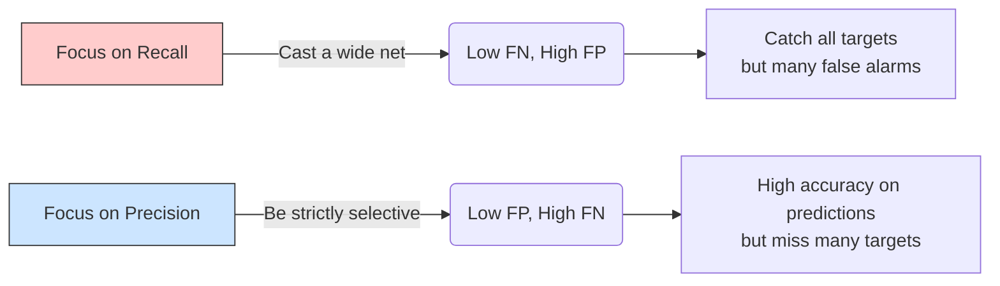

Khi đánh giá hiệu năng của một mô hình học máy (Machine Learning) hay một hệ thống tìm kiếm thông tin, chúng ta thường nghe nhắc đến thuật ngữ **Recall (Độ phủ)**. Đây là một trong những thước đo quan trọng bậc nhất giúp chúng ta biết được mô hình có đang hoạt động hiệu quả hay không, đặc biệt là trong các bài toán mang tính chất rủi ro cao hoặc mất cân bằng dữ liệu.

## Không bỏ sót mục tiêu: Recall là gì?

Recall (Độ phủ) – hay còn gọi là Độ nhạy (Sensitivity) hoặc True Positive Rate (TPR) – là thước đo đánh giá tỷ lệ các trường hợp "Đúng" (Positive) trên thực tế mà mô hình đã nhận diện thành công so với tổng số trường hợp "Đúng" thực tế tồn tại trong tập dữ liệu.

Nói một cách ngắn gọn, Recall trả lời cho câu hỏi: *"Trong tất cả các đối tượng thực sự là mục tiêu cần tìm, mô hình của chúng ta đã tìm ra được bao nhiêu phần trăm, hay đã bỏ sót mất bao nhiêu?"*

Về mặt toán học, Recall được tính bằng công thức:

$$Recall = \frac{True Positives (TP)}{True Positives (TP) + False Negatives (FN)}$$

Trong đó:
* **True Positives (TP - Điểm dương thật)**: Số lượng mẫu thực sự là Positive và mô hình dự đoán chính xác là Positive.
* **False Negatives (FN - Điểm âm giả)**: Số lượng mẫu thực sự là Positive nhưng mô hình lại bỏ sót và dán nhãn sai thành Negative.

Tổng số $(TP + FN)$ biểu diễn toàn bộ các nhãn Positive thực tế có trong tập dữ liệu (Ground Truth).

Trong bối cảnh Hệ thống truy xuất thông tin (Information Retrieval) hoặc các ứng dụng [RAG](/concepts/genai-ml/rag/) (Retrieval-Augmented Generation), Recall được hiểu là tỷ lệ tài liệu liên quan mà hệ thống đã lôi ra được trên tổng số tài liệu liên quan có trong database.

## Tại sao chúng ta cần Recall?

Nếu chỉ nhìn vào độ chính xác tổng thể (Accuracy), bạn rất dễ bị đánh lừa khi làm việc với các bộ dữ liệu mất cân bằng (Imbalanced Datasets). 

Hãy tưởng tượng một hệ thống phát hiện gian lận thẻ tín dụng. Trong số 10.000 giao dịch, chỉ có 100 giao dịch là gian lận (1%), còn lại 9.900 giao dịch là bình thường (99%). Nếu bạn xây dựng một mô hình cực kỳ đơn giản và lười biếng: luôn dự đoán mọi giao dịch là "Bình thường", mô hình này vẫn đạt độ chính xác Accuracy lên tới 99%! Thế nhưng, nó hoàn toàn vô dụng vì đã bỏ sót 100% các vụ gian lận thẻ.

Recall sinh ra chính là để đo lường khả năng **"không bỏ sót"** này. Trong các bài toán mà việc bỏ lọt mục tiêu mang lại hậu quả khôn lường (như y tế chẩn đoán bệnh ung thư, phát hiện mã độc tấn công hệ thống mạng), việc chẩn đoán nhầm một người khỏe thành có bệnh (False Positive) để họ đi kiểm tra lại vẫn tốt hơn rất nhiều so với việc bỏ sót một bệnh nhân thực sự (False Negative) khiến họ mất đi cơ hội chữa trị kịp thời.

## Điểm chạm cốt lõi của Recall

Ý tưởng cốt lõi của việc tối ưu hóa Recall là giảm thiểu chỉ số **False Negatives (FN)** về mức thấp nhất có thể.
* FN càng tiệm cận về 0 $\rightarrow$ Recall càng tiến gần về mức tuyệt đối 100% (hay 1.0).
* Recall đạt 1.0 đồng nghĩa với việc mô hình đã tóm gọn toàn bộ các đối tượng Positive mà không bỏ sót bất kỳ ai.

Tuy nhiên, cuộc sống luôn có sự đánh đổi. Bạn hoàn toàn có thể dễ dàng đạt được Recall 100% bằng cách cực đoan: *"Dự đoán tất cả mọi đối tượng đều là Positive"*. Ví dụ, một cái chuông báo cháy lúc nào cũng kêu inh ỏi thì chắc chắn sẽ không bỏ sót bất kỳ vụ cháy nào, nhưng nó sẽ khiến mọi người phát điên vì báo động giả liên tục. Lúc này, độ chuẩn xác (Precision) của hệ thống sẽ sụt giảm thê thảm.

## Minh họa thực tế: Từ bộ lọc Spam đến hệ thống RAG

### Kịch bản 1: Lọc thư rác (Spam Email)
Giả sử hòm thư của bạn thực tế nhận được 10 email Spam (TP + FN = 10).
Hệ thống lọc thư rác của bạn phân loại và đánh dấu 7 email là Spam. 
Trong số 7 email bị đánh dấu đó, có 5 email thực sự là Spam (TP = 5), còn 2 email là thư công việc quan trọng bị nhận nhầm (FP = 2).
Như vậy, có 5 email Spam vẫn lọt lưới thành công và chui vào hòm thư chính của bạn (FN = 5).
* $Recall = \frac{5}{5 + 5} = 0.5$ (50%)
* Nhận xét: Hệ thống chỉ phủ được một nửa lượng thư rác thực tế.

### Kịch bản 2: Tìm kiếm ngữ cảnh cho RAG (Vector Search)
Một người dùng đặt câu hỏi: *"Chính sách nghỉ phép năm của công ty thế nào?"*. Thực tế trong database của bạn có đúng 4 tài liệu liên quan đến chủ đề này.
Hệ thống Vector Search trả về Top 5 kết quả. Trong 5 kết quả này, có 3 tài liệu thực sự liên quan, còn 2 tài liệu nói về nội dung khác. Tài liệu liên quan thứ 4 đã bị bỏ sót do xếp ở vị trí thứ 20.
* $Recall = \frac{3}{4} = 0.75$ (75%)
* $Precision = \frac{3}{5} = 0.60$ (60%)

## Ví dụ lập trình: Tính toán Recall với Scikit-Learn

Dưới đây là cách tính toán nhanh chỉ số Recall và Precision bằng thư viện `scikit-learn` trong Python:

```python
from sklearn.metrics import recall_score, precision_score

# 1 đại diện cho Spam (Positive), 0 là Not Spam (Negative)
y_true = [1, 1, 1, 0, 0, 0] # Thực tế có 3 email Spam
y_pred = [1, 0, 0, 1, 0, 0] # Mô hình chỉ bắt đúng 1 Spam, bắt nhầm 1 Not Spam, bỏ sót 2 Spam

recall = recall_score(y_true, y_pred)
precision = precision_score(y_true, y_pred)

print(f"Recall: {recall:.2f}")       # 1/3 = 0.33 (Bắt được 33% số thư rác)
print(f"Precision: {precision:.2f}") # 1/2 = 0.50 (Trong các email báo rác, có 50% là rác thật)
```

## Cuộc chiến giằng co giữa Precision và Recall

Sự giằng co giữa Precision (Độ chuẩn xác) và Recall (Độ phủ) là một trong những bài toán đánh đổi kinh điển nhất của ngành học máy:



* **Ưu tiên tối ưu Recall**: Mô hình sẽ mở rộng ranh giới phân loại, chấp nhận "thà bắt nhầm còn hơn bỏ sót". Kết quả là số lượng lỗi False Negatives giảm mạnh, nhưng số lượng báo động giả (False Positives) sẽ tăng cao, kéo Precision đi xuống.
* **Ưu tiên tối ưu Precision**: Mô hình trở nên cực kỳ cẩn trọng và bảo thủ. Nó chỉ dán nhãn Positive khi có mức độ tự tin rất cao. Kết quả là các dự đoán đưa ra hầu như đều đúng (False Positives cực thấp), nhưng hệ thống sẽ bỏ sót rất nhiều mục tiêu thực tế (False Negatives tăng cao, Recall sụt giảm).

## Kinh nghiệm thiết kế và ứng dụng thực tế

### Khi nào nên tối ưu hóa cho Recall?
Bạn nên cấu hình ngưỡng phân loại của mô hình thiên về Recall trong các tình huống mà **hậu quả của việc bỏ sót (False Negative) đắt đỏ hơn nhiều so với việc bắt nhầm (False Positive)**:
* **Ngành Y tế**: Hệ thống phát hiện tế bào ung thư. Thà bắt nhầm một bệnh nhân lành tính đi xét nghiệm chuyên sâu còn hơn bỏ sót một ca ác tính để bệnh tiến triển nặng.
* **An ninh mạng**: Hệ thống phát hiện xâm nhập trái phép hoặc mã độc.
* **Xe tự hành**: Nhận diện chướng ngại vật trên đường. Thà phanh gấp nhầm vì một chiếc lá rơi còn hơn đâm trực diện vào người đi bộ.
* **Hệ thống RAG (giai đoạn Retrieval)**: Chúng ta cần Recall cao ở bước quét tài liệu để lấy đầy đủ ngữ cảnh đưa cho [LLM](/concepts/genai-ml/llm/). LLM sau đó có đủ trí thông minh để tự chắt lọc thông tin đúng và bỏ qua thông tin nhiễu.

### Khi nào không nên chọn Recall làm mục tiêu chính?
Tránh tập trung quá mức vào Recall khi việc **báo động giả (False Positive) gây ra sự phiền toái hoặc rủi ro nghiêm trọng**:
* **Hệ thống gợi ý (Recommender Systems)**: Nếu YouTube liên tục gợi ý những video rác, không đúng sở thích của người xem (Precision quá thấp), họ sẽ nhanh chóng rời bỏ nền tảng.
* **Hệ thống tư pháp hình sự**: Nguyên tắc tư pháp cốt lõi là thà bỏ lọt tội phạm còn hơn kết án oan người vô tội. Trường hợp này đòi hỏi Precision phải cực kỳ cao.

### Các nguyên tắc đánh giá chuẩn chỉnh (Best Practices)
* **Đo lường bằng F1-Score**: Đừng bao giờ đánh giá một mô hình chỉ dựa trên một chỉ số đơn lẻ. Hãy sử dụng F1-Score – trung bình điều hòa của Precision và Recall – để có cái nhìn cân bằng và tổng quan nhất.
* **Vẽ biểu đồ PR Curve (Precision-Recall Curve)**: Thay vì sử dụng ngưỡng mặc định là 0.5 để phân loại, hãy vẽ biểu đồ PR Curve để tìm ra điểm cân bằng tối ưu nhất phù hợp với yêu cầu thực tế của dự án.
* **Recall@K trong Search**: Đối với các hệ thống tìm kiếm hoặc [Vector Database](/concepts/genai-ml/vector-database/), hãy tập trung đo lường Recall@K (ví dụ Recall@10). Chỉ số này cho biết tỷ lệ tài liệu liên quan xuất hiện trong Top K kết quả đầu tiên, bởi vì người dùng thực tế rất hiếm khi kiên nhẫn xem hết toàn bộ danh sách kết quả.

## Các khái niệm liên quan

* [Vector Database](/concepts/genai-ml/vector-store/)
* [Reranking](/concepts/genai-ml/reranking/)
* [Chunking Strategy](/concepts/genai-ml/chunking-strategy/)

## Góc phỏng vấn: Thử thách tư duy về Recall

### 1. Hãy giải thích ý nghĩa thực tế của F1-Score và tại sao chúng ta lại dùng trung bình điều hòa (Harmonic Mean) thay vì trung bình cộng thông thường khi tính chỉ số này?
* **Gợi ý trả lời**: F1-Score là chỉ số đại diện cho sự cân bằng giữa Precision và Recall. Chúng ta bắt buộc phải dùng trung bình điều hòa thay vì trung bình cộng vì trung bình điều hòa sẽ trừng phạt rất nặng những mô hình có sự chênh lệch cực đoan giữa hai chỉ số. 
  Ví dụ: Một mô hình dự đoán vô tội vạ mọi email đều là spam sẽ đạt Recall = 1.0 nhưng Precision chỉ đạt 0.01. Nếu dùng trung bình cộng, điểm số sẽ là $(1.0 + 0.01) / 2 = 0.505$ (một con số trông có vẻ khá tốt). Tuy nhiên, nếu dùng trung bình điều hòa, điểm F1-Score sẽ bị kéo tụt xuống mức sát đáy là 0.02. Điều này phản ánh chính xác rằng mô hình đó hoàn toàn vô dụng trong thực tế.

### 2. Bạn sẽ làm thế nào để tăng chỉ số Recall cho hệ thống truy xuất tài liệu (Retrieval) trong ứng dụng RAG?
* **Gợi ý trả lời**: Để cải thiện Recall cho bước Retrieval, ta có thể áp dụng các kỹ thuật:
  1. Tăng số lượng tài liệu lấy ra (tăng giá trị $K$ trong tìm kiếm Top-K, ví dụ lấy Top-15 thay vì Top-5).
  2. Triển khai kiến trúc [Hybrid Search](/concepts/genai-ml/hybrid-search/): Kết hợp thế mạnh của Vector Search (tìm theo ngữ nghĩa) và BM25 Search (tìm theo từ khóa chính xác) để đảm bảo không bỏ sót các tài liệu chứa từ khóa chuyên ngành.
  3. Cải tiến chiến lược cắt nhỏ văn bản (Chunking Strategy), tăng tỷ lệ gối đầu (overlap) giữa các đoạn văn bản để giữ trọn vẹn ngữ cảnh ngữ nghĩa.
  4. Sử dụng mô hình Embedding chất lượng cao hơn và phù hợp với ngôn ngữ của tập tài liệu.

---

## Tài liệu tham khảo

1. [Precision and recall - Wikipedia](https://en.wikipedia.org/wiki/Precision_and_recall) - Bài viết chi tiết về định nghĩa và ứng dụng của Precision và Recall trên Wikipedia.
2. Evaluation of Ranked Retrieval Results - Introduction to Information Retrieval - Tài liệu từ Đại học Stanford về cách đánh giá xếp hạng và tính Recall trong truy xuất thông tin.
3. [Classification: Precision and Recall - Google Machine Learning Crash Course](https://developers.google.com/machine-learning/crash-course/classification/precision-and-recall) - Khóa học Machine Learning của Google giải thích về Precision và Recall.
4. [Scikit-learn recall_score API Documentation](https://scikit-learn.org/stable/modules/generated/sklearn.metrics.recall_score.html) - Tài liệu hướng dẫn sử dụng hàm tính Recall của thư viện Scikit-learn.
5. [Hands-On Machine Learning with Scikit-Learn, Keras, and TensorFlow (3rd Edition)](https://github.com/ageron/handson-ml3) - Kho lưu trữ mã nguồn và tài liệu đi kèm của cuốn sách kinh điển về Machine Learning của tác giả Aurélien Géron.

---

## English Summary

Recall, also known as Sensitivity or True Positive Rate, is a performance metric used in classification and information retrieval systems. It measures the proportion of actual positive cases that the model successfully identified ($TP / (TP + FN)$). Recall is critically important in risk-averse scenarios, such as medical diagnostics or [anomaly detection](/concepts/data-quality/anomaly-detection/), where the cost of a False Negative (missing a target) is vastly higher than a False Positive (false alarm). In search and Retrieval-Augmented Generation (RAG) contexts, Recall indicates how comprehensively the system retrieved relevant documents from the database. It is typically evaluated alongside Precision using the F1-Score or plotted on a Precision-Recall curve to determine the optimal operational threshold.
