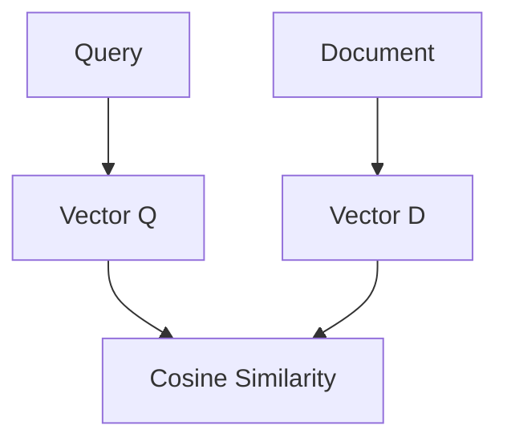

# Mô hình tái sắp xếp - Reranker

Trong các hệ thống truy xuất thông tin hiện đại và đặc biệt là trong kiến trúc RAG (Retrieval-Augmented Generation), việc tìm kiếm được tài liệu chính xác nhất để làm ngữ cảnh cho LLM quyết định trực tiếp đến chất lượng câu trả lời. Để đạt được độ chính xác tối ưu, các kỹ sư thường không chỉ dựa vào tìm kiếm vector thông thường mà sẽ bổ sung thêm một bộ lọc cực kỳ mạnh mẽ ở giai đoạn sau: **Mô hình tái sắp xếp (Reranker)**.

## Hiểu sâu về Reranker: Cross-Encoder là gì?

Về mặt bản chất học máy, mô hình Reranker thường là các mô hình ngôn ngữ được xây dựng dựa trên kiến trúc **Cross-Encoder**. Khác biệt lớn nhất của Reranker so với các mô hình sinh Vector thông thường (Bi-Encoder) là cách nó xử lý dữ liệu.

Thay vì chuyển đổi riêng rẽ từng đoạn văn bản thành một mảng số thực (vector) tĩnh, Reranker tiếp nhận đồng thời cả Câu hỏi (Query) và Tài liệu (Document) vào chung một luồng xử lý của mạng Transformer. Đầu vào của mô hình sẽ được ghép nối dưới dạng chuỗi: `[Query] + [Separator] + [Document]`. Đầu ra của mô hình không phải là một vector mà là một số thực vô hướng duy nhất (ví dụ: $0.85$), thể hiện xác suất hoặc mức độ tương đồng ngữ nghĩa sâu sắc giữa câu hỏi và tài liệu đó.

## Tại sao chúng ta cần Reranker? Giải pháp cứu cánh cho mô hình Embedding

Để thấy rõ giá trị của Reranker, chúng ta cần nhìn thẳng vào điểm yếu chí mạng của các mô hình Embedding (Bi-Encoder) trong các Vector Database:

Mô hình Bi-Encoder xử lý câu hỏi và tài liệu hoàn toàn độc lập với nhau. Nó nén toàn bộ nội dung ngữ nghĩa phong phú của một tài liệu thành một vector duy nhất, và cũng nén câu hỏi của người dùng thành một vector khác. Khi chúng ta tính toán độ tương đồng (Cosine Similarity), chúng ta thực chất chỉ đang thực hiện các phép toán so sánh hai "cục nén" này trên không gian đa chiều.

Quá trình nén thô bạo này gây ra hiện tượng thất thoát thông tin rất lớn (Information Bottleneck). Các tiểu tiết, từ khóa chuyên ngành, hay cấu trúc ngữ pháp phức tạp dễ dàng bị làm mờ nhạt đi trong mảng vector tĩnh.

Reranker (Cross-Encoder) ra đời để phá vỡ giới hạn này. Bằng cách không nén tài liệu và câu hỏi thành hai vector độc lập mà cho phép chúng xử lý đồng thời, mô hình có thể phân tích sâu sắc mối liên kết ngữ nghĩa giữa từng từ trong câu hỏi với từng từ trong tài liệu.

## So sánh chuyên sâu: Cross-Encoder vs Bi-Encoder

Sự khác biệt kỹ thuật giữa hai mô hình này quyết định vai trò của chúng trong hệ thống:

### 1. Bi-Encoder (Mô hình tạo Vector Embedding)
* **Quy trình**:
  - $Vector_A = BERT(Query)$
  - $Vector_B = BERT(Document)$
  - $Score = Cosine(Vector_A, Vector_B)$
* **Đặc tính**:
  - Ưu điểm: Có thể tính toán và tạo chỉ mục (indexing) trước cho toàn bộ tài liệu (Offline Indexing). Tốc độ tìm kiếm cực nhanh.
  - Nhược điểm: Câu hỏi và tài liệu không có cơ hội giao thoa trong quá trình mô hình phân tích ngữ nghĩa.

### 2. Cross-Encoder (Mô hình Reranker)
* **Quy trình**:
  - Khâu nối chuỗi: `Input = "Query [SEP] Document"`
  - Đi qua Transformer, lớp cơ chế Self-Attention tính toán sự liên kết chéo giữa **mọi** từ trong Query với **mọi** từ trong Document.
  - Điểm số được đưa ra qua một lớp phân loại (Linear layer) ở cuối cùng: $Score = BERT(Query \oplus Document)$
* **Đặc tính**:
  - Ưu điểm: Độ chính xác cực kỳ cao, nắm bắt được các sắc thái ngữ nghĩa tinh tế nhất.
  - Nhược điểm: Tốc độ tính toán chậm. Bắt buộc phải chạy lại toàn bộ mô hình cho mỗi cặp Query-Document ngay lúc hệ thống đang vận hành (Runtime).

## Cách thức Reranker vận hành

Khi bạn thực hiện gọi API hoặc chạy mô hình Reranker:

1. **Tokenization (Ghép chuỗi)**: Mô hình thực hiện nối Câu hỏi và Tài liệu lại thành một chuỗi duy nhất với các token phân tách đặc biệt. Ví dụ: `[CLS] Câu hỏi của bạn? [SEP] Nội dung tài liệu cần chấm điểm. [SEP]`.
2. **Deep Attention (Chú ý sâu)**: Chuỗi ký tự đi qua 12 đến 24 lớp Transformer blocks. Tại đây, cơ chế Self-Attention chéo hoạt động tối đa: từng từ của câu hỏi sẽ soi chiếu và phân tích ngữ cảnh của từng từ trong tài liệu để tự định hình ý nghĩa chuẩn xác nhất.
3. **Chấm điểm**: Giá trị biểu diễn của token đặc biệt `[CLS]` ở lớp cuối cùng được trích xuất và đưa qua một hàm phân loại (như hàm Sigmoid) để ép kết quả về một con số nằm trong khoảng từ 0 đến 1.
4. Con số này chính là mức độ liên quan ngữ nghĩa (Relevance Score) của tài liệu đối với câu hỏi.

## Sơ đồ luồng hoạt động Bi-Encoder truyền thống

Sơ đồ dưới đây mô tả cách thức so khớp vector độc lập thường thấy ở các mô hình Bi-Encoder:



## Ví dụ thực chiến: Chấm điểm độ tương đồng bằng Python

Dưới đây là đoạn code Python minh họa cách sử dụng thư viện `sentence-transformers` để tải một mô hình Cross-Encoder và thực hiện chấm điểm, sắp xếp lại các tài liệu:

```python
from sentence_transformers import CrossEncoder

# Tải mô hình Reranker (Cross-Encoder) phổ thông
model = CrossEncoder('cross-encoder/ms-marco-MiniLM-L-6-v2')

query = "Thủ đô của nước Pháp là gì?"
documents = [
    "Paris là thủ đô và thành phố đông dân nhất của Pháp.",
    "Bánh mì Baguette là một biểu tượng ẩm thực của Pháp.",
    "Lyon là một thành phố lớn ở miền trung đông nước Pháp."
]

# Chuẩn bị đầu vào dưới dạng các cặp (Query, Document)
pairs = [[query, doc] for doc in documents]

# Mô hình trực tiếp tính toán và trả về điểm số cho từng cặp
scores = model.predict(pairs)

# Hiển thị kết quả chấm điểm
for i, score in enumerate(scores):
    print(f"Doc {i+1} Score: {score:.4f} -> {documents[i]}")
    
# Output dự kiến: Tài liệu 1 (nói trực tiếp về thủ đô) sẽ có điểm vượt trội hơn hẳn so với tài liệu 2 và 3.
```

## Những lưu ý vàng khi triển khai Reranker

* **Lựa chọn mô hình nhỏ gọn**: Do Reranker bắt buộc phải chạy tính toán trực tiếp (online) lúc người dùng đang đợi kết quả, bạn không nên sử dụng các mô hình quá lớn (như 70 tỷ tham số). Các Reranker hiệu quả nhất hiện nay thường có kích thước vừa phải từ 250M đến 2B tham số (như dòng mô hình `BGE-Reranker` hoặc `MiniLM`).
* **Tính toán theo lô (Batching)**: Khi gửi danh sách tài liệu sang Reranker, hãy gom chúng lại và gửi đi dưới dạng Batch thay vì dùng vòng lặp để gọi từng cặp một. Cách này giúp tối ưu hóa tối đa khả năng xử lý tính toán song song của GPU.
* **Kiểm soát độ dài văn bản (Max Length)**: Các mô hình Cross-Encoder luôn có giới hạn cứng về độ dài token đầu vào (thường là 512 hoặc 1024 tokens cho cả query và document gộp lại). Nếu tài liệu của bạn quá dài, nó sẽ bị cắt cụt phần đuôi khi đưa vào mô hình, dẫn đến việc mất mát các dữ kiện quan trọng khi tính điểm. Do đó, hãy cắt nhỏ tài liệu (Chunking) một cách hợp lý trước khi đưa vào hệ thống.

## Cân nhắc các điểm đánh đổi

### Lợi ích nổi bật
* **Độ chính xác vượt trội**: Loại bỏ hoàn toàn tình trạng mất mát thông tin ngữ nghĩa do quá trình nén vector gây ra ở các Vector DB.
* **Dễ tinh chỉnh (Fine-tuning)**: Việc huấn luyện lại một Reranker cho phù hợp với biệt ngữ của một ngành cụ thể (y tế, pháp luật) đơn giản và dễ dàng hơn nhiều so với việc fine-tune mô hình sinh vector, vì hàm mất mát (loss function) của nó chỉ là hàm phân loại nhị phân cơ bản.

### Điểm hạn chế
* **Độ trễ (Latency) tăng lên**: Do độ phức tạp thuật toán của cơ chế Self-Attention tăng theo cấp số nhân $O(N^2)$ với N là độ dài văn bản đầu vào.
* **Không thể tạo chỉ mục trước**: Bạn bắt buộc phải tốn tài nguyên tính toán ngay lúc người dùng gửi truy vấn, không thể chuẩn bị trước như việc lưu vector tĩnh.

## Khi nào nên và không nên sử dụng?

* **Nên dùng**: Làm giai đoạn lọc thứ hai (Stage 2) trong các hệ thống tìm kiếm thông tin lớn hoặc các ứng dụng RAG. Trước tiên dùng Vector Search để nhanh chóng quét lấy Top 100 tài liệu ứng viên, sau đó dùng Reranker để lọc lấy Top 5 tài liệu chất lượng nhất đưa vào prompt cho LLM.
* **Không nên dùng**: Làm công cụ tìm kiếm độc lập đầu tiên trên toàn bộ kho dữ liệu hàng triệu bản ghi. Việc bắt hệ thống chạy Cross-Encoder trên hàng triệu tài liệu lúc runtime sẽ làm sập máy chủ và khiến người dùng phải đợi hàng giờ mới có kết quả.

## Các khái niệm liên quan

* [Reranking](/concepts/genai-ml/reranking/)
* [Vector Database](/concepts/genai-ml/vector-store/)
* [Fine-tuning](/concepts/genai-ml/fine-tuning/)

## Góc phỏng vấn: Thử thách kỹ thuật nâng cao về Reranker

### 1. Bạn hãy giải thích cụ thể điểm khác biệt cốt lõi trong kiến trúc giữa Bi-Encoder và Cross-Encoder.
* **Gợi ý trả lời**: 
  - **Bi-Encoder** (như mô hình Embedding) mã hóa độc lập Query và Document qua hai nhánh mạng Transformer riêng biệt để thu được hai vector tĩnh độc lập. Điểm số tương đồng được tính nhanh chóng bằng phép nhân Cosine Similarity ở bước cuối cùng. Nó thích hợp để quét nhanh trên tập dữ liệu lớn.
  - **Cross-Encoder** (như Reranker) ghép chung Query và Document thành một chuỗi văn bản duy nhất để đưa qua một mạng Transformer. Cơ chế Self-Attention cho phép các từ trong Query và Document giao lưu sâu sắc chéo qua lại ở từng lớp mạng, đem lại độ chính xác cực cao nhưng không thể tạo chỉ mục offline để tìm kiếm nhanh.

### 2. Nếu Cross-Encoder quá chậm và tốn kém tài nguyên, còn Bi-Encoder lại có độ chính xác chưa tốt, liệu có kiến trúc trung gian nào giải quyết được bài toán này không?
* **Gợi ý trả lời**: Có, đó là kiến trúc **Late Interaction (Tương tác muộn)**, tiêu biểu là mô hình **ColBERT**.
  - Thay vì nén toàn bộ tài liệu thành một vector duy nhất giống như Bi-Encoder, ColBERT giữ lại các vector biểu diễn riêng biệt cho từng token trong tài liệu.
  - Khi có query gửi đến, hệ thống sẽ tính toán độ tương đồng tối đa (Max-Similarity) giữa từng vector token của câu hỏi với tất cả vector token của tài liệu, sau đó cộng tổng lại.
  - Kiến trúc lai này cho phép chúng ta tính toán và lưu trữ trước (offline) các vector token của tài liệu, đồng thời khi tìm kiếm online vẫn giữ được độ chính xác gần tương đương với mô hình Cross-Encoder nhưng với tốc độ nhanh hơn rất nhiều.

## Tài liệu tham khảo

1. **Designing Data-Intensive Applications** - Martin Kleppmann (Chương 2: Data Models and Query Languages).
2. **"LoRA: Low-Rank Adaptation of Large Language Models"** - Hu et al. (Microsoft, 2021) - Tài liệu tham khảo thêm về các kỹ thuật Transformer tối ưu.

## English Summary

A Reranker is fundamentally a Cross-Encoder machine learning model utilized to precisely score the relevance between a query and a document. Unlike Bi-Encoders (Embedding models) that compress text independently into static vectors (creating an information bottleneck), Cross-Encoders concatenate the query and document into a single input. This allows the Transformer's deep self-attention mechanisms to perform rich, word-by-word cross-attention between the two texts. While this architectural design yields vastly superior accuracy for Information Retrieval and RAG pipelines, its heavy computational cost dictates that it cannot index documents offline and must be strictly used as a second-stage filter on a small subset of pre-retrieved candidates.
