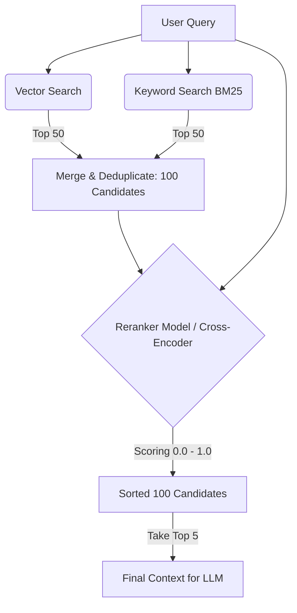

Khi xây dựng các hệ thống tìm kiếm thông tin lớn hoặc các ứng dụng [RAG](/concepts/genai-ml/rag/) (Retrieval-Augmented Generation), việc lấy được những tài liệu thực sự chất lượng và liên quan nhất để đưa vào prompt cho [LLM](/concepts/genai-ml/llm/) là yếu tố quyết định sự thành bại của giải pháp. Để giải quyết triệt để bài toán này, các kỹ sư thường áp dụng một kỹ thuật tối ưu hóa thứ hạng cực kỳ hiệu quả gọi là **Reranking (Tái sắp xếp kết quả)**.

## Bước lọc tinh tế cho hệ thống tìm kiếm: Reranking là gì?

Reranking là giai đoạn thứ hai trong quy trình truy xuất thông tin hiện đại. Nhiệm vụ của nó là nhận vào một danh sách các tài liệu ứng viên tiềm năng đã được lọc thô từ giai đoạn một (Retrieval), sau đó sử dụng một mô hình AI thông minh hơn (Reranker) để chấm điểm lại mức độ liên quan ngữ nghĩa chi tiết giữa câu hỏi của người dùng và từng tài liệu, từ đó sắp xếp lại thứ tự và đẩy những tài liệu thực sự hữu ích nhất lên trên cùng.

Thay vì tin tưởng tuyệt đối vào kết quả xếp hạng thô sơ ban đầu của [Vector Database](/concepts/genai-ml/vector-database/) (dựa trên khoảng cách vector) hay Keyword Search (dựa trên tần suất từ khóa BM25), hệ thống sẽ lấy Top-K tài liệu ứng viên (ví dụ: 100 tài liệu), truyền toàn bộ cặp `(Câu hỏi, Tài liệu)` vào mô hình Reranker để tính toán lại điểm số liên quan một cách chính xác nhất. Cuối cùng, hệ thống sắp xếp lại danh sách và chỉ lọc lấy Top-N tài liệu tốt nhất (ví dụ: 5 tài liệu) để hiển thị cho người dùng hoặc chuyển tiếp vào LLM làm ngữ cảnh.

## Tại sao hệ thống tìm kiếm cần đến hai giai đoạn?

Hệ thống tìm kiếm thông tin quy mô lớn luôn phải đối mặt với sự giằng co kinh duyệt giữa **Tốc độ (Speed)** và **Độ chính xác sâu (Deep Semantic Precision)**.

* Nếu chúng ta mang một mô hình ngôn ngữ lớn cực kỳ thông minh đi đọc chi tiết và so khớp từng tài liệu một trong số hàng triệu tài liệu trong database, hệ thống sẽ mất hàng giờ mới có thể đưa ra kết quả. Điều này hoàn toàn bất khả thi cho các ứng dụng thực tế.
* Ngược lại, nếu chỉ dùng Vector Database (Bi-Encoder) hoặc BM25, chúng ta sẽ có kết quả cực nhanh (chỉ mất khoảng 10ms). Thế nhưng, các hệ thống này phân tích ngữ nghĩa ở mức độ khá nông. Chúng có thể dễ dàng bị đánh lừa bởi các tài liệu chứa từ khóa trùng khớp nhưng ngữ cảnh thực tế lại hoàn toàn khác biệt.

Reranking ra đời như một **bước lọc tinh** để dung hòa cả hai yếu tố trên thông qua mô hình **Truy xuất hai giai đoạn (Two-stage Retrieval)**:
* **Giai đoạn 1 (Lọc thô - Retrieval)**: Sử dụng Vector DB hoặc Keyword Search để nhanh chóng quét và thu hẹp phạm vi dữ liệu, lấy ra khoảng 100 tài liệu ứng viên tiềm năng nhất (đảm bảo độ phủ - [Recall](/concepts/genai-ml/recall/) cao).
* **Giai đoạn 2 (Lọc tinh - Reranking)**: Sử dụng mô hình Reranker đọc kỹ 100 tài liệu đó để đánh giá ngữ nghĩa và sắp xếp lại thứ hạng (đảm bảo độ chính xác - Precision cao). Vì Reranker chỉ cần xử lý 100 tài liệu chứ không phải hàng triệu, tốc độ phản hồi của hệ thống vẫn được đảm bảo dưới 100ms.

## Bản chất hoạt động của Reranking

Cốt lõi của Reranking là việc chuyển dịch từ so sánh khoảng cách hình học đơn thuần (Vector Distance) sang so sánh mức độ tương tác ngữ nghĩa sâu sắc (Semantic Attention).

Trong giai đoạn lọc thô, câu hỏi và tài liệu được mã hóa độc lập thành vector nên mô hình không có cơ hội giao thoa ngữ nghĩa trực tiếp. Còn trong giai đoạn Reranking, câu hỏi và từng tài liệu được nối lại với nhau và đưa vào chung một mạng nơ-ron Cross-encoder. Cơ chế Self-Attention cho phép các từ trong câu hỏi tương tác chéo trực tiếp với các từ trong tài liệu. Nhờ vậy, mô hình có thể hiểu chính xác từ "Apple" trong câu hỏi của người dùng là đang nói về công ty công nghệ chứ không phải quả táo quả cây, từ đó chấm điểm tương đồng ngữ nghĩa chuẩn xác hơn.

## Quy trình tích hợp Reranking vào luồng RAG

1. **Nhận câu hỏi**: Người dùng gửi yêu cầu (ví dụ: *"Làm sao để cấu hình VPN?"*).
2. **Lọc thô (First-stage Retrieval)**:
   * Chạy Vector Search lấy ra 50 tài liệu liên quan ngữ nghĩa.
   * Chạy Keyword Search (BM25) lấy ra 50 tài liệu chứa từ khóa chính xác.
   * Gộp và loại bỏ trùng lặp để tạo thành một nhóm 100 tài liệu ứng viên.
3. **Tái sắp xếp (Reranking)**:
   * Hệ thống gửi danh sách gồm câu hỏi và 100 tài liệu ứng viên tới mô hình Reranker (như Cohere Rerank hay BGE-Reranker).
   * Reranker thực hiện chấm điểm từng cặp câu hỏi - tài liệu theo thang điểm từ $0.0$ đến $1.0$.
4. **Sắp xếp và Lọc**: Sắp xếp lại danh sách tài liệu theo điểm số Rerank giảm dần và chỉ giữ lại Top 5 tài liệu đứng đầu bảng.
5. **Sinh câu trả lời**: Nhét 5 tài liệu chất lượng nhất này vào prompt ngữ cảnh gửi cho LLM để tạo câu trả lời cuối cùng.

## Sơ đồ luồng xử lý Reranking hai giai đoạn


## Ví dụ thực tế: Tích hợp API Cohere Rerank

Dưới đây là đoạn code Python minh họa cách gọi dịch vụ Cohere Rerank để sắp xếp lại danh sách các tài liệu thô được trả về từ database:
```python
import cohere

# Khởi tạo client kết nối với API của Cohere
co = cohere.Client('YOUR_API_KEY')

query = "Làm sao để cấu hình VPN?"
# Danh sách tài liệu thô lấy ra từ database (có thể lẫn lộn nhiều nội dung không liên quan trực tiếp)
docs = [
    "VPN là mạng riêng ảo giúp bảo mật đường truyền internet...",
    "Để cấu hình VPN trên hệ điều hành Windows, bạn vào Settings -> Network -> VPN...",
    "Bảng so sánh giá dịch vụ VPN mới nhất năm 2025..."
]

# Gọi API Rerank để sắp xếp và chọn lọc tài liệu
response = co.rerank(
    model='rerank-multilingual-v3.0',
    query=query,
    documents=docs,
    top_n=2 # Chỉ lấy ra 2 tài liệu tốt nhất
)

# Hiển thị kết quả sau khi đã tái sắp xếp
for idx, result in enumerate(response.results):
    print(f"Rank {idx+1} (Score: {result.relevance_score:.2f}): {docs[result.document_index]}")
```

## Những kinh nghiệm vàng để tối ưu hóa Reranking

* **Đặt số lượng ứng viên ($K$) hợp lý**: Đừng tham lam đưa quá nhiều tài liệu vào bước Reranking. Ngưỡng tối ưu cho $K$ thường nằm trong khoảng từ 50 đến 150 tài liệu. Việc bắt Reranker xử lý hàng nghìn tài liệu cho một truy vấn sẽ làm tăng đáng kể độ trễ phản hồi của hệ thống và tiêu tốn nhiều tài nguyên GPU.
* **Kết hợp [Hybrid Search](/concepts/genai-ml/hybrid-search/)**: Hãy luôn chạy Reranker trên tập hợp kết quả gộp của cả Vector Search và Keyword Search. Sự kết hợp này giúp Reranker có cái nhìn toàn diện để lọc ra tài liệu tốt nhất, tận dụng được cả thế mạnh tìm kiếm ngữ nghĩa lẫn tìm kiếm từ khóa chính xác.
* **Tận dụng Reranker làm bộ lọc trước LLM**: Đừng ném hàng chục tài liệu thô trực tiếp vào prompt của LLM để mong nó tự tìm kiếm thông tin. Việc này không chỉ gây lãng phí chi phí [token](/concepts/genai-ml/token/) gửi lên API mà còn dễ làm LLM bị nhiễu thông tin. Hãy dùng Reranker để lọc lấy vài tài liệu tinh túy nhất trước khi gửi cho LLM.

## Đánh đổi thực tế: Được và mất gì khi dùng Reranking?

### Lợi thế vượt trội
* **Nâng cao chất lượng câu trả lời**: Cải thiện rõ rệt độ chính xác của ngữ cảnh đầu vào RAG chỉ với vài dòng code tích hợp mô hình Rerank.
* **Bù đắp điểm yếu của Vector Search**: Reranker xử lý rất tốt các tình huống mà tìm kiếm vector thường thất bại, như tìm kiếm các đoạn văn chứa mã lỗi kỹ thuật cụ thể hoặc các tên riêng viết tắt.

### Điểm hạn chế
* **Tăng độ trễ hệ thống (Latency)**: Do phải thực hiện tính toán online ngay khi nhận câu hỏi từ người dùng. Quá trình này thường cộng thêm khoảng 50ms đến 200ms vào tổng thời gian xử lý của pipeline.
* **Phát sinh chi phí vận hành**: Bạn cần đầu tư tài nguyên GPU để tự vận hành mô hình Rerank hoặc trả phí sử dụng API của các nhà cung cấp bên thứ ba.

### Khi nào nên áp dụng?
* Các hệ thống RAG doanh nghiệp phục vụ người dùng nội bộ hoặc khách hàng yêu cầu độ chính xác thông tin tuyệt đối.
* Khi hệ thống tìm kiếm vector của bạn thường xuyên trả về các kết quả có độ tương đồng ngữ nghĩa ảo nhưng nội dung thực tế không giải quyết được vấn đề.

### Khi nào không nên áp dụng?
* Các tính năng tìm kiếm tức thì (như gợi ý từ khóa Autocomplete khi người dùng đang gõ phím) yêu cầu độ trễ phản hồi siêu thấp (dưới 20ms).
* Khi dữ liệu của bạn đơn giản và các câu truy vấn cơ bản từ Vector Search hoặc BM25 đã đạt độ chính xác 100%.

## Các khái niệm liên quan

* [Reranker (Mô hình)](/concepts/genai-ml/reranker/)
* [Vector Database](/concepts/genai-ml/vector-store/)
* [NDCG](/concepts/genai-ml/ndcg/)

## Góc phỏng vấn: Thử thách thiết kế hệ thống Reranking

### 1. Tại sao chúng ta không áp dụng trực tiếp mô hình Reranker cho toàn bộ cơ sở dữ liệu ngay từ đầu để có độ chính xác cao nhất, thay vì phải qua bước lọc thô của Vector DB?
* **Gợi ý trả lời**: Vì mô hình Reranker (Cross-encoder) đòi hỏi chi phí tính toán cực kỳ lớn. Nó bắt buộc phải nhận vào đồng thời cả câu hỏi và tài liệu để chạy qua hàng tỷ tham số của mạng Transformer. Nếu database của bạn có 1 triệu tài liệu, việc chạy Reranker trực tiếp sẽ yêu cầu thực hiện suy luận mạng nơ-ron 1 triệu lần cho mỗi câu hỏi của người dùng, khiến thời gian phản hồi kéo dài hàng tiếng đồng hồ. 
  Do đó, thiết kế chuẩn là dùng Vector DB (Bi-encoder) để tính toán trước các vector tĩnh offline. Khi truy vấn, hệ thống chỉ cần thực hiện so khớp khoảng cách vector (phép nhân ma trận cơ bản) mất vài mili-giây để nhanh chóng lọc ra 100 ứng viên, rồi mới dùng Reranker đắt đỏ để lọc tinh trên tập nhỏ này.

### 2. Sự khác biệt bản chất giữa Reranking và kiến trúc RAG (Retrieval-Augmented Generation) là gì?
* **Gợi ý trả lời**: RAG là một kiến trúc hệ thống tổng thể kết hợp giữa hai quá trình: Tìm kiếm thông tin liên quan (Retrieval) và Sử dụng LLM để sinh câu trả lời (Generation). Trong khi đó, Reranking chỉ là một bước tối ưu hóa hiệu năng xếp hạng tài liệu nằm trong phần Retrieval của hệ thống RAG. Reranking đứng ở giữa giai đoạn lọc thô tài liệu và giai đoạn nạp ngữ cảnh vào prompt cho LLM. Bản thân Reranking không tạo ra nội dung mới, nó chỉ sắp xếp lại trật tự hiển thị của các tài liệu đã được tìm thấy.

### 3. Chúng ta có thể sử dụng chính các LLM lớn (như GPT-4) đóng vai trò làm mô hình Reranker được không?
* **Gợi ý trả lời**: Hoàn toàn có thể. Kỹ thuật này thường được gọi là "LLM-as-a-Judge" (sử dụng prompt yêu cầu LLM chấm điểm mức độ liên quan của từng tài liệu). Tuy nhiên, trong môi trường sản xuất (production), cách tiếp cận này rất ít khi được áp dụng do chi phí API cực kỳ đắt đỏ, tốn lượng lớn token, tốc độ phản hồi chậm và rủi ro LLM trả về sai định dạng kết quả khiến hệ thống không thể parse được. Thực tế, người ta thường sử dụng các mô hình Reranker chuyên dụng cỡ nhỏ (khoảng 200M đến 2B tham số) được huấn luyện riêng biệt bằng các hàm loss xếp hạng, mang lại hiệu năng tương đương nhưng nhanh và rẻ hơn hàng chục lần.

---

## Tài liệu tham khảo

1. Introduction to Information Retrieval - Sách giáo khoa kinh điển về thu hồi thông tin từ Đại học Stanford.
2. [Cohere Rerank API Documentation](https://docs.cohere.com/docs/rerank) - Tài liệu hướng dẫn sử dụng mô hình Cohere Rerank chính thức.
3. Reranking for Better Search - Qdrant Blog - Bài viết phân tích của Qdrant về cách ứng dụng Reranking để tối ưu hóa kết quả tìm kiếm vector.
4. [Node Postprocessors (Reranking) - LlamaIndex](https://docs.llamaindex.ai/en/stable/module_guides/querying/node_postprocessors/node_postprocessors/) - Hướng dẫn sử dụng các bộ lọc Postprocessor và Reranker trong framework LlamaIndex.
5. [Rerankers for RAG - Pinecone Learning Center](https://www.pinecone.io/learn/series/rag/rerankers/) - Bài viết hướng dẫn thiết lập hệ thống tái xếp hạng để cải tiến chất lượng ứng dụng RAG của Pinecone.

---

## English Summary

Reranking is the crucial second stage in modern two-stage Information Retrieval and RAG pipelines. After a fast but coarse first-stage retrieval (e.g., Vector Search or BM25) fetches a broad candidate pool of documents (high recall), a Reranker model evaluates the exact query-document pairs to compute highly accurate semantic relevance scores. It then reorders the candidates, surfacing the most relevant documents to the top (high precision) before feeding them into an LLM. While it adds a slight latency overhead, Reranking dramatically improves the final answer quality by overcoming the matching limitations of standalone vector [embeddings](/concepts/genai-ml/embeddings/).