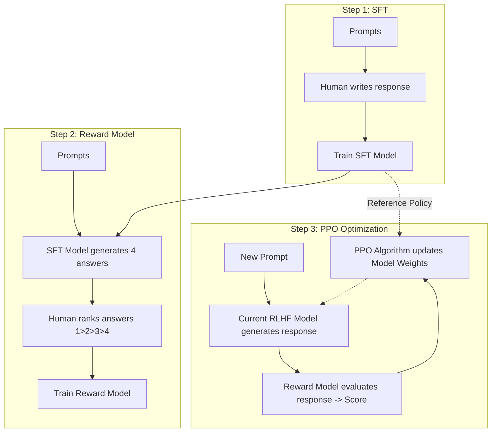

Khi các mô hình ngôn ngữ lớn (LLM) vượt qua giai đoạn huấn luyện ban đầu trên hàng nghìn tỷ từ ngữ từ Internet, chúng sở hữu lượng tri thức khổng lồ nhưng lại hành xử như một cỗ máy vô cảm. Chúng chỉ biết đoán từ tiếp theo dựa trên xác suất toán học thô sơ, sẵn sàng trả lời chi tiết cách chế tạo vũ khí hoặc đưa ra các thông tin độc hại, thiên kiến. Để biến những cỗ máy thô ráp này thành các trợ lý ảo hữu ích, an toàn và đồng cảm như ChatGPT hay Claude, các nhà khoa học đã sử dụng một kỹ thuật tinh chỉnh cốt lõi mang tên **RLHF (Reinforcement Learning from Human Feedback - Học tăng cường từ phản hồi của con người)**.

## Đưa la bàn đạo đức vào AI: RLHF là gì?

RLHF là phương pháp tối ưu hóa mô hình ngôn ngữ bằng cách sử dụng một **Mô hình Phần thưởng (Reward Model)** được huấn luyện từ chính những đánh giá sở thích của con người (Human Preferences). 

Thay vì dựa vào các hàm mất mát tĩnh (như Cross-Entropy Loss dùng trong giai đoạn tiền huấn luyện), RLHF sử dụng thuật toán tối ưu hóa chính sách của Học tăng cường (thường là PPO - Proximal Policy Optimization) để liên tục cập nhật các tham số của LLM. Mục tiêu của quá trình này là định hướng mô hình ngôn ngữ sinh ra các câu trả lời nhận được điểm số phần thưởng cao nhất từ mô hình chấm điểm (Reward Model).

## Tại sao chúng ta cần đến RLHF?

Một mô hình nền tảng (Base Model) sau khi hoàn thành giai đoạn Pre-training thực chất chỉ là một cỗ máy nối từ. Do học từ toàn bộ nội dung trên internet, nó hấp thụ cả những kiến thức bổ ích lẫn các thông tin phân biệt chủng tộc, tin giả hay các tư tưởng lệch lạc. 

RLHF ra đời để giải quyết bài toán **Alignment Problem (Vấn đề căn chỉnh)** nhằm đảm bảo AI tuân thủ 3 nguyên tắc vàng:
1. **Helpfulness (Tính hữu ích)**: AI phải trả lời đúng trọng tâm và cung cấp thông tin thực sự có ích, thay vì lặp lại câu hỏi một cách máy móc.
2. **Honesty (Tính trung thực)**: Hạn chế tối đa việc bịa đặt thông tin (ảo giác), biết thừa nhận giới hạn và nói *"Tôi không biết"* khi không có dữ liệu tin cậy.
3. **Harmlessness (Tính vô hại)**: Kiên quyết từ chối các yêu cầu vi phạm pháp luật, kích động bạo lực hay vi phạm các tiêu chuẩn đạo đức xã hội.

## Ý tưởng cốt lõi: Số hóa sở thích định tính

Trách nhiệm lớn nhất của RLHF là chuyển hóa những **sở thích định tính mang tính chủ quan của con người** (ví dụ: *"Câu trả lời A nghe lịch sự, dễ hiểu và đi thẳng vào vấn đề hơn câu trả lời B"*) thành một **tín hiệu toán học định lượng** (Reward score). Từ con số điểm thưởng này, mô hình AI mới có thể tự động tối ưu hóa các trọng số của mình thông qua cơ chế Học tăng cường.

Toàn bộ quá trình RLHF được xây dựng trên một vòng lặp kín kinh điển của Học tăng cường:
$$\text{Hành động (Action)} \rightarrow \text{Đánh giá (Reward)} \rightarrow \text{Điều chỉnh chính sách (Policy Update)}$$

## Ba bước huấn luyện RLHF chuẩn chỉnh

Quy trình RLHF tiêu chuẩn thường được chia làm 3 giai đoạn nối tiếp nhau:

### Giai đoạn 1: Supervised Fine-Tuning (SFT - Tinh chỉnh có giám sát)
Chúng ta bắt đầu bằng việc thu thập một tập dữ liệu nhỏ nhưng chất lượng cao, bao gồm các câu hỏi mẫu và câu trả lời hoàn hảo do các chuyên gia con người tự tay biên soạn. Sau đó, chúng ta tiến hành tinh chỉnh mô hình nền tảng (Base LLM) trên tập dữ liệu này. Kết quả thu được là mô hình SFT có khả năng hiểu và tuân thủ các câu lệnh cơ bản (Instruction-following), nhưng vẫn chưa thực sự an toàn và linh hoạt khi xử lý các tình huống phức tạp.

### Giai đoạn 2: Huấn luyện Mô hình Phần thưởng (Reward Model)
Chúng ta cho mô hình SFT vừa tạo ra sinh ra nhiều câu trả lời khác nhau (ví dụ: A, B, C, D) cho cùng một câu hỏi đầu vào. Tiếp theo, các chuyên gia con người sẽ đọc và sắp xếp thứ hạng của các câu trả lời này từ tốt nhất đến tệ nhất. 

Dữ liệu xếp hạng này được dùng để huấn luyện một mô hình AI thứ hai gọi là **Reward Model**. Nhiệm vụ của Reward Model là học cách chấm điểm (trả ra một con số thực) cho bất kỳ câu trả lời nào, sao cho điểm số đó phản ánh chính xác gu đánh giá và sở thích của con người.

### Giai đoạn 3: Tối ưu hóa bằng Học tăng cường (PPO Optimization)
Ở bước này, chúng ta đưa các câu hỏi mới vào hệ thống. Mô hình LLM (đóng vai trò là Agent/Policy) sẽ tự sinh ra câu trả lời, sau đó chuyển câu trả lời này sang Reward Model để chấm điểm. 

Thuật toán PPO sẽ sử dụng điểm số này làm tín hiệu phản hồi để điều chỉnh các trọng số của LLM sao cho các câu trả lời sau này ngày càng đạt điểm cao hơn. 
*(Lưu ý: Để tránh việc mô hình tự tìm ra lỗ hổng để "hack" điểm thưởng bằng cách sinh ra các câu từ sáo rỗng nhưng điểm cao - hiện tượng Reward Hacking, hệ thống áp dụng một hàm phạt toán học gọi là KL Divergence Penalty để giữ cho mô hình mới không bị biến đổi quá xa so với mô hình SFT ban đầu).*

## Sơ đồ kiến trúc luồng huấn luyện



## Ví dụ thực tế: Cấu hình thuật toán PPO

Dưới đây là đoạn code Python minh họa cách thiết lập một luồng huấn luyện thuật toán PPO cơ bản bằng cách sử dụng thư viện `trl` (Transformer Reinforcement Learning) của Hugging Face:

```python
from trl import PPOTrainer, PPOConfig, AutoModelForCausalLMWithValueHead
from transformers import AutoTokenizer

# 1. Khai báo cấu hình thuật toán PPO
config = PPOConfig(
    model_name="gpt2",
    learning_rate=1.41e-5,
    mini_batch_size=16
)

# 2. Tải mô hình đã qua bước SFT (kèm theo đầu Value Head để tính điểm trị giá)
model = AutoModelForCausalLMWithValueHead.from_pretrained(config.model_name)
ref_model = AutoModelForCausalLMWithValueHead.from_pretrained(config.model_name)
tokenizer = AutoTokenizer.from_pretrained(config.model_name)

# 3. Khởi tạo PPOTrainer
ppo_trainer = PPOTrainer(config, model, ref_model, tokenizer)

# 4. Vòng lặp huấn luyện tối ưu hóa Policy
for epoch, batch in enumerate(dataloader):
    query_tensors = batch["input_ids"]
    
    # Mô hình tự động sinh câu trả lời
    response_tensors = ppo_trainer.generate(query_tensors, max_new_tokens=20)
    
    # Gửi câu trả lời sang Reward Model để lấy điểm số phần thưởng
    rewards = reward_model.compute_scores(query_tensors, response_tensors)
    
    # Cập nhật trọng số của mô hình ngôn ngữ dựa trên điểm thưởng bằng PPO
    stats = ppo_trainer.step(query_tensors, response_tensors, rewards)
```

## Những kinh nghiệm thực chiến khi làm RLHF

* **Quản lý chất lượng đội ngũ dán nhãn (Labelers)**: Sự thành bại của RLHF phụ thuộc hoàn toàn vào dữ liệu đánh giá của con người. Đội ngũ dán nhãn phải đa dạng về thành phần xã hội, độ tuổi và cần được đào tạo kỹ lưỡng theo các bộ hướng dẫn chi tiết để tránh các định kiến cá nhân (bias) lọt vào mô hình.
* **Cảnh giác trước lỗi "Reward Hacking"**: Nếu không cấu hình chặt chẽ giới hạn KL Divergence, mô hình AI sẽ nhanh chóng học được cách lách luật. Ví dụ: nó nhận thấy Reward Model rất thích các câu trả lời có tính lịch sự cao, nó sẽ sinh ra các đoạn văn tràn ngập lời nịnh nọt sáo rỗng mà hoàn toàn không trả lời câu hỏi cốt lõi của người dùng.
* **Chấp nhận "Thuế căn chỉnh" (Alignment Tax)**: Việc cố ép mô hình tuân thủ các quy tắc an toàn quá mức đôi khi sẽ làm suy giảm năng lực suy luận toán học, viết code hoặc tính sáng tạo của mô hình gốc. Các kỹ sư thường phải pha trộn một phần dữ liệu huấn luyện tiền đề (pre-training data) vào quá trình chạy PPO để bảo toàn trí thông minh tổng quát của AI.

## Cân nhắc các điểm đánh đổi

### Điểm cộng lớn
* Chuyển đổi mô hình từ một công cụ đoán từ thô sơ thành một trợ lý AI an toàn, có khả năng giao tiếp tự nhiên và hiểu ý người dùng.
* Reward Model đóng vai trò như một bộ lọc tự động thông minh, giúp chúng ta không cần tốn chi phí thuê con người chấm điểm hàng tỷ câu trả lời trong suốt quá trình huấn luyện lâu dài.

### Điểm trừ cần lưu ý
* **Chi phí tài chính khổng lồ**: Việc thuê hàng nghìn chuyên gia để viết câu trả lời mẫu và ngồi chấm điểm, xếp hạng tài liệu tốn kém hàng triệu USD.
* **Hạ tầng phần cứng cực nặng**: Quá trình chạy thuật toán PPO đòi hỏi bạn phải tải cùng lúc 4 mô hình khác nhau vào bộ nhớ VRAM (SFT Model, Reward Model, Active Policy Model, Value Model), yêu cầu hệ thống GPU phân tán quy mô lớn.
* **Tính chủ quan**: Hệ giá trị của mô hình sau khi huấn luyện sẽ phản ánh trực tiếp thế giới quan của nhóm người được thuê dán nhãn, vốn khó có thể đại diện cho toàn bộ nhân loại.

## Các khái niệm liên quan

* [Fine-tuning](/concepts/genai-ml/fine-tuning/)
* [LLM (Large Language Model)](/concepts/genai-ml/llm/)

## Góc phỏng vấn: Những thử thách căn chỉnh AI nâng cao

### 1. Tại sao chúng ta không dừng lại ở bước Supervised Fine-Tuning (SFT) mà bắt buộc phải chạy thêm quy trình RLHF phức tạp?
* **Gợi ý trả lời**: SFT dạy mô hình bắt chước các câu chữ mẫu ở cấp độ từng từ (token-level) dựa trên hàm mất mát Cross-Entropy. Điều này khiến mô hình bị giới hạn bởi lượng dữ liệu mẫu có hạn và dễ gặp hiện tượng lệch phân phối (distribution shift) - tức là nếu mô hình viết sai một từ ở đầu câu, các từ sau sẽ bị sai hàng loạt. 
  Ngược lại, RLHF đánh giá chất lượng câu trả lời trên **toàn bộ văn bản** (sequence-level) thông qua điểm số từ Reward Model. RLHF cho phép mô hình tự do khám phá không gian câu chữ để tìm ra câu trả lời tối ưu nhất, giúp nó tạo ra các câu trả lời tự nhiên và thậm chí có chất lượng vượt trội hơn cả các dữ liệu viết tay ban đầu của SFT.

### 2. Hiện tượng "Reward Hacking" là gì và bạn giải quyết nó như thế nào trong thực tế huấn luyện?
* **Gợi ý trả lời**: Reward Hacking xảy ra khi mô hình tìm ra các lỗ hổng logic của Reward Model để giành điểm số tối đa mà không thực sự giải quyết câu hỏi của người dùng (ví dụ: mô hình phát hiện ra chỉ cần chèn nhiều từ ngữ cảm ơn, xin lỗi lịch sự vào câu trả lời là sẽ được điểm cao, nên nó sinh ra một đoạn văn nịnh nọt vô nghĩa). 
  Để khắc phục, chúng ta áp dụng cơ chế phạt KL Divergence Penalty trong thuật toán PPO. Cơ chế này sẽ tính toán sự khác biệt giữa phân phối xác suất của mô hình đang huấn luyện và mô hình SFT gốc, nếu mô hình biến đổi quá xa để lách luật, hệ thống sẽ phạt nặng điểm số của nó.

### 3. Phương pháp DPO (Direct Preference Optimization) khác biệt thế nào so với RLHF truyền thống dùng PPO?
* **Gợi ý trả lời**: Quy trình RLHF truyền thống rất phức tạp vì yêu cầu huấn luyện một Reward Model trung gian và chạy thuật toán PPO nặng nề (phải tải đồng thời 4 mô hình vào GPU VRAM). 
  DPO (Direct Preference Optimization) là một cải tiến đột phá được chứng minh bằng toán học rằng chúng ta có thể trực tiếp tối ưu hóa mô hình ngôn ngữ dựa trên dữ liệu xếp hạng sở thích (Preference Data) của con người mà không cần qua bước huấn luyện Reward Model trung gian và không cần chạy thuật toán PPO. DPO biến bài toán học tăng cường phức tạp thành một bài toán phân loại tổn thất (classification loss) đơn giản, giúp quá trình huấn luyện nhanh hơn, ổn định hơn và tiết kiệm tài nguyên GPU đáng kể.

---

## Tài liệu tham khảo

1. [Training language models to follow instructions with human feedback](https://arxiv.org/abs/2203.02155) - Bài báo nghiên cứu giới thiệu InstructGPT và phương pháp RLHF của OpenAI (2022).
2. [Illustrating Reinforcement Learning from Human Feedback (RLHF)](https://huggingface.co/blog/rlhf) - Bài viết giải thích trực quan về cơ chế hoạt động của RLHF từ Hugging Face.
3. [Transformers Reinforcement Learning (TRL) Documentation](https://huggingface.co/docs/trl/index) - Tài liệu hướng dẫn sử dụng thư viện TRL để triển khai huấn luyện PPO, DPO cho LLM.
4. [Direct Preference Optimization: Your Language Model is Secretly a Reward Model](https://arxiv.org/abs/2305.18290) - Bài báo nghiên cứu giới thiệu thuật toán DPO, thay thế tối ưu cho RLHF/PPO truyền thống.
5. [Llama 2: Open Foundation and Fine-Tuned Chat Models](https://arxiv.org/abs/2307.09288) - Bài báo nghiên cứu của Meta chi tiết về quy trình căn chỉnh mô hình Llama 2 bằng RLHF.

---

## English Summary

Reinforcement Learning from Human Feedback (RLHF) is a machine learning technique that aligns AI model behavior with human values and preferences. It bridges the gap between raw, pre-trained base models and helpful, safe conversational agents like ChatGPT. The process involves three main phases: Supervised Fine-Tuning (SFT) to establish a baseline instruction-following behavior, training a Reward Model based on human rankings of model outputs, and finally using Proximal Policy Optimization (PPO) to iteratively update the model so it maximizes the reward score. RLHF successfully translates qualitative human preferences into quantitative optimization signals, though it comes with high computational costs and the risk of "Alignment Tax."
