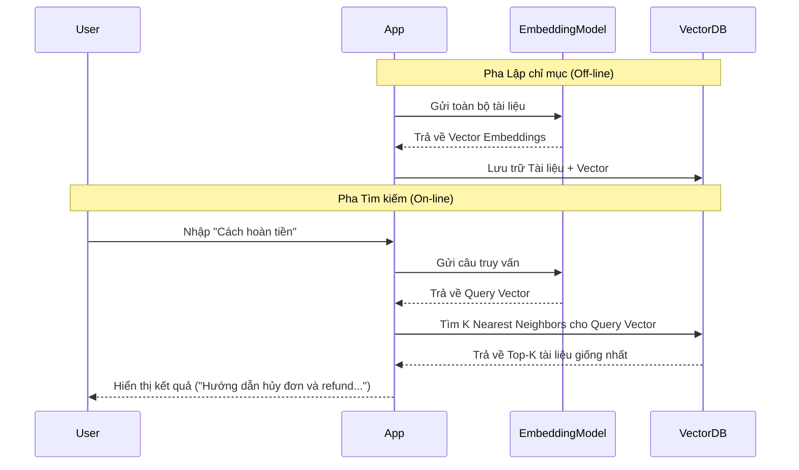

Đã bao giờ bạn gõ một câu hỏi lên công cụ tìm kiếm của một trang web bán hàng và nhận về kết quả trống trơn, chỉ vì bạn không dùng đúng từ khóa mà họ đặt tên cho sản phẩm? Hay khi bạn tìm kiếm "xe hơi", hệ thống lại bỏ qua các bài viết chứa từ "ô tô"? 

Đó là giới hạn lớn nhất của phương pháp tìm kiếm từ khóa truyền thống (Keyword Search). Để giải quyết bài toán này và giúp máy tính thực sự "hiểu" những gì con người viết, **Semantic Search (Tìm kiếm ngữ nghĩa)** đã ra đời.

## Tìm kiếm ngữ nghĩa là gì? Vượt qua giới hạn của từ khóa

**Semantic Search** là kỹ thuật truy xuất thông tin dựa trên ý nghĩa, ngữ cảnh và ý định (intent) thực sự của câu truy vấn, thay vì chỉ so khớp ký tự vật lý một cách máy móc.

Hệ thống tìm kiếm truyền thống (Lexical Search) giống như một người tra từ điển: họ đếm số lần từ khóa xuất hiện trong văn bản (sử dụng thuật toán như TF-IDF hay BM25). Trong khi đó, Semantic Search giống như một chuyên gia ngôn ngữ: họ đọc hiểu toàn bộ câu hỏi của bạn, dịch chuyển nó vào một không gian ý niệm và tìm ra tài liệu có ý nghĩa tương tự, ngay cả khi hai bên không chia sẻ bất kỳ từ chung nào.

## Tại sao chúng ta cần Tìm kiếm ngữ nghĩa?

Nếu chỉ dùng Keyword Search, bạn sẽ lập tức va phải ba chướng ngại vật lớn:
1. **Từ đồng nghĩa (Synonyms)**: Người dùng tìm kiếm "xe hơi" nhưng cơ sở dữ liệu chỉ lưu từ "ô tô", hệ thống truyền thống sẽ chịu chết.
2. **Từ đa nghĩa (Polysemy)**: Từ "Apple" trong câu "Quả apple này rất ngon" hoàn toàn khác với "Apple vừa ra mắt dòng điện thoại mới". Keyword Search không thể phân biệt được bối cảnh nếu không có cơ chế hiểu ngữ nghĩa.
3. **Cách diễn đạt đa dạng**: Hai câu "Làm sao để hủy đơn hàng?" và "Hướng dẫn hoàn tiền khi mua lỗi" có mục đích giống nhau nhưng từ vựng dùng lại khác biệt hoàn toàn.

Semantic Search ra đời để san phẳng các rào cản này bằng cách tập trung vào **ý nghĩa** thay vì **chữ viết**.

## Bản chất hoạt động: Ngôn ngữ chung của các con số

Làm sao máy tính có thể hiểu được "ý nghĩa"? Câu trả lời là: **Vectơ nhúng (Embeddings)**.

* **Số hóa ý nghĩa**: Thông qua các mô hình học máy ([Embedding Models](/concepts/genai-ml/embedding-models/)), văn bản, hình ảnh hay câu hỏi đều được chuyển đổi thành một chuỗi số thực gọi là Vectơ. Vectơ này biểu diễn vị trí của từ/câu đó trong một không gian đa chiều (thường từ vài trăm đến hàng ngàn chiều).
* **Đo lường khoảng cách**: Các khái niệm có ý nghĩa tương đồng sẽ nằm gần nhau trong không gian này. Sự tương đồng về mặt ngữ nghĩa được quy đổi thành khoảng cách toán học (thường đo bằng Cosine Similarity hoặc Dot Product). Điểm Cosine càng gần 1, hai đoạn văn bản càng giống nhau về mặt ý nghĩa.
* **Xóa nhòa rào cản ngôn ngữ (Cross-lingual)**: Các mô hình nhúng đa ngôn ngữ hiện đại cho phép bạn hỏi bằng tiếng Việt nhưng hệ thống vẫn tìm ra câu trả lời bằng tiếng Anh, miễn là chúng truyền tải chung một nội dung.

### Quy trình hoạt động của hệ thống Semantic Search

Hệ thống hoạt động qua hai giai đoạn chính:



#### Giai đoạn 1: Lập chỉ mục (Indexing - Offline)
1. **Thu thập tài liệu**: Lấy toàn bộ tài liệu từ cơ sở dữ liệu.
2. **Cắt đoạn (Chunking)**: Cắt các tài liệu dài thành từng đoạn nhỏ vừa phải để tránh loãng thông tin.
3. **Sinh Embeddings**: Đưa các đoạn này qua mô hình nhúng để lấy ra các vectơ tương ứng.
4. **Lưu trữ**: Ghi các vectơ này vào một cơ sở dữ liệu chuyên dụng gọi là **Vector Database** (như Milvus, Pinecone, Qdrant).

#### Giai đoạn 2: Truy vấn (Querying - Online)
1. Người dùng nhập câu hỏi: *"Làm sao để hủy đơn hàng?"*
2. Câu hỏi được đưa qua **cùng một mô hình nhúng** để biến thành Vectơ truy vấn (Query Vector).
3. Vector Database so sánh Query Vector với hàng triệu Vectơ tài liệu đã lưu để tìm ra Top-K vectơ có khoảng cách gần nhất (thường sử dụng thuật toán ANN như HNSW để tăng tốc).
4. Trả về đoạn văn bản gốc tương ứng cho người dùng.

## Thử nghiệm thực tế: Tìm kiếm ngữ nghĩa bằng Python

Bạn có thể tự xây dựng một công cụ tìm kiếm ngữ nghĩa đơn giản chỉ với vài dòng code Python bằng cách sử dụng thư viện `FAISS` của Meta và mô hình `sentence-transformers`:

```python
import faiss
from sentence_transformers import SentenceTransformer

# 1. Khởi tạo model và chuẩn bị dữ liệu mẫu
model = SentenceTransformer('all-MiniLM-L6-v2')
documents = ["The cat is sleeping", "I love eating pizza", "Car engine is broken"]

# 2. Tạo vector embeddings và nạp vào FAISS Index
doc_embeddings = model.encode(documents)
d = doc_embeddings.shape[1] # Kích thước vector (ví dụ: 384 chiều)
index = faiss.IndexFlatL2(d)
index.add(doc_embeddings)

# 3. Thực hiện truy vấn ngữ nghĩa
query = "A kitten is resting"
query_vector = model.encode([query])

# Tìm 1 kết quả gần nhất (k=1)
distances, indices = index.search(query_vector, k=1)

print(f"Câu hỏi: {query}")
print(f"Tài liệu khớp nhất: {documents[indices[0][0]]}") 
# Kết quả hiển thị: "The cat is sleeping" dù hai câu không hề trùng từ khóa nào!
```

## Kinh nghiệm thiết kế hệ thống tìm kiếm trong thực tế

Để hệ thống Semantic Search hoạt động hiệu quả trong môi trường thực tế, hãy lưu ý các điểm sau:

* **Sử dụng Tìm kiếm lai ([Hybrid Search](/concepts/genai-ml/hybrid-search/))**: Đừng vội vứt bỏ Keyword Search. Keyword Search cực kỳ xuất sắc khi tìm kiếm tên riêng, mã sản phẩm (ví dụ: `IPHONE-15-PRO`), mã lỗi hệ thống hoặc số ID. Giải pháp tốt nhất là kết hợp cả hai (Hybrid Search) bằng cách lấy kết quả từ cả Keyword và Semantic Search, sau đó hợp nhất điểm số bằng thuật toán RRF (Reciprocal Rank Fusion).
* **Chọn mô hình phù hợp (Asymmetric Models)**: Trong bài toán Hỏi-Đáp, câu truy vấn thường rất ngắn nhưng tài liệu trả về lại dài. Hãy sử dụng các mô hình nhúng không đối xứng (Asymmetric Models như các dòng MSMARCO) để tối ưu hóa sự tương đồng giữa câu hỏi ngắn và câu trả lời dài.
* **Chiến lược phân mảnh (Chunking)**: Tránh việc nhúng nguyên một cuốn sách hay bài viết dài hàng chục trang vào một vectơ duy nhất, vì ý nghĩa tổng thể sẽ bị pha loãng. Hãy cắt nhỏ tài liệu thành các đoạn từ 256 đến 512 tokens trước khi nhúng.
* **Độ trễ và Tài nguyên**: Semantic Search yêu cầu tính toán lớn lúc truy vấn vì phải chạy mô hình Deep Learning để sinh vectơ. Nó đòi hỏi máy chủ có GPU để tối ưu tốc độ và lượng RAM lớn cho Vector Database.

| Tiêu chí | Keyword Search (BM25) | Semantic Search (Vector) |
| :--- | :--- | :--- |
| **Cơ chế** | So khớp chính xác ký tự | So sánh khoảng cách ngữ nghĩa |
| **Điểm mạnh** | Tìm mã số, tên riêng chính xác | Hiểu từ đồng nghĩa, lỗi chính tả, bối cảnh |
| **Tốc độ** | Rất nhanh, tốn ít tài nguyên | Chậm hơn, yêu cầu GPU/RAM lớn |
| **Phù hợp** | Tìm kiếm log, mã sản phẩm | Hệ thống [RAG](/concepts/genai-ml/rag/), FAQ, gợi ý nội dung |

## Các khái niệm liên quan

* [Vectơ nhúng (Embeddings)](/concepts/genai-ml/embeddings/): Nền tảng toán học biểu diễn ngôn ngữ.
* [Phân tách văn bản (Chunking)](/concepts/genai-ml/chunking/): Kỹ thuật xử lý văn bản đầu vào.
* [Vector Database](/concepts/genai-ml/vector-database/): Cơ sở dữ liệu lưu trữ vectơ chuyên dụng.

## Góc phỏng vấn: Làm chủ Semantic Search

### 1. Sự khác biệt lớn nhất giữa Semantic Search và Keyword Search là gì? Khi nào nên kết hợp cả hai?
* **Gợi ý trả lời**: Sự khác biệt lớn nhất nằm ở cơ chế hoạt động: Keyword Search đối chiếu các ký tự vật lý của từ khóa (lexical matching), trong khi Semantic Search đối chiếu ý nghĩa bối cảnh bằng cách so sánh khoảng cách toán học giữa các vectơ. 
  Chúng ta nên kết hợp cả hai (gọi là Hybrid Search) khi xây dựng các công cụ tìm kiếm đa năng (như trang thương mại điện tử). Ví dụ, nếu người dùng gõ mã sản phẩm `IP-15-PRO-BLUE`, Keyword Search sẽ tìm ra ngay lập tức, còn Semantic Search có thể bị "ảo giác" và đưa ra các sản phẩm màu xanh khác. Ngược lại, nếu người dùng tìm "điện thoại chụp ảnh đẹp giá rẻ", Semantic Search sẽ hiểu ý định tốt hơn rất nhiều.

### 2. Tại sao chúng ta cần các thuật toán ANN (Approximate Nearest Neighbor) trong Vector Database thay vì dùng KNN thông thường?
* **Gợi ý trả lời**: Thuật toán KNN (K-Nearest Neighbors) truyền thống sẽ tính toán khoảng cách từ vectơ truy vấn tới *tất cả* các vectơ có trong database để tìm ra kết quả gần nhất. Khi cơ sở dữ liệu lên tới hàng triệu hay hàng tỷ vectơ, độ phức tạp $O(N)$ này sẽ gây ra độ trễ cực lớn, không thể chạy thời gian thực.
  Các thuật toán ANN (như HNSW, IVF) giải quyết vấn đề này bằng cách hy sinh một phần cực nhỏ độ chính xác để phân cụm hoặc xây dựng đồ thị liên kết giữa các vectơ. Nhờ đó, độ phức tạp tìm kiếm giảm xuống còn $O(\log N)$, giúp hệ thống trả về kết quả chỉ trong vài mili-giây.

---

## Tài liệu tham khảo

1. [Dense Passage Retrieval for Open-Domain Question Answering](https://arxiv.org/abs/2004.04906) - Bài báo nghiên cứu đột phá giới thiệu kỹ thuật Dense Passage Retrieval (DPR) cho hệ thống tìm kiếm câu hỏi mở.
2. [Semantic search - Wikipedia](https://en.wikipedia.org/wiki/Semantic_search) - Bài viết tổng quan về lý thuyết và lịch sử phát triển của tìm kiếm ngữ nghĩa trên Wikipedia.
3. [Vector-based Semantic Search - Pinecone Learning Center](https://www.pinecone.io/learn/semantic-search/) - Hướng dẫn chi tiết từ Pinecone về lý thuyết và thực hành thiết lập Semantic Search sử dụng cơ sở dữ liệu Vector.
4. [Semantic Search Guide - Cohere](https://docs.cohere.com/docs/semantic-search) - Hướng dẫn từ Cohere về cách ứng dụng mô hình ngôn ngữ lớn để triển khai công cụ tìm kiếm ngữ nghĩa hiệu quả.
5. [Elasticsearch Semantic Search Official Guide](https://www.elastic.co/guide/en/elasticsearch/reference/current/semantic-search.html) - Tài liệu hướng dẫn tích hợp và triển khai Semantic Search trực tiếp trên Elasticsearch sử dụng mô hình học máy.

---

## English Summary

Semantic Search is an information retrieval technique that goes beyond traditional keyword matching (lexical search) by understanding the contextual meaning and intent of a query. It utilizes Embedding Models to map both queries and documents into a shared high-dimensional vector space. Search results are generated by finding the nearest neighbors (using Cosine Similarity or Dot Product) via Approximate Nearest Neighbor (ANN) algorithms in a Vector Database. While highly effective at handling synonyms, paraphrasing, and cross-lingual queries, it is computationally expensive and less accurate for exact keyword matches like IDs, making Hybrid Search (Semantic + Lexical) the industry standard.
