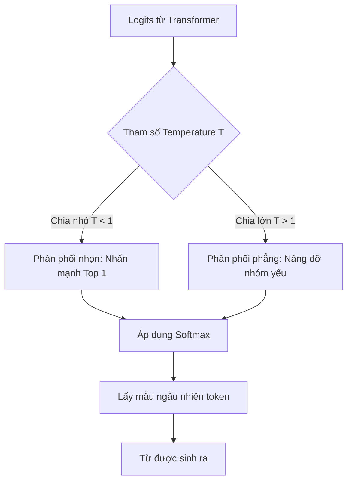

# Nhiệt độ - Temperature: Nút vặn điều chỉnh trí tưởng tượng của AI

Trong thế giới của các Mô hình Ngôn ngữ Lớn (LLM), có một tham số vô cùng quyền lực giúp bạn quyết định xem AI sẽ trả lời một cách cứng nhắc, chính xác như một cuốn sách giáo khoa, hay bay bổng, đầy tính sáng tạo như một nhà thơ. Tham số đó được gọi là **Temperature (Nhiệt độ)**. 

Bằng cách can thiệp vào các thuật toán toán học ngay trước khi mô hình lựa chọn từ vựng để xuất ra, Temperature đóng vai trò như một chiếc nút vặn điều chỉnh mức độ ngẫu nhiên và tính sáng tạo của đoạn văn bản được sinh ra.

## Bản chất toán học của "Nhiệt độ" trong AI

Về mặt kỹ thuật, **Temperature** ($T$) là một hằng số được dùng để chia trực tiếp cho các giá trị đầu ra thô (logits) của lớp mạng nơ-ron cuối cùng trước khi chúng đi qua hàm Softmax để quy đổi thành xác suất phân bố từ vựng:

* **Khi $T = 0$:** Mô hình rơi vào trạng thái hoàn toàn tất định (Deterministic). Nó luôn luôn chọn từ có xác suất cao nhất ở mọi bước sinh từ.
* **Khi $0 < T < 1$:** Làm cho phân phối xác suất trở nên "nhọn" hơn. Các từ có khả năng xuất hiện cao sẽ được gia tăng cơ hội, trong khi các từ có xác suất thấp sẽ bị dìm sâu hơn nữa.
* **Khi $T > 1$:** Làm cho phân phối xác suất trở nên "phẳng" hơn. Thu hẹp khoảng cách xác suất giữa các từ vựng, tạo cơ hội cho những từ hiếm hoặc "mạo hiểm" được xuất hiện.

## Tại sao chúng ta cần đến thông số Temperature?

Bản chất của một LLM là công cụ dự đoán từ tiếp theo (Next Token Prediction). Giả sử chúng ta đưa cho AI câu: *"Bầu trời hôm nay có màu..."*. Hệ thống sẽ tính toán và đưa ra danh sách xác suất của các từ tiếp theo như sau:
* `"xanh"`: 80%
* `"đen"`: 15%
* `"đỏ"`: 4%
* `"tím"`: 1%

Nếu không có tham số Temperature (hoặc thiết lập $T=0$), mô hình sẽ luôn chọn từ có tỷ lệ cao nhất là `"xanh"`. Nếu bạn gọi API này 100 lần, bạn sẽ nhận về 100 câu trả lời giống hệt nhau. 

Điều này cực kỳ lý tưởng cho các tác vụ toán học, viết code hoặc tra cứu dữ liệu. Tuy nhiên, nếu bạn đang cần AI sáng tác một câu chuyện hay viết một bài thơ, câu trả lời sẽ trở nên vô cùng nhàm chán và rập khuôn. Temperature ra đời nhằm cho phép người dùng chủ động bơm thêm sự "hỗn loạn" (entropy) vào quá trình sinh từ, giúp mô hình thỉnh thoảng lựa chọn các từ yếu thế hơn như `"đen"` hoặc `"đỏ"` để tạo nên sự mới lạ.

## Ba mức nhiệt độ phổ biến và tác động thực tế

* **Nhiệt độ thấp ($T = 0$ - Logic & Chính xác):** Hoàn toàn không có sự sáng tạo. Phù hợp cho các tác vụ hỏi đáp dữ liệu thực tế (QA), trích xuất thông tin, viết mã nguồn, và kiến trúc RAG. Mức này giúp hạn chế tối đa hiện tượng Ảo giác (Hallucination) của AI.
* **Nhiệt độ trung bình ($T = 0.7 \rightarrow 1.0$ - Cân bằng):** Đây là chế độ mặc định của phần lớn các chatbot hiện nay (như ChatGPT, Claude). Câu văn tạo ra tự nhiên, từ vựng phong phú nhưng vẫn đảm bảo tính logic và mạch lạc của nội dung.
* **Nhiệt độ cao ($T > 1.5$ - Hỗn loạn):** Mức độ sáng tạo đạt đỉnh điểm, nhưng đi kèm rủi ro cực kỳ lớn về việc câu văn bị sai ngữ pháp, vô nghĩa hoặc hoàn toàn lạc đề.

## Phép toán Softmax hoạt động thế nào dưới ảnh hưởng của T?

Chúng ta có công thức Softmax có tích hợp Temperature ($T$):

$$ p_i = \frac{\exp(z_i / T)}{\sum_j \exp(z_j / T)} $$

Trong đó $z_i$ là điểm số thô (logit) của từ vựng $i$.

Hãy cùng xem hiệu ứng của phép chia cho $T$:
Giả sử hệ thống đang cân nhắc giữa từ "A" (điểm thô 2.0) và từ "B" (điểm thô 1.0).
* **Nếu $T = 1$ (Bình thường):** Tỷ lệ chọn từ A là $\approx 73\%$, từ B là $27\%$.
* **Nếu $T = 0.1$ (Lạnh):** Điểm thô bị phóng đại lên thành 20 và 10. Khoảng cách $\exp(20)$ và $\exp(10)$ trở nên khổng lồ. Tỷ lệ chọn từ A vọt lên $\approx 99.99\%$. Từ B hầu như không còn cơ hội.
* **Nếu $T = 2$ (Nóng):** Điểm thô co lại thành 1.0 và 0.5. Khoảng cách xác suất bị thu hẹp đáng kể. Tỷ lệ chọn từ A giảm xuống $\approx 62\%$, từ B tăng lên $38\%$. Từ B giờ đây có cơ hội "ra sân" rất cao.

## Sơ đồ luồng xử lý logits

Dưới đây là cách mà tham số Temperature can thiệp vào quá trình tạo từ vựng của AI:



## Ví dụ thực tế bằng Python

Đoạn code minh họa việc điều chỉnh Temperature bằng OpenAI API:

```python
import openai

prompt = "Con chim bay lượn trên..."

# Yêu cầu tính chính xác cao (T = 0)
resp_cold = openai.ChatCompletion.create(
    model="gpt-4",
    messages=[{"role": "user", "content": prompt}],
    temperature=0.0
)
# Kết quả thường là: "...bầu trời xanh thẳm."

# Yêu cầu tính sáng tạo (T = 1.2)
resp_hot = openai.ChatCompletion.create(
    model="gpt-4",
    messages=[{"role": "user", "content": prompt}],
    temperature=1.2
)
# Kết quả có thể biến đổi rất đa dạng: 
# "...mặt nước hồ thu trong vắt" hoặc "...những ngọn mây hồng phiêu lãng."
```

## Quy tắc vàng khi tinh chỉnh Temperature

* **Mặc định với hệ thống RAG:** Luôn đặt `temperature = 0`. RAG yêu cầu câu trả lời phải dựa sát sườn vào tài liệu được cung cấp. Bất kỳ sự "sáng tạo" nào ở đây đều là định nghĩa của Ảo giác (Hallucination).
* **Kết hợp khéo léo với Prompt Engineering:** Thay vì cố gắng tăng Temperature lên quá cao để AI viết hay hơn (dẫn đến vỡ định dạng cấu trúc), hãy giữ Temperature ở mức cân bằng ($0.7$) và sử dụng kỹ thuật viết prompt định hướng (ví dụ: *"Hãy viết theo giọng điệu lãng mạn, sử dụng nhiều phép ẩn dụ..."*).
* **Tránh tinh chỉnh đồng thời cả Temperature và Top-p:** Cả hai thông số này đều dùng để điều khiển tính ngẫu nhiên. Việc điều chỉnh cả hai cùng lúc sẽ khiến đầu ra của mô hình trở nên cực kỳ bất ổn và rất khó kiểm soát.

## Đánh đổi và giới hạn

### Điểm mạnh
* Là thông số trực quan, dễ hiểu nhất giúp nhà phát triển nhanh chóng can thiệp vào cách LLM ứng xử.
* Giúp ép mô hình đi theo suy luận logic, chặt chẽ khi giảm sát về mức 0.

### Điểm yếu
* Không kiểm soát được cấu trúc ngữ pháp. Khi thiết lập nhiệt độ quá cao, AI sẽ bắt đầu viết các câu văn chắp vá, sai chính tả, hoặc lặp đi lặp lại các ký tự vô nghĩa.

## Khái niệm liên quan & Tài liệu tham khảo

**Khái niệm liên quan:**
* [Nucleus Sampling (Top-p)](/concepts/genai-ml/top-p/)
* [Token (Đơn vị từ vựng)](/concepts/genai-ml/token/)

**Tài liệu tham khảo:**
1. **Deep Learning** - *Ian Goodfellow, Yoshua Bengio, Aaron Courville* (Chương về Softmax và Sampling).
2. **OpenAI API Reference** - *Chat Completions Documentation*.

---

## Góc phỏng vấn: Câu hỏi thường gặp

### 1. Về mặt toán học, chuyện gì xảy ra với phân phối xác suất khi ta đẩy Temperature T tiến tới vô cùng ($T \rightarrow \infty$)?
**Gợi ý trả lời:**
Khi $T \rightarrow \infty$, tỷ số $z_i / T$ sẽ tiến dần về 0 với mọi điểm số thô $z_i$. Do đó, tử số $\exp(z_i / T)$ trong công thức Softmax sẽ tiến tới $\exp(0) = 1$ cho tất cả các token có mặt trong từ điển. 

Khi áp dụng phép toán Softmax, mọi token đều có xác suất xuất hiện ngang nhau (phân phối đều - Uniform Distribution). Việc sinh từ lúc này tương đương với việc bốc thăm ngẫu nhiên 100%, dẫn đến một chuỗi ký tự hỗn loạn, vô nghĩa hoàn toàn.

### 2. Trong một ứng dụng RAG phân tích các điều khoản hợp đồng pháp lý, bạn sẽ thiết lập tham số Temperature và Top-p như thế nào?
**Gợi ý trả lời:**
Đối với bài toán phân tích pháp lý, tính chính xác và trung thực của dữ liệu là quan trọng nhất. Tôi sẽ thiết lập **Temperature = 0** để kích hoạt cơ chế Greedy Decoding (luôn chọn từ có xác suất cao nhất), giúp loại bỏ tính ngẫu nhiên và ngăn chặn ảo giác. 

Ở mức $T=0$, tham số Top-p sẽ không còn tác dụng. Nếu vì lý do nào đó cần câu văn mềm mại hơn một chút và để $T > 0$ cực nhỏ (ví dụ $0.1$), tôi sẽ giới hạn **Top-p ở mức rất thấp (khoảng 0.1)** để đảm bảo AI chỉ được lựa chọn trong số các từ vựng an toàn nhất.

---

## English summary

Temperature is a hyperparameter applied to the logits output of a Large Language Model before the Softmax function, controlling the randomness and creativity of the generated text. A Temperature of 0 equates to greedy decoding (deterministic), which is optimal for coding, structured data extraction, and RAG architectures where factual accuracy is paramount and hallucinations are unacceptable. As Temperature increases (e.g., 0.7 - 1.0), the probability distribution flattens, allowing lower-probability words to be sampled, thereby fostering diverse and creative outputs like poetry or brainstorming. Exceedingly high temperatures result in chaotic, nonsensical text.
