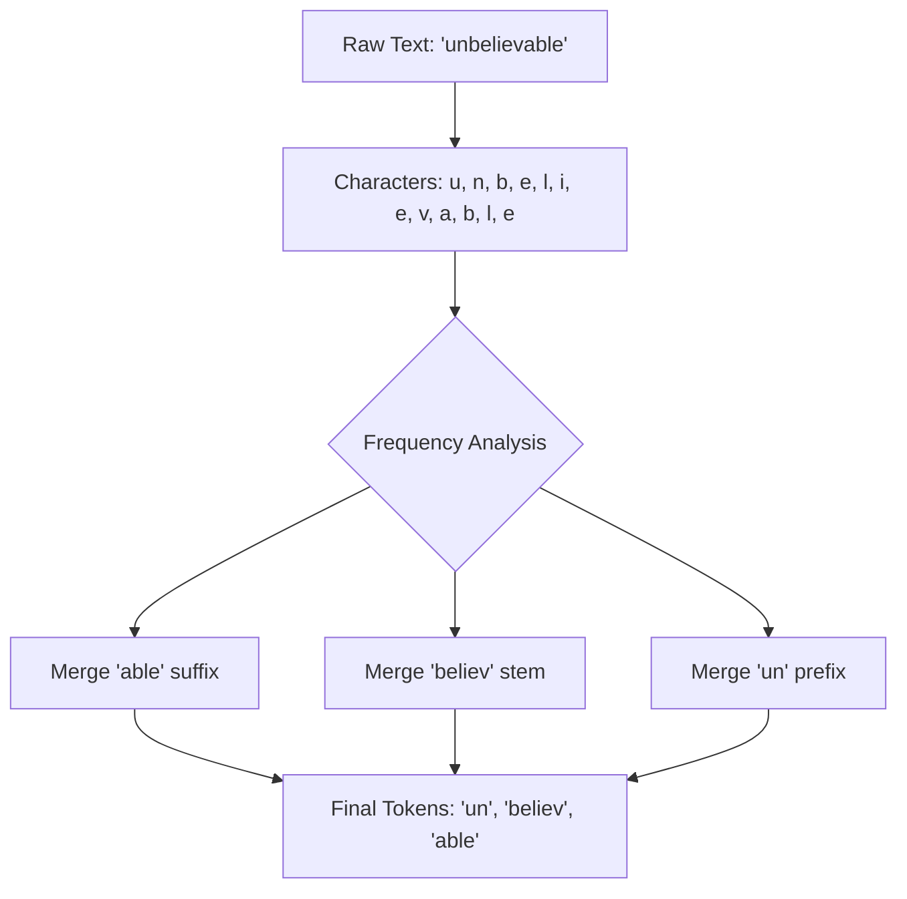

Khi bắt đầu lập trình hoặc sử dụng các Mô hình Ngôn ngữ Lớn (LLM) như GPT-4 hay Claude, bạn sẽ liên tục bắt gặp từ khóa **Token**. Nhà cung cấp API tính tiền dựa trên "1 triệu token", mô hình giới hạn độ dài dựa trên "Cửa sổ ngữ cảnh (Context Window) 128k token". 

Vậy Token thực chất là gì? Tại sao các mô hình AI không đọc chữ cái hoặc nguyên cả từ như con người, mà lại bắt buộc phải dịch mọi thứ ra thành Token?

## Token là gì? Mảnh ghép lego của ngôn ngữ

Trong Xử lý ngôn ngữ tự nhiên (NLP) và Trí tuệ nhân tạo, **Token** là đơn vị dữ liệu nhỏ nhất của văn bản mà mô hình máy tính có thể tiếp nhận, xử lý và hiểu được. 

Điều quan trọng cần nhớ: một token không nhất thiết phải tương đương với một từ hoàn chỉnh. Nó có thể là một từ nguyên vẹn, một phần của từ (như âm tiết hoặc hậu tố), hoặc thậm chí chỉ là một ký tự đơn lẻ. Quá trình băm nhỏ một đoạn văn bản thô thành các mảnh ghép token được gọi là **Tokenization**.

## Tại sao mô hình AI không đọc chữ cái hay nguyên cả từ?

Máy tính về bản chất không hiểu ngôn ngữ hay chữ viết của con người. Để mạng nơ-ron có thể tính toán, chúng ta bắt buộc phải số hóa văn bản thô. Tuy nhiên, việc lựa chọn chia nhỏ văn bản ở mức độ nào là một bài toán đánh đổi đau đầu:

* **Nếu chia nhỏ theo từng chữ cái (Character-level):** Mỗi chữ cái (a, b, c...) là một token. Cách này giúp từ điển của AI cực kỳ gọn nhẹ (chỉ khoảng dưới 100 token cho bảng chữ cái). Tuy nhiên, một câu ngắn cũng sẽ bị xẻ thành một chuỗi ký tự siêu dài, khiến bộ nhớ của AI (Context Window) bị cạn kiệt rất nhanh, đồng thời mô hình rất khó học được mối liên hệ ngữ nghĩa giữa các chữ cái ở xa nhau.
* **Nếu chia nhỏ theo từng từ nguyên vẹn (Word-level):** Mỗi từ đầy đủ là một token. Cách này giúp chuỗi dữ liệu đầu vào ngắn gọn và dễ hiểu ngữ nghĩa. Nhưng nhược điểm là kho từ điển của AI sẽ phình to ra tới hàng triệu từ (do có từ ghép, tên riêng, tiếng lóng, viết tắt, viết sai chính tả). Nếu gặp một từ mới lạ chưa có trong từ điển, AI sẽ bị "đơ" và báo lỗi Out-Of-Vocabulary (OOV).

Để giải quyết bài toán này, các nhà khoa học đã tạo ra giải pháp lai thông minh: **Token hóa theo bộ phận của từ (Sub-word Tokenization)**. Những từ phổ biến sẽ được giữ nguyên, còn những từ dài hoặc lạ sẽ bị tách nhỏ thành các mảnh ghép nhỏ hơn. Ví dụ, từ `"unbelievable"` có thể được tách làm ba token: `["un", "believ", "able"]`. Nếu AI chưa từng gặp từ này, nó vẫn có thể tự dịch nghĩa dựa trên ba mảnh ghép lego quen thuộc đó.

## Thuật toán Byte-Pair Encoding (BPE) hoạt động thế nào?

Hầu hết các mô hình ngôn ngữ lớn hiện đại đều sử dụng thuật toán **BPE (Byte-Pair Encoding)** để xây dựng bộ Tokenizer. Cơ chế hoạt động như sau:

1. **Khởi tạo:** Coi mọi ký tự hoặc byte độc lập trong kho dữ liệu huấn luyện là các token cơ sở ban đầu.
2. **Thống kê và Gom nhóm:** Tìm cặp token xuất hiện cạnh nhau nhiều nhất (ví dụ: chữ `e` và `r` thường đi liền thành `er`). Tiến hành ghép chúng lại để tạo thành một token mới là `er`.
3. **Lặp lại:** Tiếp tục quá trình gom nhóm này (ghép `t` và `h` thành `th`, ghép tiếp `th` và `e` thành `the`...) cho đến khi bộ từ điển đạt kích thước mong muốn (ví dụ: 100,000 token).
4. **Áp dụng:** Khi người dùng gửi một đoạn văn mới lên, bộ Tokenizer sẽ ưu tiên cắt văn bản đó thành các token lớn nhất có sẵn trong từ điển của nó.

Sơ đồ quy trình biến đổi:



## Bất bình đẳng ngôn ngữ: Câu chuyện token Việt vs Anh

Do hầu hết các LLM toàn cầu được huấn luyện trên kho dữ liệu Internet mà tiếng Anh chiếm đa số, thuật toán BPE học được rất nhiều cụm từ tiếng Anh hoàn chỉnh. Nhờ đó, từ điển token của AI cực kỳ tối ưu cho tiếng Anh (quy tắc ngón tay cái: **1 token $\approx$ 4 ký tự $\approx$ 0.75 từ**).

Tuy nhiên, với các ngôn ngữ ít dữ liệu huấn luyện hơn như tiếng Việt, thuật toán BPE không thể học hết các từ ghép hoàn chỉnh. Vì thế, các từ tiếng Việt thường bị chẻ nhỏ thành các mảnh vụn nhỏ hơn hoặc thậm chí là cấp độ từng ký tự đơn lẻ.

Hãy so sánh hai câu có nghĩa tương đương đi qua bộ Tokenizer `tiktoken` (cl100k_base) của OpenAI:

* **Tiếng Anh:** `"Artificial Intelligence is amazing!"`
  * Số lượng từ: 4 từ.
  * Danh sách Token (5 tokens): `["Artificial", " Intelligence", " is", " amazing", "!"]`
  * Đánh giá: Cực kỳ tối ưu, trung bình 1 từ chỉ tốn 1.25 token.
* **Tiếng Việt:** `"Trí tuệ nhân tạo thật tuyệt vời!"`
  * Số lượng từ: 7 từ.
  * Danh sách Token (11 tokens): `["Tr", "í", " tu", "ệ", " nhân", " t", "ạo", " th", "ật", " tuyệt", " vời!"]`
  * Đánh giá: Bị băm nát thành các âm tiết và chữ cái đơn. Chi phí token đắt gấp đôi dù cùng một lượng thông tin truyền tải.

> [!WARNING]
> Sự bất bình đẳng này khiến người dùng các ngôn ngữ không phải tiếng Anh phải trả nhiều tiền API hơn cho cùng một câu hỏi và làm cạn kiệt Cửa sổ ngữ cảnh (Context Window) của mô hình nhanh hơn nhiều.

## Ví dụ thực tế: Đo đạc số token bằng Python

Để quản lý chi phí API, bạn có thể tự đếm số lượng token trước khi gửi đi bằng thư viện mã nguồn mở `tiktoken` của OpenAI:

```python
import tiktoken

# Sử dụng bộ mã hóa cl100k_base (dành cho GPT-4)
encoder = tiktoken.get_encoding("cl100k_base")

text_en = "Artificial Intelligence is amazing!"
text_vi = "Trí tuệ nhân tạo thật tuyệt vời!"

# Chuyển đổi văn bản thành mảng các số nguyên ID
tokens_en = encoder.encode(text_en)
tokens_vi = encoder.encode(text_vi)

print(f"Tiếng Anh: {len(tokens_en)} tokens -> {tokens_en}")
print(f"Tiếng Việt: {len(tokens_vi)} tokens -> {tokens_vi}")
```

## Best Practices quản lý chi phí API và Cửa sổ ngữ cảnh

* **Đếm token trước khi gọi API:** Luôn sử dụng thư viện như `tiktoken` trong code để kiểm soát độ dài prompt. Nếu prompt vượt quá hạn mức cho phép, hệ thống sẽ tự động báo lỗi gây gián đoạn dịch vụ.
* **Sử dụng đúng Tokenizer tương ứng:** Mỗi mô hình (GPT, LLaMA, Claude) có một bộ Tokenizer riêng với từ điển khác nhau. Hãy đảm bảo bạn dùng đúng thư viện đếm token của nhà cung cấp mô hình đó để có số liệu chính xác.
* **Quản lý Token đầu ra (Output):** Các nhà cung cấp API tính phí cho cả Input tokens (câu hỏi của bạn) và Output tokens (câu trả lời của AI). Trong đó, giá của Output tokens thường đắt gấp 2 - 3 lần. Hãy thiết lập tham số `max_tokens` hợp lý để giới hạn AI không viết dông dài gây tốn kém chi phí vô ích.

## Khái niệm liên quan & Tài liệu tham khảo

**Khái niệm liên quan:**
* [Cửa sổ ngữ cảnh (Context Window)](/concepts/genai-ml/context-window/)
* [Phân tách văn bản (Chunking)](/concepts/genai-ml/chunking/)
* [Mô hình ngôn ngữ lớn (LLMs)](/concepts/genai-ml/llm/)

## Góc phỏng vấn: Câu hỏi thường gặp

### 1. Thuật toán Byte-Pair Encoding (BPE) giải quyết được vấn đề gì trong xử lý ngôn ngữ tự nhiên (NLP)?
**Gợi ý trả lời:**
BPE là một thuật toán token hóa theo mức độ bộ phận của từ (Sub-word). Nó giải quyết được bài toán cân bằng giữa:
* **Kích thước từ điển (Vocabulary Size):** Giúp từ điển không bị phình to quá lớn như phương pháp Word-level (vốn dễ bị bỏ sót tên riêng, từ viết tắt).
* **Độ dài chuỗi đầu vào:** Giúp chuỗi token truyền vào mạng nơ-ron ngắn hơn và giàu ngữ nghĩa hơn nhiều so với phương pháp Character-level (vốn chia nhỏ về mức chữ cái đơn lẻ, làm cạn kiệt Context Window rất nhanh).
Biệt ngữ: BPE giải quyết triệt để lỗi từ lạ Out-Of-Vocabulary (OOV) vì bất kỳ từ lạ nào cũng có thể bị chẻ nhỏ thành các mảnh ghép ký tự có sẵn trong từ điển.

### 2. Tại sao chi phí khi phát triển ứng dụng GenAI bằng tiếng Việt lại thường cao hơn nhiều so với tiếng Anh?
**Gợi ý trả lời:**
Hầu hết các LLM lớn trên thế giới hiện nay đều sử dụng bộ Tokenizer được huấn luyện chủ yếu dựa trên các tài liệu tiếng Anh. Do đó, từ điển của chúng chứa sẵn phần lớn các từ tiếng Anh hoàn chỉnh (1 từ thường tương đương 1 token). 

Trong khi đó, do dữ liệu tiếng Việt ít hơn, các từ tiếng Việt không được nhận diện nguyên vẹn mà bị băm nhỏ thành các âm tiết hoặc ký tự đơn lẻ (1 từ tiếng Việt có thể tốn 2 đến 3 token). Vì nhà cung cấp API tính tiền dựa trên số lượng token xử lý, cùng một câu có nghĩa tương đương, phiên bản tiếng Việt sẽ sinh ra số lượng token lớn hơn nhiều, dẫn đến chi phí vận hành đắt hơn và chiếm dụng bộ nhớ ngữ cảnh nhiều hơn.

---

## Tài liệu tham khảo

1. [Neural Machine Translation of Rare Words with Subword Units](https://arxiv.org/abs/1508.07909) - Bài báo nghiên cứu nền tảng đề xuất sử dụng BPE cho việc mã hóa subword trong xử lý ngôn ngữ tự nhiên.
2. [OpenAI tiktoken GitHub Repository](https://github.com/openai/tiktoken) - Thư viện mã nguồn mở của OpenAI để đếm và tối ưu hóa token nhanh chóng trong Python.
3. [Hugging Face NLP Course: Tokenizers Chapter](https://huggingface.co/learn/nlp-course/chapter6/1) - Phần khóa học chi tiết của Hugging Face giải thích cơ chế hoạt động của các bộ Tokenizer khác nhau.
4. [Tokenizer Summary - Hugging Face Transformers](https://huggingface.co/docs/transformers/tokenizer_summary) - Tài liệu tổng hợp và so sánh chi tiết các thuật toán BPE, WordPiece và SentencePiece.
5. [OpenAI Tokenizer Tool](https://platform.openai.com/tokenizer) - Công cụ web chính thức của OpenAI giúp lập trình viên kiểm tra trực quan và đếm số lượng token cho các đoạn văn bản.

---

## English summary

A Token is the fundamental unit of text processed by a Large Language Model, representing a word, subword, or character. Through a process called Tokenization—typically using the Byte-Pair Encoding (BPE) algorithm—raw text is converted into a sequence of integer IDs. Subword tokenization perfectly balances vocabulary size and sequence length while eliminating the Out-Of-Vocabulary (OOV) problem. Because tokenizer vocabularies are heavily biased towards English, processing other languages like Vietnamese typically results in more tokens per word, leading to higher API costs and faster depletion of the Context Window.
