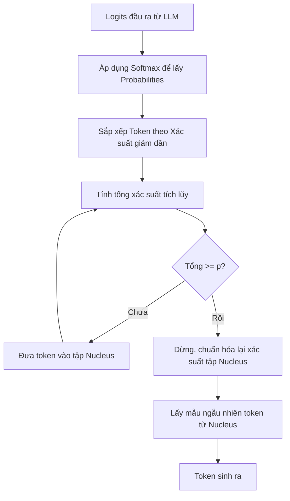

Hãy tưởng tượng bạn đang chơi trò chơi nối chữ với một nhà thông thái. Tại mỗi lượt đi, thay vì lôi toàn bộ cuốn từ điển tiếng Việt ra để chọn từ tiếp theo (dễ dẫn đến việc bốc nhầm các từ cổ hoặc từ hiếm gây tối nghĩa câu), nhà thông thái chỉ liệt kê ra một danh sách ngắn các từ phù hợp nhất với ngữ cảnh hiện tại. Sau đó, ông tính tổng mức độ "tự tin" của nhóm từ này sao cho vừa tròn một ngưỡng nhất định (ví dụ 90%) và chỉ bốc ngẫu nhiên một từ trong nhóm đó. 

Trong thế giới của các Mô hình Ngôn ngữ Lớn (LLM), kỹ thuật chọn lọc thông minh này được gọi là **Top-p** hay **Nucleus Sampling (Lấy mẫu hạt nhân)**.

## Top-p là gì? Tập hợp hạt nhân động

**Top-p (Nucleus Sampling)** là một thuật toán giải mã (decoding strategy) được sử dụng để kiểm soát độ ngẫu nhiên và tính mạch lạc của văn bản do AI tạo ra. 

Thay vì bốc ngẫu nhiên trên toàn bộ từ điển (vốn chứa hàng trăm ngàn token), thuật toán sẽ:
1. Sắp xếp tất cả các token tiềm năng theo xác suất xuất hiện giảm dần.
2. Cộng dồn xác suất từ cao xuống thấp.
3. Chỉ giữ lại nhóm token hàng đầu có tổng xác suất tích lũy vừa vượt quá hoặc bằng ngưỡng $p$ ($0 \le p \le 1$) đã thiết lập.
4. Chọn ngẫu nhiên token tiếp theo chỉ trong phạm vi nhóm "hạt nhân" (nucleus) này.

## Tại sao chúng ta cần đến Nucleus Sampling?

Bản chất của việc AI viết văn là lấy mẫu từ một phân phối xác suất từ vựng. 
* Nếu chúng ta luôn bắt AI chọn từ có xác suất cao nhất (Greedy Decoding), câu văn sinh ra sẽ rất đơn điệu, lặp đi lặp lại và thiếu sức sống.
* Tuy nhiên, nếu cho phép AI lấy mẫu hoàn toàn tự do trên toàn bộ từ điển, mô hình sẽ thỉnh thoảng bốc nhầm các từ có xác suất cực thấp nằm ở "phần đuôi dài" (long tail). Điều này dẫn đến các lỗi ngớ ngẩn như câu văn bị sai ngữ pháp, vô nghĩa, hoặc phát sinh ảo giác (hallucination).

Top-p ra đời để giải quyết dứt điểm bài toán này bằng cách cắt bỏ phần đuôi từ vựng không an toàn một cách linh hoạt theo ngữ cảnh, đảm bảo AI vừa viết văn tự nhiên, vừa không nói những điều nhảm nhí.

## Cơ chế vận hành từng bước của thuật toán Top-p

Hãy xem ví dụ thực tế: Chúng ta đặt cấu hình **Top-p = 0.9**. 
AI đang cần tìm từ tiếp theo cho câu: *"Con mèo thích ăn..."*. Phân phối xác suất của các từ vựng tiềm năng được tính ra như sau:

1. `"cá"` (xác suất 0.50)
2. `"chuột"` (xác suất 0.20)
3. `"hạt"` (xác suất 0.15)
4. `"cỏ"` (xác suất 0.07)
5. `"đất"` (xác suất 0.03)
6. ... các từ khác (tổng xác suất 0.05)

Thuật toán tiến hành cộng dồn xác suất từ trên xuống dưới:
* `"cá"`: 0.50 (chưa đạt 0.9)
* `"cá"` + `"chuột"` = 0.70 (chưa đạt 0.9)
* `"cá"` + `"chuột"` + `"hạt"` = 0.85 (chưa đạt 0.9)
* `"cá"` + `"chuột"` + `"hạt"` + `"cỏ"` = 0.92 (đã vượt ngưỡng 0.9)

Tại điểm này, hệ thống sẽ dừng lại và khóa nhóm "hạt nhân" gồm bốn từ: `["cá", "chuột", "hạt", "cỏ"]`. Xác suất của bốn từ này được quy đổi để tổng bằng 1. Từ tiếp theo sẽ được bốc ngẫu nhiên trong bốn từ này. Từ `"đất"` và các từ phía sau bị loại bỏ hoàn toàn khỏi cuộc chơi.

## Sơ đồ thuật toán tính tổng xác suất tích lũy

Dưới đây là sơ đồ luồng lọc từ vựng bằng thuật toán Top-p:



## Ví dụ thực tế: Cấu hình Top-p bằng Python

Bạn có thể dễ dàng thiết lập tham số `top_p` khi gọi API của OpenAI:

```python
import openai

response = openai.ChatCompletion.create(
    model="gpt-4",
    messages=[{"role": "user", "content": "Viết một bài thơ về biển."}],
    temperature=0.8,
    top_p=0.5, # Chỉ lấy ngẫu nhiên trong nhóm từ chiếm 50% tổng xác suất
    max_tokens=100
)

print(response.choices[0].message.content)
```

> [!TIP]
> Trong ví dụ này, dù chúng ta đặt `temperature = 0.8` (khuyến khích tính ngẫu nhiên), nhưng việc siết `top_p = 0.5` đã giới hạn mạnh mẽ nhóm từ vựng an toàn mà mô hình được phép sử dụng. Nhờ đó, bài thơ sinh ra vẫn giữ được cấu trúc chặt chẽ và không bị bay bổng quá đà.

## So sánh tương quan giữa Top-k và Top-p

Trước khi Top-p ra đời, người ta thường dùng thuật toán **Top-k** để kiểm soát từ vựng. Hãy đặt hai thuật toán này lên bàn cân để hiểu tại sao Top-p lại được ưa chuộng hơn:

* **Top-k (Cố định số lượng):** Luôn chỉ xem xét đúng $k$ từ có xác suất cao nhất (ví dụ: $k=50$). Thiết kế này gặp vấn đề khi phân phối xác suất thay đổi:
  * Nếu phân phối xác suất rất "phẳng" (nhiều từ có cơ hội ngang nhau), giới hạn 50 từ sẽ làm mất đi nhiều từ thú vị.
  * Nếu phân phối xác suất rất "nhọn" (chỉ có 1 từ chiếm 95% xác suất), việc xét tiếp 49 từ còn lại vô tình đưa các từ vô nghĩa vào danh sách lấy mẫu ngẫu nhiên.
* **Top-p (Tự động co giãn):** Thay vì cố định số lượng từ, Top-p tự động thích ứng với độ tin cậy của mô hình:
  * Khi mô hình phân vân, nhóm từ vựng (hạt nhân) tự động phình to ra để chứa nhiều từ hơn, tăng tính sáng tạo.
  * Khi mô hình rất tự tin, nhóm hạt nhân tự động co hẹp lại (có khi chỉ còn 1-2 từ), đảm bảo an toàn tuyệt đối cho câu văn.

## Quy tắc vàng và cạm bẫy thiết kế

* **Quy tắc vàng của OpenAI:** Bạn **không nên** điều chỉnh đồng thời cả `temperature` và `top_p` trong cùng một câu lệnh gọi mô hình. Điều chỉnh cả hai biến số ngẫu nhiên này sẽ làm hành vi của AI trở nên vô cùng khó đoán và khó gỡ lỗi. Tốt nhất, hãy giữ cố định một bên (ví dụ đặt `top_p = 1.0` mặc định) và tinh chỉnh bên còn lại (`temperature`), hoặc ngược lại.
* **Thiết lập theo mục đích công việc:**
  * **Top-p thấp ($0.1 \rightarrow 0.3$):** Phù hợp cho các tác vụ cần độ chính xác cao, đòi hỏi tư duy logic (như viết code, sinh câu lệnh SQL, dịch thuật hoặc trích xuất thông tin).
  * **Top-p cao ($0.7 \rightarrow 0.95$):** Phù hợp cho các tác vụ cần sự đa dạng ngôn từ, sáng tạo nghệ thuật (như viết blog, lên ý tưởng, viết truyện).

## Đánh đổi và giới hạn

### Điểm mạnh
* Giúp cân bằng hoàn hảo giữa tính sáng tạo và sự logic của văn bản.
* Tự động co giãn số lượng từ vựng dựa trên mức độ tự tin của mô hình theo từng ngữ cảnh cụ thể.

### Điểm yếu
* Đòi hỏi thêm bước tính toán (sắp xếp và cộng dồn xác suất tích lũy) trên toàn bộ từ điển sau khi chạy lớp Softmax. Việc này tạo ra một khoản chi phí tính toán nhỏ (overhead) trong quá trình sinh từ.

## Khái niệm liên quan & Tài liệu tham khảo

**Khái niệm liên quan:**
* [Nhiệt độ (Temperature)](/concepts/genai-ml/temperature/)
* [Token (Đơn vị từ vựng)](/concepts/genai-ml/token/)
* [Mô hình ngôn ngữ lớn (LLMs)](/concepts/genai-ml/llm/)

**Tài liệu tham khảo:**
1. **The Curious Case of Neural Text Degeneration** - *Holtzman et al.* (2019) (Nghiên cứu khai sinh ra khái niệm Nucleus Sampling).
2. **Hugging Face Generation Documentation** - *Tài liệu chi tiết về các hàm giải mã trong NLP*.

---

## Góc phỏng vấn: Câu hỏi thường gặp

### 1. Hãy so sánh sự khác biệt cơ bản giữa Top-k và Top-p (Nucleus Sampling). Tại sao hiện nay các LLM lại chuộng Top-p hơn?
**Gợi ý trả lời:**
Sự khác biệt cốt lõi nằm ở tính linh hoạt của tập từ vựng được xem xét:
* **Top-k** sử dụng một ngưỡng cắt cứng dựa trên số lượng từ (luôn lấy đúng $k$ từ hàng đầu). Nó không thích ứng tốt khi mức độ tự tin của mô hình thay đổi theo từng từ khác nhau trong câu.
* **Top-p (Nucleus)** sử dụng một ngưỡng cắt động dựa trên tổng xác suất tích lũy ($p$). Nhờ vậy, tập hợp từ vựng sẽ tự động phình to khi mô hình phân vân và co hẹp lại khi mô hình đã rất chắc chắn về từ tiếp theo. Sự linh hoạt này giúp Top-p loại bỏ hiệu quả các từ ngớ ngẩn ở phần đuôi xác suất mà vẫn giữ được tính tự nhiên của câu văn, vì thế nó được ưa chuộng hơn trong các hệ thống GenAI hiện đại.

### 2. Nếu tôi đặt tham số Temperature = 0, liệu thông số Top-p có còn tác dụng gì không?
**Gợi ý trả lời:**
Hoàn toàn không. Khi thiết lập `temperature = 0`, phân phối xác suất sau hàm Softmax sẽ bị biến thành hàm `argmax` (tất định). Lúc này, token có xác suất cao nhất ban đầu sẽ được khuếch đại thành xác suất 1.0 (hoặc 100%), trong khi tất cả các token khác đều có xác suất bằng 0. Do đó, việc áp dụng ngưỡng Top-p (dù đặt bằng bao nhiêu) cũng chỉ thu được một token duy nhất này mà thôi. Đây chính là cơ chế giải mã tham lam (Greedy Decoding).

---

## English summary

Top-p (Nucleus Sampling) is a decoding strategy used in Large Language Models to govern text generation. Instead of sampling from the entire vocabulary or a fixed number of top tokens (Top-k), Nucleus Sampling dynamically selects the smallest set of tokens whose cumulative probability exceeds the threshold $p$. This approach effectively truncates the "long tail" of low-probability, nonsensical words while allowing enough diversity from the high-probability tokens. It solves the issue of repetitive text seen in greedy decoding and avoids the grammatical errors or hallucinations common in pure random sampling. It is recommended to adjust either Top-p or Temperature, but not both simultaneously.
