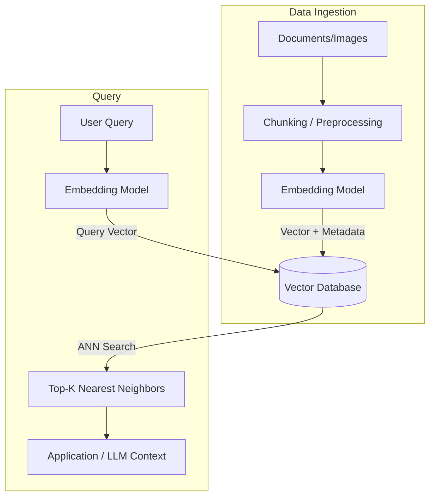

# Cơ sở dữ liệu Vector - Vector Database: Nền tảng lưu trữ tri thức cho GenAI

Trong kỷ nguyên của Trí tuệ nhân tạo tạo sinh, các mô hình ngôn ngữ lớn (LLM) giống như những bộ não siêu việt nhưng lại có một điểm yếu chí mạng: chúng không có trí nhớ dài hạn đối với dữ liệu nội bộ của doanh nghiệp. Để giải quyết vấn đề này, các kỹ sư dữ liệu đã xây dựng một "ngăn nhớ" chuyên biệt có khả năng lưu trữ và truy xuất tri thức một cách thông minh. Đó chính là **Cơ sở dữ liệu Vector (Vector Database / Vector Store)**. 

Khác với các cơ sở dữ liệu truyền thống vốn chỉ hiểu các phép so khớp từ khóa chính xác, Vector Database lưu trữ thông tin dưới dạng các tọa độ đa chiều (embeddings) và cho phép tìm kiếm dữ liệu dựa trên sự tương đồng về mặt ngữ nghĩa (semantic similarity).

## Vector Store là gì? Khi AI lưu trữ tri thức dưới dạng các con số

Về mặt định nghĩa, **Cơ sở dữ liệu Vector** là một hệ thống lưu trữ được thiết kế chuyên biệt để quản lý các mảng số thực đa chiều (vector) đại diện cho các thực thể phi cấu trúc như văn bản, hình ảnh hoặc âm thanh. 

Quá trình dịch chuyển dữ liệu thô này thành các vector số học được gọi là **Embedding**, được thực hiện bởi các mô hình học máy (như OpenAI `text-embedding-3-large`, BERT hoặc CLIP). Một Vector Database không chỉ đơn thuần lưu trữ các con số này mà quan trọng hơn, nó cung cấp các cấu trúc chỉ mục thông minh (như HNSW, IVF) giúp tìm kiếm ra các vector "gần gũi" nhất với câu hỏi của người dùng trong không gian hàng ngàn chiều chỉ trong nháy mắt.

## Tại sao chúng ta cần đến một kho lưu trữ Vector?

Phần lớn dữ liệu phát sinh hàng ngày trong doanh nghiệp là dữ liệu phi cấu trúc (như file PDF, email, hình ảnh, video). Các cơ sở dữ liệu quan hệ (SQL) hay NoSQL truyền thống vốn rất xuất sắc khi xử lý dữ liệu có cấu trúc, nhưng lại hoàn toàn "bất lực" trước dữ liệu phi cấu trúc.

Nếu bạn muốn tìm kiếm bức ảnh chứa *"một chú mèo đang ngủ trưa"* hoặc đoạn văn có nội dung tương đồng với ý niệm *"cảm thấy thỏa mãn với cuộc sống"*, câu lệnh SQL với toán tử `LIKE %cat%` sẽ không thể giải quyết được. 

Vector Database ra đời để mở ra cánh cửa **Tìm kiếm theo ngữ nghĩa (Semantic Search)**. Thay vì so sánh mặt chữ, nó đo lường khoảng cách toán học giữa các ý niệm. Hai câu: *"Tôi thấy rất vui"* và *"Tôi ngập tràn hạnh phúc"* dù không chia sẻ bất kỳ từ vựng chung nào, nhưng khi được đưa vào không gian vector, tọa độ của chúng vẫn sẽ nằm rất sát nhau.

## Ba thành phần cốt lõi của một Vector Database

Một Vector Database hoàn chỉnh được cấu thành từ ba trụ cột kỹ thuật chính:

1. **Embedding (Mã hóa):** Quá trình biến đổi văn bản hay hình ảnh thành một mảng các số thực (Float Array) có độ dài từ 384 đến 3072 chiều tùy vào mô hình được chọn.
2. **Hàm đo khoảng cách toán học (Distance Metrics):** Quyết định cách thức tính toán độ tương đồng giữa hai vector:
   * *Cosine Similarity:* Đo góc giữa hai vector (rất được ưa chuộng khi xử lý văn bản).
   * *Euclidean Distance (L2):* Đo khoảng cách đường thẳng hình học giữa hai điểm trong không gian.
   * *Dot Product (Tích vô hướng):* Phép nhân ma trận tối ưu, cực nhanh khi các vector đã được chuẩn hóa (normalized).
3. **Thuật toán tìm kiếm xấp xỉ (Approximate Nearest Neighbor - ANN):** Nếu hệ thống so sánh tuần tự một vector truy vấn với hàng triệu vector khác trong database (thuật toán KNN), tốc độ sẽ cực kỳ chậm. Các thuật toán ANN (như HNSW, IVF, PQ) chấp nhận hy sinh một tỷ lệ rất nhỏ độ chính xác để mang lại tốc độ truy vấn tức thời trên quy mô dữ liệu khổng lồ.

## Quy trình vận hành: Từ tệp tin thô đến kết quả tìm kiếm

Hệ thống Vector Database hoạt động qua hai quy trình khép kín:



### Giai đoạn ghi (Indexing Pipeline)
* Đọc tài liệu thô phi cấu trúc từ các nguồn.
* Chia nhỏ văn bản thành các đoạn ngắn (Chunking) để giữ cho ngữ nghĩa tập trung.
* Chuyển hóa các đoạn văn này thành vector thông qua mô hình Embedding.
* Lưu trữ vector kèm theo dữ liệu gốc (Metadata) vào Vector Database và tự động xây dựng cây chỉ mục (Index).

### Giai đoạn đọc (Search Pipeline)
* Người dùng nhập câu hỏi trên ứng dụng.
* Câu hỏi được gửi qua cùng một mô hình Embedding để tạo thành Vector Query.
* Vector Database chạy thuật toán ANN tìm kiếm trên chỉ mục để lọc ra Top-K vector nằm gần Vector Query nhất.
* Hệ thống lấy ra phần Metadata (đoạn văn bản gốc) tương ứng với các vector này và trả về cho ứng dụng (hoặc đưa vào ngữ cảnh của LLM).

## Ví dụ thực tế: Sử dụng pgvector trên PostgreSQL

Chúng ta có thể lưu trữ và tìm kiếm vector trực tiếp trong cơ sở dữ liệu quan hệ PostgreSQL bằng cách sử dụng extension **pgvector**:

```sql
-- 1. Kích hoạt extension pgvector
CREATE EXTENSION vector;

-- 2. Tạo bảng lưu trữ tài liệu với cột vector 3 chiều
CREATE TABLE documents (
    id SERIAL PRIMARY KEY,
    content TEXT,
    embedding vector(3)
);

-- 3. Thêm tài liệu (Với giá trị vector đã được tính toán từ Client)
INSERT INTO documents (content, embedding) VALUES 
('Mèo thích ăn cá', '[0.1, 0.2, 0.8]'),
('Chó thích gặm xương', '[0.2, 0.1, 0.3]');

-- 4. Tìm kiếm ngữ nghĩa bằng khoảng cách Cosine (Ký hiệu <=> )
SELECT content, embedding 
FROM documents
ORDER BY embedding <=> '[0.11, 0.22, 0.79]' 
LIMIT 1;

-- Kết quả trả về sẽ là bản ghi: "Mèo thích ăn cá"
```

## Best Practices thiết kế hệ thống và cạm bẫy cần tránh

* **Thiết lập bộ lọc kết hợp (Hybrid Search):** Hãy luôn lưu kèm Metadata (như tác giả, ngày tạo, thẻ danh mục) cùng với vector. Việc này cho phép bạn kết hợp tìm kiếm ngữ nghĩa với các câu lệnh lọc điều kiện SQL truyền thống (`WHERE author = 'Alice'`), giúp tăng độ chính xác của kết quả.
* **Chọn đúng hàm đo khoảng cách:** Hãy kiểm tra kỹ tài liệu hướng dẫn của mô hình Embedding bạn chọn để biết họ sử dụng phép đo nào khi huấn luyện. Với mô hình của OpenAI, hãy sử dụng `Cosine Similarity`. Việc chọn sai hàm đo khoảng cách sẽ khiến kết quả tìm kiếm bị sai lệch nghiêm trọng.
* **Lên lịch tối ưu hóa chỉ mục định kỳ:** Khi bạn thực hiện các thao tác xóa hoặc cập nhật dữ liệu, các Vector Database thường chỉ đánh dấu xóa logic (soft delete) trên sơ đồ đồ thị. Bạn cần lên lịch chạy các tiến trình dọn dẹp và tổ chức lại chỉ mục (vacuum/optimize) định kỳ để duy trì hiệu năng đọc ổn định.

## Điểm mạnh và điểm yếu (Trade-offs)

### Điểm mạnh
* Tìm kiếm ngữ nghĩa xuất sắc, hiểu sâu sắc bối cảnh bối cảnh và từ đồng nghĩa mà không bị giới hạn bởi mặt chữ.
* Tốc độ phản hồi vượt trội ở quy mô hàng trăm triệu bản ghi nhờ cấu trúc tìm kiếm ANN.
* Hỗ trợ tìm kiếm đa phương thức (Multi-modal), cho phép so khớp hình ảnh và chữ viết trong cùng một không gian vector.

### Điểm yếu
* **Yêu cầu phần cứng cao:** Để đảm bảo tốc độ tối ưu, các chỉ mục đồ thị như HNSW buộc phải nạp và lưu trữ trực tiếp trên bộ nhớ RAM. Do đó, chi phí hạ tầng RAM sẽ rất đắt đỏ khi dữ liệu phình to.
* **Khó giải thích (Explainability):** Các phép toán khoảng cách được thực thi trên mảng số thực hàng ngàn chiều rất khó để diễn dịch một cách trực quan cho con người hiểu tại sao kết quả A lại giống câu hỏi B hơn kết quả C.
* **Không tối ưu cho từ khóa chính xác:** Rất kém khi xử lý các truy vấn tìm kiếm mã số chính xác tuyệt đối (như mã sản phẩm `SKU-123`, mã số bưu điện). Cách khắc phục là bắt buộc phải sử dụng Hybrid Search kết hợp tìm kiếm văn bản truyền thống.

## Khái niệm liên quan & Tài liệu tham khảo

**Khái niệm liên quan:**
* [RAG (Retrieval-Augmented Generation)](/concepts/genai-ml/rag/)
* [Embeddings](/concepts/genai-ml/embeddings/)
* [Reranking - Xếp hạng lại](/concepts/genai-ml/reranking/)
* [Chunking Strategy - Chiến lược cắt đoạn](/concepts/genai-ml/chunking-strategy/)

**Tài liệu tham khảo:**
1. **The Curious Case of Neural Text Degeneration** - *Holtzman et al.* (Paper giới thiệu về Nucleus Sampling và decoding).
2. **Hugging Face Transformers Documentation** - *Tài liệu chi tiết về các giải thuật sinh văn bản và vector search*.

---

## Góc phỏng vấn: Câu hỏi thường gặp

### 1. Phân biệt sự khác nhau giữa KNN (K-Nearest Neighbors) và ANN (Approximate Nearest Neighbors) trong Vector Store.
**Gợi ý trả lời:**
* **KNN (K-Nearest Neighbors):** Là thuật toán quét cạn (brute-force). Hệ thống tính toán khoảng cách từ vector truy vấn đến *tất cả* các vector đang có trong database. Cách này đảm bảo tìm ra kết quả chính xác 100% nhưng có độ phức tạp $O(N)$, không thể mở rộng khi dữ liệu vượt ngưỡng triệu dòng.
* **ANN (Approximate Nearest Neighbors):** Là thuật toán tìm kiếm xấp xỉ. Hệ thống xây dựng các cấu trúc chỉ mục thông minh (như đồ thị phân tầng HNSW) để thu hẹp không gian tìm kiếm và chỉ so sánh khoảng cách với một nhóm nhỏ các vector tiềm năng. Cách này mang lại độ phức tạp $O(\log N)$ cực nhanh, đổi lại là chấp nhận một sai số cực kỳ nhỏ không đáng kể. Hầu hết các Vector DB thực tế đều chạy thuật toán ANN.

### 2. Ý tưởng cốt lõi của cấu trúc lập chỉ mục HNSW (Hierarchical Navigable Small World) hoạt động như thế nào?
**Gợi ý trả lời:**
HNSW kết hợp hai ý tưởng: Skip List (Danh sách nhảy phân tầng) và Small World Graph (Đồ thị thế giới nhỏ). 

Hệ thống phân chia các vector thành nhiều tầng đồ thị khác nhau. Tầng cao nhất có mật độ điểm cực kỳ thưa thớt, các điểm nằm cách xa nhau. Tầng thấp nhất chứa toàn bộ dữ liệu dày đặc. 

Khi thực hiện truy vấn, thuật toán sẽ bắt đầu dò tìm từ tầng trên cùng để đi những bước nhảy lớn đến khu vực gần đích nhất. Sau đó, nó hạ dần xuống các tầng dưới để tinh chỉnh chi tiết và tìm ra các điểm lân cận gần nhất với tốc độ cực nhanh mà không phải quét qua toàn bộ các điểm trên đồ thị.

### 3. Khi nào chúng ta nên sử dụng PostgreSQL với extension `pgvector` và khi nào nên dùng các Vector DB chuyên dụng (như Qdrant, Milvus)?
**Gợi ý trả lời:**
* **Nên dùng `pgvector` trên PostgreSQL khi:** Quy mô dữ liệu ở mức vừa và nhỏ (dưới vài triệu vector). Việc này giúp tận dụng hệ thống cơ sở dữ liệu quan hệ có sẵn, đảm bảo tính nhất quán dữ liệu (ACID), đơn giản hóa kiến trúc hệ thống và thực hiện các câu lệnh JOIN kết hợp metadata (Hybrid Search) cực kỳ hiệu quả.
* **Nên dùng Vector DB chuyên dụng khi:** Quy mô dữ liệu cực kỳ lớn (hàng chục đến hàng trăm triệu vector), yêu cầu số lượng truy vấn đồng thời cao (QPS lớn). Các Vector DB chuyên dụng được thiết kế tối ưu cho việc tính toán phân tán (distributed computing), quản lý bộ nhớ In-Memory chuyên sâu cho đồ thị HNSW, và hỗ trợ mở rộng độc lập giữa tầng tính toán (Compute) và tầng lưu trữ (Storage).

---

## English summary

A Vector Database is a specialized data management system designed to store, index, and query high-dimensional mathematical representations of unstructured data, known as embeddings. Unlike traditional relational databases that rely on exact keyword matches, vector databases perform semantic searches by calculating mathematical distances (e.g., Cosine Similarity, Euclidean Distance) between vectors. Utilizing Approximate Nearest Neighbor (ANN) algorithms like HNSW, they can retrieve conceptually similar items across millions of records in milliseconds. Vector databases are the foundational retrieval engine powering modern Generative AI applications, Recommender Systems, and Retrieval-Augmented Generation (RAG) architectures.
