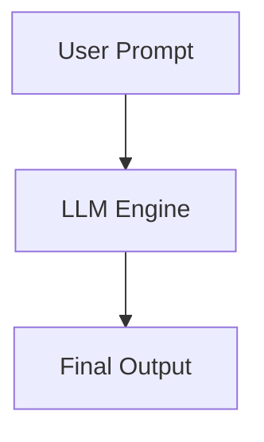

Hãy tưởng tượng bạn tuyển dụng một trợ lý thông minh vừa tốt nghiệp từ một trường đại học hàng đầu thế giới. Bạn đưa cho họ một tài liệu tiếng Anh và nói: *"Hãy tóm tắt văn bản này sang tiếng Việt cho tôi"*. Bạn không cần phải làm mẫu cho họ một bản tóm tắt nào trước đó cả. Người trợ lý chỉ cần dựa vào kiến thức ngôn ngữ học và kỹ năng đọc hiểu sẵn có của mình để hoàn thành xuất sắc nhiệm vụ.

Trong thế giới của AI tạo sinh (GenAI), kỹ thuật này được gọi là **Zero-shot Prompting** (Học không cần ví dụ). Đây là phương pháp tương tác cơ bản và tự nhiên nhất với các Mô hình Ngôn ngữ Lớn ([LLM](/concepts/genai-ml/llm/)) hiện đại.

---

## Đi sâu vào định nghĩa: Zero-shot là gì?

Trong lĩnh vực Học máy (Machine Learning) truyền thống, **Zero-shot Learning** mô tả khả năng một mô hình có thể nhận dạng hoặc phân loại các đối tượng thuộc những nhãn (labels) mà nó chưa từng thấy trong tập dữ liệu huấn luyện (ví dụ: mô hình được học cách nhận biết ngựa và các thuộc tính sọc vằn, từ đó có thể tự nhận biết được ngựa vằn dù chưa từng học qua ảnh ngựa vằn).

Còn trong bối cảnh Prompt Engineering và GenAI, **Zero-shot Prompting** đơn giản là việc bạn gửi một câu lệnh (instruction) hoặc câu hỏi cho LLM mà không đính kèm theo bất kỳ cặp ví dụ đầu vào-đầu ra mẫu nào. LLM sẽ tự phân tích yêu cầu từ ngôn ngữ tự nhiên và suy diễn ra cách phản hồi dựa trên các trọng số (weights) đã được học từ hàng nghìn tỷ token văn bản trong quá trình tiền huấn luyện (pre-training).

---

## Tại sao kỹ thuật này lại thay đổi cách chúng ta làm việc với AI?

Sự ra đời của Zero-shot Prompting mang lại những bước tiến vượt bậc so với các phương pháp xây dựng mô hình AI truyền thống:

1. **Nói lời tạm biệt với chi phí gán nhãn dữ liệu**: Trước đây, để làm một tác vụ phân tích cảm xúc hay dịch thuật, bạn cần hàng ngàn dòng dữ liệu được con người dán nhãn thủ công rất tốn kém để train mô hình. Với Zero-shot, bạn chỉ cần mô tả mong muốn của mình trong một dòng lệnh.
2. **Linh hoạt tối đa**: Các mô hình truyền thống thường là AI hẹp (narrow AI) — mô hình dịch chỉ biết dịch, mô hình phân loại chỉ biết phân loại. Với LLM và Zero-shot, cùng một mô hình duy nhất có thể viết code, làm thơ, phân tích dữ liệu, dịch thuật... chỉ bằng cách thay đổi nội dung prompt.
3. **Tối ưu hóa tài nguyên ([Token](/concepts/genai-ml/token/) Efficiency)**: Cửa sổ ngữ cảnh ([Context Window](/concepts/genai-ml/context-window/)) của LLM luôn có giới hạn và việc gửi kèm quá nhiều ví dụ mẫu (Few-shot) sẽ làm tăng lượng token tiêu thụ. Zero-shot giúp tiết kiệm tối đa token, từ đó giảm chi phí cuộc gọi API và giảm độ trễ (latency) phản hồi của hệ thống.

---

## Phân tích cơ chế hoạt động của Zero-shot

Sức mạnh của Zero-shot Prompting dựa trên hai trụ cột công nghệ chính:
* **Instruction Tuning (Tinh chỉnh theo chỉ dẫn)**: Các LLM hiện đại (như GPT-4, Claude 3, Llama 3) đã được huấn luyện qua các giai đoạn tinh chỉnh đặc biệt (như SFT - Supervised Fine-Tuning hay RLHF - Reinforcement Learning from Human Feedback) để hiểu và tuân thủ các mệnh lệnh từ người dùng, chứ không đơn giản là đoán từ tiếp theo như các mô hình ngôn ngữ thế hệ cũ.
* **Semantic Abstraction (Trừu tượng hóa ngữ nghĩa)**: Khả năng liên kết các khái niệm trong câu lệnh với không gian vector tiềm ẩn (latent space), giúp LLM tự động áp dụng các quy luật ngữ pháp, logic toán học vào bài toán mới mà không cần xem mẫu.

Quy trình xử lý một Zero-shot Prompt diễn ra rất đơn giản:



1. **Mã hóa (Input Encoding)**: Câu lệnh của bạn được mã hóa (tokenized) thành các chuỗi số mà máy tính có thể hiểu.
2. **Cơ chế Attention (Contextual Attention)**: Mô hình sử dụng cơ chế Self-Attention của Transformer để phân tích ngữ nghĩa và các ràng buộc trong câu lệnh (ví dụ: từ "tóm tắt", "ngắn gọn", "định dạng JSON").
3. **Truy xuất tri thức (Latent Knowledge Retrieval)**: Mô hình kích hoạt các vùng kiến thức và quy luật logic đã học được trong quá trình huấn luyện liên quan đến chủ đề yêu cầu.
4. **Tự động sinh (Generation)**: LLM dự đoán và tạo ra từng từ tiếp theo để trả lời câu hỏi của bạn.

---

## Ví dụ thực tiễn: Phân loại cảm xúc khách hàng

Giả sử bạn cần phân tích cảm xúc từ các phản hồi của khách hàng gửi về hệ thống.

**Prompt (Zero-shot)**:
```text
Classify the sentiment of the following customer review into exactly one of these categories: [Positive, Negative, Neutral].

Review: "The delivery was incredibly fast, but the packaging was severely damaged."
Sentiment:
```

**Output mong đợi từ LLM**:
```text
Neutral
```

Trong prompt này, bạn không hề đưa ra ví dụ nào kiểu như *"Review A là Positive, Review B là Negative"*. LLM tự hiểu nghĩa của "Positive", "Negative", "Neutral" và tự phân tích cấu trúc tương phản trong câu để đưa ra nhãn chính xác nhất.

Dưới đây là đoạn code Python mẫu gọi API của OpenAI để xử lý tác vụ này:

```python
from openai import OpenAI

client = OpenAI(api_key="YOUR_API_KEY")

prompt = """
Classify the sentiment of the following customer review into exactly one of these categories: [Positive, Negative, Neutral].

Review: "The delivery was incredibly fast, but the packaging was severely damaged."
Sentiment:
"""

response = client.chat.completions.create(
    model="gpt-4o",
    messages=[
        {"role": "user", "content": prompt}
    ],
    temperature=0 # Temperature=0 để câu trả lời có tính quyết định và ổn định
)

print(response.choices[0].message.content) # Output: Neutral
```

---

## Những nguyên tắc vàng khi viết Zero-shot Prompt

Để LLM hiểu đúng ý bạn ngay từ lần đầu tiên mà không cần ví dụ, hãy áp dụng các nguyên tắc sau:

* **Mô tả cực kỳ rõ ràng và cụ thể (Be Specific)**: Thay vì viết chung chung *"Hãy sửa lại câu này"*, hãy viết rõ *"Hãy viết lại câu sau bằng giọng văn chuyên nghiệp, ngắn gọn và sửa hết các lỗi chính tả nếu có"*.
* **Định hướng định dạng đầu ra (Format Output)**: Yêu cầu rõ cấu trúc bạn muốn nhận để dễ lập trình phân tích kết quả sau này, ví dụ: *"Chỉ trả về chuỗi JSON hợp lệ với các key là..."* hoặc *"Liệt kê dưới dạng danh sách gạch đầu dòng"*.
* **Tận dụng System Prompt**: Thiết lập vai trò (Persona) rõ ràng cho mô hình (ví dụ: *"Bạn là một Data Engineer giàu kinh nghiệm..."* hoặc *"Bạn là chuyên gia tối ưu hóa SQL..."*) để giúp LLM định hướng bộ nhớ tìm kiếm thông tin chính xác hơn.
* **Sử dụng cấu trúc phân tách rõ ràng**: Dùng các ký tự phân tách như `"""`, `---` hoặc các cặp thẻ XML (như `<text>...</text>`) để phân định rõ đâu là chỉ thị hành động và đâu là phần nội dung dữ liệu đầu vào.

---

## Những sai lầm phổ biến cần né tránh

* **Nhồi nhét quá nhiều yêu cầu phức tạp (Prompt Overloading)**: Đưa ra quá nhiều yêu cầu trái ngược hoặc lồng ghép sâu trong một câu lệnh duy nhất dễ khiến LLM bị bối rối và bỏ sót một số điều kiện ràng buộc.
* **Kỳ vọng định dạng quá phức tạp mà không hướng dẫn**: Bắt LLM trả về một định dạng cấu trúc dữ liệu tùy biến rất lạ hoặc có logic phức tạp mà không có ví dụ cụ thể để nó tham khảo thường dẫn đến hiện tượng ảo giác ([hallucination](/concepts/genai-ml/hallucination/)) hoặc trả về sai format.
* **Bỏ qua Role-playing**: Việc không cung cấp ngữ cảnh nền tảng hoặc vai trò dễ khiến LLM đưa ra câu trả lời chung chung, thiếu chiều sâu kỹ thuật.

---

## Cân nhắc giữa Lợi ích và Đánh đổi

### Điểm mạnh
* **Nhanh chóng và đơn giản**: Dễ dàng thử nghiệm ý tưởng ngay lập tức mà không tốn công chuẩn bị.
* **Tiết kiệm tài chính**: Giảm thiểu chi phí token truyền vào API khi xử lý dữ liệu lớn.
* **Độ linh hoạt cao**: Dễ dàng thay đổi hướng xử lý bài toán chỉ bằng cách chỉnh sửa văn bản.

### Điểm yếu
* **Độ chính xác không cao bằng Few-shot**: Với các tác vụ yêu cầu khả năng suy luận logic phức tạp hoặc có định dạng đầu ra cực kỳ ngặt nghèo, Zero-shot thường có xác suất lỗi cao hơn.
* **Độ ổn định kém**: LLM có thể thay đổi cách diễn đạt hoặc định dạng trả về giữa các lần chạy khác nhau nếu cấu hình tham số `temperature` lớn hơn 0.

---

## Khi nào nên dùng và Khi nào nên tránh?

* **Nên dùng**: Cho các tác vụ xử lý ngôn ngữ tự nhiên phổ biến mà các mô hình đã rất thuần thục (dịch thuật, tóm tắt bài viết, phân loại thực thể) hoặc khi xử lý các tài liệu văn bản quá dài mà bạn không còn đủ không gian cửa sổ ngữ cảnh để nhét các ví dụ mẫu.
* **Nên tránh**: Đối với các bài toán suy luận logic nhiều bước, tính toán toán học phức tạp (lúc này nên chuyển sang dùng Chain-of-Thought hoặc Few-shot Prompting), hoặc khi cần lấy kết quả đầu ra tuân thủ tuyệt đối theo một cấu trúc schema nghiêm ngặt.

---

## Các khái niệm liên quan

* [Few-shot Prompting](/concepts/genai-ml/few-shot/)
* [System Prompt](/concepts/genai-ml/system-prompt/)
* [Large Language Model (LLM)](/concepts/genai-ml/llm/)
* [Ảo giác LLM (Hallucination)](/concepts/genai-ml/hallucination/)

---

## Góc phỏng vấn: Thử thách kỹ năng Prompt Engineering

### 1. Hãy phân biệt Zero-shot Prompting và Zero-shot Learning trong Machine Learning truyền thống.
* **Gợi ý trả lời**: 
  * **Zero-shot Learning** trong ML truyền thống là khả năng của một mô hình (thường là thị giác máy tính hoặc phân loại nhãn) có thể phân biệt các nhãn dữ liệu mới mà nó chưa từng thấy trong tập huấn luyện. Quá trình này được thực hiện bằng cách ánh xạ các thuộc tính ngữ nghĩa từ những thứ đã biết sang thứ chưa biết.
  * **Zero-shot Prompting** trong GenAI là một kỹ thuật tương tác ở giai đoạn suy luận (inference) với LLM. Người dùng đưa ra yêu cầu bằng ngôn ngữ tự nhiên để mô hình thực hiện mà không cần cung cấp bất kỳ ví dụ mẫu nào, tận dụng toàn bộ kiến thức và khả năng hiểu câu lệnh đã được huấn luyện sẵn của LLM.

### 2. Khi một câu lệnh Zero-shot thất bại (trả về kết quả sai hoặc sai định dạng), bạn sẽ làm gì để khắc phục?
* **Gợi ý trả lời**: 
  Tôi sẽ thực hiện các bước tối ưu hóa prompt theo thứ tự sau:
  1. Kiểm tra lại từ ngữ để đảm bảo câu lệnh rõ ràng, mạch lạc và không gây hiểu lầm.
  2. Bổ sung [System Prompt](/concepts/genai-ml/system-prompt/) để thiết lập vai trò (Persona) cụ thể cho LLM.
  3. Cung cấp các chỉ dẫn định dạng chặt chẽ (ví dụ: yêu cầu output định dạng JSON kèm theo schema mẫu).
  4. Nếu tác vụ đòi hỏi logic phức tạp, tôi sẽ áp dụng kỹ thuật *Zero-shot Chain-of-Thought* bằng cách chèn thêm câu lệnh *"Let's think step by step"* (Hãy suy nghĩ từng bước một).
  5. Nếu các cách trên vẫn không đạt hiệu quả mong muốn, tôi sẽ chuyển sang dùng *Few-shot Prompting* bằng cách chèn thêm 1-3 ví dụ mẫu chuẩn hóa.

### 3. Khả năng thực hiện tốt Zero-shot trên một tác vụ cụ thể của LLM cho thấy điều gì về quá trình huấn luyện mô hình đó?
* **Gợi ý trả lời**: 
  Điều này chứng minh hai điểm quan trọng: 
  Thứ nhất, lượng dữ liệu huấn luyện ban đầu (pre-training corpus) của mô hình chứa rất nhiều kiến thức liên quan đến chủ đề của tác vụ đó, giúp mô hình xây dựng được các mối quan hệ ngữ nghĩa vững chắc. 
  Thứ hai, giai đoạn tinh chỉnh theo chỉ dẫn (Instruction Tuning - SFT/[RLHF](/concepts/genai-ml/rlhf/)) đã hoạt động rất hiệu quả, giúp mô hình hiểu được ý định và cấu trúc của các câu lệnh dạng mệnh lệnh, thay vì chỉ đơn thuần là đoán từ tiếp theo một cách máy móc.

---

## Tài liệu tham khảo

1. **"Language Models are Few-Shot Learners"** - Brown et al. (OpenAI, 2020) (Nghiên cứu nền tảng về khả năng zero/few-shot của GPT-3).
2. **"Finetuned Language Models are Zero-Shot Learners" (FLAN)** - Wei et al. (Google Research, 2021) (Định hình khái niệm Instruction Tuning để cải thiện zero-shot performance).
3. **Prompt Engineering Guide** (DAIR.AI) - (Tài liệu tổng hợp thực tiễn về kỹ thuật viết prompt).
4. **OpenAI API Documentation** - Best practices for prompt engineering.

---

## English Summary

**Zero-shot Prompting** is a technique in [Prompt Engineering](/concepts/genai-ml/prompt-engineering/) where a Large Language Model (LLM) is given a task description and asked to solve it without any demonstrations or examples provided in the prompt. This capability emerges from the model's extensive pre-training on vast amounts of text and subsequent instruction tuning (e.g., RLHF or SFT), enabling it to generalize instructions and leverage its latent knowledge to complete novel tasks. While highly token-efficient and flexible, zero-shot approaches may lack the accuracy and formatting adherence of few-shot prompting in complex or domain-specific scenarios.
