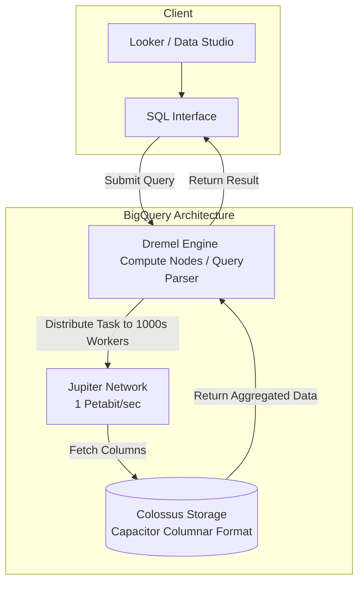

# Google BigQuery - Nền tảng phân tích Serverless

## Summary

Google BigQuery (BQ) là hệ thống Data Warehouse doanh nghiệp (Enterprise Data Warehouse) chạy trên nền tảng đám mây Google Cloud Platform (GCP). BQ nổi bật hoàn toàn so với các đối thủ truyền thống nhờ thiết kế **Serverless hoàn toàn (Fully-managed Serverless)**. Người dùng không cần phải tạo máy chủ, cài đặt database, hay quản lý index. BQ sử dụng một mạng lưới phân tán khổng lồ để quét (scan) Petabytes dữ liệu chỉ trong vài giây thông qua các truy vấn ANSI SQL tiêu chuẩn, với mô hình tính phí chủ yếu dựa trên lượng dữ liệu quét (Pay-as-you-go).

---

## Definition

BigQuery không phải là một cơ sở dữ liệu quan hệ truyền thống (như PostgreSQL hay MySQL). Nó là một **Cơ sở dữ liệu phân tích dạng cột (Columnar OLAP Database)**.

Nó giải quyết bài toán: *Làm sao để một người phân tích dữ liệu (Data Analyst) có thể viết một câu lệnh SQL duy nhất và nhận được kết quả tổng hợp doanh thu từ bảng dữ liệu lịch sử chứa 1.000 tỷ dòng (hàng Petabytes) trong chưa tới 10 giây?*

---

## Why it exists

Những năm 2000, khi Google phát triển công cụ tìm kiếm và các sản phẩm toàn cầu (Gmail, YouTube), họ tạo ra những tệp log siêu khổng lồ mà không một Data Warehouse thương mại nào trên thị trường (như Oracle, Teradata thời bấy giờ) có khả năng lưu trữ và truy vấn nổi. 

Để giải quyết, nội bộ Google đã phát minh ra các siêu công nghệ phân tán (Dremel, Colossus). Nhận thấy sức mạnh khủng khiếp này, năm 2011, Google quyết định "thương mại hóa" hệ thống nội bộ của mình ra công chúng dưới cái tên **BigQuery**, mở ra kỷ nguyên Data Warehouse trên đám mây (Cloud DWH) có tính năng Serverless.

---

## Core idea: Kiến trúc dưới nắp capo

Sức mạnh của BigQuery nằm ở kiến trúc Tách rời Tính toán và Lưu trữ (Decoupled Compute & Storage) kết hợp với công nghệ độc quyền của Google, được liên kết với nhau bằng mạng cáp quang tốc độ khủng (Jupiter network). Kiến trúc này bao gồm 3 lớp:

1. **Lớp lưu trữ (Storage) - Colossus**: Dữ liệu nạp vào BQ được lưu ở định dạng nén cột độc quyền gọi là **Capacitor**, và được phân mảnh ra quản lý trên hệ thống lưu trữ tệp toàn cầu của Google (Colossus). Dữ liệu được sao lưu (replicate) mặc định, đảm bảo không bao giờ mất.
2. **Lớp tính toán (Compute) - Dremel**: Dremel là một cỗ máy phân tán các truy vấn. Khi bạn gõ `SELECT SUM(...)`, Dremel biến câu SQL thành một cây thực thi (Execution Tree). Cây này chia nhỏ công việc ra và phân phát cho **hàng ngàn máy chủ (workers)** quét dữ liệu cùng một lúc, rồi tổng hợp kết quả (MapReduce style) gửi trả về cho bạn.
3. **Mạng lõi (Network) - Jupiter**: Mạng cáp quang siêu tốc cho phép hàng ngàn máy chủ Compute đọc dữ liệu từ máy chủ Storage ở tốc độ 1 Petabit/giây (như thể máy tính và ổ cứng cắm sát vào nhau).

---

## How it works (Mô hình giá cả - Pricing Model)

Việc hiểu cách BigQuery hoạt động gắn liền với cách Google tính tiền. BQ tách biệt hai loại phí:

1. **Phí lưu trữ (Storage Pricing)**: Khoảng $0.02/GB/tháng (giống mức giá lưu trữ file thô trên S3/GCS). Nếu dữ liệu không bị sửa đổi trong 90 ngày, giá tự động giảm 50% (Long-term storage).
2. **Phí tính toán (Compute/Query Pricing)**: Có hai hình thức mua:
   * **On-demand (Trả theo truy vấn - Phổ biến nhất)**: Trả **$6.25 cho mỗi 1 Terabyte** dữ liệu mà câu lệnh SQL của bạn *quét qua* (Data Scanned). (Không quét thì không mất tiền).
   * **Capacity Pricing (Mua khoán - Cho doanh nghiệp lớn)**: Mua cố định một sức mạnh tính toán (gọi là Slots, tối thiểu 100 slots) với chi phí trả cố định hàng tháng, tha hồ chạy bao nhiêu SQL cũng được.

---

## Architecture / Flow



---

## Practical example

**Bối cảnh:** Bạn có bảng `wikipedia_views` dung lượng 10TB. Bạn cần tìm xem bài viết về "Việt Nam" được xem bao nhiêu lần trong năm 2026.

**Truy vấn TỒI (Tốn $62.5):**
```sql
-- Dùng SELECT * bắt BigQuery quét cả bảng 10TB
SELECT * FROM `bigquery-public-data.wikipedia.views`
WHERE title = 'Vietnam' AND date LIKE '2026-%';
```
*(Lưu ý: BQ tính phí theo Dữ liệu quét, không phải Dữ liệu trả về. Mặc dù kết quả trả về có thể chỉ là vài dòng, BQ vẫn tính tiền 10TB = $62.5 vì nó phải quét các cột không cần thiết).*

**Truy vấn TỐT (Có thể chỉ tốn $0.01):**
```sql
-- Chỉ chọn duy nhất 2 cột cần thiết (views) và (date)
SELECT sum(views) 
FROM `bigquery-public-data.wikipedia.views`
WHERE date BETWEEN '2026-01-01' AND '2026-12-31'
  AND title = 'Vietnam';
```
Bởi vì BQ lưu trữ theo Cột (Columnar), khi bạn gọi `sum(views)`, nó sẽ bỏ qua việc đọc các cột khác như (author, description, id) đang chiếm 99% dung lượng. Hơn nữa, nếu bảng được Phân vùng (Partition) theo `date`, nó sẽ bỏ qua dữ liệu của năm 2025 trở về trước. Dung lượng quét giảm từ 10TB xuống còn vài Megabytes!

---

## Best practices

* **Partitioning (Phân vùng theo ngày tháng)**: Luôn thiết lập Partitioning (thường là theo cột Ngày - `DATE` column). Nó là lớp khiên bảo vệ túi tiền của bạn. Một truy vấn `WHERE date = 'today'` trên bảng Partitioned sẽ chỉ quét dữ liệu ngày hôm nay, thay vì toàn bảng.
* **Clustering (Phân nhóm)**: Sau khi Partition, hãy Cấu hình Clustering trên các cột thường được dùng trong điều kiện `WHERE` (như `customer_id` hoặc `category`). BQ sẽ sắp xếp dữ liệu có cùng ID nằm gần nhau, giúp bỏ qua các khối dữ liệu không khớp nhanh hơn.
* **KHÔNG DÙNG `SELECT *`**: Đây là nguyên tắc sống còn khi làm việc với Database Columnar. Càng lấy nhiều cột ra, càng tốn tiền và chạy chậm.
* **Tránh lệnh `UPDATE / DELETE` riêng lẻ**: BQ không tối ưu cho việc thao tác từng dòng (OLTP style). Việc chạy 1000 câu lệnh UPDATE rời rạc sẽ làm sập giới hạn (Quota limits). Nếu cần sửa đổi, hãy dùng lệnh `MERGE` (Upsert) để sửa đổi theo Lô (Batch) lớn định kỳ.

---

## Common mistakes

* **Cố gắng tạo Indexes (Chỉ mục)**: Một lập trình viên chuyển từ MySQL/Postgres sang sẽ tự hỏi "Tạo index ở đâu?". BQ không có khái niệm Index. BQ dùng sức mạnh cục súc (Brute-force) kết hợp với kiến trúc phân tán quét qua mọi thứ. Việc thay thế cho Index chính là Clustering và Partitioning.
* **Sử dụng `LIMIT` để giảm chi phí**: Bạn nghĩ rằng chạy `SELECT * FROM table LIMIT 10` sẽ tốn ít tiền hơn? **SAI**. `LIMIT` chỉ giới hạn kết quả trả về màn hình, BQ vẫn phải quét toàn bộ bảng dưới nền (Full table scan) và bạn vẫn phải trả đủ tiền cho toàn bộ dung lượng bảng.
* **Không cài đặt Cảnh báo hóa đơn (Billing Alerts)**: Đã có rất nhiều câu chuyện rùng rợn (Horror stories) về các công ty để lọt một câu lệnh SQL chạy trong vòng lặp (loop) và nhận hóa đơn trăm ngàn USD vào cuối tháng. Bắt buộc phải cài đặt mức giới hạn quét dữ liệu trên mỗi User/Dự án (Quota Controls).

---

## Trade-offs

### Ưu điểm
* **Trải nghiệm Zero-Ops tuyệt đối**: Không máy chủ, không cấu hình, không bảo trì, không nâng cấp phần mềm. Bạn tạo project và bắt đầu gõ SQL.
* Tốc độ phản hồi cực nhanh trên tập dữ liệu hàng chục Petabytes.
* Tích hợp cực kỳ liền mạch với hệ sinh thái Máy học (Machine Learning) - Bạn có thể train model trực tiếp bằng lệnh SQL (`CREATE MODEL` trong BQ ML).

### Nhược điểm
* **Vendor Lock-in**: Bạn không thể tải bộ mã của BigQuery về chạy ở trung tâm dữ liệu riêng. Cú pháp SQL đôi chỗ dùng hàm đặc thù của Google.
* Rất kém trong các truy vấn có độ trễ cực thấp (<100ms) yêu cầu đọc từng dòng ngẫu nhiên (Point lookups). BQ chỉ tối ưu cho các lệnh Scan diện rộng.
* Mô hình On-demand dễ gây sốc hóa đơn nếu Data Analysts trong công ty không được đào tạo về tối ưu SQL.

---

## When to use

* Là trung tâm Data Warehouse lý tưởng cho các doanh nghiệp xây dựng toàn bộ hạ tầng (Cloud infrastructure) trên Google Cloud (GCP).
* Khi doanh nghiệp có dữ liệu siêu khổng lồ (vài Terabytes trở lên) nhưng không muốn tốn nhân sự quản trị hệ thống phức tạp (Hadoop administrator).
* Làm nơi chứa (Sink) cho dữ liệu truyền phát trực tiếp (Real-time Streaming) từ Pub/Sub và xử lý bằng Dataflow.

## When not to use

* Làm Backend Database cho một ứng dụng Web (Ví dụ: kiểm tra người dùng có đăng nhập đúng password không). Hãy dùng Cloud SQL hoặc Firestore.
* Khi lượng dữ liệu của bạn quá bé (dưới vài chục Gigabytes). Hiệu năng của BQ sẽ không khác biệt, thậm chí chậm hơn việc tạo truy vấn bằng PostgreSQL truyền thống do độ trễ khởi tạo mạng (Network Overhead) của hệ thống phân tán.

---

## Related concepts

* [Snowflake](/concepts/snowflake)
* [Amazon Redshift](/concepts/amazon-redshift)
* [Serverless Data Processing](/concepts/serverless-data)

---

## Interview questions

### 1. Phân vùng (Partitioning) và Phân cụm (Clustering) trong BigQuery khác nhau như thế nào?
* **Người phỏng vấn muốn kiểm tra**: Kỹ năng thiết kế lược đồ vật lý để tối ưu hiệu năng/chi phí.
* **Gợi ý trả lời**: Cả hai đều giúp tiết kiệm chi phí quét dữ liệu, nhưng ở cấp độ khác nhau. 
  * *Partitioning* cắt bảng thành các phần hoàn toàn độc lập (thường theo Ngày). BigQuery có thể loại bỏ hoàn toàn các partition không thỏa mãn điều kiện `WHERE date = ...` khỏi chi phí thanh toán. 
  * *Clustering* diễn ra *bên trong* các partition. Nó sắp xếp lại (sort) dữ liệu vật lý theo từ 1 đến 4 cột chỉ định (vd: `customer_id`). Khi truy vấn, BQ dùng metadata block để nhảy qua các khối không chứa `customer_id` cần tìm. Khác với Partition, Clustering không đảm bảo giảm số tiền thanh toán hiển thị trước lúc chạy (query estimate), nhưng thực tế khi chạy nó sẽ giảm dung lượng quét.

### 2. BigQuery tính tiền như thế nào? Tại sao thêm `LIMIT 10` vào câu query `SELECT *` không làm giảm số tiền phải trả?
* **Người phỏng vấn muốn kiểm tra**: Hiểu biết cơ bản về kiến trúc Columnar và mô hình Pay-as-you-go.
* **Gợi ý trả lời**: Mô hình On-demand của BQ tính tiền dựa trên tổng lượng byte của CÁC CỘT được chọn (`SELECT`) trong câu truy vấn, nhân với toàn bộ số dòng của bảng đó (trừ khi bảng được partition). Lệnh `LIMIT 10` là phép toán được áp dụng ở giai đoạn cuối cùng (sau khi BQ đã quét và thu thập dữ liệu xong để trả về màn hình). Vì nó đã quét xong dữ liệu, hệ thống tính phí vẫn ghi nhận là quét toàn bảng.

---

## References

1. **Google Cloud Architecture Center** - BigQuery under the hood.
2. **Dremel: Interactive Analysis of Web-Scale Datasets** - Google Research Paper (Nền tảng của BQ).
3. **Google BigQuery: The Definitive Guide** - Valliappa Lakshmanan, Jordan Tigani (Tác giả O'Reilly, Tigani là một trong những kỹ sư tạo ra BQ).

---

## English summary

Google BigQuery is an enterprise-grade, fully managed serverless data warehouse built on Google's highly distributed architecture (Dremel for compute, Colossus for storage). As a columnar OLAP database, it separates compute from storage, allowing users to query petabyte-scale datasets in seconds using standard SQL without provisioning infrastructure. Its default "On-demand" pricing model charges based on the volume of data scanned, making table Partitioning, Clustering, and avoiding `SELECT *` essential best practices. While exceptional for massive-scale analytics and eliminating operational overhead (Zero-Ops), it is not suited for low-latency OLTP transactional workloads or teams lacking strict cost-control measures.
