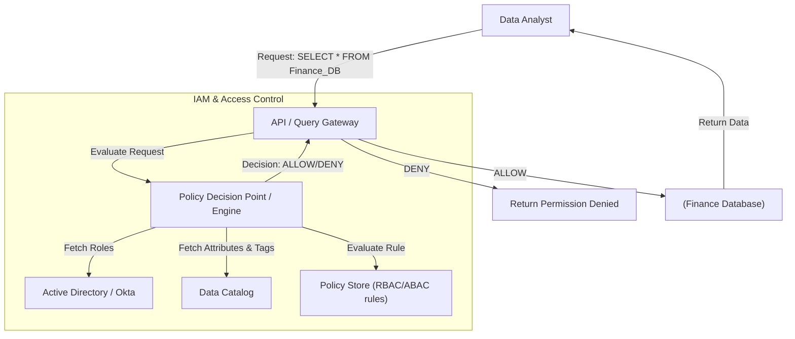

Hãy tưởng tượng bạn đang quản lý một kho dữ liệu khổng lồ của một tập đoàn lớn. Một ngày nọ, một kỹ sư dữ liệu vô tình chạy lệnh `DROP TABLE` nhầm trên môi trường Production, hoặc dữ liệu thẻ tín dụng nhạy cảm của khách hàng bị hiển thị công khai cho toàn bộ đội ngũ Marketing. Đây chính là những kịch bản "ác mộng" mà bất kỳ hệ thống dữ liệu nào cũng muốn tránh. 

Để giải quyết bài toán này, chúng ta cần một cơ chế bảo vệ vững chắc: **Kiểm soát truy cập (Access Control)**. Đây là hệ thống quản lý nhằm xác định ai (người dùng, ứng dụng) được phép làm gì (đọc, ghi, sửa, xóa) trên tài nguyên dữ liệu nào (cơ sở dữ liệu, bảng, cột, hàng). 

Trong bài viết này, chúng ta sẽ cùng đi sâu vào hai mô hình kiểm soát truy cập phổ biến và mạnh mẽ nhất hiện nay: **RBAC (Role-Based Access Control)** và **ABAC (Attribute-Based Access Control)**.

## Tại sao chúng ta cần kiểm soát truy cập chặt chẽ?

Trong thế giới [Data Engineering](/concepts/foundation/data-engineering/), dữ liệu không chỉ là tài sản mà còn đi kèm với trách nhiệm pháp lý và bảo mật. Nếu không có một hệ thống phân quyền rõ ràng, hệ thống của bạn sẽ phải đối mặt với ba rủi ro lớn:

1. **Lộ lọt dữ liệu nhạy cảm (Data Breach):** Nhân viên không có phận sự hoặc tin tặc (thông qua tài khoản bị xâm nhập) có thể dễ dàng tải xuống toàn bộ cơ sở dữ liệu khách hàng.
2. **Sai sót do con người (Human Error):** Một câu lệnh `DELETE` hay `DROP` vô tình từ một Data Analyst mới vào nghề có thể phá hủy cả hệ thống dữ liệu lịch sử.
3. **Vi phạm quy định pháp lý:** Các tiêu chuẩn nghiêm ngặt như SOC2, GDPR, HIPAA yêu cầu kiểm soát truy cập cực kỳ chặt chẽ và tuân thủ nghiêm ngặt nguyên tắc **Least Privilege** (Đặc quyền tối thiểu).

## Hai trường phái phân quyền: RBAC và ABAC

Để giải quyết những bài toán trên, các kỹ sư thường tiếp cận theo hai hướng đi khác nhau: phân quyền theo vai trò hoặc phân quyền theo thuộc tính.

### 1. RBAC (Role-Based Access Control) - Phân quyền theo vai trò
Với RBAC, quyền truy cập không được cấp trực tiếp cho từng cá nhân mà được gán cho các **Vai trò (Roles)**. Người dùng sau đó sẽ được đưa vào các vai trò tương ứng.
* **Cách hoạt động:** Rất trực quan và tương thích với cơ cấu phòng ban của doanh nghiệp. Ví dụ: Bạn tạo ra vai trò `DATA_ANALYST` và cấp quyền `SELECT` trên bảng `sales`. Mọi thành viên thuộc nhóm Analyst sẽ được gán vai trò này.
* **Ưu điểm:** Dễ hiểu, dễ quản lý ở quy mô nhỏ và vừa.
* **Hạn chế:** Khi tổ chức phình to, số lượng vai trò tăng lên chóng mặt (hiện tượng **Role Explosion** - Bùng nổ vai trò). Ví dụ: Khi bạn có 10 phòng ban và 5 cấp bậc quản lý khác nhau, số lượng vai trò cần duy trì có thể lên tới hàng chục hoặc hàng trăm.

### 2. ABAC (Attribute-Based Access Control) - Phân quyền theo thuộc tính
Khác với sự tĩnh lặng của RBAC, ABAC là một mô hình động, đánh giá quyền truy cập theo thời gian thực (dynamically) dựa trên sự kết hợp của nhiều **Thuộc tính (Attributes/Tags)**:
* **Thuộc tính người dùng (User Attributes):** Vị trí địa lý, chức vụ, phòng ban, cấp độ bảo mật (Clearance level).
* **Thuộc tính tài nguyên (Resource Attributes):** Nhãn dữ liệu (ví dụ: `PII`, `Public`), mức độ nhạy cảm của bảng/cột.
* **Thuộc tính môi trường (Environment Attributes):** Thời gian truy cập trong ngày, địa chỉ IP của thiết bị.

*Ví dụ về một quy tắc ABAC:* Cho phép đọc bảng `customers` NẾU `User.department == 'Sales'` VÀ `User.region == Resource.region` VÀ `Environment.time` nằm trong giờ hành chính.

## Cơ chế vận hành của một hệ thống Access Control

Một quy trình kiểm soát truy cập chuẩn thường kết hợp chặt chẽ với hệ thống Quản lý định danh (IAM) qua ba bước cốt lõi:

1. **Authentication (Xác thực):** Xác nhận danh tính của bạn (bạn là ai?) qua Password, SSO hoặc MFA.
2. **Authorization (Ủy quyền):** Đánh giá xem bạn được phép làm gì. 
   * Với **RBAC**, hệ thống đối chiếu vai trò của bạn với các quyền tĩnh được thiết lập trước.
   * Với **ABAC**, một công cụ Policy Engine (như OPA - Open Policy Agent, AWS IAM) sẽ thu thập các thẻ nhãn dữ liệu, đánh giá logic Boolean để đưa ra quyết định Allow (Cho phép) hoặc Deny (Từ chối).
3. **Auditing (Kiểm toán):** Ghi lại toàn bộ hành động (dù thành công hay thất bại) vào hệ thống log để phục vụ mục đích kiểm tra sau này.

### Kiến trúc tổng quan của hệ thống

Hãy cùng xem sơ đồ dưới đây để hình dung cách một yêu cầu truy xuất dữ liệu được xử lý:



## Bắt tay vào thực hành: Cấu hình phân quyền trong thực tế

Chúng ta hãy cùng xem cách triển khai kiểm soát truy cập trong [Snowflake](/concepts/cloud-data-platform/snowflake/), kết hợp cả Row-level Security (RLS) và Column-level Security (CLS).

### 1. Phân quyền theo cột sử dụng RBAC (Column-Level Security)
Giả sử chúng ta có yêu cầu: Chỉ nhóm quản trị nhân sự `HR_ADMIN` mới được phép xem cột lương nhân viên (`salary`), các tài khoản khác khi truy vấn chỉ nhận về kết quả `NULL`.

```sql
-- Bước 1: Tạo vai trò chuyên biệt
CREATE ROLE HR_ADMIN;
GRANT ROLE HR_ADMIN TO USER alice;

-- Bước 2: Tạo chính sách ẩn dữ liệu (Masking Policy)
CREATE OR REPLACE MASKING POLICY hide_salary AS (val NUMBER) RETURNS NUMBER ->
  CASE
    WHEN CURRENT_ROLE() IN ('HR_ADMIN') THEN val
    ELSE NULL
  END;

-- Bước 3: Áp dụng chính sách lên cột salary của bảng employees
ALTER TABLE employees MODIFY COLUMN salary SET MASKING POLICY hide_salary;
```

### 2. Phân quyền theo dòng sử dụng ABAC (Row-Level Security)
Yêu cầu: Mỗi quản lý chỉ được phép xem dữ liệu doanh thu của các cửa hàng thuộc khu vực (region) mà họ phụ trách.
Thay vì tạo ra hàng loạt vai trò tĩnh như `MANAGER_US`, `MANAGER_EU`, chúng ta sẽ sử dụng phương pháp ABAC thông qua một bảng ánh xạ (Mapping Table) và Row Access Policy.

```sql
-- Giả sử bảng mapping lưu thuộc tính của người dùng như sau:
-- manager_name | region
-- bob          | US
-- charlie      | EU

CREATE OR REPLACE ROW ACCESS POLICY region_policy AS (region_col VARCHAR) RETURNS BOOLEAN ->
  CURRENT_ROLE() = 'SUPER_ADMIN' 
  OR EXISTS (
    SELECT 1 FROM manager_mapping
    WHERE manager_name = CURRENT_USER()
      AND region = region_col
  );

-- Áp dụng chính sách này cho bảng dữ liệu bán hàng
ALTER TABLE sales ADD ROW ACCESS POLICY region_policy ON (region);
```

Khi Bob (Quản lý khu vực US) chạy lệnh `SELECT * FROM sales`, hệ thống sẽ tự động lọc và chỉ trả về các dòng dữ liệu có `region = 'US'`. Bob sử dụng chung một câu lệnh SQL giống hệt đồng nghiệp của mình, nhưng kết quả trả về đã được cá nhân hóa một cách an toàn.

## Những nguyên tắc vàng và sai lầm cần tránh

### Nguyên tắc thiết kế (Best Practices)
* **Luôn tuân thủ Least Privilege (Đặc quyền tối thiểu):** Hãy thiết lập mặc định là `DENY` cho mọi truy cập. Chỉ cấp đúng và đủ quyền cần thiết để hoàn thành công việc.
* **Phân quyền theo chức năng, không theo cá nhân:** Đừng bao giờ gán quyền trực tiếp cho một tài khoản cụ thể (ví dụ: `GRANT SELECT TO USER alice`). Thay vào đó, hãy gán quyền cho vai trò và gán người dùng vào vai trò đó.
* **Tách biệt Control Plane và Data Plane:** Sử dụng các công cụ quản trị tập trung (như Apache Ranger, AWS Lake Formation) để quản lý các chính sách bảo mật ở một nơi duy nhất, tránh việc rải rác các lệnh GRANT/REVOKE trên từng database.
* **Đánh giá và kiểm duyệt định kỳ (Access Review):** Thường xuyên rà soát lại danh sách phân quyền để thu hồi quyền từ những nhân sự đã chuyển bộ phận hoặc nghỉ việc.

### Những sai lầm "xương máu" thường gặp (Common Mistakes)
* **Rơi vào bẫy "Bùng nổ vai trò" (Role Explosion):** Tạo quá nhiều vai trò siêu nhỏ (ví dụ: `Role_Read_Table_A`, `Role_Read_Table_B`). Điều này biến hệ thống RBAC thành một mớ bòng bong không thể quản lý. Hãy cân nhắc chuyển dịch sang ABAC khi gặp trường hợp này.
* **Dùng chung tài khoản (Shared Accounts):** Việc cả team Data Engineer dùng chung tài khoản `admin_prod` là một lỗ hổng bảo mật cực lớn. Khi có sự cố xảy ra, bạn sẽ hoàn toàn mất khả năng truy vết (Audit) xem ai đã thực hiện hành động phá hoại.
* **Cài cắm logic phân quyền vào mã nguồn ứng dụng (Hardcoding):** Viết những dòng code kiểu như `if (user == 'admin')` trực tiếp trong API. Khi cấu trúc tổ chức thay đổi, bạn sẽ phải chỉnh sửa và deploy lại toàn bộ ứng dụng. Hãy để tầng Database hoặc Policy Engine lo việc này.

## So sánh và đánh đổi (Trade-offs)

| Tiêu chí | RBAC | ABAC |
| :--- | :--- | :--- |
| **Độ phức tạp** | Thấp, dễ cấu hình và làm quen. | Cao, đòi hỏi thiết kế chính sách chặt chẽ. |
| **Tính linh hoạt** | Kém linh hoạt hơn, mang tính chất tĩnh. | Cực kỳ linh hoạt, phản ứng động theo ngữ cảnh. |
| **Hiệu năng** | Tốc độ kiểm tra nhanh vì là các ánh xạ tĩnh. | Có thể gây trễ (latency) khi phải đánh giá nhiều thuộc tính động. |
| **Khả năng mở rộng** | Dễ gặp tình trạng bùng nổ vai trò ở quy mô lớn. | Rất tốt cho hệ thống lớn, giảm số lượng vai trò cần quản lý. |

## Khi nào nên chọn mô hình nào?

* **Lựa chọn RBAC khi:** Dự án của bạn ở quy mô vừa và nhỏ, cấu trúc nhân sự và phân chia công việc rõ ràng (ví dụ: Data Engineer viết dữ liệu, Analyst đọc dữ liệu).
* **Lựa chọn ABAC khi:** Bạn làm việc trong môi trường Enterprise lớn, đa khách hàng (Multi-tenant) hoặc các ngành đặc thù có yêu cầu khắt khe về bảo mật dữ liệu cá nhân (PII, y tế, tài chính), nơi cần phân quyền chi tiết đến từng dòng/cột dựa trên ngữ cảnh người dùng và vị trí địa lý.
* **Lưu ý:** Không nên lạm dụng ABAC cho các hệ thống nội bộ nhỏ vì chi phí thiết lập và bảo trì các công cụ Policy Engine đôi khi vượt quá lợi ích thực tế mà nó mang lại.

## Các khái niệm liên quan

* [Phân loại dữ liệu - Data Classification](/concepts/governance-metadata/data-classification/)
* [Nhật ký kiểm toán - Audit Logging](/concepts/governance-metadata/audit-logging/)

## Góc phỏng vấn: Những câu hỏi thường gặp

### 1. Sự khác biệt cốt lõi giữa RBAC và ABAC là gì?
* **Gợi ý trả lời:** Sự khác biệt lớn nhất nằm ở tính chất tĩnh và động. RBAC phân quyền dựa trên Vai trò (Role) tĩnh của người dùng, phù hợp cho quy mô nhỏ nhưng dễ bị bùng nổ vai trò khi hệ thống phức tạp lên. ABAC phân quyền dựa trên Thuộc tính (Attribute) động (như tag dữ liệu, phòng ban, thời gian, IP truy cập), mang lại khả năng phân quyền mịn và linh hoạt hơn nhưng đòi hỏi công cụ quản lý phức tạp hơn.

### 2. Làm thế nào để triển khai Row-Level Security (RLS) để giới hạn người dùng theo khu vực mà không tạo ra hàng trăm Role khác nhau?
* **Gợi ý trả lời:** Thay vì tạo hàng trăm vai trò tĩnh, ta ứng dụng tư duy ABAC bằng cách tạo một bảng ánh xạ (Entitlement table) giữa tài khoản người dùng (`user_id`) và khu vực (`region`). Sau đó, thiết lập một Row Access Policy ở cấp độ bảng để tự động chèn thêm điều kiện lọc dữ liệu một cách vô hình (ví dụ: `WHERE region = (SELECT region FROM mapping_table WHERE user = current_user())`) cho mỗi truy vấn của người dùng.

### 3. Nguyên tắc Least Privilege (Đặc quyền tối thiểu) là gì và làm sao để áp dụng nó trong Data Engineering pipeline?
* **Gợi ý trả lời:** Least Privilege là việc chỉ cấp quyền tối thiểu cần thiết để hoàn thành một tác vụ cụ thể. Trong [Data pipeline](/concepts/foundation/data-pipeline/), điều này đồng nghĩa với việc Service Account chạy Airflow [DAG](/concepts/orchestration/dag/) chỉ được cấp quyền đọc (`SELECT`) trên bảng nguồn và ghi (`INSERT/UPDATE`) trên bảng đích, tuyệt đối không được cấp các quyền nguy hiểm như `DROP TABLE`, `ALTER SCHEMA` hoặc quyền truy cập vào các bảng nằm ngoài phạm vi xử lý của pipeline đó.

## Tài liệu tham khảo

1. **NIST Special Publication 800-162** - Guide to Attribute Based Access Control (ABAC) Definition and Considerations.
2. **Snowflake Documentation** - Row-Level Security & Column-Level Security.
3. **AWS IAM Best Practices** - Hướng dẫn chi tiết về RBAC, ABAC và Least Privilege.

## English Summary

Access Control governs who can interact with what data resources and how. The two primary models are Role-Based Access Control (RBAC), which grants permissions based on static roles (e.g., Analyst, Engineer), and Attribute-Based Access Control (ABAC), which evaluates dynamic attributes of the user, resource, and environment (e.g., department, data tags, time of day). While RBAC is simpler to implement, it often leads to "Role Explosion" in large organizations. ABAC solves this by offering granular, context-aware permissions, enabling advanced features like Row-Level Security (RLS) and Column-Level Security (CLS) to secure PII without duplicating roles.
