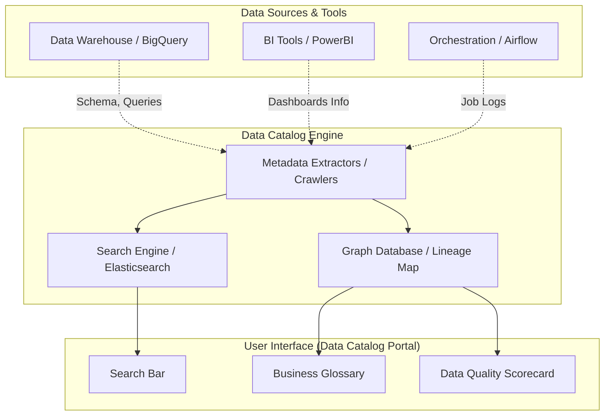

Hãy tưởng tượng bạn bước vào một siêu thị khổng lồ nhưng không hề có các biển chỉ dẫn ngành hàng, không có nhãn giá và các sản phẩm được xếp lộn xộn trên kệ. Việc tìm kiếm một hộp sữa sẽ trở thành một cơn ác mộng. Trong thế giới dữ liệu của doanh nghiệp cũng vậy, khi số lượng bảng dữ liệu lên tới hàng ngàn và nằm rải rác ở khắp các phòng ban, việc tìm đúng dữ liệu để làm báo cáo là vô cùng khó khăn. **Data Catalog (Danh mục dữ liệu)** chính là "tấm bản đồ chỉ đường" giúp giải quyết triệt để sự hỗn loạn này.

## Data Catalog: Bản đồ dẫn đường trong kho tàng dữ liệu doanh nghiệp

Về mặt bản chất, **Data Catalog** là một siêu nền tảng `(Platform)` chuyên làm nhiệm vụ thu thập, quản lý và tổ chức Siêu dữ liệu `(Metadata)` từ mọi ngóc ngách trong hệ thống công nghệ của doanh nghiệp – từ các cơ sở dữ liệu nguồn, Data Warehouse, cho đến các ETL pipeline và các báo cáo BI Dashboard. Nó cung cấp một giao diện web trực quan, hoạt động giống như một thanh công cụ tìm kiếm Google nội bộ dành riêng cho dữ liệu.

Khi một nhà phân tích dữ liệu cần xây dựng báo cáo về *"Doanh thu khách hàng hạng thẻ Vàng"*, thay vì phải mò mẫm gõ SQL để dò tìm giữa hàng ngàn bảng dữ liệu chưa rõ nguồn gốc, họ chỉ cần lên Data Catalog và gõ từ khóa *"Doanh thu thẻ Vàng"*. Hệ thống sẽ lập tức trả về:
* Tên bảng dữ liệu chuẩn xác nhất (ví dụ: `mart_gold_revenue`) kèm theo huy hiệu chứng nhận chất lượng.
* Định nghĩa rõ ràng của từng cột (Business Glossary).
* Sơ đồ phả hệ cho biết bảng này được tính toán từ nguồn nào `(Data Lineage)`.
* Ai chịu trách nhiệm quản lý bảng dữ liệu này `(Data Owner)` để gửi yêu cầu cấp quyền truy cập.

## Nỗi ám ảnh về "kiến thức truyền miệng" và sự thất lạc thông tin

Tại sao doanh nghiệp lại cần Data Catalog? Trong thực tế vận hành, các chuyên gia dữ liệu thường phải dành tới 70-80% thời gian của mình chỉ để đi tìm kiếm và xác minh dữ liệu trước khi thực sự bắt tay vào phân tích. Điều này xuất phát từ hai vấn đề nhức nhối:

* **Kiến thức truyền miệng (Tribal Knowledge)**: Mọi thông tin quan trọng về cấu trúc dữ liệu chỉ nằm trong đầu của một vài kỹ sư kỳ cựu. Khi họ nghỉ việc hoặc chuyển bộ phận, toàn bộ khối tri thức đó lập tức biến mất, khiến người ở lại loay hoay trong đống đổ nát.
* **Tái tạo lại những thứ đã có (Reinventing the wheel)**: Đội Marketing có thể mất 2 tuần làm việc để viết code tính toán chỉ số khách hàng rời bỏ `(Churn Rate)`, trong khi đội Data Science đã tính toán sẵn và lưu trữ một bảng tương tự từ tháng trước mà không ai hay biết.

Data Catalog ra đời để chuyển hóa tri thức của các cá nhân thành tài sản chung của doanh nghiệp, giúp việc khai thác dữ liệu trở nên minh bạch và dễ dàng.

## Những vũ khí cốt lõi của một Data Catalog hiện đại

Một hệ thống Data Catalog hoàn chỉnh thường sở hữu năm tính năng quan trọng sau:

1. **Khung tìm kiếm thông minh**: Hỗ trợ tìm kiếm dữ liệu bằng ngôn ngữ tự nhiên. Đánh chỉ mục `(indexing)` toàn bộ tên bảng, tên cột, nhãn và mô tả để cho ra kết quả nhanh nhất.
2. **Business Glossary (Từ điển thuật ngữ kinh doanh)**: Thống nhất định nghĩa các thuật ngữ nghiệp vụ (như thế nào được coi là một *"Active User"*) và liên kết trực tiếp định nghĩa đó với các cột dữ liệu kỹ thuật vật lý tương ứng.
3. **Data Lineage (Bản đồ phả hệ dữ liệu)**: Vẽ ra sơ đồ trực quan thể hiện đường đi của dữ liệu từ hệ thống gốc, qua các bước biến đổi của ETL, cho tới khi hiển thị trên các biểu đồ Dashboard cuối cùng.
4. **Chỉ số đánh giá chất lượng**: Tích hợp các thang đo độ tin cậy của dữ liệu (ví dụ gắn thẻ xanh cho bảng dữ liệu sạch được cập nhật đều đặn, hoặc thẻ đỏ cho các bảng dữ liệu lỗi thời cần tránh).
5. **Tính năng tương tác cộng đồng**: Cho phép người dùng bình luận, đánh giá sao, ghi chú các mẹo xử lý dữ liệu ngay trên giao diện của từng bảng để chia sẻ kinh nghiệm cho những người dùng sau.

## Cơ chế hoạt động của hệ thống quét Metadata

Hầu hết các công cụ Data Catalog hiện đại (như Atlan, Alation, Collibra, DataHub) hoạt động dựa trên mô hình quét tự động `(Crawler)` theo sơ đồ dưới đây:



1. **Kết nối**: Data Catalog kết nối qua API với quyền đọc thông tin `(Read-only)` tới các thành phần trong hệ thống như Cloud Data Warehouse, BI Tools hay các Orchestrator.
2. **Quét dữ liệu**: Các bot quét tự động chạy định kỳ (thường vào ban đêm) để kéo về toàn bộ siêu dữ liệu kỹ thuật mới nhất (như cấu trúc bảng, lịch sử chạy truy vấn).
3. **Đánh chỉ mục**: Phân tích siêu dữ liệu và xây dựng nên các bản đồ quan hệ tri thức `(Knowledge Graph)` kết nối các bảng lại với nhau.
4. **Bổ sung nghiệp vụ**: Các quản trị viên dữ liệu `(Data Stewards)` tiến hành phân loại các cột thông tin nhạy cảm (như thông tin cá nhân PII) và viết thêm các mô tả chi tiết bằng ngôn ngữ tự nhiên.
5. **Khai thác**: Người dùng cuối tìm kiếm dữ liệu trên cổng thông tin web của Catalog và gửi yêu cầu cấp quyền trực tiếp nếu tìm thấy bảng dữ liệu phù hợp.

## Câu chuyện thực tế và cách tự động hóa Metadata bằng Python

Hãy tưởng tượng một nhà phân tích dữ liệu mới gia nhập công ty vào tuần đầu tiên.
* **Nếu không có Data Catalog**: Cô phải nhắn tin hỏi đồng nghiệp lâu năm để xin tên bảng. Đồng nghiệp bận nên phải mất 2 ngày mới trả lời: *"Em dùng bảng `subs_final_v2` nhé"*. Khi mở bảng lên, cô hoàn toàn bối rối trước 50 cột viết tắt kiểu `stt`, `is_churn_flg` mà không có bất kỳ dòng mô tả nào.
* **Nếu có Data Catalog**: Cô lên trang chủ Catalog, gõ chữ *"Hủy gói cước"*. Kết quả trả về bảng `dim_subscription_churn` đi kèm huy hiệu chứng nhận dữ liệu chuẩn. Click vào bảng, cô đọc được mô tả chi tiết của cột `is_churn_flg`: *"Cờ đánh dấu khách hủy dịch vụ (1 = Đã hủy, 0 = Đang hoạt động), được tính toán nếu khách hàng quá hạn thanh toán 30 ngày"*. Cô hoàn thành báo cáo ngay trong buổi sáng thay vì mất cả tuần.

Dưới đây là một đoạn code Python thực tế minh họa cách sử dụng thư viện của công cụ DataHub để tự động hóa việc đẩy các mô tả nghiệp vụ lên hệ thống Data Catalog:

```python
from datahub.emitter.rest_emitter import DatahubRestEmitter
from datahub.metadata.com.linkedin.pegasus2avro.dataset import DatasetProperties
from datahub.emitter.mcp import MetadataChangeProposalWrapper

# Khởi tạo kết nối tới REST API của DataHub
emitter = DatahubRestEmitter("http://localhost:8080")

# Định nghĩa các thông tin mô tả nghiệp vụ cho bảng dữ liệu
properties = DatasetProperties(
    description="Bảng dim_subscription_churn: Chứa cờ đánh dấu khách hàng hủy dịch vụ (is_churn_flg).",
    customProperties={"verified": "true", "owner": "Finance Team"}
)

# Đóng gói dữ liệu yêu cầu cập nhật siêu dữ liệu (Metadata Change Proposal)
mcp = MetadataChangeProposalWrapper(
    entityType="dataset",
    changeType="UPSERT",
    urn="urn:li:dataset:(urn:li:dataPlatform:bigquery,my_project.my_dataset.dim_subscription_churn,PROD)",
    aspectName="datasetProperties",
    aspect=properties
)

# Phát tán siêu dữ liệu lên cổng thông tin DataHub
emitter.emit(mcp)
print("Cập nhật thông tin lên Data Catalog thành công!")
```

## Nghệ thuật thổi hồn vào Data Catalog (Best Practices)

* **Xây dựng văn hóa cộng đồng (Crowdsourcing)**: Đừng biến Data Catalog thành một dự án kỹ thuật khô khan chỉ do một vài kỹ sư viết tài liệu. Hãy khuyến khích người dùng ở mọi phòng ban (như Sales, Marketing) cùng tham gia viết đánh giá, bổ sung định nghĩa nghiệp vụ bằng các hình thức khen thưởng hoặc tích điểm. Catalog chỉ thực sự sống khi có sự đóng góp của cộng đồng.
* **Tích hợp sâu vào công cụ làm việc hàng ngày**: Đội ngũ kỹ thuật thường rất lười phải mở thêm một tab trình duyệt khác để tra cứu. Hãy tích hợp Data Catalog trực tiếp dưới dạng extension trong công cụ viết SQL hoặc thiết lập một con Bot trên Slack. Người dùng chỉ cần gõ `/catalog find <tên_bảng>` trên Slack là có thể nhận kết quả tra cứu ngay lập tức.
* **Hệ thống chứng nhận chất lượng rõ ràng**: Giữa hàng ngàn bảng dữ liệu nháp, bảng test nằm lộn xộn, hãy gán các huy hiệu như "Certified by Finance" cho các bảng dữ liệu chuẩn đã qua phê duyệt để người dùng không bị lạc lối trong "bãi rác dữ liệu".

## Những sai lầm kinh điển biến Catalog thành "bãi rác"

* **Mua công cụ trước khi xây dựng quy trình (Tool-first)**: Nghĩ rằng chỉ cần chi tiền mua các phần mềm đắt đỏ là doanh nghiệp sẽ tự khắc có quản trị dữ liệu tốt. Nếu văn hóa chia sẻ tri thức và quản lý tài sản thông tin không được thực thi trong tổ chức, Data Catalog sẽ nhanh chóng trở thành một "bãi rác có tính năng tìm kiếm" vì không ai chịu cập nhật định nghĩa mới.
* **Định nghĩa thuật ngữ mâu thuẫn**: Để xảy ra tình trạng một định nghĩa nghiệp vụ như "Doanh thu" được giải nghĩa theo 3 cách khác nhau ở 3 phòng ban trên cùng một Catalog, làm tăng thêm sự bối rối cho người sử dụng.

## Bức tranh hai mặt: Cơ hội và thách thức

### Ưu điểm
* Giúp người dùng trong doanh nghiệp có khả năng tự khám phá và sử dụng dữ liệu hiệu quả `(Self-service)`.
* Tiết kiệm thời gian trả lời các yêu cầu hỗ trợ lặt vặt cho đội ngũ Data Engineer.
* Rút ngắn tối đa thời gian làm quen hệ thống `(Onboarding)` cho các nhân sự phân tích mới.

### Thách thức
* **Nguy cơ lỗi thời thông tin**: Nếu các quản trị viên dữ liệu không thường xuyên bảo trì và cập nhật các thay đổi, Catalog sẽ chứa các thông tin cũ sai lệch, làm mất đi lòng tin của người sử dụng.
* **Chi phí đắt đỏ**: Chi phí mua bản quyền các công cụ Data Catalog thương mại lớn thường rất cao. Các giải pháp mã nguồn mở thay thế tuy miễn phí nhưng lại yêu cầu năng lực vận hành hệ thống mạnh.

## Khi nào doanh nghiệp thực sự cần một Data Catalog?

**Nên đầu tư khi:**
* Doanh nghiệp của bạn vượt qua ngưỡng phức tạp về dữ liệu: có trên 20 nhân sự khai thác dữ liệu trực tiếp, sở hữu hàng ngàn bảng trong Data Warehouse và hàng trăm biểu đồ báo cáo.
* Đang triển khai kiến trúc Data Lake/Data Lakehouse – nơi dữ liệu phi cấu trúc đổ về ồ ạt như một đầm lầy, nếu không có Catalog thì không ai biết bên trong đầm lầy đó chứa những gì.

**Chưa cần dùng khi:**
* Doanh nghiệp quy mô nhỏ, toàn bộ dữ liệu chỉ gói gọn trong vài chục bảng SQL đơn giản. Khi đó, một trang Notion mô tả thông tin là đã đủ hiệu quả và tiết kiệm chi phí.

## Góc phỏng vấn: Những câu hỏi thực chiến

### 1. Hãy mô tả cách Data Catalog hỗ trợ việc triển khai chiến lược "Dân chủ hóa dữ liệu" (Data Democratization) trong doanh nghiệp.
* **Mục đích câu hỏi**: Đánh giá khả năng liên kết giữa công cụ kỹ thuật và tầm nhìn vận hành doanh nghiệp của ứng viên.
* **Gợi ý trả lời**:
  * Dân chủ hóa dữ liệu là việc trao quyền khai thác và phân tích dữ liệu cho cả những nhân sự không có nền tảng kỹ thuật chuyên sâu (như Business Users) để họ tự đưa ra quyết định. Tuy nhiên, nếu chỉ cấp quyền truy cập vào database trống trơn, họ sẽ không hiểu gì và bỏ cuộc.
  * Data Catalog đóng vai trò như chiếc cầu nối. Nhờ giao diện tìm kiếm thân thiện, từ điển thuật ngữ nghiệp vụ rõ ràng, nó giúp người dùng nghiệp vụ có thể tự khám phá, đọc hiểu và sử dụng dữ liệu một cách độc lập mà không cần phải phụ thuộc vào đội ngũ kỹ thuật.

### 2. Sự khác biệt cốt lõi giữa Data Dictionary (Từ điển dữ liệu) và Data Catalog là gì?
* **Mục đích câu hỏi**: Phân biệt các khái niệm quản lý thông tin truyền thống và nền tảng dữ liệu hiện đại.
* **Gợi ý trả lời**:
  * *Data Dictionary* là một danh sách tĩnh (thường lưu dưới dạng file Excel hoặc text), chỉ chứa các mô tả kỹ thuật ở cấp độ cột và bảng (ví dụ: Cột ID có kiểu dữ liệu Integer). Nó mang tính chất mô tả thụ động và chủ yếu phục vụ cho các kỹ sư quản trị database (DBA).
  * *Data Catalog* là một nền tảng rộng lớn bao quát cả Data Dictionary, nhưng bổ sung thêm nhiều tính năng động như: Khung tìm kiếm thông minh, Bản đồ phả hệ (Lineage), Đánh giá chất lượng dữ liệu và các tính năng tương tác cộng đồng. Catalog hướng tới phục vụ toàn bộ mọi đối tượng trong doanh nghiệp.

## Khái niệm liên quan & Tài liệu tham khảo

**Khái niệm liên quan:**
* [Metadata Management (Quản lý siêu dữ liệu)](/concepts/governance-metadata/metadata-management/)
* Data Discovery
* [Data Governance (Quản trị dữ liệu)](/concepts/governance-metadata/data-governance/)
* [Data Mesh](/concepts/system-architecture/data-mesh/)

**Tài liệu tham khảo:**
1. **Data Management at Scale** - Piethein Strengholt (Chương phân tích về vai trò của Data Catalog trong doanh nghiệp lớn).
2. **DataHub and Amundsen Architecture** - Các bài viết thiết kế hệ thống từ LinkedIn và Lyft.

## English Summary

A Data Catalog is an enterprise-wide metadata management and data discovery platform designed to function like an internal "Google search engine" for a company's data assets. By automatically harvesting technical metadata, data lineage, and query logs across data warehouses and BI tools, and combining them with crowdsourced business glossaries and data profiling metrics, it empowers both technical and business users to find, understand, and trust data. Effectively eliminating "tribal knowledge" and tedious data support tickets, a robust Data Catalog is the crucial user-interface layer that enables true self-service analytics and underpins Data Mesh and Data Democratization strategies.
