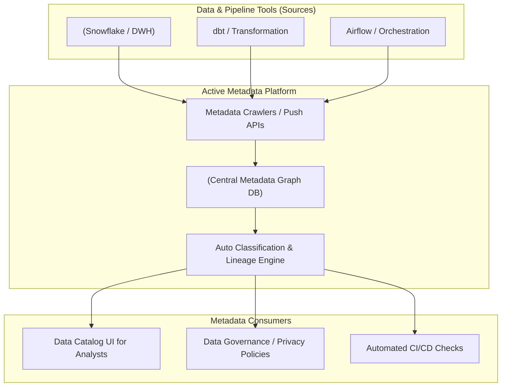

Hãy tưởng tượng bạn bước vào một thư viện khổng lồ chứa hàng triệu cuốn sách nhưng hoàn toàn không có mục lục, không có tên tác giả trên bìa, và các cuốn sách được xếp lộn xộn không theo thứ tự nào. Dù thư viện đó có chứa nhiều kiến thức vô giá đến đâu, bạn cũng sẽ sớm bỏ cuộc vì không thể tìm thấy thông tin mình cần. 

Trong thế giới dữ liệu, thảm họa đó được gọi là **Đầm lầy dữ liệu (Data Swamp)**. Và thứ duy nhất giúp chúng ta ngăn chặn thảm họa này chính là **Siêu dữ liệu (Metadata)** cùng quy trình **Quản lý siêu dữ liệu (Metadata Management)**.

Nếu dữ liệu (Data) là nội dung của một cuốn sách, thì siêu dữ liệu (Metadata) chính là bìa sách, mục lục, tên tác giả, tóm tắt nội dung và các thẻ phân loại của cuốn sách đó. Nói cách khác, Metadata chính là *"dữ liệu về dữ liệu"* (Data about data).

## Phân loại Metadata trong hệ thống dữ liệu

Để quản lý hiệu quả, chúng ta thường chia Metadata thành ba nhóm chính, mỗi nhóm phục vụ một mục đích và đối tượng sử dụng riêng biệt:

1. **Technical Metadata (Siêu dữ liệu kỹ thuật)**: Phục vụ chủ yếu cho máy móc và các kỹ sư dữ liệu. Nó mô tả cấu trúc vật lý của dữ liệu.
   * *Ví dụ*: Tên bảng là `fct_sales`, kiểu dữ liệu của cột `price` là `DECIMAL(10,2)`, khóa chính là `order_id`, bảng được lưu trữ trên server AWS vùng `us-east-1`.
2. **Business Metadata (Siêu dữ liệu kinh doanh)**: Phục vụ cho con người, đặc biệt là các nhà phân tích nghiệp vụ (Business Analysts) và người dùng doanh nghiệp. Nó giúp chuyển đổi các định nghĩa kỹ thuật khô khan thành ngôn ngữ kinh doanh dễ hiểu.
   * *Ví dụ*: Cột `net_revenue` được định nghĩa là *"Doanh thu gộp trừ đi các khoản giảm trừ gia cảnh và hoàn tiền"*. Bảng này thuộc quyền sở hữu của phòng Kế toán.
3. **Operational Metadata (Siêu dữ liệu vận hành)**: Mô tả trạng thái hoạt động của hệ thống và các đường ống dẫn dữ liệu (data pipelines).
   * *Ví dụ*: Đường ống ETL vừa hoàn thành lúc 2:00 AM, chạy mất 15 phút, đã chèn thêm 10.000 dòng dữ liệu mới và không phát hiện lỗi nào.

---

## Tại sao doanh nghiệp lại cần quản lý Metadata?

Nhiều doanh nghiệp khi mới bắt đầu thường chỉ tập trung toàn lực vào việc xây dựng hạ tầng lưu trữ và các đường ống ETL để đẩy dữ liệu vào kho nhanh nhất có thể. Tuy nhiên, nếu thiếu đi Metadata, họ sẽ sớm phải đối mặt với các vấn đề:

* **Sự hoang mang của nhà phân tích**: Một chuyên viên phân tích mới vào công ty mở kho dữ liệu lên và thấy 5 bảng có tên tương tự nhau: `customer_data`, `customer_info_final`, `customer_info_v2_final`, `customer_test`. Cô ấy hoàn toàn không biết nên lấy dữ liệu từ bảng nào để làm báo cáo và phải đi hỏi khắp nơi, gây lãng phí thời gian của cả đội ngũ.
* **Quyết định dựa trên dữ liệu lỗi thời**: Nếu thiếu siêu dữ liệu vận hành, không ai nhận ra một đường ống dữ liệu quan trọng đã bị lỗi và ngừng cập nhật từ 3 tháng trước. Các báo cáo gửi lên ban giám đốc vẫn chạy bình thường nhưng sử dụng số liệu cũ mà không ai hay biết.
* **Hiểu sai định nghĩa chỉ số**: Phòng marketing tính toán chỉ số "lợi nhuận" theo công thức trước thuế, trong khi phòng tài chính tính sau thuế. Sự lệch pha này dẫn đến những cuộc tranh cãi vô bổ trong các cuộc họp chiến lược.

Quản lý siêu dữ liệu ra đời để giải quyết hai bài toán cốt lõi: **Sự thấu hiểu** (Understanding) và **Sự tin cậy** (Trust) đối với dữ liệu của doanh nghiệp.

---

## Cơ chế hoạt động của Metadata Management hiện đại

Trong các hệ thống hiện đại, việc quản lý metadata không còn là việc các kỹ sư dữ liệu phải ngồi viết tài liệu thủ công vào các file Excel hay trang Wiki (vốn sẽ bị lỗi thời chỉ sau vài ngày). Thay vào đó, quy trình này được tự động hóa hoàn toàn thông qua cơ chế **Active Metadata Management (Quản lý siêu dữ liệu chủ động)**.



Quy trình tự động này diễn ra qua 4 bước:
1. **Tự động thu thập (Ingestion)**: Các bộ quét (crawlers) của hệ thống quản lý metadata (như DataHub, OpenMetadata) sẽ tự động kết nối qua API tới Data Warehouse và các công cụ lập lịch (Airflow, dbt) để lấy schema, lịch sử chạy và logs của hệ thống theo chu kỳ ngắn.
2. **Xây dựng bản đồ dòng chảy (Data Lineage)**: Hệ thống tự động phân tích các câu lệnh SQL để vẽ ra bản đồ trực quan mô tả dữ liệu di chuyển từ đâu đến đâu (ví dụ: Bảng C được tổng hợp từ Bảng A và Bảng B).
3. **Phân loại tự động (Auto Classification)**: Sử dụng các thuật toán học máy để phát hiện các mẫu dữ liệu nhạy cảm (như số chứng minh thư, số thẻ tín dụng) và tự động gán nhãn bảo mật (PII - Personally Identifiable Information).
4. **Kích hoạt hành động (Activation)**: Khi phát hiện một bảng dữ liệu nguồn bị lỗi không cập nhật đúng hạn, hệ thống Metadata sẽ chủ động gửi cảnh báo và tạm thời ẩn biểu đồ tương ứng trên dashboard BI để ngăn người dùng đọc số liệu sai lệch.

---

## Minh họa thực tế trong dbt

Hãy xem cách chúng ta khai báo siêu dữ liệu trực tiếp trong mã nguồn bằng file cấu hình YAML của dbt. Cách tiếp cận này giúp tài liệu luôn đi kèm với mã nguồn (Code as Documentation) và dễ dàng được đồng bộ lên các công cụ Data Catalog:

```yaml
version: 2

models:
  - name: fct_customer_profiles
    description: "Bảng tổng hợp thông tin hồ sơ và tài chính của khách hàng. Chủ sở hữu: Nguyễn Văn A."
    meta:
      owner: "Nguyễn Văn A"
      department: "Risk Management"
    columns:
      - name: yearly_income
        description: "Thu nhập kê khai hàng năm của khách hàng (Đơn vị: USD)."
        meta:
          sensitivity: "PII-Tier2"
          contains_pii: true
```

---

## Điểm cộng, điểm trừ và kinh nghiệm thực chiến

### Những ưu điểm vượt trội (Pros)
* **Tiết kiệm thời gian tìm kiếm**: Các nhà phân tích không còn phải tốn từ 30% đến 40% thời gian làm việc hàng ngày chỉ để đi tìm xem dữ liệu nằm ở đâu và có ý nghĩa gì.
* **Quản trị dữ liệu hiệu quả (Data Governance)**: Giúp doanh nghiệp dễ dàng tuân thủ các quy định pháp lý về bảo mật thông tin (như GDPR) nhờ khả năng tự động phát hiện và gắn nhãn dữ liệu nhạy cảm.
* **Hỗ trợ phân tích tác động (Impact Analysis)**: Khi bạn chuẩn bị sửa đổi một cột dữ liệu ở bảng nguồn, Data Lineage sẽ chỉ ra chính xác những dashboard hay báo cáo downstream nào sẽ bị ảnh hưởng (bị lỗi) để bạn chủ động phòng tránh.

### Những hạn chế cần lưu ý (Cons)
* **Khó đo lường giá trị ngay lập tức (ROI)**: Việc đầu tư cho Metadata Management không mang lại doanh thu trực tiếp cho doanh nghiệp ngay ngày mai mà chỉ giúp hệ thống chạy trơn tru và an toàn hơn về lâu dài, điều này đôi khi gây khó khăn khi thuyết phục ban giám đốc chi ngân sách.
* **Chi phí vận hành**: Hệ thống tự động crawler cần được cấu hình và bảo trì liên tục để đảm bảo không làm nghẽn hiệu năng của Data Warehouse chính.

### Những sai lầm phổ biến cần tránh
* **Bắt nhân viên viết tài liệu thủ công quá nhiều**: Yêu cầu các kỹ sư phải viết mô tả chi tiết cho hàng vạn cột dữ liệu ngay trong tuần đầu tiên triển khai. Điều này tạo ra gánh nặng tâm lý lớn và dự án sẽ nhanh chóng bị bỏ hoang. Thay vào đó, hãy dùng query logs để xác định top 100 bảng được sử dụng nhiều nhất và tập trung hoàn thiện metadata cho chúng trước.
* **Mất kết nối giữa tài liệu và thực tế**: Mua một công cụ Data Dictionary rất đắt tiền nhưng lại bắt nhân sự tự cập nhật thủ công mỗi khi thay đổi cấu trúc bảng trên Database. Chỉ sau vài tuần, tài liệu trên tool và cấu trúc bảng thực tế sẽ bị lệch nhau, khiến công cụ mất đi hoàn toàn độ tin cậy.

---

## Khi nào nên áp dụng Metadata Management?

* **Nên áp dụng từ sớm**: Ngay từ khi bắt đầu xây dựng Data Warehouse, hãy tập thói quen viết các comment mô tả ngắn gọn trực tiếp trong code hoặc file YAML.
* **Bắt buộc áp dụng**: Khi hệ thống dữ liệu của công ty phình to, hoặc khi chuyển dịch sang các kiến trúc phân tán như **Data Mesh** — nơi dữ liệu được quản lý độc lập bởi nhiều phòng ban khác nhau và rất cần một cổng thông tin Catalog tập trung để kết nối tất cả lại.

---

## Khái niệm liên quan

* [Data Catalog](/concepts/governance-metadata/data-catalog/)
* [Data Governance](/concepts/governance-metadata/data-governance/)
* [Data Lineage](/concepts/governance-metadata/data-lineage/)

---

## Góc phỏng vấn: Câu hỏi thường gặp

### 1. Sự khác biệt cốt lõi giữa Technical Metadata và Business Metadata là gì? Tại sao chúng ta cần cả hai?
* **Mục đích của người phỏng vấn**: Đánh giá khả năng hiểu và phân loại đối tượng người dùng trong hệ thống thông tin của bạn.
* **Gợi ý trả lời**:
  * **Technical Metadata** trả lời cho câu hỏi *"Dữ liệu được lưu trữ và vận hành thế nào?"* (How). Nó chứa các thông tin kỹ thuật như kiểu dữ liệu, index, khóa chính, server lưu trữ... đối tượng phục vụ là các Kỹ sư dữ liệu và máy móc để tối ưu hóa hiệu năng và gỡ lỗi hệ thống.
  * **Business Metadata** trả lời cho câu hỏi *"Dữ liệu này có ý nghĩa gì trong thực tế kinh doanh?"* (What/Why). Nó chứa định nghĩa chỉ số, quyền sở hữu bảng, phân loại bảo mật... đối tượng phục vụ là các nhà phân tích và người dùng nghiệp vụ để họ lấy đúng số liệu làm báo cáo.
  * Thiếu Technical Metadata, hệ thống sẽ dễ bị sập và không thể vận hành. Thiếu Business Metadata, dữ liệu dù có chạy mượt mà đến mấy cũng trở nên vô giá trị vì không ai hiểu và dám tin dùng.

### 2. Định nghĩa "Active Metadata Management" và sự khác biệt của nó với phương pháp "Passive" truyền thống?
* **Mục đích của người phỏng vấn**: Đánh giá mức độ cập nhật của bạn với các xu hướng công nghệ dữ liệu hiện đại (Modern Data Stack).
* **Gợi ý trả lời**:
  * **Passive Metadata (Siêu dữ liệu thụ động)** giống như một "cuốn sổ tay" tĩnh (file Excel hoặc trang Wiki). Nó chỉ lưu trữ thông tin và hoàn toàn phụ thuộc vào việc con người nhớ để cập nhật thủ công. Nó rất nhanh bị lỗi thời và bị bỏ hoang khi hệ thống thay đổi.
  * **Active Metadata (Siêu dữ liệu chủ động)** hoạt động tự động và hai chiều (bi-directional). Nó liên tục kết nối với hệ thống để tự cập nhật cấu trúc (schema) thời gian thực mà không cần con người can thiệp. Đồng thời, nó có khả năng kích hoạt các hành động ngược lại lên hệ thống (ví dụ: tự động gửi cảnh báo và chặn quyền truy cập của người dùng đối với một cột dữ liệu nếu phát hiện cột đó chứa thông tin nhạy cảm PII chưa được mã hóa).

---

## Tài liệu tham khảo

1. **"Data Management at Scale"** - Piethein Strengholt.
2. **DAMA-DMBOK** - *Metadata Management Knowledge Area*.
3. **Bài nghiên cứu về Active Metadata** của Prukalpa Sankar (Founder Atlan).

---

## English summary

Metadata Management is the critical discipline of capturing, integrating, and maintaining "data about data" across technical, business, and operational dimensions. It prevents a data warehouse from turning into an unnavigable "data swamp" by providing clear context: technical schemas for engineers, business definitions (glossaries) for analysts, and pipeline execution states for operations. Modern "Active Metadata" platforms move away from static wiki pages, automatically crawling distributed data systems to construct dynamic metadata graphs that power data catalogs, data lineage, and automated data governance workflows.
