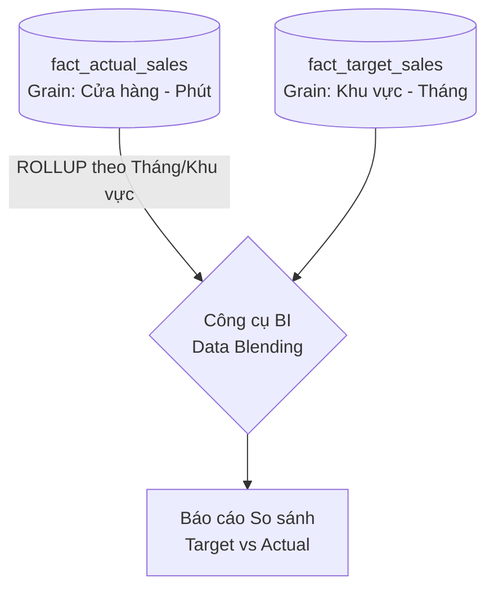

# Độ mịn dữ liệu - Grain

## Summary

Trong Data Warehousing và Dimensional Modeling, Độ mịn (Grain hoặc Granularity) định nghĩa mức độ chi tiết chính xác mà một dòng dữ liệu (record) trong Bảng sự kiện (Fact Table) đại diện. Đây là quyết định thiết kế quan trọng và không thể nhân nhượng nhất của một Data Engineer. Một Fact Table phải có một "Grain" thống nhất và rõ ràng. Nếu định nghĩa Grain lỏng lẻo hoặc trộn lẫn các dòng dữ liệu có mức độ chi tiết khác nhau vào cùng một bảng, toàn bộ hệ thống báo cáo (Business Intelligence) sẽ cho ra những con số tính toán sai lệch, dẫn tới sự sụp đổ niềm tin của người dùng vào Data Warehouse.

---

## Definition

**Grain (Độ mịn / Độ hạt)** là câu trả lời duy nhất cho câu hỏi: *"Một dòng dữ liệu trong bảng Fact này diễn tả chính xác sự kiện gì?"*

Ví dụ về định nghĩa Grain rõ ràng:
* *"Một dòng trong bảng Fact đại diện cho 1 sản phẩm được quét mã vạch trên 1 tờ biên lai thanh toán."* (Grain: Dòng hóa đơn / Line item).
* *"Một dòng trong bảng Fact đại diện cho tổng doanh số của 1 cửa hàng vào 1 ngày."* (Grain: Cửa hàng - Ngày).
* *"Một dòng trong bảng Fact đại diện cho số dư ngân hàng của 1 tài khoản vào cuối mỗi tháng."* (Grain: Tài khoản - Tháng).

Càng lưu dữ liệu ở mức độ chi tiết (Ví dụ: Từng giao dịch), ta gọi là **Fine Grain** (Độ mịn cao). Ngược lại, dữ liệu bị tổng hợp theo cụm (Ví dụ: Tổng theo ngày, tổng theo tuần), ta gọi là **Coarse Grain** (Độ mịn thấp / thô).

---

## Why it exists

Dữ liệu kinh doanh đến từ nhiều quy trình khác nhau. Nhân viên Marketing xem ngân sách ở mức "Tháng". Nhân viên cửa hàng xem doanh thu ở mức "Từng hóa đơn". 

Nếu Data Engineer thiết kế các bảng vô tội vạ mà không tuyên bố độ mịn (Grain) từ trước, hệ quả là:
1. **Lỗi Double-counting (Nhân đôi số liệu)**: Nếu nhét dòng "Tổng doanh thu thứ 2" và dòng "Tổng doanh thu thứ 3" cùng chung một bảng với dòng "Tổng doanh thu của tuần đó". Khi chạy hàm `SUM(revenue)`, doanh thu sẽ bị nhân đôi.
2. **Không thể khoan xuống dữ liệu (Drill-down)**: Nếu chỉ nạp dữ liệu vào Data Warehouse ở dạng tổng hợp (đã Group By theo Ngày), sếp sẽ không bao giờ trả lời được câu hỏi: *"Vào lúc 9 giờ sáng hôm đó chúng ta bán được mấy sản phẩm?"*.

Khái niệm Grain sinh ra để ép buộc kiến trúc sư dữ liệu phải có một bộ khung quy tắc thép trước khi tạo bảng.

---

## Core idea

Ý tưởng trọng tâm của Grain xoay quanh quy trình thiết kế 4 bước của Ralph Kimball:
1. Chọn quy trình nghiệp vụ.
2. **Khai báo Grain (Declare the Grain)** - *Bước quan trọng nhất!*
3. Chọn các Chiều (Dimensions).
4. Chọn các Chỉ số (Facts).

Quy tắc bất di bất dịch của Kimball: **"Mọi dòng trong một Fact Table phải thuộc về cùng một Grain duy nhất."** Không có ngoại lệ.

Khi đã tuyên bố Grain ở Bước 2, tất cả các Dimensions (Bước 3) thêm vào Fact Table phải hoàn toàn tuân theo và tương thích với mức Grain đó. Ví dụ: Nếu Grain là "Doanh số cấp độ Cửa hàng - Ngày", bạn không thể thêm một cột `customer_key` vào Fact Table, vì trong 1 ngày 1 cửa hàng có tới hàng trăm khách hàng, 1 cột `customer_key` không thể đại diện cho họ được.

---

## How it works

Quy trình thiết lập và đảm bảo Grain hoạt động:
1. Data Architect phỏng vấn Business User để hiểu nhu cầu. User luôn hỏi: *"Tôi muốn báo cáo tổng hợp theo Tháng"* (Coarse Grain).
2. Data Architect từ chối làm theo yêu cầu trên. Architect quyết định thiết kế bảng `fact_sales` ở mức sâu nhất có thể (Atomic Grain) - ví dụ: Từng sản phẩm trên hóa đơn.
3. Architect viết tài liệu rõ ràng: Bảng `fact_sales` có Grain là `Date + Store + Ticket ID + Product ID`.
4. Trong quá trình ETL, pipeline được lập trình để ném văng ra lỗi (Error) và dừng xử lý nếu hệ thống nguồn đẩy nhầm vào một dòng dữ liệu là tổng của cả hóa đơn.
5. Khi làm báo cáo, công cụ BI sẽ quét bảng `fact_sales` (mức chi tiết) và tự động tính `SUM` lại để ra báo cáo theo Tháng mà Business User yêu cầu.

---

## Architecture / Flow

Dưới đây là một ví dụ về việc vi phạm Grain gây tai họa:

**Bảng `fact_sales_bad` (Lẫn lộn Grain: Vừa lưu chi tiết, vừa lưu tổng hóa đơn)**

| order_id | product_name | quantity | revenue |
| :--- | :--- | :--- | :--- |
| O-01 | Apple | 1 | 100 |
| O-01 | Banana | 2 | 50 |
| **O-01** | **(TỔNG ĐƠN HÀNG O-01)** | **3** | **150** |

*Nếu Business Analyst thực hiện `SELECT SUM(revenue)`, kết quả sẽ là **300**, thay vì **150**! Sự nghiệp phân tích dữ liệu kết thúc.*

---

## Practical example

Giả sử doanh nghiệp có 2 luồng dữ liệu liên quan:
1. Mục tiêu kinh doanh (Target) được giao theo cấp độ **Khu vực (Region)** và **Tháng (Month)**.
2. Doanh thu thực tế (Actual) chảy về theo cấp độ **Cửa hàng (Store)** và **Phút (Minute)**.



Ta KHÔNG ĐƯỢC thiết kế chung 1 Fact Table. Phải tách làm 2 bảng với 2 Grain khác nhau:

**1. Bảng Doanh thu thực tế (Atomic Grain)**
```sql
CREATE TABLE fact_actual_sales (
    date_key INT,
    time_key INT,
    store_key INT,
    product_key INT,
    quantity INT,
    revenue DECIMAL(10,2)
);
-- Grain: 1 dòng = 1 sản phẩm bán ra tại 1 cửa hàng vào 1 phút cụ thể.
```

**2. Bảng Mục tiêu kinh doanh (Aggregated Grain)**
```sql
CREATE TABLE fact_target_sales (
    month_key INT,
    region_key INT,
    target_revenue DECIMAL(15,2)
);
-- Grain: 1 dòng = Mục tiêu giao cho 1 khu vực trong 1 tháng.
```

Khi làm báo cáo so sánh Target vs Actual, ta sẽ ROLLUP (tổng hợp) dữ liệu từ `fact_actual_sales` lên mức (Tháng + Khu vực) trong công cụ BI, sau đó mới khớp (JOIN/Blend) với `fact_target_sales`. Việc này gọi là "Drill Across".

---

## Best practices

* **Atomic Grain là vua**: Luôn cố gắng lưu trữ dữ liệu ở mức độ chi tiết sâu nhất, vi mô nhất (Atomic level). Dữ liệu atomic có sức chống chịu trước mọi câu hỏi phát sinh (Ad-hoc queries). Nếu bạn gộp nhóm (Aggregated) ngay từ vòng gửi xe (Ví dụ: Lưu tổng doanh thu theo tuần), bạn không bao giờ có thể trả lời được câu hỏi "Doanh thu Thứ 2 cao hơn Thứ 3 bao nhiêu?".
* **Phát biểu bằng câu hoàn chỉnh**: Để không bao giờ nhầm lẫn, hãy ghi chú lại định nghĩa Grain bằng văn xuôi. Đừng dùng danh từ rời rạc. Hãy viết: *"1 dòng = 1 giao dịch thẻ tín dụng thành công tại 1 trạm POS"*.
* **Bổ sung Aggregation Tables**: Atomic Data xử lý mọi câu hỏi nhưng có thể chạy chậm vì quá nhiều dòng. Cách giải quyết: Giữ lại bảng Atomic làm cốt lõi, nhưng tạo thêm một bảng `fact_sales_daily_summary` (Aggregated Grain) cho các dashboard chỉ xem tổng quát để báo cáo load nhanh hơn.

---

## Common mistakes

* **Khai báo Grain quá muộn**: Thêm các Dimension ngẫu nhiên vào Fact Table trước, sau đó mới quay lại suy nghĩ xem bảng này rốt cuộc đang chứa dữ liệu gì. Điều này thường dẫn đến các cột khóa ngoại (Foreign Keys) chứa giá trị Null hoặc gây trùng lặp dòng.
* **Header / Line Item Trap**: Cố gắng đưa thông tin ở mức Header (Ví dụ: Chi phí vận chuyển của cả chuyến xe) vào bảng Fact cấp độ Line Item (Chi tiết các món hàng trên xe). Phí vận chuyển 500k bị ghi lặp lại ở cả 10 món hàng, khiến SUM chi phí vận chuyển thành 5 triệu. (Nên phân bổ đều - allocate - 500k cho 10 món, hoặc tạo 2 bảng Fact riêng biệt).

---

## Trade-offs

### Atomic Grain (Mức độ cực kỳ chi tiết)
* **Ưu điểm**: Linh hoạt tuyệt đối (Maximum flexibility). Có thể xoay (slice-and-dice), khoan sâu (drill-down), cuộn lên (roll-up) theo mọi chiều hướng.
* **Nhược điểm**: Bảng sẽ có dung lượng khổng lồ. Yêu cầu sức mạnh tính toán (Compute) rất lớn để tổng hợp báo cáo hàng ngày (Table Scan tốn kém).

### Aggregated Grain (Mức độ đã tổng hợp)
* **Ưu điểm**: Query chạy cực nhanh (Tính bằng mili-giây). Tốn ít ổ cứng. Rất tốt cho các Dashboard lãnh đạo cấp cao (chỉ nhìn các con số lớn).
* **Nhược điểm**: Mất đi các chiều dữ liệu chi tiết. Không thể trả lời các câu hỏi tại sao doanh thu sụt giảm vào giờ nghỉ trưa.

---

## When to use

* Khái niệm Grain bắt buộc phải được khai báo bằng văn bản (Documentation) trước khi thiết kế bất kỳ bảng dữ liệu nào trong mọi Data Warehouse.

---

## Related concepts

* [Fact Table](/concepts/fact-table)
* [Dimensional Modeling](/concepts/dimensional-modeling)
* [Kimball Methodology](/concepts/kimball-methodology)

---

## Interview questions

### 1. Nếu bạn đang có một Fact Table lưu trữ số liệu ở mức "Ngày". Sếp yêu cầu báo cáo doanh thu theo "Giờ". Bạn sẽ xử lý thế nào?
* **Người phỏng vấn muốn kiểm tra**: Hiểu biết về giới hạn vật lý của dữ liệu và tư duy Grain.
* **Gợi ý trả lời**: Dữ liệu từ mức độ thô (Coarse) không bao giờ có thể "khoan" (Drill-down) ngược xuống mức độ mịn (Fine) được. Do bảng Fact hiện tại Grain là "Ngày", toàn bộ thông tin về Giờ đã bị mất trong quá trình tổng hợp (Aggregated) ở khâu ETL. Để đáp ứng yêu cầu của sếp, tôi không thể sửa bảng hiện tại. Tôi bắt buộc phải xây dựng lại luồng ETL (từ nguồn) để tạo ra một bảng `fact_sales` mới với Atomic Grain (chi tiết từng giao dịch kèm thời gian). Sau đó thay thế bảng cũ, hoặc giữ lại bảng cũ làm Summary Table.

### 2. Làm thế nào để giải quyết bài toán Chi phí vận chuyển (Freight) ở mức độ "Hóa đơn", trong khi Fact Table của bạn lại được thiết kế ở mức độ "Chi tiết sản phẩm" (Line Item)?
* **Người phỏng vấn muốn kiểm tra**: Kỹ thuật phân bổ (Allocation) và hiểu biết về sự chênh lệch Grain.
* **Gợi ý trả lời**: Đây là một cái bẫy phổ biến của thiết kế Grain. Tôi có 2 cách giải quyết:
  1. Tách bảng: Tạo một Fact Table riêng (`fact_invoice_header`) để lưu riêng chi phí vận chuyển. (Cách này an toàn nhưng rườm rà khi phân tích lợi nhuận thuần cho từng mặt hàng).
  2. Phân bổ (Allocation): Tại khâu ETL, tôi sẽ dùng toán học để chia nhỏ chi phí vận chuyển của hóa đơn đó xuống từng dòng Line Item. Tiêu chí chia có thể dựa trên Trọng lượng sản phẩm, hoặc Đơn giá sản phẩm. Ví dụ phí xe là 100k, sản phẩm A nặng chiếm 80% tải trọng xe, tôi sẽ ghi đè 80k phí vận chuyển vào dòng của sản phẩm A. Bằng cách này, toàn bộ dữ liệu vẫn duy trì thống nhất ở Line Item Grain mà không bị lỗi nhân đôi khi tính tổng.

---

## References

1. **The Data Warehouse Toolkit** - Ralph Kimball (Tuyên bố Bước 2: "Declare the Grain" là bước thiết kế tối thượng).
2. **Data Modeling for the Business** - Steve Hoberman.

---

## English summary

In dimensional modeling, "Grain" (or Granularity) defines the exact level of detail represented by a single row within a Fact Table. Establishing the grain is the most critical and uncompromisable step in Data Warehouse design (Step 2 of the Kimball methodology). A fact table must strictly adhere to a single, uniform grain. Mixing different grains (e.g., storing both individual transaction lines and daily summary totals in the same table) will inevitably lead to catastrophic double-counting and data integrity failures. Best practice strongly advocates designing fact tables at the lowest possible atomic grain to preserve maximum flexibility for unpredictable ad-hoc queries, handling aggregation dynamically at the BI layer.
