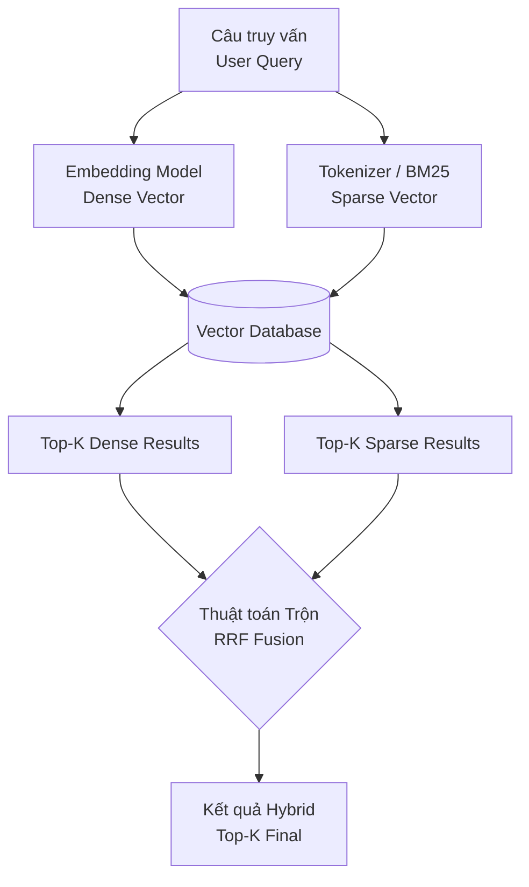

# Tìm kiếm kết hợp - Hybrid Search

## Summary

**Tìm kiếm kết hợp (Hybrid Search)** là một phương pháp truy xuất thông tin kết hợp đồng thời sức mạnh của hai thuật toán tìm kiếm trái ngược nhau: **Tìm kiếm từ khóa chính xác (Keyword/Sparse Search)** và **Tìm kiếm ngữ nghĩa (Semantic/Dense Vector Search)**. Bằng cách hòa trộn và xếp hạng lại (fusion/re-ranking) điểm số từ hai phương pháp này, Hybrid Search khắc phục được điểm yếu của từng phương pháp đơn lẻ, cung cấp các kết quả truy xuất (retrieval) chính xác toàn diện nhất, đặc biệt tối quan trọng trong các hệ thống RAG (Retrieval-Augmented Generation) cấp doanh nghiệp.

---

## Definition

Trong hệ thống tìm kiếm tài liệu hiện đại, chúng ta có hai trường phái:
1. **Tìm kiếm Dày (Dense / Vector Search)**: Đại diện bởi Vector Database và Embeddings. Nó hiểu ngữ nghĩa và từ đồng nghĩa (ví dụ: "chó" == "cún").
2. **Tìm kiếm Thưa (Sparse / Keyword Search)**: Đại diện bởi các thuật toán thống kê văn bản như TF-IDF hoặc **BM25** (phổ biến trong Elasticsearch/OpenSearch). Nó chỉ tìm khớp chính xác các ký tự.

**Hybrid Search** là việc chạy song song một câu truy vấn của người dùng qua cả hai hệ thống Dense và Sparse kể trên, lấy ra hai danh sách kết quả, sau đó dùng một thuật toán kết hợp (Fusion Algorithm - phổ biến nhất là Reciprocal Rank Fusion - RRF) để trộn chúng lại thành một danh sách Top-K kết quả duy nhất để gửi cho LLM.

---

## Why it exists

Ban đầu, sự ra đời của Vector Search được coi là sẽ "giết chết" BM25 truyền thống. Nhưng trong thực tế triển khai RAG, các kỹ sư nhận ra Vector Search có một "gót chân Achilles" tử huyệt: **Nó cực kỳ kém trong việc tìm kiếm các từ khóa đặc thù**.

Hãy lấy ví dụ người dùng truy vấn: *"Đánh giá hiệu năng của bộ vi xử lý Intel Core i7-13700K trong năm 2023"*.
* **Vector Search** sẽ hiểu ngữ nghĩa là người này đang tìm bài đánh giá CPU máy tính, và có thể trả về các bài đánh giá "AMD Ryzen 9" hoặc "Intel Core i5" vì chúng nằm rất gần nhau trong không gian vector (đều là bài đánh giá chip). Nó có thể bỏ qua cụm mã SKU "i7-13700K" vì cụm từ đó bị "loãng" ngữ nghĩa.
* **Keyword Search (BM25)** không hiểu "hiệu năng" là gì, nhưng nó sẽ bám chặt lấy chuỗi ký tự "i7-13700K" và "2023", trả về chính xác tài liệu chứa SKU này.

Vì 80% truy vấn doanh nghiệp chứa các mã ID nội bộ, tên riêng, từ viết tắt, hoặc email (những thứ yêu cầu khớp chữ hoàn hảo), Keyword Search vẫn không thể thiếu. Hybrid Search ra đời để "lấy điểm mạnh bù điểm yếu", mang lại kết quả "vừa đúng ngữ nghĩa, vừa chuẩn từ khóa".

---

## Core idea

Ý tưởng lõi của Hybrid Search giải quyết bài toán: "Làm thế nào để cộng điểm của hệ thống BM25 (thang điểm ngẫu nhiên, ví dụ từ 0 đến 100) với điểm của Vector Search (thang điểm Cosine Similarity từ -1 đến 1)?". Hai thang điểm này hoàn toàn không cùng hệ quy chiếu, việc cộng trực tiếp sẽ gây thảm họa.

Thuật toán kết hợp phổ biến nhất không dùng điểm số tuyệt đối, mà dùng **Thứ hạng (Rank)**, gọi là **Reciprocal Rank Fusion (RRF)**.
Thay vì nhìn vào điểm, RRF nhìn vào vị trí của tài liệu.
Công thức RRF Score cho 1 tài liệu = $\frac{1}{k + \text{Rank}_{\text{dense}}} + \frac{1}{k + \text{Rank}_{\text{sparse}}}$
(với $k$ là một hằng số phạt, thường = 60).

Tài liệu nào vừa nằm ở Top đầu của Vector Search, VÀ nằm ở Top đầu của Keyword Search, sẽ được cộng hưởng và đẩy lên xếp hạng 1 trong kết quả Hybrid.

---

## How it works

Luồng kiến trúc Hybrid Search trong một Vector Database (như Milvus, Qdrant, Pinecone) hỗ trợ native hybrid:



**1. Giai đoạn Lập chỉ mục (Indexing)**
* Văn bản gốc được chia chunk.
* Chunk đi qua Embedding Model sinh ra Dense Vector (ví dụ mảng 768 chiều).
* Chunk đi qua Tokenizer & BM25 sinh ra Sparse Vector (một mảng khổng lồ cỡ hàng trăm nghìn chiều của từ vựng nhưng hầu hết bằng 0, chỉ có giá trị tần suất ở các từ xuất hiện).
* Lưu cả Dense Vector và Sparse Vector vào database.

**2. Giai đoạn Tìm kiếm (Searching)**
* Người dùng gõ Query.
* Hệ thống sinh ra Dense Vector từ Query + Tokenize Query thành Sparse Vector.
* Cơ sở dữ liệu thực thi 2 luồng truy vấn song song tốc độ cao.
* Thu được `Danh sách kết quả Vector (Top 20)` và `Danh sách kết quả Keyword (Top 20)`.
* Thuật toán RRF trộn hai danh sách này lại.
* Tùy chọn (Alpha tuning): Một số hệ thống cho phép cấu hình tham số `Alpha (từ 0.0 đến 1.0)`. $Alpha=1$ là thuần Vector, $Alpha=0$ là thuần Keyword. $Alpha=0.5$ là hòa trộn cân bằng.

---

## Practical example

**Use case**: Hệ thống tra cứu văn bản pháp luật RAG.

* **Truy vấn**: "Điều kiện bồi thường khi thu hồi đất nông nghiệp theo Nghị định 47/2014"
* **Sparse (BM25) bắt được**: Tên nghị định "Nghị định 47/2014" (Tài liệu B: Nghị định 47 nói về thu hồi đất nhưng đoạn văn đó không nói rõ bồi thường).
* **Dense (Vector) bắt được**: Ngữ nghĩa "điều kiện bồi thường đất" (Tài liệu A: Nghị định sửa đổi mới không có chữ 47 nhưng cùng ý nghĩa đền bù).
* **Hybrid Search trộn lại**: Tài liệu C (vừa nằm top 3 của BM25 vì chứa "47/2014", vừa nằm top 2 của Vector vì mang nặng ý nghĩa "thu hồi bồi thường nông nghiệp"). Tài liệu C được đẩy lên vị trí số 1.
* LLM nhận Tài liệu C để tạo câu trả lời hoàn hảo.

**Mã giả cấu hình Hybrid Search (ví dụ với Weaviate):**

```python
response = (
    client.query
    .get("PhapLuat", ["noi_dung", "nghi_dinh"])
    .with_hybrid(
        query="Điều kiện bồi thường khi thu hồi đất nông nghiệp theo Nghị định 47/2014",
        alpha=0.5 # Alpha = 0.5 là cân bằng 50/50 giữa Vector Search và Keyword Search
    )
    .with_limit(3)
    .do()
)
```

---

## Best practices

* **Mặc định sử dụng cho RAG**: Bất kể bạn xây dựng RAG cho lĩnh vực gì, hãy biến Hybrid Search thành kiến trúc mặc định (default standard) thay vì chỉ dùng Vector Search. Các báo cáo Benchmark (như BEIR) cho thấy Hybrid Search luôn cải thiện chỉ số mAP (Mean Average Precision) từ 15-30%.
* **Tinh chỉnh trọng số (Alpha/Weights)**: Nếu tài liệu của công ty toàn mã lỗi kỹ thuật (Error logs, SKUs), hãy nghiêng trọng số về Keyword Search. Nếu tài liệu là văn học, bài viết blog, hãy nghiêng trọng số về Vector Search.
* **Sử dụng Database hỗ trợ Native Hybrid**: Đừng tự thiết lập Elasticsearch ở một server và Qdrant ở một server khác rồi tự code python kéo kết quả về trộn (rất chậm mạng và tốn tiền duy trì 2 DB). Hãy dùng các CSDL hỗ trợ lưu Sparse/Dense cùng một node (như Milvus 2.4+, Weaviate, Pinecone, Qdrant) để tính toán fusion ngay tại ổ đĩa.

---

## Common mistakes

* **Quên xử lý Tokenization cho tiếng Việt (BM25)**: Các thuật toán keyword như BM25 dựa vào cách cắt từ (word segmentation). Tiếng Việt không phân cách từ bằng khoảng trắng đơn thuần (như "học sinh" là 1 từ gồm 2 âm tiết). Nếu đẩy tiếng Việt vào BM25 mặc định của tiếng Anh, nó sẽ cắt thành "học" và "sinh", làm nát bét logic Keyword Search. Phải dùng Tokenizer tiếng Việt (như pyvi, VnCoreNLP).
* **Cho rằng Re-ranking là Hybrid Search**: Nhiều kỹ sư nhầm lẫn việc dùng mô hình Cross-Encoder (như Cohere Rerank) ở cuối là Hybrid Search. Reranking chỉ là sắp xếp lại các kết quả *đã được tìm thấy*. Nếu hệ thống Vector ở tầng đầu (Retriever) không tìm thấy SKU cụ thể (trả về 0 kết quả), thì Cross-Encoder cũng không có gì để sắp xếp lại cả. Bạn PHẢI dùng Hybrid để vớt (Retrieve) tài liệu từ tầng đáy lên.

---

## Trade-offs

### Ưu điểm
* **Độ bao phủ tối đa (High Recall)**: Giải quyết cả bài toán hiểu ngữ nghĩa mù mờ và bài toán tìm mã số chính xác tuyệt đối.
* **Ổn định cao (Robustness)**: Kháng cự tốt với sự kém cỏi của các Embedding Models (nếu model nhúng bị ngu ở một domain chuyên biệt, BM25 sẽ "cân" lại kết quả).

### Nhược điểm
* **Tốn kém chi phí lưu trữ (Storage)**: Vector Database phải lưu 2 bản index khác nhau (1 cho ma trận số thực, 1 cho inverted index của chữ) khiến dung lượng đĩa và RAM tăng lên gấp rưỡi hoặc gấp đôi.
* **Gia tăng độ trễ truy vấn (Latency)**: Phải chạy 2 thuật toán đồng thời trên mặt vật lý và chạy toán tử trộn (fusion), khiến request chậm hơn khoảng vài chục mili-giây so với tìm kiếm đơn.

---

## When to use

* Hệ thống E-commerce / RAG cho E-commerce (tìm kiếm "giày chạy bộ màu xanh" + mã giảm giá "TET2026").
* Khai phá dữ liệu Y tế (bệnh án chứa từ lóng y khoa + mã ICD-10 chính xác).
* Chatbot tư vấn luật, tư vấn tài liệu IT/API Docs (chứa tên hàm, đường dẫn URL cần khớp chính xác).

## When not to use

* Tìm kiếm hình ảnh / âm thanh (BM25 không có tác dụng với dữ liệu non-text).
* CSDL quá nhỏ (dưới 1000 tài liệu), chỉ cần chạy Keyword Search cơ bản hoặc Vector nhỏ là đủ, làm Hybrid tốn công sức thiết lập hệ thống.

---

## Related concepts

* [Cơ sở dữ liệu Vector (Vector Database)](/concepts/vector-database)
* [Retrieval-Augmented Generation (RAG)](/concepts/rag)
* [Large Language Model (LLM)](/concepts/llm)

---

## Interview questions

### 1. Tại sao không thể cộng trực tiếp điểm số Cosine Similarity (Dense) và điểm số BM25 (Sparse) với nhau trong Hybrid Search?
* **Người phỏng vấn muốn kiểm tra**: Kiến thức nền tảng về thuật toán tìm kiếm và xử lý số liệu.
* **Gợi ý trả lời (Strong Answer)**: Vì chúng không nằm trên cùng một không gian đo lường (scale). Cosine Similarity luôn chuẩn hóa trong khoảng [-1, 1] (thường thực tế nằm giữa 0.7 đến 1.0). Trong khi đó, điểm BM25 là một con số mở không giới hạn trên (unbounded), có thể là 5, 20 hoặc 150 tùy thuộc vào độ dài tài liệu và tần suất từ khóa. Nếu cộng trực tiếp, điểm BM25 sẽ lấn át (overshadow) hoàn toàn điểm Cosine, khiến Vector Search trở nên vô dụng. Ta phải dùng các kỹ thuật dựa trên xếp hạng như Reciprocal Rank Fusion (RRF) hoặc chuẩn hóa MinMaxScaler phức tạp trước khi cộng.

### 2. Thuật toán Reciprocal Rank Fusion (RRF) tính toán như thế nào? Ý nghĩa của hằng số $k$ (thường bằng 60) là gì?
* **Người phỏng vấn muốn kiểm tra**: Chiều sâu hiểu biết về thuật toán cốt lõi của Hybrid Search.
* **Gợi ý trả lời (Strong Answer)**: RRF lấy nghịch đảo thứ hạng: $Score = 1 / (k + Rank)$. Hằng số $k$ đóng vai trò làm "trơn" (smoothing curve). Nếu $k=0$, khoảng cách điểm giữa top 1 (1/1=1.0) và top 2 (1/2=0.5) là quá lớn, khiến tài liệu nằm top 1 ở một luồng độc chiếm chiến thắng tuyệt đối. Việc thêm $k=60$ làm cho điểm số top 1 (1/61) và top 2 (1/62) sát nhau hơn, tạo cơ hội cho các tài liệu xuất hiện ở vị trí thứ hạng cao (nhưng không nhất thiết phải top 1) ở CẢ HAI luồng tìm kiếm được cộng dồn điểm từ từ, vượt lên trên tài liệu chỉ đứng top 1 ở một luồng duy nhất. 

### 3. Trong một hệ thống RAG quy mô lớn, việc áp dụng cả Hybrid Search (BM25 + Vector) và Cross-Encoder (Reranker) có lãng phí không? Vị trí của chúng trong luồng xử lý là ở đâu?
* **Người phỏng vấn muốn kiểm tra**: Kỹ năng thiết kế luồng Information Retrieval cấp doanh nghiệp.
* **Gợi ý trả lời (Strong Answer)**: Hoàn toàn không lãng phí, đây là tiêu chuẩn (State-of-the-art) gọi là **Two-Stage Retrieval (Truy xuất hai giai đoạn)**.
  * *Giai đoạn 1 (Lấy rơm / Retriever)*: Hàng triệu tài liệu trong DB. Ta dùng Hybrid Search lấy ra một tập nhỏ Top 50 tài liệu (có cả ngữ nghĩa và từ khóa) cực nhanh. Đây là "lưới lọc thô".
  * *Giai đoạn 2 (Đãi vàng / Reranker)*: Đưa 50 tài liệu này cùng câu Query chạy qua mô hình Cross-Encoder chuyên dụng để chấm điểm sự liên quan siêu chính xác (chậm và tốn tài nguyên GPU, nên không thể chạy cho hàng triệu tài liệu). Reranker xếp hạng lại và chọn ra Top 5 tốt nhất đưa cho LLM.
  Kết hợp cả hai đảm bảo hệ thống vừa scale được về mặt tốc độ (Stage 1), vừa đảm bảo độ chính xác ngữ cảnh tuyệt đối để chống ảo giác (Stage 2).

---

## References

1. **"Reciprocal Rank Fusion outperforms Condorcet and individual Rank Learning Methods"** - Cormack et al. (2009) (Nghiên cứu gốc về tính hiệu quả của RRF).
2. **Pinecone Documentation: Sparse-dense hybrid search** (Tài liệu triển khai thực tế giải thích cơ chế Sparse vector SPLADE + Dense vector).
3. **Elasticsearch / Lucene Docs on Hybrid Retrieval** (Cách BM25 và KNN hoạt động song song trong Lucene engine mới).

---

## English summary

**Hybrid Search** in the context of vector databases and RAG systems refers to the parallel combination of **Dense Vector Search** (semantic matching via embeddings) and **Sparse Keyword Search** (exact lexical matching via BM25/TF-IDF). Because vector embeddings often struggle to accurately retrieve specific names, IDs, or acronyms, hybrid search leverages algorithms like **Reciprocal Rank Fusion (RRF)** to blend the ranked results from both paradigms. This two-pronged approach ensures high retrieval recall, capturing both the nuanced contextual meaning and the exact critical keywords, forming the gold standard first-stage retriever architecture for production-grade GenAI applications.
