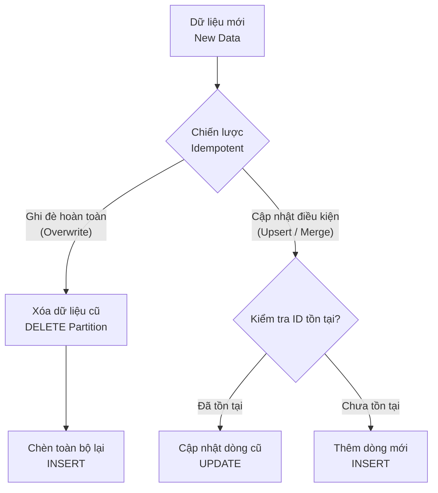

# Tính lũy đẳng - Idempotency

## Summary

Tính lũy đẳng (Idempotency) là thuộc tính đảm bảo rằng một tác vụ (task) hay luồng dữ liệu (pipeline) khi chạy lại nhiều lần với cùng một tập dữ liệu đầu vào (input) thì luôn tạo ra cùng một kết quả duy nhất ở đầu ra (output), không sinh ra dữ liệu rác, không làm nhân đôi dữ liệu. Đây là tiêu chuẩn vàng trong việc xây dựng các hệ thống Data Engineering mạnh mẽ và chịu lỗi tốt (fault-tolerant).

---

## Definition

Trong khoa học máy tính và Data Engineering, **Idempotency** chỉ một hành động mà nếu được áp dụng nhiều lần cũng không làm thay đổi kết quả sau lần thực thi thành công đầu tiên. 

Công thức: `f(f(x)) = f(x)`

Trong bối cảnh hệ thống phân tán và Data Pipeline (ETL/ELT), hệ thống có tính idempotent cho phép kỹ sư dữ liệu tự do chạy lại (rerun/backfill) các job bị lỗi (failed) hoặc quá hạn mà không cần lo lắng về việc dữ liệu bị hỏng (corruption) hay xuất hiện các bản ghi trùng lặp (duplicates).

---

## Why it exists

Trong thực tế, các Data Pipeline thường xuyên gặp sự cố do nhiều nguyên nhân: hệ thống nguồn (source system) không phản hồi, mạng chập chờn, hoặc máy chủ phân tích (compute cluster) bị sập giữa chừng.
Khi điều đó xảy ra, câu hỏi đặt ra là: *"Điều gì sẽ xảy ra nếu ta chạy lại job này?"*

Nếu pipeline không có tính lũy đẳng:
* Lần chạy thứ nhất ghi được 50% dữ liệu rồi sập.
* Lần chạy thứ hai ghi lại từ đầu, dẫn đến 50% dữ liệu đầu tiên bị ghi hai lần (duplicate data).
* Gây ra lỗi sai số trong báo cáo (revenue bị nhân đôi) và làm hỏng lòng tin (trust) vào hệ thống dữ liệu.

Idempotency ra đời nhằm giải phóng Data Engineer khỏi quá trình dọn dẹp thủ công (manual cleanup). Nếu một pipeline gặp lỗi, cách khắc phục duy nhất và an toàn nhất là: **Chỉ cần chạy lại (Rerun)**.

---

## How it works

Để đạt được Idempotency, các Data Engineers thường áp dụng hai cơ chế phổ biến nhất:



1. **Ghi đè hoàn toàn (Overwrite / Replace)**
   Thay vì lệnh `INSERT` dữ liệu (append), pipeline sẽ xóa (DROP/DELETE) phân vùng (partition) của khoảng thời gian đó và ghi đè bằng toàn bộ dữ liệu mới tính toán. 

2. **Cập nhật có điều kiện (Upsert / Merge)**
   Kiểm tra sự tồn tại của khóa chính (Primary Key). Nếu bản ghi đã tồn tại, thực hiện cập nhật (`UPDATE`). Nếu chưa tồn tại, thực hiện thêm mới (`INSERT`). Quá trình này thường được gọi là UPSERT hoặc MERGE.

---

## Practical example

Xét ví dụ pipeline trích xuất dữ liệu giao dịch hàng ngày (daily sales) vào lúc nửa đêm, tương ứng với ngày phân vùng `2026-06-07`.

**1. Cách làm không có tính lũy đẳng (Non-idempotent):**
```sql
-- Chạy lúc nửa đêm ngày 07/06/2026
INSERT INTO sales_warehouse
SELECT * FROM source_sales WHERE date = '2026-06-07';
```
Nếu script này sập giữa chừng rồi chạy lại, lệnh `INSERT` sẽ append thêm dữ liệu cũ, sinh ra duplicate.

**2. Cách làm có tính lũy đẳng (Idempotent) bằng Overwrite (Delete-Write):**
```sql
-- Xóa sạch dữ liệu của phân vùng hiện tại trước
DELETE FROM sales_warehouse WHERE date = '2026-06-07';

-- Nạp lại dữ liệu
INSERT INTO sales_warehouse
SELECT * FROM source_sales WHERE date = '2026-06-07';
```

**3. Cách làm có tính lũy đẳng bằng MERGE (Upsert):**
```sql
MERGE INTO sales_warehouse AS target
USING (SELECT * FROM source_sales WHERE date = '2026-06-07') AS source
ON target.order_id = source.order_id
WHEN MATCHED THEN
  UPDATE SET target.amount = source.amount, target.status = source.status
WHEN NOT MATCHED THEN
  INSERT (order_id, date, amount, status) VALUES (source.order_id, source.date, source.amount, source.status);
```

---

## Best practices

* **Partitioning**: Luôn phân vùng (partition) dữ liệu theo thời gian (ví dụ: ngày tạo `created_at` hoặc ngày xử lý `execution_date`). Bằng cách này, việc Overwrite chỉ tác động đến một phân vùng nhỏ cụ thể, đảm bảo hiệu năng.
* **Atomic Transactions**: Đảm bảo quá trình thay thế hoặc xóa dữ liệu diễn ra như một giao dịch nguyên tử (Atomic). Ví dụ, trong Apache Spark kết hợp với Delta Lake hoặc Apache Iceberg, cơ chế Overwrite Partition là nguyên tử.
* **Tách biệt Logic và State**: Tránh duy trì state (trạng thái nội bộ) giữa các lần chạy. Pipeline nên phụ thuộc hoàn toàn vào tham số đầu vào (như `ds` trong Apache Airflow).

---

## Common mistakes

* **Sử dụng `INSERT` mù quáng**: Dùng `INSERT` mà không kiểm tra trùng lặp sẽ nhanh chóng làm hỏng hệ thống khi có backfill.
* **Xóa sai phạm vi (Incorrect scope of Delete)**: Viết lệnh DELETE nhưng lại sử dụng tham số thời gian động như `CURRENT_DATE()`. Nếu job chạy chậm sang ngày hôm sau, nó sẽ xóa phân vùng của ngày hôm sau thay vì ngày bị lỗi. Luôn phải dùng tham số cố định (deterministic variables) do Orchestrator truyền vào.
* **Bỏ qua Idempotency ở hệ thống nguồn**: Gọi các API không idempotent nhiều lần có thể gây ra việc gọi tạo tài nguyên nhiều lần thay vì chỉ lấy dữ liệu (đối với phương thức `POST`).

---

## Trade-offs

### Ưu điểm
* **Dễ dàng khôi phục lỗi (Fault Tolerance)**: Khắc phục sự cố đơn giản bằng nút bấm "Rerun".
* **Phục vụ Backfill dễ dàng**: Cho phép chạy lại dữ liệu lịch sử trong nhiều năm bằng cách trigger lại job cũ.
* **Bảo vệ tính toàn vẹn của dữ liệu (Data Integrity)**: Đảm bảo chỉ số phân tích chính xác, không trùng lặp.

### Nhược điểm
* **Hiệu năng (Performance Overhead)**: Các thao tác `MERGE`, `UPSERT` hay `DELETE` tốn tài nguyên hệ thống cơ sở dữ liệu hơn nhiều so với việc chỉ `APPEND` (chèn tiếp).
* **Phức tạp khi code**: Đòi hỏi Data Engineer phải cấu trúc truy vấn tinh vi hơn, quản lý Primary Keys và Partitions chặt chẽ.

---

## When to use

* Bắt buộc phải áp dụng (Must-have) trong mọi hệ thống Data Pipeline hiện đại chạy định kỳ (Batch processing).
* Trong quá trình xây dựng các công cụ Orchestration (Apache Airflow, Dagster).

## When not to use

* Với hệ thống xử lý dòng chảy (Streaming), đôi khi việc đạt được Exactly-Once processing (một hình thức cao hơn của idempotency) rất tốn kém và gây độ trễ lớn, thay vì vậy có thể chọn At-Least-Once nếu dữ liệu trùng lặp có thể xử lý sau (downstream deduplication).

---

## Related concepts

* [Deduplication](/concepts/deduplication)
* [Data Pipeline](/concepts/data-pipeline)
* [Batch Processing](/concepts/batch-processing)

---

## Interview questions

### 1. Hãy mô tả tính lũy đẳng (Idempotency) là gì và tại sao nó lại quan trọng đối với ETL?
* **Người phỏng vấn muốn kiểm tra**: Hiểu biết cơ bản về tính ổn định và thiết kế hệ thống ETL.
* **Gợi ý trả lời**: Định nghĩa bằng công thức `f(f(x)) = f(x)`. Trình bày việc khi ETL thất bại, khả năng chạy lại mà không làm xáo trộn dữ liệu hiện tại, không gây duplicate dữ liệu, giảm thiểu sự can thiệp thủ công từ kỹ sư dữ liệu.

### 2. Làm thế nào để triển khai Idempotency khi viết dữ liệu từ Spark vào S3/Data Lake?
* **Gợi ý trả lời**: 
  * Sử dụng cơ chế ghi đè phân vùng (Partition Overwrite) `spark.write.mode("overwrite").partitionBy("date").save(path)`.
  * Khuyến nghị dùng các định dạng dữ liệu hỗ trợ ACID transactions như Delta Lake, Apache Iceberg hay Apache Hudi, chúng hỗ trợ lệnh `MERGE` và cơ chế thay thế phân vùng nguyên tử một cách tự nhiên.

---

## References

* **Data Engineering with Python** - Paul Crickard.
* **Fundamentals of Data Engineering** - Joe Reis, Matt Housley.

---

## English summary

Idempotency is an essential property of data pipelines ensuring that running a specific operation or job multiple times with the same input yields the exact same state without producing duplicate data or unintended side effects. It provides fault tolerance by enabling engineers to safely rerun failed or delayed batch jobs. Implementation typically relies on atomic partition overwrites (Delete-Write) or logical UPSERTs/MERGE operations.
