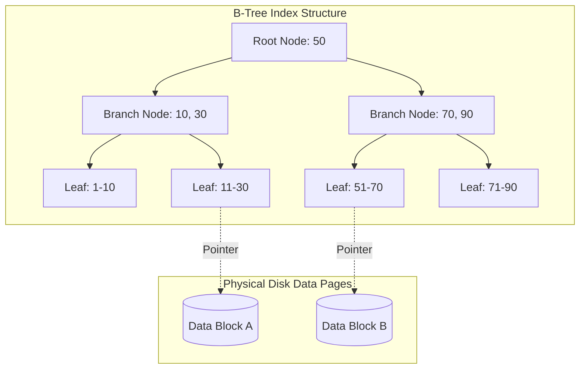

# Chỉ mục Cơ sở dữ liệu - Indexing

## Summary

Chỉ mục (Index) là một cấu trúc dữ liệu đặc biệt được cơ sở dữ liệu tạo ra để tăng tốc độ tìm kiếm và truy xuất thông tin, tương tự như phần "Mục lục" ở cuối một cuốn sách. Nếu không có Index, Database phải quét từng dòng từ trên xuống dưới (Full Table Scan) để tìm dữ liệu. Bằng cách sử dụng Index (thường dựa trên cấu trúc B-Tree), thời gian tìm kiếm một bản ghi trong hàng triệu dòng được giảm từ vài giây xuống chỉ còn vài mili-giây.

---

## Definition

**Database Index** là một bản sao phụ của một (hoặc nhiều) cột trong bảng, được lưu trữ ở một định dạng có thứ tự, kèm theo các con trỏ (pointers) trỏ về vị trí lưu trữ vật lý của dòng dữ liệu gốc trên ổ đĩa. 

Mục đích duy nhất của Index là cải thiện tốc độ Đọc (Read / SELECT). Đổi lại, nó tiêu tốn thêm dung lượng lưu trữ (Storage) và làm chậm các thao tác Ghi (Write / INSERT, UPDATE, DELETE).

---

## Why it exists

Thử tưởng tượng bạn cần tìm từ "Database" trong một cuốn sách bách khoa 1000 trang.
* **Không có mục lục (No Index)**: Bạn lật từng trang từ trang 1 đến trang 1000 để đọc (Full Scan). Tốn cực kỳ nhiều thời gian.
* **Có mục lục (Index)**: Bạn mở phần Mục lục (được sắp xếp theo bảng chữ cái A-Z), lướt qua chữ D, tìm chữ "Database", thấy nó ghi "Trang 450". Bạn lật thẳng đến trang 450. Tốn vài giây.

Trong cơ sở dữ liệu có hàng trăm triệu bản ghi, việc quét toàn bộ ổ đĩa là bất khả thi về mặt hiệu năng. Index sinh ra để giải quyết "nút thắt cổ chai" I/O của ổ đĩa.

---

## Core idea

Các loại cấu trúc dữ liệu Index phổ biến:
1. **B-Tree (Balanced Tree)**: Cấu trúc phổ biến nhất, được dùng làm mặc định trong MySQL, Postgres. B-Tree luôn giữ cho cây được cân bằng, giúp việc tìm kiếm `(id = 5)`, tìm khoảng `(id BETWEEN 1 AND 10)`, hoặc tìm tiền tố `(name LIKE 'Nguyen%')` hoạt động cực kỳ nhanh với độ phức tạp `O(log N)`.
2. **Hash Index**: Dùng bảng băm (Hash table). Cực kỳ nhanh cho truy vấn tìm chính xác bằng (Equality `id = 5`) với độ phức tạp `O(1)`. Nhưng **không thể** dùng để tìm khoảng (Range query như `id > 5`).
3. **Bitmap Index**: Dùng cho các cột có số lượng giá trị phân biệt thấp (Low cardinality) như cột Giới tính (Nam/Nữ). Rất phổ biến trong Data Warehouse.

---

## How it works

Hãy xem cách **B-Tree Index** hoạt động khi bạn chạy: 
`SELECT * FROM users WHERE user_id = 45;` (Giả sử `user_id` đã được đánh Index).

1. Thay vì vào bảng `users`, CSDL vào cây Index của `user_id`.
2. Gốc của cây (Root Node) có thể chứa [10, 50, 100]. Nó biết 45 nằm giữa 10 và 50.
3. Nó đi xuống nhánh [10-50] (Leaf Node).
4. Tìm thấy giá trị `45` ở Leaf Node. Đi kèm với giá trị 45 là một con trỏ địa chỉ đĩa cứng (Ví dụ: `Block 5, Offset 10`).
5. CSDL nhảy thẳng đến `Block 5` trên đĩa cứng, bốc toàn bộ dòng dữ liệu (tên, tuổi, email...) lên và trả về cho bạn.
Quá trình này chỉ tốn khoảng 3-4 lần đọc đĩa (I/O).

---

## Architecture / Flow



---

## Practical example

Ví dụ tạo Index trên PostgreSQL:

```sql
-- Tạo một bảng User
CREATE TABLE users (
    id SERIAL PRIMARY KEY, -- Mặc định tạo B-Tree Index trên khóa chính
    email VARCHAR(255) UNIQUE, -- Mặc định tạo B-Tree Index (Unique)
    first_name VARCHAR(50),
    last_name VARCHAR(50),
    created_at TIMESTAMP
);

-- Tình huống: Thường xuyên tìm user theo Họ và Tên
-- Tạo Composite Index (Index phức hợp trên nhiều cột)
CREATE INDEX idx_users_name ON users(last_name, first_name);

-- Câu lệnh này sẽ DÙNG được Index
SELECT * FROM users WHERE last_name = 'Nguyen' AND first_name = 'An';

-- Câu lệnh này KHÔNG DÙNG được Index (Lỗi phổ biến)
SELECT * FROM users WHERE first_name = 'An';
-- Giải thích: Composite Index giống như danh bạ điện thoại sắp xếp theo Họ, rồi mới đến Tên. 
-- Nếu bạn không biết Họ, bạn không thể tìm nhanh theo Tên.
```

---

## Best practices

* **Index các khóa ngoại (Foreign Keys)**: Luôn tạo index trên các cột được dùng trong mệnh đề `JOIN` để tối ưu phép nối bảng.
* **Index các cột dùng để tìm kiếm, sắp xếp**: Các cột hay xuất hiện trong mệnh đề `WHERE`, `ORDER BY`, `GROUP BY`.
* **Hiểu về Composite Index (Chỉ mục phức hợp)**: Thứ tự các cột trong Composite Index cực kỳ quan trọng (Quy tắc *Left-most prefix*). Hãy đặt các cột có độ phân tán cao (High Selectivity) lên trước.
* **Covering Index**: Nếu câu query của bạn chỉ `SELECT email FROM users WHERE id = 1`, và bạn đã có index trên `(id, email)`, CSDL sẽ lấy luôn email từ cây Index mà không cần nhảy vào đĩa cứng tìm Data Page nữa (Index-only scan), tốc độ siêu việt.

---

## Common mistakes

* **Over-indexing (Đánh Index bừa bãi)**: Tạo index cho MỌI cột trong bảng. Kết quả: Tốc độ đọc rất nhanh, nhưng tốc độ `INSERT/UPDATE` sụp đổ. Mỗi lần thêm 1 dòng mới, CSDL phải cập nhật lại 10 cái cây B-Tree khác nhau.
* **Index các cột Low Cardinality trên B-Tree**: Tạo B-Tree index cho cột `Gender` (chỉ có M/F). Index này vô dụng vì dữ liệu chỉ chia làm 2 nửa, CSDL thà quét toàn bảng (Full scan) còn nhanh hơn là phải dò qua cây Index rồi lại nhảy vào đĩa cứng hàng triệu lần.
* **Sử dụng hàm trên cột có Index**: Câu lệnh `WHERE YEAR(created_at) = 2026` sẽ làm **vô hiệu hóa Index** trên cột `created_at` (Sự cố Function-wrapped column). Thay vào đó hãy viết `WHERE created_at >= '2026-01-01' AND created_at < '2027-01-01'`.

---

## Trade-offs

### Ưu điểm
* Giảm thiểu hàng trăm ngàn lần số lượng thao tác I/O ổ đĩa cho câu lệnh `SELECT`.
* Giúp thực hiện Sorting (`ORDER BY`) và Grouping nhanh chóng mà không cần tốn RAM trên máy chủ.

### Nhược điểm
* **Làm chậm thao tác Ghi (Write Penalty)**: Mọi thao tác Insert, Update (lên cột có index), Delete đều yêu cầu cấu trúc lại cây B-Tree.
* **Tốn không gian lưu trữ**: Index là một bản sao dữ liệu. Có những trường hợp dung lượng file Index còn lớn hơn cả file dữ liệu gốc.

---

## When to use

* Sử dụng trên các bảng OLTP có kích thước lớn.
* Bắt buộc phải có đối với Khóa chính (Primary Key) và Khóa ngoại (Foreign Key).

## When not to use

* Trên các bảng quá nhỏ (dưới vài ngàn dòng). Việc đọc toàn bảng lên RAM còn nhanh hơn là duyệt qua cây Index.
* Trên các bảng có tần suất Ghi (Insert/Update) lớn hơn Đọc (Ví dụ: bảng lưu log người dùng, chỉ ghi vào và hiếm khi xem lại).

---

## Related concepts

* [Relational Database](/concepts/relational-database)
* [OLTP](/concepts/oltp)

---

## Interview questions

### 1. Tại sao CSDL quan hệ lại chọn B-Tree để làm Index mặc định thay vì Hash Table?
* **Gợi ý trả lời**: Hash Table có thời gian tìm kiếm `O(1)` rất nhanh, nhưng nó **chỉ** hỗ trợ truy vấn tìm chính xác (`WHERE id = 5`). Nó vô dụng với các truy vấn tìm kiếm theo khoảng (Range queries) như `WHERE age BETWEEN 20 AND 30` hoặc `ORDER BY age`. B-Tree lưu trữ các khóa (keys) theo thứ tự tăng dần tại các Leaf Nodes (được nối với nhau bằng danh sách liên kết), cho phép duyệt tuần tự rất nhanh qua một dải giá trị, đáp ứng hoàn hảo các yêu cầu tìm khoảng, sắp xếp và gom nhóm của SQL.

### 2. Sự cố "vô hiệu hóa Index" (Index invalidation) thường xảy ra khi nào trong câu lệnh SQL?
* **Gợi ý trả lời**: Xảy ra khi lập trình viên áp dụng các hàm (functions) hoặc phép tính trực tiếp lên cột đã được đánh Index ở phía bên trái mệnh đề `WHERE`. Ví dụ: `WHERE LOWER(email) = 'test@gmail.com'` hoặc `WHERE price * 10 > 1000` hoặc tìm kiếm LIKE có ký tự đại diện ở đầu `WHERE name LIKE '%Nguyen'`. Trong các trường hợp này, CSDL không thể dùng B-Tree mà buộc phải quét toàn bảng, áp dụng hàm lên từng dòng rồi mới so sánh.

---

## References

1. **Use The Index, Luke!** - Markus Winand (Hướng dẫn kinh điển về Indexing cho Developer).
2. **Database Internals** - Alex Petrov.

---

## English summary

Database Indexing is a data structure technique (most commonly B-Trees) used to quickly locate and access the data in a database, avoiding costly full table scans. While indexes drastically improve read (SELECT) performance and enable efficient sorting and range queries, they come with a trade-off: they consume additional disk space and incur a write penalty, as the index tree must be updated during INSERT, UPDATE, and DELETE operations. Best practices include indexing foreign keys, utilizing composite indexes carefully respecting the left-most prefix rule, and avoiding function-wrapped columns in WHERE clauses which silently invalidate the index.
