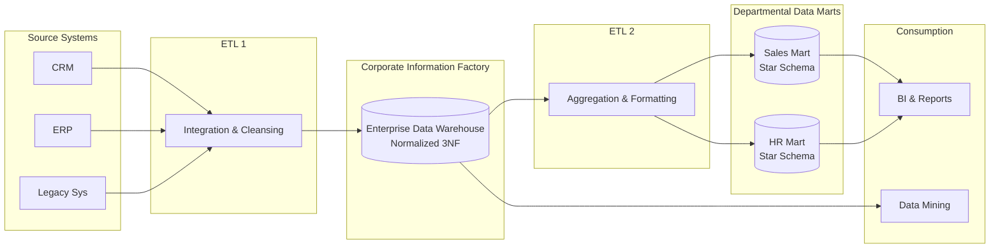

# Phương pháp luận Inmon - Inmon Methodology

## Summary

Inmon Methodology (Phương pháp luận Inmon), được khởi xướng bởi Bill Inmon - người được mệnh danh là "Cha đẻ của Data Warehouse", là một triết lý thiết kế và xây dựng Kho dữ liệu doanh nghiệp (Enterprise Data Warehouse - EDW). Trái ngược với Kimball, Inmon theo đuổi cách tiếp cận "từ trên xuống" (Top-down) và định hướng dữ liệu (Data-driven). Trọng tâm của phương pháp này là tạo ra một kho lưu trữ tập trung, lưu giữ toàn bộ dữ liệu lịch sử của tổ chức ở trạng thái chi tiết nhất, được chuẩn hóa chặt chẽ (mức 3NF) nhằm đảm bảo một "nguồn chân lý duy nhất" (Single Source of Truth) toàn vẹn, trước khi cung cấp cho các mục đích phân tích.

---

## Definition

Theo định nghĩa gốc của **Bill Inmon**, Data Warehouse là: *"Một tập hợp dữ liệu hướng chủ đề (subject-oriented), được tích hợp (integrated), thay đổi theo thời gian (time-variant) và không biến động (non-volatile) để hỗ trợ quá trình ra quyết định của ban quản lý."*

**Phương pháp luận Inmon** (còn được gọi là Corporate Information Factory - CIF) thiết kế Data Warehouse thành một kho dữ liệu quan hệ (Relational Database) tuân thủ nghiêm ngặt các quy tắc chuẩn hóa (thường là Third Normal Form - 3NF) nhằm loại bỏ sự trùng lặp. Từ kho dữ liệu trung tâm khổng lồ này, dữ liệu sau đó mới được trích xuất, tổng hợp và phi chuẩn hóa để tạo thành các Data Marts (dạng Star Schema) phục vụ cho từng phòng ban.

---

## Why it exists

Ở quy mô tập đoàn đa quốc gia với hàng chục, hàng trăm hệ thống OLTP riêng biệt chứa dữ liệu phức tạp, việc để các phòng ban tự định nghĩa các Data Mart (theo hướng Bottom-up) tiềm ẩn rủi ro mâu thuẫn dữ liệu nghiêm trọng về mặt dài hạn. 

Triết lý Inmon ra đời nhằm giải quyết vấn đề quản trị dữ liệu quy mô lớn (Data Governance) và khả năng mở rộng bằng cách:
1. Đảm bảo mọi thay đổi về cấu trúc kinh doanh chỉ cần cập nhật ở một điểm duy nhất (Core DWH) do tính không trùng lặp của chuẩn 3NF.
2. Giữ lại dữ liệu ở mức độ chi tiết nguyên tử (atomic level) nhất để phục vụ cho các nghiệp vụ kiểm toán, đối soát (reconciliation) và đào sâu dữ liệu (data mining) mà Star Schema đôi khi bị mất mát thông tin.

---

## Core idea

Inmon xây dựng kiến trúc Data Warehouse dựa trên nguyên lý **Top-down (Từ trên xuống)** và **Chuẩn hóa (Normalization)**:
1. **Enterprise Data Warehouse (EDW) là trung tâm vũ trụ**: Tất cả dữ liệu thô từ hệ thống nguồn phải được đưa vào, làm sạch, và tổ chức theo mô hình thực thể (ER Model) chuẩn hóa 3NF ở cấp độ toàn công ty. EDW này phục vụ toàn bộ doanh nghiệp chứ không phục vụ một quy trình kinh doanh cụ thể nào.
2. **Data Marts phụ thuộc (Dependent Data Marts)**: Người dùng kinh doanh không truy vấn trực tiếp vào EDW (vì schema 3NF quá phức tạp). Thay vào đó, bộ phận IT sẽ thiết lập các quy trình trích xuất dữ liệu từ EDW, tạo ra các Data Mart chuyên biệt cho từng phòng ban.
3. **Single Source of Truth**: Vì các Data Mart lấy dữ liệu từ một EDW đã được chuẩn hóa duy nhất, tính nhất quán của dữ liệu trên toàn tổ chức được đảm bảo tuyệt đối.

---

## How it works

Quy trình xây dựng Data Warehouse theo Inmon (Corporate Information Factory):
1. **Thu thập và Tích hợp**: Dữ liệu từ CRM, ERP, Hệ thống lõi được Extract và đưa vào vùng Staging.
2. **Biến đổi vào Core EDW**: Dữ liệu được làm sạch, đồng bộ hóa định dạng, và Nạp (Load) vào lõi EDW theo mô hình chuẩn hóa 3NF. Tại đây dữ liệu mang tính "subject-oriented" (Ví dụ: thông tin về Khách Hàng quy tụ về một nơi, thay vì rải rác theo ứng dụng).
3. **Tạo Data Marts**: Từ lõi EDW, dữ liệu được tổng hợp, biến đổi thành dạng mô hình chiều (Dimensional / Star Schema) và đẩy ra các Data Marts để phòng ban sử dụng.

---

## Architecture / Flow

Kiến trúc Corporate Information Factory (Inmon):



*Lưu ý: Data Mining/Data Science có quyền truy cập thẳng vào Core EDW (3NF) để lấy dữ liệu nguyên bản chi tiết.*

---

## Practical example

Mô hình hóa dữ liệu Khách hàng theo tư duy Inmon (3NF):

Thay vì lưu toàn bộ thông tin trong một bảng `dim_customer` rộng (phi chuẩn hóa) như Kimball, Inmon sẽ bẻ nhỏ các thực thể:

**1. Bảng Khách Hàng cốt lõi:**
```sql
CREATE TABLE edw_customer (
    customer_id INT PRIMARY KEY,
    first_name VARCHAR(50),
    last_name VARCHAR(50),
    gender CHAR(1),
    date_of_birth DATE
);
```

**2. Bảng Địa chỉ (tách biệt để chuẩn hóa):**
```sql
CREATE TABLE edw_address (
    address_id INT PRIMARY KEY,
    street VARCHAR(255),
    city VARCHAR(100),
    state VARCHAR(50),
    zip_code VARCHAR(20)
);
```

**3. Bảng Ánh xạ (Mapping) - Xử lý quan hệ N-N (nếu 1 người có nhiều địa chỉ):**
```sql
CREATE TABLE edw_customer_address (
    customer_id INT,
    address_id INT,
    address_type VARCHAR(20), -- 'Home', 'Office'
    is_current BOOLEAN,
    FOREIGN KEY (customer_id) REFERENCES edw_customer(customer_id),
    FOREIGN KEY (address_id) REFERENCES edw_address(address_id)
);
```

Từ 3 bảng 3NF trung tâm này, quá trình *ETL 2* mới tổng hợp chúng thành bảng `dim_customer` (Star Schema) lưu tại Data Mart để phòng ban truy vấn báo cáo.

---

## Best practices

* **Đầu tư mạnh vào Data Modeling**: Giai đoạn thiết kế mô hình 3NF cho toàn bộ doanh nghiệp (Enterprise Data Model) là then chốt. Cần sự tham gia của kiến trúc sư dữ liệu dày dặn kinh nghiệm để vạch ra toàn cảnh dữ liệu tổ chức trước khi viết dòng code ETL đầu tiên.
* **Tự động hóa luồng cấp liệu từ EDW sang Data Mart**: Đảm bảo rằng việc dữ liệu chảy từ kho 3NF xuống các Data Mart phải mượt mà và tự động, tránh hiện tượng thắt cổ chai phục vụ báo cáo.
* **Mở quyền truy cập lõi cho Advanced Analytics**: Tận dụng triệt để kho 3NF bằng cách cấp quyền đọc trực tiếp cho Data Scientists. Dữ liệu chi tiết chưa tổng hợp là mỏ vàng cho các thuật toán Machine Learning dự đoán.

---

## Common mistakes

* **Quá tham vọng ("Boiling the Ocean")**: Cố gắng mô hình hóa toàn bộ 100% dữ liệu của công ty thành 3NF một cách hoàn hảo ngay từ ban đầu. Điều này dẫn đến dự án kéo dài nhiều năm mà không cung cấp được bất kỳ giá trị kinh doanh nào.
* **Bắt người dùng Business truy vấn trực tiếp vào EDW**: Mô hình 3NF cần quá nhiều JOIN để lấy dữ liệu. Việc cho người dùng kinh doanh (những người quen dùng SQL cơ bản) chọc thẳng vào lõi 3NF sẽ làm sập hệ thống và sinh ra các câu query sai lệch logic. Hãy điều hướng họ tới Data Marts.

---

## Trade-offs

### Ưu điểm
* **Nguồn chân lý duy nhất vững chắc**: Tính toàn vẹn dữ liệu cực cao. Không có hiện tượng dư thừa, trùng lặp (redundancy). Việc cập nhật logic (như thêm thuộc tính khách hàng) chỉ cần làm ở một nơi.
* **Linh hoạt và Dễ bảo trì dài hạn**: Thêm một thực thể mới hoặc quy trình kinh doanh mới vào kiến trúc 3NF ít gây gián đoạn cho cấu trúc tổng thể so với Star Schema.
* **Phục vụ tốt Data Mining**: Dữ liệu được lưu ở dạng hạt chi tiết nhất (lowest granularity).

### Nhược điểm
* **Triển khai chậm chạp (Time to value cao)**: Cách tiếp cận Top-down đòi hỏi phải phân tích, thiết kế toàn cảnh trước, do đó doanh nghiệp phải chờ rất lâu (có thể hàng năm) để xem được báo cáo đầu tiên.
* **Yêu cầu kỹ năng chuyên môn rất cao**: Cần đội ngũ kiến trúc sư và Data Modeler xuất sắc.
* **Chi phí ETL tăng gấp đôi**: Phải xây dựng 2 quy trình ETL: Nguồn $\rightarrow$ EDW (3NF) và EDW $\rightarrow$ Data Marts (Dimensional).

---

## When to use

* Các tổ chức lớn, có cấu trúc phức tạp (Ngân hàng, Viễn thông, Bảo hiểm) coi tính toàn vẹn, khả năng kiểm toán (audibility) và tích hợp dữ liệu quan trọng hơn thời gian triển khai.
* Doanh nghiệp có đội ngũ Data IT cực kỳ chuyên nghiệp và ngân sách dài hạn ổn định.
* Khi tổ chức có nhu cầu rất lớn về Data Science / Machine Learning song song với Business Intelligence.

## When not to use

* Startups hoặc công ty cỡ trung cần xây dựng hệ thống báo cáo (Dashboard) nhanh chóng để hỗ trợ ra quyết định lập tức (Kimball phù hợp hơn).
* Đội ngũ dữ liệu mỏng, thiếu chuyên gia Data Modeling ở mức độ doanh nghiệp.

---

## Related concepts

* [Kimball Methodology](/concepts/kimball-methodology)
* [Data Warehouse](/concepts/data-warehouse)
* Third Normal Form (3NF)
* [Corporate Information Factory (CIF)](#)

---

## Interview questions

### 1. Tại sao Inmon lại chọn 3NF làm cơ sở thiết kế cho trung tâm Data Warehouse thay vì Star Schema?
* **Gợi ý trả lời**: Bill Inmon ưu tiên tính toàn vẹn của dữ liệu và khả năng quản lý quy mô lớn. Star Schema lưu trữ dữ liệu bị dư thừa (redundancy) để tối ưu cho việc đọc (Ví dụ: tên danh mục lặp lại hàng triệu lần). Ở cấp độ lưu trữ trung tâm của cả một tập đoàn lớn, nếu các thay đổi logic xảy ra, cập nhật dữ liệu trên mô hình dư thừa rất rủi ro và dễ sinh ra bất đồng nhất (data anomalies). 3NF đảm bảo mỗi điểm thông tin chỉ được lưu đúng một lần, tạo ra một Core DWH chuẩn xác, dễ bảo trì, và cung cấp một "Single Source of Truth" không thể tranh cãi.

### 2. Sự khác biệt về vai trò của Data Mart giữa Inmon và Kimball là gì?
* **Gợi ý trả lời**:
  * Theo **Kimball**: Data Mart là "viên gạch nền móng" đầu tiên. EDW thực chất là sự nối lại của nhiều Data Marts (thông qua Conformed Dimensions). Các Data Mart lấy dữ liệu trực tiếp từ nguồn thông qua Staging.
  * Theo **Inmon**: Data Mart là sản phẩm thứ cấp. Phải có EDW (3NF) trước. Các Data Mart được trích xuất và tổng hợp dữ liệu lấy từ lõi EDW này, chứ không lấy từ nguồn thô. (Dependent Data Marts).

### 3. Trong kiến trúc Inmon, nếu một phòng ban mới cần một Data Mart mới, luồng công việc sẽ diễn ra như thế nào?
* **Gợi ý trả lời**: Luồng công việc sẽ đi theo hướng: 1. Kiểm tra xem các dữ liệu cần thiết đã có trong kho trung tâm EDW (3NF) chưa. 2. Nếu chưa có, kỹ sư sẽ phải thực hiện ETL luồng dữ liệu mới từ Source System vào vùng EDW (và chuẩn hóa 3NF). 3. Sau khi dữ liệu đã yên vị tại EDW, thực hiện viết các tác vụ ETL thứ hai để trích xuất, biến đổi và nạp dữ liệu từ EDW 3NF ra thành các bảng Star Schema chuyên biệt cho phòng ban đó.

---

## References

1. **Building the Data Warehouse** - W.H. Inmon. (Sách nền tảng đặt nền móng cho thuật ngữ Data Warehouse).
2. **Corporate Information Factory** - W.H. Inmon, Claudia Imhoff, Ryan Sousa.
3. **Data Warehouse Architecture: Inmon vs. Kimball** - Các bài báo nghiên cứu chuyên ngành.

---

## English summary

The Inmon Methodology, established by Bill Inmon (the "Father of Data Warehousing"), dictates a top-down, data-driven approach to constructing an Enterprise Data Warehouse (EDW). Central to this philosophy is the Corporate Information Factory (CIF), where all enterprise data is integrated into a highly normalized (typically 3NF) centralized repository to establish an infallible "Single Source of Truth." Instead of querying this complex 3NF core directly, business users consume data through secondary, dependent Data Marts (often modeled as Star Schemas) extracted and aggregated from the EDW. While Inmon’s approach guarantees unparalleled data integrity, lack of redundancy, and robust scalability for huge enterprises, it suffers from a significantly slower time-to-value and requires rigorous up-front data modeling compared to the Kimball method.
