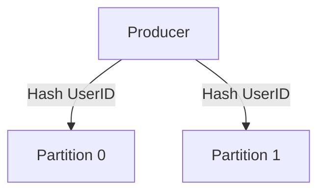

# Kafka Topics và Partitions

## Summary

Trong hệ thống Apache Kafka, **Topic** là danh mục logic dùng để phân loại dữ liệu, còn **Partition** (phân vùng) là cơ sở vật lý dùng để chia nhỏ Topic đó ra rải đều trên nhiều máy chủ (Brokers). Khái niệm Partition là chìa khóa vàng giúp Kafka có thể mở rộng giới hạn lưu trữ vượt quá khả năng của một máy tính đơn lẻ và cung cấp năng lực đọc/ghi song song (Parallelism) cho hàng nghìn Clients cùng một lúc.

---

## Definition

* **Topic (Chủ đề)**: Tương tự như một "Bảng" (Table) trong Database hoặc một "Thư mục" (Folder) trong hệ điều hành. Producer đẩy dữ liệu vào một Topic có tên cụ thể (vd: `website_clicks`), và Consumer đăng ký kênh đó để lấy thông tin ra.
* **Partition (Phân vùng)**: Thay vì lưu trọn bộ Topic `website_clicks` trong 1 máy chủ, Kafka chặt Topic đó thành nhiều đoạn (ví dụ 3 đoạn: Partition 0, Partition 1, Partition 2). Mỗi máy chủ Broker sẽ giữ 1 Partition. Mỗi Partition là một File Log dạng **Append-only** (Chỉ ghi nối tiếp), không thể xóa giữa chừng.

Bên trong Partition, mỗi tin nhắn (Message) khi chèn vào sẽ được đánh một số thứ tự duy nhất gọi là **Offset** (chỉ số trang), tăng dần từ 0 đến vô hạn.

---

## Why it exists

**Vấn đề:** Nếu một Topic khổng lồ như Log tìm kiếm Google nhận 1 triệu tin nhắn mỗi giây, và ta nhét toàn bộ Topic đó vào 1 máy chủ, máy chủ đó sẽ bị nổ băng thông mạng và sập ổ cứng ngay lập tức. Cả cụm Kafka chỉ có tốc độ bằng đúng sức mạnh máy tính yếu nhất đó.

**Giải pháp với Partition:** Chia Topic đó làm 100 Partitions nằm trên 100 máy chủ khác nhau. Lúc này, áp lực ghi đĩa và băng thông được chia đều cho 100 cỗ máy. Đồng thời, ở phía nhận, 100 ứng dụng Consumers có thể đồng thời vào 100 máy lấy dữ liệu ra xử lý song song. Nhờ kiến trúc này, Kafka Scale-Out vô cực.

---

## How it works

Quá trình chia luồng dữ liệu vào các Partition:

1. Khi Producer gửi một message `{"user": "Bob", "action": "login"}`, nó có quyền quyết định tin nhắn đó bay vào Partition nào thông qua **Khóa của bản ghi (Message Key)**.
2. Nếu Message KHÔNG có Key (Key = NULL): Kafka sẽ dùng chiến lược Vòng tròn (Round-robin) để rải đều tin nhắn ra các Partitions. Tin 1 vào P0, tin 2 vào P1, tin 3 vào P2.
3. Nếu Message CÓ Key (Ví dụ Key = `user_id = Bob`): Kafka sẽ đem chuỗi "Bob" băm qua thuật toán Murmur2 Hash để tính toán. Result Hash sẽ luôn quy về đúng 1 Partition duy nhất.
   * => *Kết quả*: Mọi sự kiện liên quan đến user "Bob" sẽ luôn được lưu xếp hàng tuần tự tại Partition 1. Mọi sự kiện của user "Alice" được lưu tại Partition 2.

**Bảo đảm thứ tự (Ordering Guarantee):** Kafka CHỈ bảo đảm thứ tự trước sau của tin nhắn **nằm trong CÙNG một Partition**. Kafka không đảm bảo thứ tự trên bình diện toàn bộ Topic.

---

## Architecture / Flow



---

## Practical example

Để đảm bảo các sự kiện của cùng một người dùng luôn được xử lý tuần tự (vào cùng một Partition), ta cần thiết lập `Message Key` khi gửi tin nhắn từ Producer.

```python
from kafka import KafkaProducer
import json

producer = KafkaProducer(bootstrap_servers='localhost:9092')

# Gửi message với Key để đảm bảo thứ tự trong cùng 1 partition
producer.send(
    topic='page_views',
    key=b'user_Bob', # Khoá quyết định Partition đích
    value=json.dumps({"action": "login"}).encode('utf-8')
)
producer.flush()
```

---

## Best practices

* **Tính toán số lượng Partition chuẩn xác ngay từ đầu**: Số lượng Partition định nghĩa số lượng Consumer tối đa có thể chạy song song (xem bài [Consumer Groups](/concepts/consumer-groups)). Khuyên dùng theo công thức: *Expected Throughput (MB/s) chia cho Tốc độ xử lý của 1 Consumer (MB/s)*. (Thường để 30-50 partitions cho hệ thống lớn).
* **Tuyệt đối hạn chế Tăng Partition khi đang chạy**: Bạn có thể tăng số lượng partition của 1 topic sau khi đã tạo (ví dụ từ 3 lên 5), nhưng KHÔNG BAO GIỜ có thể giảm nó. Hơn nữa, khi tăng số lượng, Hàm Băm (Hash Formula) bị thay đổi. Tin nhắn của User "Bob" đang nằm ở Partition 1 sẽ bị đẩy qua Partition 4 ở lần gửi tiếp theo, làm phá vỡ hoàn toàn cam kết "Giữ đúng thứ tự sự kiện" của User đó.

---

## Common mistakes

* **Quên sử dụng Message Key cho dữ liệu giao dịch**: Ví dụ dữ liệu Giao dịch Ngân hàng `(T1: Tạo đơn, T2: Trừ tiền, T3: Gửi SMS)`. Nếu bạn đẩy không có Key (Round-robin), 3 sự kiện sẽ rớt vào 3 Partitions khác nhau. 3 máy chủ Consumer độc lập sẽ xử lý chúng song song với tốc độ mạng khác nhau. Rất có thể Hệ thống sẽ Gửi SMS hoàn thành trước cả khi Hệ thống Trừ tiền kích hoạt! Lỗi hệ thống nghiêm trọng. Phải luôn set `Key = transaction_id` để 3 tin này luôn chui vào 1 hàng đợi tuần tự.
* **Tạo quá nhiều Topic/Partitions**: Quản lý Partition đi kèm với File descriptors và Zookeeper overhead. Tạo ra 100,000 Partitions trên một cụm nhỏ sẽ làm hệ thống tự động crash.

---

## Trade-offs

### Ưu điểm
* Song song hóa việc đọc ghi cực kỳ tốt, Scale phần cứng tuyến tính.
* Partitions hỗ trợ Cơ chế sao chép (Replication) giữa các Broker. Ví dụ Partition 0 nằm ở máy 1, sẽ tự động copy bóng (Replica) qua máy 2. Nếu máy 1 cháy nổ, máy 2 lên thay thế ngay lập tức giúp hệ thống Zero-downtime.

### Nhược điểm
* Việc không đảm bảo thứ tự Toàn cầu (Global Order) trên toàn Topic đòi hỏi người thiết kế phần mềm phải có kiến thức cực sâu về Hash Routing để tránh Bug logic.

---

## When to use

* Hiểu về cơ chế này là yêu cầu tiên quyết khi phải làm việc tạo Cấu trúc Topic / Kafka Admin.

---

## Related concepts

* [Apache Kafka](/concepts/apache-kafka)
* [Consumer Groups](/concepts/consumer-groups)
* [Data Skew](/concepts/data-skew)

---

## Interview questions

### 1. Tại sao Kafka chỉ đảm bảo tính thứ tự tuần tự trong nội bộ 1 Partition mà không phải toàn Topic?
* **Người phỏng vấn muốn kiểm tra**: Kiến thức thiết kế hệ thống phân tán cơ bản (Trade-off).
* **Gợi ý trả lời**: Nếu Kafka muốn cam kết thứ tự Global Order cho cả 1 triệu message/s trên Topic, toàn bộ dữ liệu bắt buộc phải chảy qua một "phễu/điểm kiểm tra" trung tâm để xếp hàng, tiêu diệt hoàn toàn khái niệm phân tán, tạo ra nút cổ chai (bottleneck) nghiêm trọng. Giới hạn thứ tự trong 1 Partition giúp Kafka đánh đổi một phần logic để mở khóa khả năng mở rộng (Scale) vô hạn bằng phần cứng.

### 2. Nếu Topic của tôi có cấu hình 5 Partitions. Khi Consumer rớt mạng, chuyện gì xảy ra với các Offset?
* **Gợi ý trả lời**: Offset là con số trỏ vị trí tin nhắn mà Consumer đã đọc thành công (ví dụ P0: Offset 14, P1: Offset 20). Kafka sẽ tự lưu giữ những mốc Offset này vào một topic ẩn trong hệ thống (gọi là `__consumer_offsets`). Khi hệ thống Consumer restart lên, nó kết nối vào Kafka, xin lại mốc này và bắt đầu đọc tiếp từ Offset 15 cho P0, Offset 21 cho P1, không bị sót hay tính lặp lại tin nhắn.

---

## References

* **Kafka: The Definitive Guide** - Neha Narkhede (Chương Kafka Internals).
* Confluent: How to choose the number of topics/partitions.

---

## English summary

Kafka Topics act as logical categories for streaming messages, while Partitions are the physical core of Kafka's distributed nature. By subdividing a Topic into multiple Partitions spread across various Brokers, Kafka accomplishes massive horizontal scalability and parallel I/O processing. A critical design characteristic is that Kafka guarantees strict message ordering only within a single Partition—not globally across the Topic. Ensuring messages that require sequential processing (e.g., state changes of a specific transaction) land in the same Partition requires assigning a consistent Message Key before publishing.
