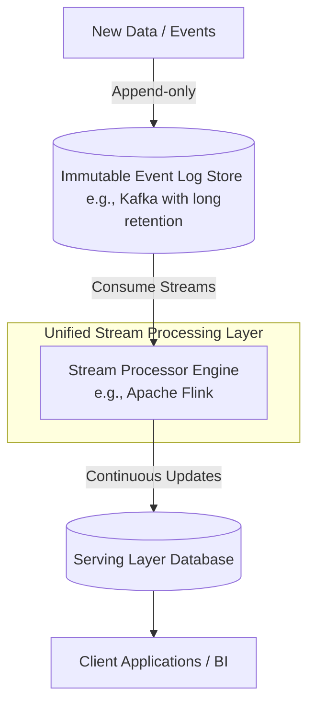
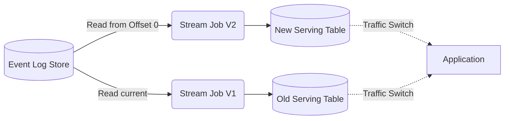

# Kappa Architecture

## Summary

Kiến trúc Kappa (Kappa Architecture) là một mô hình kiến trúc phần mềm tập trung hoàn toàn vào việc xử lý dữ liệu qua luồng (Stream Processing) mà không cần lớp xử lý lô (Batch Layer) riêng biệt. Nó coi tất cả mọi dữ liệu (cả sự kiện đang diễn ra và dữ liệu lịch sử) đều là một chuỗi sự kiện. Điều này giúp giảm thiểu độ phức tạp về bảo trì hệ thống và thống nhất logic xử lý so với kiến trúc Lambda.

---

## Definition

Được đề xuất bởi Jay Kreps (nhà đồng sáng lập của Apache Kafka) như một sự thay thế đơn giản hơn cho kiến trúc Lambda, **Kappa Architecture** loại bỏ hoàn toàn hệ thống xử lý lô (Batch). Nó sử dụng một công cụ xử lý luồng mạnh mẽ (như Apache Flink, Kafka Streams) để xử lý cả dữ liệu thời gian thực và xử lý lại dữ liệu lịch sử.

Trong Kappa, Batch xử lý chỉ là một trường hợp đặc biệt của xử lý luồng (khi điểm bắt đầu (start offset) ở quá khứ và điểm kết thúc nằm ở hiện tại).

---

## Why it exists

Dù kiến trúc Lambda giải quyết tốt bài toán dung hòa giữa độ chính xác và độ trễ, nó lại mang tới một vấn đề lớn: **Nợ kỹ thuật và chi phí vận hành (Operational Complexity)**.
Trong kiến trúc Lambda, kỹ sư thường phải viết, kiểm thử và duy trì cùng một logic kinh doanh hai lần: một lần trong hệ thống Batch (như Hadoop/Spark) và một lần trong hệ thống Stream (như Storm/Spark Streaming). Nếu hai logic này bất đồng bộ, kết quả sẽ bị sai lệch.

Jay Kreps lập luận rằng: với sự tiến bộ của các hệ thống xử lý luồng phân tán chịu lỗi cao, khả năng lưu trữ không giới hạn của log dữ kiện (như Kafka), chúng ta hoàn toàn có thể loại bỏ luồng lô (Batch) mà vẫn đảm bảo độ tin cậy và khả năng tính toán lại lịch sử (re-computation).

---

## Core idea

Ý tưởng cốt lõi của kiến trúc Kappa là:
* **Mọi thứ đều là Stream**: Cả dữ liệu vừa xảy ra mili-giây trước hay dữ liệu cách đây 5 năm đều được lưu trữ trong một hệ thống Log nối liền (Append-only Log).
* **Single Codebase**: Có một mã nguồn duy nhất và một framework duy nhất thực hiện việc chuyển đổi (transformation) dữ liệu.
* **Reprocessing (Xử lý lại lịch sử)**: Khi logic nghiệp vụ thay đổi, thay vì chạy lại một tác vụ Batch, hệ thống sẽ triển khai một job streaming mới, đọc dữ liệu từ đầu log (offset = 0) và tính toán lại, xuất kết quả ra một bảng/view mới ở lớp phục vụ (Serving layer).

---

## How it works

Hệ thống hoạt động đơn giản hơn, bao gồm 2 thành phần chính:

1. **Log Data Store (Kho lưu trữ Log)**: 
   - Đóng vai trò là nguồn chân lý bất biến (Immutable source of truth). Thông thường sử dụng Apache Kafka (với khả năng cấu hình lưu trữ log không giới hạn thời gian - infinite retention).
   - Mọi sự kiện đầu vào được đẩy vào topic này.

2. **Stream Processing Engine (Công cụ xử lý luồng)**:
   - Các công cụ như Apache Flink hoặc Kafka Streams.
   - Nó tiêu thụ dữ liệu từ Log Store, áp dụng logic tính toán kinh doanh và đưa kết quả liên tục vào CSDL phục vụ (Serving Layer).
   - Nếu có lỗi code hoặc muốn tạo thuật toán mới: Triển khai ứng dụng stream mới (phiên bản 2.0). Ứng dụng này sẽ đọc lại toàn bộ Log Store từ vị trí đầu tiên (replay) ở tốc độ tối đa của phần cứng (catch-up phase) đưa kết quả ra một bảng phục vụ mới. Sau khi job này bắt kịp với dữ liệu hiện tại, ứng dụng có thể được tự động chuyển qua bảng mới và ứng dụng phiên bản 1.0 bị vô hiệu hóa.

---

## Architecture / Flow

*Sơ đồ quá trình xử lý lại (Reprocessing) trong Kappa:*

---

## Practical example

Một công ty viễn thông cần phân tích các hành vi rớt mạng của người dùng (Call drops).

Họ đưa tất cả các sự kiện mạng vào Kafka topics với policy lưu trữ vĩnh viễn (infinite retention).
Họ viết một ứng dụng Flink (Phiên bản 1) để nhóm (windowing) sự kiện và tìm ra tần suất rớt mạng. Data liên tục ghi ra Cassandra.

6 tháng sau, đội Data Science tìm ra một thuật toán mới (Phiên bản 2) dự đoán lý do rớt mạng tốt hơn 30%. Kỹ sư dữ liệu không cần khởi động Hadoop. Họ chỉ cần submit job Flink V2 lên cụm. Flink V2 sẽ tự động tua lại (replay) Kafka từ tháng 1, xử lý lại sự kiện lịch sử ở tốc độ cao. Khi Flink V2 đã xử lý đến tháng 7 (bắt kịp thực tế), kỹ sư sẽ trỏ API của ứng dụng đọc báo cáo từ Database của V2, và tắt nhẹ nhàng ứng dụng V1. Không có sự gián đoạn, chỉ có 1 codebase.

---

## Best practices

* **Kafka Retention Policy**: Cấu hình thời gian lưu trữ (retention) của Kafka log đủ dài (có thể là vô hạn, kết hợp Tiered Storage để đẩy dữ liệu cũ xuống S3 nhằm tiết kiệm chi phí ổ đĩa đắt đỏ của broker Kafka).
* **Khả năng xử lý trạng thái (Stateful processing)**: Công cụ streaming phải có khả năng lưu giữ và khôi phục trạng thái xuất sắc (ví dụ RocksDB trong Flink) để xử lý việc nhóm dữ liệu, join stream lịch sử lớn.
* **Xử lý bất đồng bộ thứ tự (Event Time vs Processing Time)**: Phải lập trình dựa trên *Event Time* (Thời gian sự kiện phát sinh) và xử lý tốt dữ liệu đến trễ (Watermarks, late-arriving data) vì khi tua lại lịch sử (replay), processing time sẽ hoàn toàn vô nghĩa.

---

## Common mistakes

* **Sử dụng Engine Streaming yếu kém**: Chọn các công cụ không có khả năng bảo vệ trạng thái (state recovery) tốt. Việc tua lại hàng TB dữ liệu mà job bị sập giữa chừng không có checkpoint sẽ là một thảm họa.
* **Bỏ qua hiệu năng khi xử lý lại (Reprocessing capacity)**: Xây dựng cụm máy chủ đủ để chịu tải luồng hàng ngày, nhưng không dự phòng CPU/RAM để có thể chạy Catch-up (Reprocessing) dữ liệu của 5 năm với tốc độ cao. Kết quả là việc catch-up có thể mất vài tuần.
* **Event ordering assumption**: Giả định rằng dữ liệu trong log luôn đến đúng thứ tự thời gian. Trong thực tế, dữ liệu di động có thể đến muộn vài ngày khi người dùng có mạng trở lại.

---

## Trade-offs

### Ưu điểm
* **Một mã nguồn duy nhất (Single Codebase)**: Giảm hẳn tải duy trì, kiểm thử và đồng bộ hóa.
* **Kiến trúc mạch lạc**: Cơ sở hạ tầng hệ thống tinh gọn hơn vì không phải duy trì các hệ sinh thái Hadoop hay Spark Batch.
* **Linh hoạt tái cấu trúc**: Việc test một hệ thống mới dễ dàng vì nó chạy độc lập trên cùng một stream song song.

### Nhược điểm
* **Hạn chế lưu trữ Log**: Việc lưu trữ dữ liệu khổng lồ (Petabytes) trong Kafka để chờ ngày xử lý lại là đắt đỏ và khó quản lý hơn rất nhiều so với lưu trong Data Lake (S3/HDFS).
* **Hiệu suất Batch vẫn vô địch**: Mặc dù Flink có khả năng tính toán nhanh, nhưng khi phải JOIN hàng chục bảng dữ liệu siêu khổng lồ (Heavy OLAP style), một công cụ thuần Batch như Spark SQL hoặc BigQuery vẫn vượt trội và tiết kiệm bộ nhớ hơn so với Stream processing.

---

## When to use

* Các hệ thống hướng sự kiện (Event-driven architectures) nơi luồng dữ liệu (logs, clickstreams, telemetry) là dạng dữ liệu chủ yếu.
* Muốn giảm thiểu gánh nặng duy trì 2 hệ thống mã nguồn phân biệt cho đội ngũ Kỹ sư dữ liệu nhỏ.

## When not to use

* Dữ liệu chủ yếu có tính quan hệ (Relational), cần các phép JOIN phức tạp cực lớn.
* Yêu cầu lưu trữ lịch sử cực kỳ khổng lồ, khiến chi phí cấu hình lưu trữ vô hạn trên event broker là không khả thi về tài chính.

---

## Related concepts

* [Lambda Architecture](/concepts/lambda-architecture)
* [Event-Driven Architecture](/concepts/event-driven-architecture)
* [Data Mesh](/concepts/data-mesh)

---

## Interview questions

### 1. Kappa Architecture quản lý bài toán "Tính toán lại dữ liệu lịch sử" (Reprocessing) như thế nào so với Lambda?
* **Người phỏng vấn muốn kiểm tra**: Hiểu biết cơ chế Replay thay vì Recompute.
* **Gợi ý trả lời (Strong Answer)**: Trong Lambda, nếu có lỗi, chúng ta sửa mã nguồn ở Batch layer và chạy tác vụ Hadoop quét toàn bộ dữ liệu lưu trữ tĩnh (Data Lake) để ghi đè lại kết quả. Trong Kappa, chúng ta chỉ cần chạy một phiên bản ứng dụng luồng (Stream Application) thứ hai song song. Ứng dụng này sẽ đọc (replay) sự kiện từ vị trí offset=0 trên Kafka/Event Store và ghi kết quả vào một database lưu trữ tạm mới. Khi ứng dụng 2 xử lý xong lịch sử và bắt kịp real-time, ta trỏ ứng dụng tiêu thụ sang database mới và tắt ứng dụng 1 đi.

### 2. Sự khác biệt giữa Event Time và Processing Time trong xử lý luồng kiến trúc Kappa quan trọng như thế nào?
* **Người phỏng vấn muốn kiểm tra**: Kiến thức sâu về ngữ nghĩa xử lý luồng dữ liệu (stream semantics).
* **Gợi ý trả lời (Strong Answer)**: Rất quan trọng, đặc biệt khi thực hiện reprocessing. Processing Time là thời gian máy chủ streaming nhận/xử lý bản ghi, trong khi Event Time là thời gian thực tế sự kiện đó sinh ra từ thiết bị. Khi ta chạy replay log lịch sử của 1 năm vào ngày hôm nay, hàng triệu sự kiện của năm ngoái sẽ có Processing Time là "ngày hôm nay". Nếu hệ thống gom nhóm (windowing) theo Processing Time, báo cáo sẽ hoàn toàn sai lệch. Hệ thống bắt buộc phải được lập trình dựa trên Event Time, kết hợp với khái niệm Watermarks để giải quyết sự kiện trễ.

---

## References

1. **Questioning the Lambda Architecture** - Jay Kreps (Bài báo gốc khai sinh ra khái niệm Kappa Architecture năm 2014).
2. **Streaming Systems** - Tyler Akidau, Slava Chernyak, Reuven Lax (Sách xuất sắc từ các kỹ sư Google Dataflow giải thích chi tiết về Event Time, Watermarks).

---

## English summary

The Kappa Architecture is a simplified, stream-first architectural pattern that discards the separate Batch Layer found in the Lambda Architecture. Treating all data as an immutable stream of events, it uses a unified stream processing engine (like Apache Flink or Kafka Streams) to handle both real-time data and historical data reprocessing. Reprocessing is achieved by simply spinning up a new version of the streaming application that replays the event log from offset zero. This model radically reduces operational complexity and code duplication, though it places heavy demands on the event broker's long-term storage capacity and the state-management capabilities of the stream processor.
