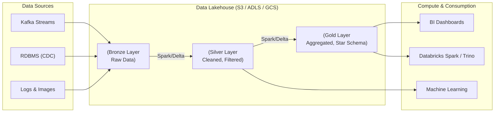

# Kiến trúc Lakehouse - Data Lakehouse

## Summary

Lakehouse (hay Data Lakehouse) là một hệ thống kiến trúc quản trị dữ liệu hiện đại, được thiết kế để kết hợp các tính năng tốt nhất của cả hai thế giới: Data Lake (Hồ dữ liệu) và Data Warehouse (Kho dữ liệu). Nó cho phép tổ chức lưu trữ mọi loại dữ liệu (có cấu trúc, bán cấu trúc, phi cấu trúc) trên nền tảng lưu trữ đám mây giá rẻ (như Amazon S3, Google Cloud Storage) - tính năng của Data Lake; nhưng đồng thời cung cấp tính năng quản trị giao dịch ACID, schema enforcement và hiệu năng truy vấn SQL tốc độ cao - đặc quyền vốn chỉ có ở Data Warehouse. 

---

## Definition

**Lakehouse** là một kiến trúc hệ thống mở, nơi dữ liệu được lưu trữ trên một lớp bộ nhớ Object Storage rẻ tiền, nhưng được phủ lên bởi một **lớp siêu dữ liệu (metadata layer) thông minh**. 

Thay vì phải duy trì 2 hệ thống song song (Đổ dữ liệu rác vào Data Lake, sau đó ETL phần dữ liệu sạch sang hệ quản trị cơ sở dữ liệu quan hệ đắt đỏ của Data Warehouse để báo cáo), kiến trúc Lakehouse cho phép các công cụ BI (Business Intelligence) và Machine Learning truy xuất và phân tích trực tiếp trên cùng một bản sao dữ liệu duy nhất đang nằm ở Data Lake.

Các công nghệ cốt lõi tạo nên lớp siêu dữ liệu của Lakehouse hiện nay là: **Delta Lake** (của Databricks), **Apache Iceberg** (của Netflix) và **Apache Hudi** (của Uber).

---

## Why it exists

Suốt thập kỷ 2010s, mô hình kiến trúc song song "Two-Tier" (Data Lake + Data Warehouse) gây ra vô số nỗi đau cho các kỹ sư dữ liệu:
1. **Chi phí đội lên gấp đôi**: Dữ liệu vừa được lưu trữ trên S3 (Data Lake), sau đó lại phải copy vào Amazon Redshift hoặc Snowflake (Data Warehouse). Bạn phải trả tiền lưu trữ 2 lần, cộng thêm tiền điện toán khổng lồ cho việc sao chép (ETL).
2. **Độ trễ dữ liệu (Data Staleness)**: Phải mất nhiều giờ hoặc qua đêm để dữ liệu chảy từ Lake vào Warehouse. Báo cáo BI luôn là dữ liệu của ngày hôm qua.
3. **Data Swamp (Đầm lầy dữ liệu)**: Dữ liệu trên Data Lake thường ở dạng Parquet/CSV. Khi có tác vụ xóa hoặc cập nhật luật bảo mật GDPR, việc UPDATE/DELETE trực tiếp các file Parquet tĩnh là bất khả thi. Data Lake bị rác hóa nhanh chóng.

Kiến trúc Lakehouse ra đời (được Databricks thương mại hóa mạnh mẽ từ năm 2020) nhằm phá bỏ bức tường giữa 2 hệ thống này, tạo ra một nguồn chân lý duy nhất (Single Source of Truth).

---

## Core idea

Ý tưởng cốt lõi của Lakehouse là: **Chuyển năng lực quản lý bảng (Table Management) từ Động cơ cơ sở dữ liệu (Database Engine) xuống thẳng định dạng File (Open Table Formats)**.

Trong Data Warehouse truyền thống, Data Engine là kẻ giam giữ dữ liệu (Vendor Lock-in). Bạn không thể dùng Spark để đọc trực tiếp file dữ liệu nằm sâu trong đĩa cứng của Oracle hay Teradata.
Trong Lakehouse, dữ liệu được lưu dưới định dạng tệp mở (Parquet). Lớp Table Format (như Iceberg) chỉ là một tập hợp các file JSON theo dõi xem file Parquet nào thuộc về version nào của bảng. Do đó, Spark, Trino, Flink, hay Python đều có thể trực tiếp đọc cùng một bảng với tốc độ chóng mặt, và hỗ trợ UPDATE/DELETE y hệt một cơ sở dữ liệu thực thụ nhờ cơ chế kiểm soát giao dịch (ACID).

---

## How it works

Cách một truy vấn hoạt động trong Lakehouse:
1. **Lưu trữ**: File Parquet gốc nằm tại AWS S3.
2. **Metadata Layer**: Hệ thống (như Delta Lake) có một tệp `_delta_log` ghi lại nhật ký: "Ở version 2, thêm file A, xóa file B". 
3. **Truy vấn**: Engine xử lý (như Databricks Photon) nhận câu SQL `SELECT * FROM sales`.
4. Nó đọc tệp Log trước. Tìm ra các file Parquet mới nhất cấu thành nên bảng `sales`. (Bỏ qua các file rác).
5. Engine đẩy các lệnh lọc (WHERE) xuống trực tiếp tầng lưu trữ S3 để chỉ đọc các vùng dữ liệu nhỏ (Data Skipping), sau đó trả kết quả về bộ nhớ cho công cụ BI.

---

## Architecture / Flow

Mô phỏng kiến trúc hệ thống Lakehouse với nguyên tắc **Medallion Architecture (Đồng - Bạc - Vàng)**:



*Trong sơ đồ này, toàn bộ Bronze, Silver và Gold đều nằm chung trên một lớp lưu trữ Cloud rẻ tiền. Dữ liệu Gold đã được tổ chức thành Star Schema (Fact/Dimension) cho BI, trong khi dữ liệu Silver được dùng thẳng cho việc train AI/ML.*

---

## Practical example

Một trong những sức mạnh cốt lõi của Lakehouse (như Delta Lake hoặc Iceberg) là khả năng quản lý dữ liệu với SQL, hỗ trợ Time-Travel và tối ưu hóa file.

```sql
-- Đọc dữ liệu tại bảng lưu trữ trên S3
SELECT * FROM gold_sales_fact;

-- Time-Travel: Truy vấn lại trạng thái dữ liệu chính xác vào ngày hôm qua
SELECT * FROM gold_sales_fact TIMESTAMP AS OF '2026-06-07 00:00:00';

-- Xóa dữ liệu (Điều không thể làm dễ dàng với Data Lake truyền thống)
DELETE FROM gold_sales_fact WHERE customer_id = 'C123';

-- Tối ưu hóa: Gộp các file Parquet nhỏ thành file lớn để tăng tốc độ truy vấn
OPTIMIZE gold_sales_fact ZORDER BY (date_id);
```

---

## Best practices

* **Tiêu chuẩn hóa Open Table Formats**: Khi xây dựng Lakehouse, bắt buộc phải chọn một định dạng bảng mã nguồn mở chuẩn (Apache Iceberg, Delta Lake hoặc Hudi) làm xương sống. Đừng bao giờ xây dựng Lakehouse trên các file Parquet trần trụi (bare Parquet) - bạn sẽ chết chìm trong "Đầm lầy dữ liệu".
* **Tách biệt Storage và Compute**: Luôn giữ dữ liệu của bạn trên các kho lưu trữ Object Storage (S3/GCS) và thuê các Engine tính toán (Databricks, Snowflake, Athena) dưới dạng Serverless hoặc tắt mở linh hoạt để tiết kiệm tối đa chi phí.
* **Tối ưu hóa File Size (Compaction)**: Dữ liệu stream liên tục sẽ tạo ra hàng vạn file Parquet nhỏ (Small Files Problem), làm chậm quá trình quét. Hãy chạy các tác vụ dọn dẹp định kỳ (Ví dụ: `OPTIMIZE` trong Delta Lake) để gộp các file nhỏ thành các file lớn (128MB - 1GB).

---

## Common mistakes

* **Xem Lakehouse như một "Phép thuật" (Magic Bullet)**: Nghĩ rằng chỉ cần cài Delta Lake là xong. Một Lakehouse nếu không được quy hoạch mô hình dữ liệu (Data Modeling - như Kimball Star Schema ở tầng Gold) thì truy vấn BI vẫn sẽ chậm thảm hại.
* **Gắn chặt vào công nghệ độc quyền (Vendor Lock-in)**: Thay vì dùng phiên bản mã nguồn mở của Delta/Iceberg, doanh nghiệp bị mắc kẹt vào các tính năng đóng của nhà cung cấp dịch vụ đám mây, làm mất đi đặc tính linh hoạt "Open" vốn có của Lakehouse.
* **Cập nhật dữ liệu quá nhỏ (Micro-updates)**: Lakehouse dùng Parquet (cấu trúc cột tĩnh). Việc chạy liên tục hàng ngàn câu lệnh `UPDATE` sửa từng dòng nhỏ sẽ gây ra Overhead (quá tải) tạo file mới liên tục. Nên dùng Batch UPDATE hoặc CDC.

---

## Trade-offs

### Ưu điểm
* **Chi phí rẻ (Cost Efficiency)**: Gộp chung 2 hệ thống làm 1. Lưu trữ trên S3 rẻ hơn hàng chục lần so với lưu trữ trên đĩa cứng của các Data Warehouse truyền thống.
* **Đơn giản hóa hạ tầng (Simplicity)**: Ít đường ống ETL di chuyển dữ liệu hơn. Ít rủi ro hỏng hóc giữa các hệ thống (point of failure).
* **AI/ML + BI tích hợp**: Data Scientist có thể dùng Python/Tensorflow đọc dữ liệu Silver trực tiếp song song với Data Analyst dùng SQL đọc dữ liệu Gold mà không tranh chấp tài nguyên.
* **Hỗ trợ Time-Travel**: Nhờ Transaction Log, Lakehouse lưu trữ các phiên bản của bảng. Ta có thể viết query: `SELECT * FROM sales VERSION AS OF 10` để xem dữ liệu ngày hôm qua, cực kỳ tiện cho việc Debug.

### Nhược điểm
* **Hiệu suất cho các truy vấn siêu nhỏ**: Đối với báo cáo yêu cầu độ trễ tính bằng vài chục mili-giây, hoặc các query tìm kiếm đúng 1 bản ghi (Point lookup), Lakehouse vẫn chậm hơn Data Warehouse đích thực (bởi giới hạn đọc file trên mạng của S3).
* **Độ phức tạp trong vận hành Metadata**: Các kỹ sư phải học cách làm quen với việc bảo trì bảng (Vacuuming, Compaction, Z-Ordering), thứ mà Data Warehouse thường tự làm ẩn phía sau.

---

## When to use

* Được coi là xu hướng kiến trúc tiêu chuẩn (Standard Architecture) hiện tại cho các hệ thống dữ liệu đám mây (Modern Data Stack) khởi tạo mới.
* Doanh nghiệp có khối lượng dữ liệu khổng lồ, bao gồm cả dữ liệu bán cấu trúc (JSON, Logs) và phi cấu trúc (Images/Audio), muốn kết hợp khai thác AI và BI.
* Doanh nghiệp muốn kiểm soát 100% dữ liệu gốc của mình bằng định dạng mã nguồn mở thay vì trao nó cho các hãng phần mềm.

## When not to use

* Doanh nghiệp chỉ có thuần túy dữ liệu quan hệ từ ERP/CRM, dung lượng nhỏ (< 1TB) và chỉ có nhu cầu làm báo cáo tài chính nội bộ. (Trường hợp này, một Data Warehouse truyền thống như PostgreSQL hoặc BigQuery sẽ chạy nhanh và dễ cài đặt hơn nhiều).
* Các hệ thống cần xử lý hàng triệu transaction nhỏ lẻ mỗi giây (Đó là nhiệm vụ của OLTP Database).

---

## Related concepts

* [Data Lake](/concepts/data-lake)
* [Data Warehouse](/concepts/data-warehouse)
* [Delta Lake](/concepts/delta-lake)
* [Apache Iceberg](/concepts/apache-iceberg)
* [Medallion Architecture](/concepts/medallion-architecture)

---

## Interview questions

### 1. Tại sao không thể chạy lệnh UPDATE trực tiếp lên một file Parquet trong Data Lake thông thường, và Lakehouse giải quyết bài toán đó như thế nào?
* **Người phỏng vấn muốn kiểm tra**: Hiểu biết sâu sắc về cấu trúc lưu trữ và nguyên lý hoạt động của Table Formats.
* **Gợi ý trả lời**: 
  * Parquet là định dạng lưu trữ bất biến (Immutable). Một khi file Parquet đã ghi xuống ổ đĩa, ta không thể tìm đến dòng thứ 100 và chèn đè ký tự vào đó mà không viết lại toàn bộ file. Trong Data Lake truyền thống, việc update yêu cầu phải tải toàn bộ file lên RAM, sửa dòng đó, và lưu thành file mới đè lên file cũ, rất dễ gây lỗi mất dữ liệu nếu đang ghi thì mất điện (thiếu ACID).
  * Lakehouse (như Delta Lake) không sửa file cũ. Nó dùng kỹ thuật **Copy-on-Write** (Tạo file Parquet mới chứa dữ liệu đã sửa) hoặc **Merge-on-Read** (Lưu phần dữ liệu sửa vào một file phụ). Sau đó nó cập nhật Tệp nhật ký siêu dữ liệu (Transaction Log), đánh dấu file cũ là "đã xóa" (tombstone) và trỏ con trỏ đọc vào file mới. Điều này đảm bảo tính nhất quán (ACID) mà hệ thống không bao giờ bị corrupt (hỏng).

### 2. Sự khác biệt giữa Data Warehouse, Data Lake và Data Lakehouse trong 1 câu là gì?
* **Gợi ý trả lời**:
  * **Data Warehouse**: Nơi cấu trúc, quản lý và tối ưu truy vấn cực mạnh cho dữ liệu có cấu trúc, nhưng đắt đỏ và khép kín.
  * **Data Lake**: Nơi đổ mọi loại dữ liệu (cấu trúc đến phi cấu trúc) vào lưu trữ rẻ tiền vô hạn, nhưng lộn xộn và không hỗ trợ giao dịch (ACID).
  * **Data Lakehouse**: Phủ một lớp quản trị thông minh lên trên Data Lake, mang lại khả năng quản lý ACID và hiệu năng truy vấn của Warehouse trên nền lưu trữ rẻ tiền và mở của Lake.

---

## References

1. **Databricks Research Papers** - "Lakehouse: A New Generation of Open Platforms that Unify Data Warehousing and Advanced Analytics" (Tài liệu định nghĩa kiến trúc).
2. **Fundamentals of Data Engineering** - Joe Reis.
3. **Apache Iceberg / Delta Lake Documentation**.

---

## English summary

The Data Lakehouse is a modern data architecture paradigm that unifies the best elements of a Data Lake (cheap, infinitely scalable object storage for all data types like S3 or GCS) with the robust capabilities of a Data Warehouse (ACID transactions, schema enforcement, and high-performance SQL analytics). By abstracting the table management layer away from proprietary database engines and utilizing open table formats (such as Delta Lake, Apache Iceberg, or Apache Hudi) on top of open file formats (like Parquet), the Lakehouse eliminates the need to maintain parallel systems or complex ETL pipelines transferring data between a lake and a warehouse. This unified "Single Source of Truth" significantly reduces costs, accelerates data freshness, and seamlessly supports both Machine Learning (AI) and Business Intelligence (BI) workloads simultaneously.
