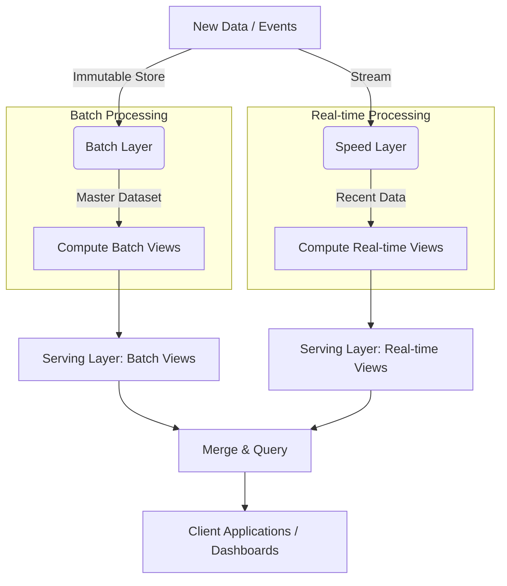

# Lambda Architecture

## Summary

Kiến trúc Lambda là một mô hình thiết kế hệ thống xử lý dữ liệu lớn được thiết kế để xử lý khối lượng lớn dữ liệu bằng cách tận dụng cả phương pháp xử lý lô (batch processing) và xử lý luồng theo thời gian thực (stream processing). Nó cung cấp một cách tiếp cận mạnh mẽ, chịu lỗi cao để cân bằng giữa độ trễ (latency), thông lượng (throughput) và độ chính xác của dữ liệu.

---

## Definition

Được đề xuất bởi Nathan Marz (tác giả của Apache Storm), **Lambda Architecture** giải quyết bài toán xử lý sự kiện trong Big Data bằng cách chia quá trình tính toán thành ba lớp (layers):
1. **Batch Layer**: Lưu trữ nguồn chân lý tổng thể, xử lý dữ liệu với khối lượng lớn, có độ chính xác cao nhất nhưng độ trễ cao.
2. **Speed Layer (hoặc Stream Layer)**: Xử lý dữ liệu thời gian thực có độ trễ cực thấp để cung cấp dữ liệu tức thì, hy sinh một chút độ chính xác tĩnh.
3. **Serving Layer**: Kết hợp kết quả từ cả hai lớp trên để cung cấp cái nhìn toàn diện và mới nhất cho các truy vấn của người dùng.

---

## Why it exists

Trước đây, kỹ sư dữ liệu đối mặt với một sự thỏa hiệp: 
* Một hệ thống Batch (Hadoop MapReduce) xử lý dữ liệu cực kỳ chính xác và khổng lồ nhưng mất nhiều giờ hoặc nhiều ngày để ra kết quả. 
* Một hệ thống Streaming xử lý rất nhanh, nhưng dễ bị sai sót dữ liệu khi có lỗi đường truyền (data loss) hoặc khó cập nhật tính toán trên toàn bộ lịch sử (vì dữ liệu chỉ đi qua một lần).

Kiến trúc Lambda ra đời để giải quyết vấn đề này. Hệ thống hoạt động dựa trên phương trình cốt lõi: 
**Query = Function(All Data)**.
Bằng cách có cả hai luồng, hệ thống cung cấp dữ liệu tức thời (nhờ luồng nhanh) trong khi liên tục tự sửa các lỗi tiềm ẩn để đạt độ chính xác hoàn hảo (nhờ luồng batch).

---

## Core idea

Ý tưởng cốt lõi của kiến trúc này là **Sự bất biến của dữ liệu (Immutable Data)**. Dữ liệu thô đi vào hệ thống không bao giờ bị ghi đè, nó được append liên tục vào kho lưu trữ trung tâm. 
Bất cứ sự cố hệ thống hay logic xử lý sai nào đều có thể được sửa chữa đơn giản bằng cách viết lại thuật toán và chạy lại Batch Layer trên toàn bộ kho dữ liệu bất biến từ điểm khởi đầu (recomputation).

---

## How it works

Dữ liệu thô từ nguồn (ví dụ: Kafka) được phân tách thành 2 luồng song song:

1. **Batch Layer (Lớp lô)**:
   - Dữ liệu thô được lưu trữ bất biến (ví dụ trong HDFS hoặc S3).
   - Hệ thống (như Apache Spark, Hadoop) định kỳ (ví dụ mỗi đêm) chạy các phép tính (batch views) trên toàn bộ dữ liệu lịch sử. Kết quả mang tính chính xác tuyệt đối.

2. **Speed Layer (Lớp tốc độ)**:
   - Cùng một dữ liệu đó được xử lý tức thời ngay khi nó đến (như Apache Flink, Spark Streaming).
   - Speed layer chỉ tính toán dữ liệu của khoảng thời gian gần nhất (những dữ liệu chưa được xử lý trong Batch layer đợt gần nhất). Nó tạo ra các "real-time views".

3. **Serving Layer (Lớp phục vụ)**:
   - Cung cấp các công cụ lưu trữ tối ưu hóa đọc (ví dụ: Apache Cassandra, HBase, Elasticsearch).
   - Khi một ứng dụng truy vấn, lớp này sẽ ghép (merge) kết quả chính xác từ Batch Views (dữ liệu đến hôm qua) và kết quả tức thời từ Real-time Views (dữ liệu trong hôm nay) lại với nhau để ra câu trả lời toàn vẹn.

---

## Architecture / Flow



---

## Practical example

Một hệ thống giới thiệu sản phẩm của E-commerce cần tính toán danh sách "Sản phẩm bạn có thể thích" dựa trên lịch sử click của người dùng.

* **Batch Layer**: Chạy vào 2h sáng mỗi ngày, phân tích hàng tỷ lượt click trong 5 năm qua bằng Spark để tạo ra một hồ sơ sở thích sâu sắc và chính xác cho người dùng A. Kết quả lưu vào Serving database.
* **Speed Layer**: Trong ngày hôm nay, người dùng A vừa click vào 3 đôi giày Nike mới. Spark Streaming nhận các event này ngay lập tức và tính toán điểm sở thích tạm thời cho nhãn hiệu Nike.
* **Serving Layer**: Khi người dùng A tải trang chủ lúc 3h chiều, ứng dụng web sẽ query kết hợp (merge) dữ liệu từ hồ sơ Batch (sở thích lâu dài) cộng thêm dữ liệu từ Speed view (sự quan tâm tức thời đến giày Nike) để đưa ra đề xuất cập nhật ngay lúc đó. Đêm hôm sau, dữ liệu về giày Nike sẽ được trộn vào đợt Batch mới và Speed view tạm thời sẽ được xóa bỏ.

**Mã giả (Pseudo-code) cho lớp Serving:**

```python
def get_recommendations(user_id):
    # 1. Truy vấn kết quả tính toán chính xác từ Batch Layer (đến 2h sáng hôm nay)
    batch_views = db.query("SELECT recs FROM batch_layer WHERE user = ?", user_id)
    
    # 2. Truy vấn kết quả tạm thời từ Speed Layer (từ 2h sáng đến hiện tại)
    realtime_views = db.query("SELECT recs FROM speed_layer WHERE user = ?", user_id)
    
    # 3. Merge (Hợp nhất) hai luồng kết quả
    final_recommendations = merge_logic(batch_views, realtime_views)
    
    return final_recommendations
```

---

## Best practices

* **Thiết kế dữ liệu Batch bất biến**: Phải đảm bảo Master Dataset trong Batch layer là chế độ append-only (chỉ thêm mới), không bị sửa đổi để dễ dàng khắc phục khi cần chạy lại.
* **Đồng bộ hóa Logic Code**: Cố gắng sử dụng các framework có thể chia sẻ mã nguồn chung giữa lô và luồng (ví dụ: Apache Spark cho phép dùng chung DataFrame API cho cả Spark SQL Batch và Spark Structured Streaming) để giảm nợ kỹ thuật.
* **Xóa dữ liệu Speed Layer định kỳ**: Sau khi Batch layer chạy xong và cập nhật dữ liệu của ngày hôm qua vào Serving layer, dữ liệu tương ứng bên Speed layer phải được xóa bỏ (hoặc thay thế) để tránh tính trùng lặp.

---

## Common mistakes

* **Quản lý hai codebase song song (Nợ kỹ thuật)**: Duy trì hai bộ mã nguồn bằng hai ngôn ngữ / công nghệ khác nhau (ví dụ dùng Scalding cho Batch và Storm cho Speed) để thực hiện cùng một logic kinh doanh. Khi có thay đổi nghiệp vụ, kỹ sư phải sửa code ở hai nơi, rất dễ gây lỗi logic bất đồng bộ.
* **Over-engineering (Kỹ thuật quá mức)**: Áp dụng kiến trúc Lambda cho các hệ thống không thực sự cần dữ liệu thời gian thực. Việc duy trì kiến trúc này đòi hỏi đội ngũ vận hành rất chuyên nghiệp và chi phí hạ tầng cao gấp đôi.

---

## Trade-offs

### Ưu điểm
* **Độ chịu lỗi cực cao (Fault tolerance)**: Lỗi phần cứng, hỏng dữ liệu trên đường truyền, lỗi do con người viết code sai ở hệ thống Streaming đều có thể được sửa chữa bằng cách chạy lại Batch layer.
* **Cân bằng hoàn hảo**: Đạt được tốc độ thời gian thực (real-time) với sự tự tin tuyệt đối vào độ chính xác của dữ liệu lịch sử.

### Nhược điểm
* **Độ phức tạp duy trì vận hành cực lớn**: Quản lý, giám sát và vận hành hai hệ thống tính toán độc lập phức tạp đòi hỏi nhiều nhân lực.
* **Khó khăn trong việc hợp nhất (Merge)**: Xây dựng cơ chế truy vấn hợp nhất giữa Batch Views và Real-time Views đòi hỏi nỗ lực kỹ thuật cao ở tầng Serving.

---

## When to use

* Các hệ thống phân tích nơi độ tin cậy và chính xác của dữ liệu lớn lịch sử là tuyệt đối cần thiết, nhưng vẫn bắt buộc phải có dashboard đáp ứng tức thời với dữ liệu mới cập nhật vài giây trước (ví dụ: Fraud Detection ở ngân hàng, hệ thống quảng cáo Real-time Bidding).
* Khối lượng dữ liệu lịch sử quá lớn (hàng trăm TB, PB) đến mức việc chạy lại logic toàn bộ bằng một công cụ Streaming là bất khả thi.

## When not to use

* Doanh nghiệp muốn giảm thiểu nợ kỹ thuật và độ phức tạp vận hành. (Hãy xem xét [Kiến trúc Kappa](/concepts/kappa-architecture)).
* Nếu hệ thống chỉ cần báo cáo hàng ngày (độ trễ 24 giờ là chấp nhận được), chỉ cần Batch Layer là đủ.

---

## Related concepts

* [Kappa Architecture](/concepts/kappa-architecture)
* [Real-time Architecture](/concepts/real-time-architecture)
* [Event-Driven Architecture](/concepts/event-driven-architecture)

---

## Interview questions

### 1. Sự khác biệt chính giữa kiến trúc Lambda và kiến trúc Kappa là gì?
* **Người phỏng vấn muốn kiểm tra**: Kiến thức sâu về tiến hóa kiến trúc hệ thống và khả năng so sánh ưu/nhược điểm.
* **Gợi ý trả lời (Strong Answer)**: Kiến trúc Lambda sử dụng hai luồng xử lý riêng biệt: Batch Layer (đảm bảo tính chính xác lịch sử) và Speed Layer (xử lý độ trễ thấp tức thời). Trong khi đó, kiến trúc Kappa loại bỏ hoàn toàn Batch Layer, xử lý tất cả mọi thứ (cả lịch sử lẫn hiện tại) như là luồng sự kiện (Stream Processing) thông qua các nền tảng như Kafka hoặc Flink, nhằm giảm độ phức tạp vận hành và không phải viết cùng một logic code hai lần.

### 2. Làm thế nào để Lambda Architecture xử lý việc lỗi logic của con người (Human Error)?
* **Người phỏng vấn muốn kiểm tra**: Hiểu biết về nguyên lý Master Dataset bất biến.
* **Gợi ý trả lời (Strong Answer)**: Vì dữ liệu đầu vào luôn được lưu trữ dưới dạng Immutable (không thay đổi) trong Batch layer. Nếu một Data Engineer deploy sai code làm sai lệch số liệu doanh thu trong tuần qua, anh ta chỉ cần sửa lại code, xóa bỏ các Batch Views bị lỗi ở Serving Layer, và cho phép Batch Layer chạy lại quá trình tính toán trên kho dữ liệu gốc (recomputation). Kết quả sẽ lại chính xác hoàn toàn. 

---

## References

1. **Big Data: Principles and best practices of scalable realtime data systems** - Nathan Marz & James Warren.
2. **Designing Data-Intensive Applications** - Martin Kleppmann (Chương 11 về Stream Processing).

---

## English summary

Lambda Architecture is a data-processing architecture designed to handle massive quantities of data by taking advantage of both batch and stream-processing methods. It relies on a robust, append-only Master Dataset. The architecture resolves the latency vs. accuracy trade-off by delegating heavy, highly-accurate historical computations to the Batch Layer, whilst delegating low-latency, real-time approximations to the Speed Layer. Finally, a Serving Layer queries and merges views from both layers to present a complete and up-to-date picture, though it comes at the cost of managing dual processing logic and higher operational complexity.
