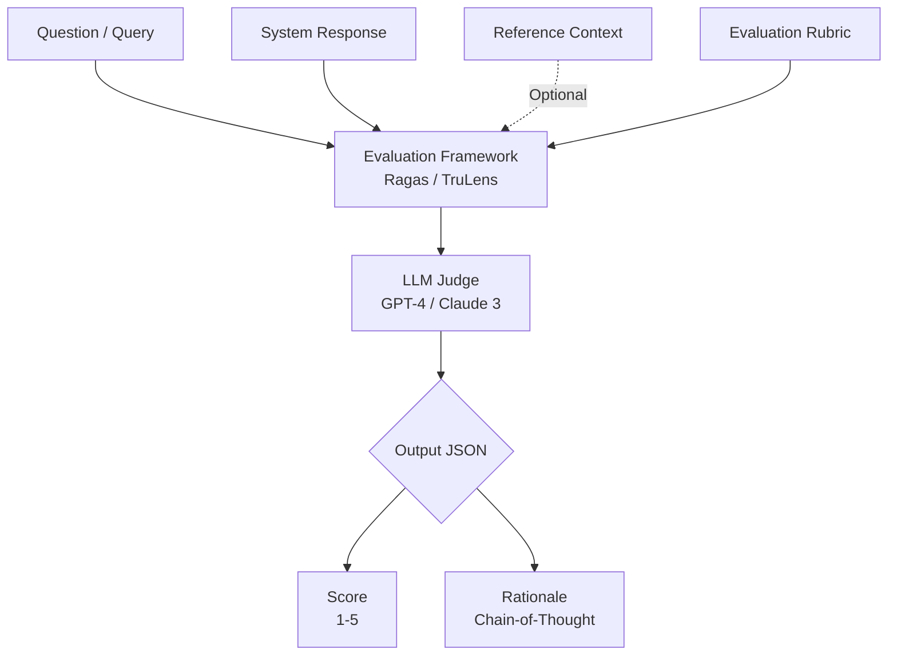

# LLM Làm Giám Khảo (LLM-as-a-judge): Khi AI Tự Chấm Điểm AI

Khi đưa một ứng dụng GenAI (như chatbot chăm sóc khách hàng hoặc hệ thống tìm kiếm thông tin RAG) vào môi trường thực tế, câu hỏi đau đầu nhất của mọi đội ngũ phát triển luôn là: **"Làm sao để biết câu trả lời của chatbot có chính xác, an toàn và hữu ích hay không?"** 

Không giống như các ứng dụng phần mềm truyền thống có đầu ra cố định (deterministic), ngôn ngữ tự nhiên cực kỳ linh hoạt. Một câu hỏi có thể có hàng chục cách trả lời đúng khác nhau. 

Nếu dùng con người để ngồi đọc và chấm điểm hàng ngàn câu trả lời thì quá tốn kém và không thể mở rộng. Còn nếu dùng các công cụ đo lường toán học cũ như BLEU hay ROUGE, hệ thống sẽ trở nên cực kỳ cứng nhắc vì chúng chỉ đếm từ trùng lặp chứ không hiểu được ngữ nghĩa.

Đó là lúc phương pháp **LLM-as-a-judge (LLM làm giám khảo)** xuất hiện như một cứu cánh. Phương pháp này sử dụng một Mô hình Ngôn ngữ Lớn cực kỳ thông minh (như GPT-4, Claude 3) đóng vai trò làm "trọng tài" để tự động đánh giá và chấm điểm chất lượng đầu ra của các LLM khác.

## Tại sao chúng ta cần LLM-as-a-judge?

Đánh giá chất lượng (Evaluation - Eval) hiện là một trong những rào cản lớn nhất khi muốn đưa AI vào thực tế. Chúng ta đối mặt với ba vấn đề lớn:

1. **Sự bất lực của các chỉ số truyền thống**: Các chỉ số như ROUGE (thường dùng cho tóm tắt văn bản) hay BLEU (dùng cho dịch thuật) chỉ hoạt động bằng cách đếm xem có bao nhiêu từ ngữ trùng khớp chính xác giữa câu trả lời sinh ra và câu trả lời mẫu. Nếu chatbot trả về một câu có nghĩa tương đương nhưng dùng các từ đồng nghĩa khác hoàn toàn, các chỉ số này sẽ chấm 0 điểm.
2. **Nghẽn cổ chai khi dùng con người (Human Eval)**: Việc thuê các chuyên gia ngồi đánh giá thủ công từng câu trả lời là một quy trình vô cùng chậm chạp và đắt đỏ. Hơn nữa, con người cũng dễ bị ảnh hưởng bởi các yếu tố chủ quan và định kiến cá nhân.
3. **Nhu cầu tự động hóa trong quy trình CI/CD**: Khi bạn thay đổi một câu Prompt hoặc cập nhật lại cơ sở dữ liệu Vector DB, làm sao để biết chắc chắn hệ thống đang tốt lên hay tệ đi? Bạn cần một quy trình chạy tự động hàng đêm để kiểm thử hàng ngàn test case và trả về kết quả ngay lập tức. LLM-as-a-judge giải quyết được việc này với chi phí token rẻ hơn nhiều so với việc thuê nhân sự.

## Ý tưởng cốt lõi và cách thức vận hành

Triết lý của phương pháp này rất đơn giản: **Dùng một mô hình AI có khả năng lập luận và tuân thủ chỉ dẫn vượt trội để làm người chấm thi**.

Chúng ta có thể lập trình cho "LLM giám khảo" bằng một System Prompt chứa bộ tiêu chí chấm điểm chi tiết (Rubric). Các khía cạnh thường được đưa ra đánh giá bao gồm:
* **Relevance (Độ liên quan)**: Câu trả lời của chatbot có đi thẳng vào trọng tâm câu hỏi của người dùng không?
* **Faithfulness (Độ trung thực)**: Trong hệ thống RAG, câu trả lời có hoàn toàn dựa trên tài liệu được cung cấp (context) không, hay là do AI tự bịa ra (ảo giác - hallucination)?
* **Helpfulness (Tính hữu ích)**: Câu trả lời có rõ ràng, dễ hiểu và thực sự giải quyết được vấn đề không?

### Sơ đồ quy trình đánh giá:



Để quá trình đánh giá diễn ra chính xác, chúng ta thường cung cấp cho LLM giám khảo:
1. **Dữ liệu đầu vào**: Câu hỏi của người dùng, Câu trả lời của chatbot và Ngữ cảnh tham chiếu (nếu có).
2. **Tiêu chí chấm điểm (Rubric)**: Định nghĩa rõ ràng thế nào là 1 điểm, thế nào là 5 điểm.
3. **Yêu cầu giải thích (Chain-of-Thought)**: Bắt buộc giám khảo phải viết ra lập luận logic của mình trước khi đưa ra điểm số cuối cùng để tránh đoán mò.

---

## Một ví dụ thực tế: Phát hiện ảo giác trong RAG

Hãy xem cách chúng ta thiết lập một Prompt để phát hiện xem chatbot có đang nói nhảm hay không.

**Dữ liệu gửi cho LLM giám khảo:**
```text
Bạn là một giám khảo công tâm. Hãy đọc TÀI LIỆU và CÂU TRẢ LỜI dưới đây. 
Nhiệm vụ của bạn là đánh giá xem CÂU TRẢ LỜI có hoàn toàn suy ra từ TÀI LIỆU hay không (Điểm 1: Có, Điểm 0: Không). Trả về định dạng JSON gồm "reason" và "score".

TÀI LIỆU: Bầu trời trên Trái đất có màu xanh do hiện tượng tán xạ Rayleigh. 
CÂU TRẢ LỜI: Bầu trời màu xanh do tán xạ Rayleigh và do phản chiếu màu của đại dương.
```

**Kết quả phản hồi từ Giám khảo (GPT-4):**
```json
{
  "reason": "Câu trả lời đề cập đến 'tán xạ Rayleigh' có tồn tại trong tài liệu. Tuy nhiên, nó tự ý thêm thông tin 'phản chiếu màu của đại dương', điều này không hề có trong tài liệu cung cấp.",
  "score": 0
}
```

Nhờ có phần giải thích rõ ràng này, các kỹ sư dữ liệu có thể dễ dàng hiểu được tại sao hệ thống bị chấm 0 điểm và tiến hành sửa đổi prompt hoặc dữ liệu đầu vào.

---

## Những điểm cộng, điểm trừ và lưu ý khi áp dụng

Dù rất mạnh mẽ, phương pháp này cũng có những giới hạn vật lý và thuật toán riêng.

### Những ưu điểm vượt trội (Pros)
* **Tự động hóa hoàn toàn**: Dễ dàng tích hợp vào đường ống CI/CD để tự động kiểm thử hệ thống mỗi khi thay đổi code.
* **Hiểu ngữ nghĩa sâu sắc**: Vượt trội hơn hẳn so với việc so khớp từ vựng đơn thuần.
* **Giải thích được kết quả (Explainability)**: Có lý do rõ ràng đi kèm điểm số giúp việc debug trở nên cực kỳ thuận tiện.

### Những hạn chế cần lưu ý (Cons)
* **Chi phí API đắt đỏ**: Quá trình chấm điểm đòi hỏi phải gửi kèm một lượng ngữ cảnh rất lớn (prompt, tài liệu, câu hỏi, câu trả lời) và phải dùng các model thông minh nhất (thường là đắt nhất) nên chi phí token sẽ tăng rất nhanh.
* **Định kiến của AI (LLM Bias)**: Giám khảo AI cũng có những thiên vị riêng, ví dụ như thích các câu trả lời dài dòng hơn (Verbosity bias), thiên vị các câu trả lời do chính nó sinh ra hoặc thiên vị thứ tự hiển thị của các câu trả lời (Position bias).

### Lời khuyên xương máu khi triển khai (Best Practices)
* **Tuyệt đối không dùng chính mô hình đó để chấm điểm**: Đừng bao giờ bắt một mô hình nhỏ tự đánh giá chính nó. Hãy luôn dùng một mô hình mạnh hơn (ví dụ dùng GPT-4 để chấm điểm cho Llama-3-8B).
* **Bắt buộc viết lý do trước khi chấm điểm**: Việc ép mô hình sinh ra lập luận (`reason`) trước khi phun ra con số (`score`) sẽ giúp kích hoạt cơ chế Chain-of-Thought, giúp điểm số đầu ra nhất quán và chính xác hơn nhiều.
* **Sử dụng phương pháp so sánh cặp (Pairwise)**: Thay vì bắt LLM chấm điểm tuyệt đối từ 1-10 (vốn rất mơ hồ), hãy đưa cho nó hai câu trả lời A và B rồi hỏi: *"Câu nào tốt hơn?"*. Cách tiếp cận này cho kết quả rất gần với đánh giá của con người.
* **Hoán đổi vị trí để chống bias**: Để tránh việc LLM luôn chọn phương án xuất hiện đầu tiên, hãy chạy đánh giá hai lần với thứ tự hoán đổi (A-B và B-A).

---

## Khi nào nên và không nên chọn LLM-as-a-judge?

### Nên chọn khi:
* Bạn đang vận hành một hệ thống RAG hoặc Chatbot ở quy mô lớn và cần một giải pháp đánh giá tự động, liên tục.
* Bạn cần so sánh hiệu năng giữa các mô hình mã nguồn mở khác nhau để đưa ra lựa chọn tối ưu nhất cho bài toán của doanh nghiệp.

### Không nên chọn khi:
* Bài toán của bạn có câu trả lời rõ ràng và có thể kiểm thử bằng mã nguồn (ví dụ như bài toán lập trình có Unit Test, hoặc bài toán tính toán số học).
* Ngân sách dự án quá hạn hẹp để có thể duy trì chi phí gọi API từ các mô hình lớn như GPT-4.

---

## Khái niệm liên quan

* [Large Language Model (LLM)](/concepts/llm)
* [Ảo giác LLM (Hallucination)](/concepts/hallucination)
* [Retrieval-Augmented Generation (RAG)](/concepts/rag)
* [System Prompt](/concepts/system-prompt)

---

## Góc phỏng vấn: Câu hỏi thường gặp

### 1. Tại sao không dùng ROUGE hoặc BLEU score để đánh giá độ chính xác của hệ thống RAG thay vì phải tốn tiền gọi API GPT-4 làm giám khảo?
* **Mục đích của người phỏng vấn**: Đánh giá sự hiểu biết của bạn về giới hạn của các metrics xử lý ngôn ngữ tự nhiên (NLP) truyền thống.
* **Gợi ý trả lời**:
  * Các chỉ số như BLEU hay ROUGE hoạt động dựa trên cơ chế so khớp từ vựng trùng lặp (n-gram overlap). Trong các hệ thống RAG hiện đại, LLM thường diễn đạt lại thông tin (paraphrase) bằng ngôn từ tự nhiên để người dùng dễ đọc hơn.
  * Khi đó, dù câu trả lời hoàn toàn đúng về mặt ngữ nghĩa, các chỉ số truyền thống vẫn sẽ chấm điểm rất thấp do từ ngữ không trùng khớp hoàn toàn với câu mẫu (ground truth). Chỉ có các mô hình ngôn ngữ lớn làm giám khảo mới đủ khả năng hiểu và đánh giá sự tương đồng về mặt ngữ nghĩa bất chấp sự khác biệt về từ vựng.

### 2. Kể tên các tiêu chí cốt lõi của RAG Triad (Tam giác RAG) thường được đánh giá bằng LLM-as-a-judge?
* **Mục đích của người phỏng vấn**: Kiểm tra xem bạn có nắm vững các framework đánh giá RAG tiêu chuẩn như Ragas hay TruLens không.
* **Gợi ý trả lời**:
  * Tam giác RAG tập trung vào 3 mối quan hệ cốt lõi:
    1. **Context Relevance (Độ liên quan của ngữ cảnh)**: Đo lường xem tài liệu được truy xuất từ Vector Database có chứa thông tin để trả lời câu hỏi hay không.
    2. **Groundedness / Faithfulness (Tính trung thực)**: Kiểm tra xem câu trả lời của LLM có hoàn toàn dựa trên ngữ cảnh được cung cấp hay bịa đặt thêm thông tin bên ngoài.
    3. **Answer Relevance (Độ liên quan của câu trả lời)**: Đảm bảo câu trả lời giải quyết trực tiếp và chính xác câu hỏi của người dùng, không đi lan man.

### 3. Làm thế nào để chúng ta đánh giá xem chính "LLM giám khảo" có đang chấm điểm chính xác hay không?
* **Mục đích của người phỏng vấn**: Kiểm tra tư duy thiết kế hệ thống và đo lường khoa học (Meta-evaluation).
* **Gợi ý trả lời**:
  * Chúng ta cần xây dựng một tập dữ liệu chuẩn gọi là "Golden Dataset" (khoảng 50-100 mẫu) và nhờ các chuyên gia con người đánh giá và chấm điểm thủ công một cách cẩn thận.
  * Sau đó, cho LLM giám khảo chấm điểm trên cùng tập dữ liệu này và tính toán mức độ tương quan (ví dụ: dùng hệ số tương quan Pearson hoặc Cohen's Kappa) giữa điểm số của AI và con người. Nếu độ tương quan đạt mức cao (ví dụ > 0.8), chúng ta có thể tin tưởng đưa cấu hình giám khảo đó vào vận hành tự động trên quy mô lớn.

---

## Tài liệu tham khảo

1. **"Judging LLM-as-a-Judge with MT-Bench and Chatbot Arena"** - Zheng et al. (LMSYS, 2023).
2. **Ragas (Retrieval Augmented Generation Assessment) Documentation**.
3. **TruLens Framework Documentation** (RAG Triad & Hallucination detection).

---

## English summary

**LLM-as-a-judge** is an automated evaluation framework where a highly capable Large Language Model (like GPT-4) is prompted to act as an impartial evaluator to assess the quality of outputs generated by another AI system. Because traditional lexical metrics like BLEU or ROUGE fail to capture semantic equivalence and nuance, using an LLM evaluator allows developers to score generated texts on complex, subjective dimensions such as faithfulness, relevance, and helpfulness. By requiring the model to generate a Chain-of-Thought rationale alongside its score, this method provides scalable, explainable, and cost-effective continuous evaluation (CI/CD) for production GenAI applications like RAG systems.
