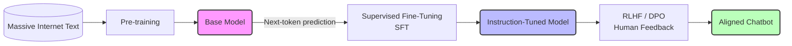

# Mô hình Ngôn ngữ Lớn - Large Language Model (LLM)

## Summary

**Mô hình Ngôn ngữ Lớn (Large Language Model - LLM)** là một hệ thống Trí tuệ Nhân tạo (AI) học sâu (Deep Learning) mang tính đột phá, được thiết kế để hiểu, tạo lập và tương tác bằng ngôn ngữ tự nhiên. Dựa trên kiến trúc mạng nơ-ron Transformer và được huấn luyện trên hàng nghìn tỷ từ ngữ từ Internet, sức mạnh thực sự của LLM không phải là trí thông minh có ý thức, mà là khả năng toán học siêu phàm trong việc dự đoán từ ngữ tiếp theo (next-token prediction) dựa trên ngữ cảnh, tạo ra ảo giác về sự hiểu biết sâu sắc và suy luận logic.

---

## Definition

Về mặt kỹ thuật, một **LLM** là một tập hợp khổng lồ các tệp tin chứa ma trận trọng số (weights parameters - thường từ vài tỷ đến hàng nghìn tỷ tham số). Những con số này mã hóa mối quan hệ phân phối thống kê giữa các từ vựng trong ngôn ngữ loài người.

Khi bạn đưa vào một chuỗi văn bản (Input / Prompt), LLM thực hiện các phép nhân ma trận liên hoàn qua hàng chục lớp xử lý để tính toán ra một bảng xác suất. Bảng xác suất này cho biết: *"Dựa vào toàn bộ dữ liệu tôi đã đọc trên Internet, từ (token) nào có khả năng cao nhất sẽ xuất hiện tiếp theo trong ngữ cảnh này?"* Việc lặp đi lặp lại quá trình dự đoán từng từ một tạo thành các đoạn văn bản dài mạch lạc.

---

## Why it exists

Trước kỷ nguyên LLM (trước 2017), Xử lý Ngôn ngữ Tự nhiên (NLP) dựa vào các mạng RNN (Recurrent Neural Networks) hoặc LSTM. Những mô hình này gặp 3 tử huyệt:
1. **Mất trí nhớ ngắn hạn**: Xử lý văn bản theo trình tự từ trái sang phải, đọc đến cuối câu thì quên mất đầu câu.
2. **Chậm chạp (Không thể tính toán song song)**: Vì phải xử lý tuần tự, không thể tận dụng sức mạnh tính toán khổng lồ của GPU để tăng tốc độ huấn luyện.
3. **Phân mảnh chức năng**: Bạn cần 1 mô hình riêng để dịch thuật, 1 mô hình khác để tóm tắt, 1 mô hình khác nữa để phân tích cảm xúc.

Năm 2017, Google xuất bản bài báo *"Attention Is All You Need"*, giới thiệu kiến trúc **Transformer**. Cấu trúc này giải quyết bài toán song song hóa, mở ra khả năng nhồi nhét những tập dữ liệu khổng lồ (văn bản toàn cầu) vào các mô hình khổng lồ (hàng trăm tỷ tham số). Kết quả bùng nổ là những mô hình "Zero-shot generalists" (Chuyên gia đa năng): Một LLM duy nhất có thể làm mọi tác vụ NLP chỉ qua việc được ra lệnh (Prompting).

---

## Core idea

Sự vĩ đại của LLM được xây dựng trên 3 trụ cột cốt lõi:

1. **Tokenization (Mã hóa từ vựng)**: Mô hình không đọc chữ cái. Văn bản được băm nhỏ thành các Token (1 token $\approx$ 0.75 từ tiếng Anh). Từ "Hamburger" có thể tách thành "Ham" và "burger". Mỗi token được ánh xạ thành một con số ID.
2. **Word Embeddings (Biểu diễn không gian vector)**: Mỗi từ được gán cho một tọa độ (vector đa chiều). Các từ có ý nghĩa tương đồng (như Vua và Hoàng Hậu) sẽ nằm sát nhau trong không gian này. Mô hình hiểu "ngữ nghĩa" thông qua khoảng cách hình học.
3. **Cơ chế Self-Attention (Tự chú ý)**: Khi đọc một từ trong câu, cơ chế này giúp mô hình "liếc nhìn" tất cả các từ khác xung quanh để xác định từ nào quan trọng nhất định hình ngữ cảnh. Ví dụ: Trong câu *"Con chuột máy tính bị đứt đuôi"*, nhờ Attention, mô hình biết từ "chuột" liên quan mật thiết đến "máy tính" (đồ công nghệ) chứ không phải động vật.

---

## How it works

Hành trình ra đời của một LLM hiện đại (như ChatGPT, Llama) trải qua 3 giai đoạn huấn luyện (Training Pipeline):



**Giai đoạn 1: Pre-training (Tiền huấn luyện - Sinh ra con quái vật)**
* **Mục tiêu**: Đọc cả Internet (Wikipedia, Reddit, Sách, Code GitHub) và đoán từ bị thiếu/từ tiếp theo.
* **Chi phí**: Hàng chục triệu đô la, tốn hàng vạn GPU trong nhiều tháng.
* **Kết quả**: Một Base Model (Mô hình nền tảng) am hiểu mọi kiến thức trên đời nhưng... vô dụng trong việc trò chuyện. Nếu bạn hỏi *"Thủ đô nước Pháp là gì?"*, Base Model có thể tự động điền tiếp *"Thủ đô nước Anh là gì?"* vì nó nghĩ bạn đang làm danh sách câu hỏi trắc nghiệm.

**Giai đoạn 2: Supervised Fine-Tuning (SFT - Tinh chỉnh có giám sát)**
* **Mục tiêu**: Dạy mô hình biết tuân theo chỉ dẫn (Instruction Following).
* **Quá trình**: Con người viết hàng vạn cặp `[Câu hỏi / Chỉ dẫn] - [Câu trả lời mẫu hoàn hảo]`.
* **Kết quả**: Mô hình Instruction-Tuned (như Llama-3-Instruct). Khi hỏi *"Thủ đô nước Pháp?"*, nó biết phải trả lời *"Đó là Paris"*.

**Giai đoạn 3: RLHF (Reinforcement Learning from Human Feedback - Tinh chỉnh bằng phản hồi con người) / DPO**
* **Mục tiêu**: Chỉnh đốn thái độ, đạo đức và sự an toàn. (Alignment).
* **Quá trình**: LLM sinh ra 2 câu trả lời, con người (hoặc một AI khác) chấm điểm câu nào thân thiện hơn, ít độc hại hơn. Mô hình tự cập nhật để tối đa hóa "phần thưởng" (reward) này.
* **Kết quả**: Một Chatbot AI an toàn, lịch sự, biết từ chối các yêu cầu viết mã độc hay chế tạo bom.

---

## Practical example

Xét cách LLM dự đoán từ bằng bảng xác suất.
* Prompt: *"Trời mưa, tôi phải mang theo cái..."*
* LLM đi qua hàng tỷ tính toán, xuất ra phân phối xác suất cho Token tiếp theo:
  * `ô` (85%)
  * `áo_mưa` (12%)
  * `cặp` (2.9%)
  * `máy_bay` (0.001%)

Quá trình chọn từ cuối cùng phụ thuộc vào tham số **Temperature** (Nhiệt độ):
* Nếu Temperature = 0: Luôn chọn từ xác suất cao nhất (`ô`). Văn bản sinh ra cứng nhắc, máy móc.
* Nếu Temperature > 0 (vd 0.7): Có cơ hội chọn "áo_mưa" để câu văn sáng tạo, bay bổng hơn.

**Mã ví dụ cấu hình LLM API bằng Python:**

```python
import openai

response = openai.ChatCompletion.create(
    model="gpt-4",
    messages=[
        {"role": "system", "content": "Bạn là một nhà thơ sáng tạo."},
        {"role": "user", "content": "Trời mưa, tôi phải mang theo cái..."}
    ],
    temperature=0.7, # Tăng tính sáng tạo
    max_tokens=50
)
print(response.choices[0].message.content)
```

---

## Best practices

* **Thiết kế System Prompt vững chắc**: Luôn đóng khung vai trò (Persona) và giới hạn quyền hạn của LLM trước khi cho người dùng tương tác để chống lại Prompt Injection (Tấn công chèn câu lệnh).
* **Luôn sử dụng RAG cho dữ liệu nội bộ**: LLM bị đóng băng kiến thức. Đừng cố gắng fine-tune LLM chỉ để dạy nó một sự thật mới (fact). Hãy kết nối nó với Vector DB (Kiến trúc RAG).
* **Kiểm soát tính sáng tạo**: Với bài toán trích xuất JSON hoặc phân tích log hệ thống, luôn cài đặt `Temperature = 0.0`. Với bài toán viết bài PR quảng cáo, hãy đẩy lên `0.7` hoặc cao hơn.

---

## Common mistakes

* **Nhân hóa AI (Anthropomorphism)**: Tin rằng LLM có cảm xúc, linh hồn hoặc thực sự "hiểu" sự đau khổ. Điều này dẫn đến sự tin tưởng thái quá (Over-reliance) của kỹ sư vào các phán đoán logic/đạo đức của máy.
* **Hỏi LLM về những URL chết hoặc bài toán phép tính nhân lớn**: LLM tính toán phép nhân bằng cách... nối chữ (ngôn ngữ) chứ không dùng bộ xử lý số học tuyến tính (ALU) như máy tính cầm tay, nên nó tính toán rất tệ. Nếu đưa một URL, nó thường ảo giác (hallucinate) nội dung URL dựa trên các từ trong đường link thay vì thực sự "đọc" internet.
* **Bỏ qua bảo mật dữ liệu**: Gửi mã nguồn tuyệt mật hoặc báo cáo tài chính nội bộ lên các API công cộng (như ChatGPT bản free) thay vì dùng Enterprise API hoặc chạy Local LLM.

---

## Trade-offs

### Ưu điểm
* **Trí thông minh tổng quát (Emergent Abilities)**: Có thể giải quyết những bài toán chưa từng xuất hiện trong tập dữ liệu huấn luyện (Zero-shot).
* **Giao diện tự nhiên (NLU/NLG)**: Phá vỡ rào cản học lập trình. Bất cứ ai biết nói tiếng mẹ đẻ đều có thể điều khiển máy tính.

### Nhược điểm
* **Ảo giác (Hallucination)**: Bản chất cốt lõi của LLM là máy đoán từ (stochastic parrot). Nó không có khái niệm về "Sự thật khách quan". Nó luôn tự tin bịa chuyện nếu thiếu ngữ cảnh.
* **Black Box (Hộp đen)**: Gần như không thể giải thích (explainable AI) một cách chính xác toán học tại sao LLM lại chọn từ A mà không chọn từ B trong một mạng nơ-ron hàng trăm tỷ tham số.
* **Ngốn tài nguyên môi trường**: Việc huấn luyện và chạy Inference các mô hình lớn tiêu thụ lượng năng lượng (điện, nước làm mát data center) khổng lồ.

---

## When to use

* Xây dựng chatbot chăm sóc khách hàng tự động, trợ lý ảo.
* Tóm tắt văn bản khổng lồ, dịch thuật ngữ nghĩa cao (bảo toàn sắc thái văn chương).
* Viết code boilerplate, review code, phân tích và trích xuất dữ liệu phi cấu trúc (PDF, email) sang cấu trúc JSON.

## When not to use

* Hệ thống điều khiển hệ thống vật lý (Y tế, Hàng không) nơi rủi ro của sai số xác suất (dù là 0.01%) mang lại hậu quả chết người.
* Phân tích số liệu tài chính chuyên sâu, tính toán ma trận thống kê (Sử dụng Python/Pandas truyền thống nhanh và đúng 100%).

---

## Related concepts

* [Ảo giác LLM (Hallucination)](/concepts/hallucination)
* [Retrieval-Augmented Generation (RAG)](/concepts/rag)
* [Gợi ý hệ thống (System Prompt)](/concepts/system-prompt)
* [Tác nhân AI (AI Agent)](/concepts/ai-agent)

---

## Interview questions

### 1. Giải thích sự khác biệt giữa Base LLM (như GPT-3 gốc) và Instruction-Tuned LLM (như ChatGPT)?
* **Người phỏng vấn muốn kiểm tra**: Hiểu biết về vòng đời huấn luyện (training pipeline) của LLM.
* **Gợi ý trả lời (Strong Answer)**: 
  * *Base LLM*: Là kết quả của giai đoạn Pre-training. Mục tiêu duy nhất của nó là đoán từ tiếp theo. Nếu đưa câu lệnh "Hãy viết bài thơ về mùa thu", nó có thể sinh ra tiếp "Hãy viết bài văn về mùa xuân" vì nó nghĩ đó là một danh sách bài tập.
  * *Instruction-Tuned LLM*: Là Base LLM đã trải qua giai đoạn SFT (Supervised Fine-Tuning) và RLHF. Nó đã học được khái niệm hội thoại, biết ranh giới giữa người hỏi (User) và người đáp (Assistant). Khi gặp câu lệnh, nó sẽ thực hiện hành động tạo ra bài thơ thay vì đoán từ ngẫu nhiên.

### 2. Token là gì? Tại sao các LLM lại xử lý văn bản theo Token thay vì từng chữ cái (Characters) hoặc từng từ nguyên vẹn (Words)?
* **Người phỏng vấn muốn kiểm tra**: Kiến thức sâu về kiến trúc xử lý NLP.
* **Gợi ý trả lời (Strong Answer)**: 
  * Nếu dùng chữ cái (A,B,C), ma trận từ vựng (Vocabulary) nhỏ (chỉ vài chục), nhưng chuỗi vector quá dài, làm quá tải Context Window và mô hình khó học ngữ nghĩa vì chữ "a" đứng một mình không mang nhiều ý nghĩa.
  * Nếu dùng nguyên từ (Word), ma trận từ vựng sẽ khổng lồ (hàng triệu từ), chưa kể lỗi chính tả, từ lóng hay ngôn ngữ ghép tiếng Đức/Tiếng Việt. Điều này làm phình to ma trận Embedding, gây tràn RAM và không xử lý được từ hiếm (Out-of-vocabulary).
  * *Sub-word Tokenization* (như BPE, WordPiece) là sự cân bằng hoàn hảo: Cắt từ thành âm tiết. Từ phổ biến là 1 token, từ hiếm bị chia nhỏ thành các cụm tiền tố/hậu tố. Cỡ Vocabulary được tối ưu (khoảng 30k-100k tokens), giải quyết trọn vẹn hai bài toán trên.

### 3. "Emergent Abilities" (Khả năng bộc phát) trong LLM là gì?
* **Người phỏng vấn muốn kiểm tra**: Hiểu biết triết học và scaling laws của mô hình lớn.
* **Gợi ý trả lời (Strong Answer)**: Emergent Abilities đề cập đến những khả năng giải quyết bài toán phức tạp (như Few-shot learning, dịch thuật, lập luận toán học) đột ngột xuất hiện khi quy mô của LLM (số lượng tham số và dữ liệu huấn luyện) vượt qua một ngưỡng nhất định (thường từ hàng chục tỷ tham số trở lên), mặc dù mô hình chưa từng được lập trình hay huấn luyện cụ thể cho nhiệm vụ đó. Đây là đặc tính cho thấy trí tuệ ngôn ngữ có thể "nảy sinh" từ việc tăng cường quy mô phần cứng và dữ liệu thuần túy.

---

## References

1. **"Attention Is All You Need"** - Vaswani et al. (2017) (Bài báo gốc của Google khai sinh kiến trúc Transformer).
2. **"Language Models are Few-Shot Learners"** - Brown et al. (2020) (Giới thiệu GPT-3 và khái niệm In-Context Learning).
3. **"Training language models to follow instructions with human feedback"** - Ouyang et al. (2022) (Nền tảng của InstructGPT và RLHF tạo ra ChatGPT).
4. **HuggingFace NLP Course** (Khóa học miễn phí tuyệt vời để hiểu sâu về Tokenizer, Embeddings và Transformers).

---

## English summary

A **Large Language Model (LLM)** is a sophisticated Deep Learning system based on the Transformer architecture, characterized by billions of parameter weights and trained on massive corpus of text data. Fundamentally, an LLM is a probabilistic engine optimized for next-token prediction via self-attention mechanisms and dense word embeddings. The lifecycle of modern conversational LLMs involves massive unsupervised Pre-training to acquire general world knowledge, followed by Supervised Fine-Tuning (SFT) and Reinforcement Learning from Human Feedback (RLHF) to align their behavior with human instructions and safety guidelines, enabling unparalleled zero-shot capabilities across diverse natural language processing tasks.
