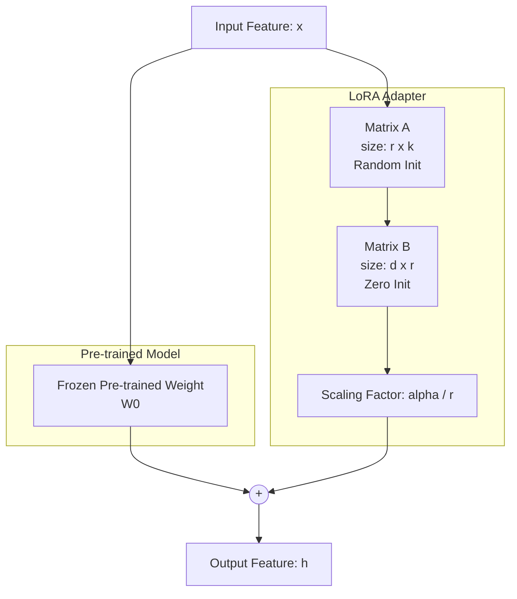

# Low-Rank Adaptation (LoRA)

## Summary

Low-Rank Adaptation (LoRA) là một kỹ thuật tinh chỉnh tham số hiệu quả (Parameter-Efficient Fine-Tuning - PEFT) dành cho các Mô hình Ngôn ngữ Lớn (LLMs). Thay vì phải huấn luyện lại toàn bộ hàng tỷ tham số của mô hình (Full Fine-tuning), LoRA đóng băng các trọng số gốc và chỉ huấn luyện một lượng nhỏ các tham số mới thông qua các ma trận hạng thấp (low-rank matrices). Phương pháp này giúp giảm đáng kể yêu cầu về phần cứng (VRAM) và thời gian huấn luyện mà vẫn duy trì hiệu suất tương đương với việc tinh chỉnh toàn bộ mô hình.

---

## Definition

**Low-Rank Adaptation (LoRA)** là một phương pháp tối ưu hóa toán học được giới thiệu bởi các nhà nghiên cứu của Microsoft. Kỹ thuật này dựa trên giả thuyết "hạng nội tại" (intrinsic rank): khi các mô hình khổng lồ được tinh chỉnh cho một tác vụ cụ thể, sự thay đổi của các trọng số thực chất nằm trong một không gian chiều thấp (low-dimensional space). 

Do đó, LoRA xấp xỉ ma trận cập nhật trọng số ($\Delta W$) bằng tích của hai ma trận nhỏ hơn nhiều ($A$ và $B$) với hạng (rank) là $r$. Nhờ vậy, số lượng tham số cần huấn luyện giảm đi hàng nghìn lần so với kích thước gốc của mô hình.

---

## Why it exists

Với sự bùng nổ của GenAI, các mô hình như GPT-3, Llama 3 hay Mistral có kích thước từ hàng tỷ đến hàng nghìn tỷ tham số. 
Việc tinh chỉnh toàn bộ (Full Fine-tuning) các mô hình này vấp phải những rào cản cực lớn:
1. **Chi phí phần cứng khổng lồ**: Tinh chỉnh toàn bộ mô hình 70 tỷ tham số yêu cầu nhiều card GPU A100/H100 (mỗi card 80GB VRAM) chỉ để chứa Optimizer States và Gradients.
2. **Quản lý rủi ro Catastrophic Forgetting**: Việc cập nhật toàn bộ trọng số dễ làm mô hình "quên" đi các kiến thức tổng quát đã học được ở giai đoạn Pre-training.
3. **Lưu trữ và Triển khai**: Mỗi khi tinh chỉnh toàn bộ mô hình cho một khách hàng hoặc tác vụ mới, bạn phải tạo ra một bản sao hoàn chỉnh của LLM (nặng hàng chục đến hàng trăm GB), gây lãng phí dung lượng cực lớn.

LoRA ra đời để dân chủ hóa (democratize) việc huấn luyện LLM, cho phép tinh chỉnh các mô hình hàng tỷ tham số chỉ bằng 1 hoặc 2 GPU dân dụng (như RTX 3090/4090), đồng thời tạo ra các "Adapter" siêu nhẹ (chỉ vài chục MB) có thể lắp ghép linh hoạt.

---

## Core idea

Cốt lõi của LoRA nằm ở đại số tuyến tính cơ bản. Giả sử ma trận trọng số gốc của mô hình là $W_0 \in \mathbb{R}^{d \times k}$ (kích thước $d$ hàng, $k$ cột). 

Trong Full Fine-tuning, chúng ta học một ma trận cập nhật $\Delta W$ có cùng kích thước, nên trọng số mới sẽ là: 
$$W = W_0 + \Delta W$$

LoRA giới hạn $\Delta W$ bằng cách biểu diễn nó dưới dạng tích của hai ma trận $A$ và $B$:
$$\Delta W = B \times A$$
Trong đó:
* $B \in \mathbb{R}^{d \times r}$
* $A \in \mathbb{R}^{r \times k}$
* $r \ll \min(d, k)$ (Hạng $r$ nhỏ hơn rất nhiều so với $d$ và $k$).

Ví dụ: Nếu $d = 4096, k = 4096$, $\Delta W$ có hơn 16.7 triệu tham số. Nhưng nếu chọn $r = 8$, ma trận $A$ có $8 \times 4096 = 32.768$ tham số, ma trận $B$ cũng có $32.768$ tham số. Tổng cộng chỉ cần học $\sim 65$ nghìn tham số (giảm hơn 250 lần!).

---

## How it works

Quy trình hoạt động của LoRA trong thực tế trải qua 4 bước:

1. **Khởi tạo và Đóng băng**: Mô hình gốc được tải lên bộ nhớ. Trọng số gốc $W_0$ bị đóng băng (frozen) – nghĩa là chúng không nhận gradient và không bị thay đổi.
2. **Chèn Adapter**: Các ma trận $A$ và $B$ (gọi là LoRA adapters) được gắn song song vào các lớp tuyến tính (linear layers), phổ biến nhất là các ma trận Query, Key, Value trong cơ chế Attention.
   * Ma trận $A$ được khởi tạo bằng phân phối ngẫu nhiên (Gaussian).
   * Ma trận $B$ được khởi tạo bằng **toàn số 0** (zero matrix). Điều này đảm bảo ban đầu $\Delta W = B \times A = 0$, giúp output của mô hình chưa tinh chỉnh không bị sai lệch ở epoch đầu tiên.
3. **Huấn luyện**: Chỉ tính toán gradient và cập nhật trọng số cho $A$ và $B$.
4. **Suy luận (Inference)**: Sau khi huấn luyện, người dùng có thể tải adapter nhẹ này và cộng gộp trực tiếp (merge) vào trọng số gốc: $W_{merged} = W_0 + B \times A$. Quá trình tính toán lúc này diễn ra bình thường trên $W_{merged}$ mà không phải chịu bất kỳ độ trễ (latency overhead) nào.

---

## Architecture / Flow

Dưới đây là kiến trúc luồng dữ liệu mô tả cơ chế của LoRA được gắn song song với một lớp trọng số có sẵn:



*Trong đó*: $\alpha$ (alpha) là hệ số mở rộng giúp định cỡ ảnh hưởng của LoRA adapter lên trọng số gốc.

---

## Practical example

Một Data Engineer được giao nhiệm vụ tạo ra một AI SQL Bot từ mô hình Llama-3-8B. Mô hình gốc không giỏi việc tạo SQL chuẩn PostgreSQL dựa trên schema nội bộ.

Thay vì Full Fine-tuning tốn kém, kỹ sư quyết định dùng LoRA:
1. **Dữ liệu**: Chuẩn bị bộ dữ liệu 10,000 cặp câu hỏi tự nhiên và câu lệnh SQL tương ứng (text-to-sql dataset).
2. **Cấu hình LoRA**:
   * Áp dụng LoRA vào các lớp của mô đun Attention: `q_proj`, `k_proj`, `v_proj`, `o_proj`.
   * Chọn Rank $r = 16$.
   * Chọn hệ số $\alpha = 32$.
3. **Huấn luyện**: Quá trình huấn luyện chỉ chạy trên một GPU RTX 4090 24GB mất khoảng 3 giờ.
4. **Kết quả**: Kỹ sư thu được một thư mục Adapter nặng khoảng `80MB`. 
5. **Triển khai**: Khi deploy, kỹ sư tải model Llama-3-8B (nặng 16GB), sau đó tiêm `80MB` Adapter này vào. Bot giờ đây viết SQL xuất sắc mà phần cứng huấn luyện chỉ bằng một góc nhỏ.

**Ví dụ thiết lập LoRA với thư viện PEFT của HuggingFace:**

```python
from peft import LoraConfig, get_peft_model
from transformers import AutoModelForCausalLM

# Tải mô hình gốc (Base Model)
base_model = AutoModelForCausalLM.from_pretrained("meta-llama/Meta-Llama-3-8B")

# Định nghĩa cấu hình LoRA
lora_config = LoraConfig(
    r=16,               # Hạng của ma trận (Rank)
    lora_alpha=32,      # Hệ số scale
    target_modules=["q_proj", "v_proj"], # Các lớp Attention để tiêm LoRA vào
    lora_dropout=0.05,
    bias="none",
    task_type="CAUSAL_LM"
)

# Bọc mô hình gốc với cấu hình LoRA (Chỉ huấn luyện adapter)
peft_model = get_peft_model(base_model, lora_config)
peft_model.print_trainable_parameters()
# Output: trainable params: 6,815,744 || all params: 8,037,076,992 || trainable%: 0.0848%
```

---

## Best practices

* **Thiết lập $r$ và $\alpha$**: Một quy tắc ngón tay cái (rule of thumb) phổ biến là đặt $\alpha = 2 \times r$. Các giá trị rank $r$ phổ biến nhất là 8, 16, 32 hoặc 64. Không phải lúc nào $r$ lớn cũng tốt hơn.
* **Mục tiêu chèn LoRA (Target Modules)**: Luôn áp dụng LoRA cho tất cả các trọng số trong khối Attention (Query, Key, Value, Output). Áp dụng thêm vào MLP layers (up_proj, down_proj) nếu bộ dữ liệu thực sự lớn và tác vụ khó, nhưng sẽ tốn VRAM hơn.
* **Learning Rate**: LoRA thường đòi hỏi Learning Rate (tốc độ học) **cao hơn** so với Full Fine-tuning. Các giá trị như `1e-4`, `2e-4` hoặc `3e-4` sử dụng thuật toán AdamW thường cho kết quả tốt.
* **Kết hợp lượng tử hóa (QLoRA)**: Nếu VRAM quá eo hẹp, hãy sử dụng QLoRA. Mô hình gốc $W_0$ sẽ được nén xuống 4-bit (chỉ để đọc), trong khi ma trận $A$ và $B$ của LoRA được giữ ở 16-bit (BFloat16) để huấn luyện.

---

## Common mistakes

* **Quên hợp nhất trọng số (Merge weights)**: Chạy mô hình suy luận bằng cách load song song model gốc và adapter. Việc này làm tăng độ trễ (inference latency) vì phải tính toán hai nhánh ma trận rời rạc. Lời khuyên là sử dụng kịch bản merge adapter vào model gốc trước khi deploy production.
* **Khởi tạo sai ma trận B**: Nếu khởi tạo cả $A$ và $B$ là số ngẫu nhiên, mô hình sẽ bị "sốc" ở bước đầu vì cộng thêm một ma trận nhiễu cực lớn vào không gian biểu diễn, làm hàm mất mát (loss) phân kỳ. Ma trận $B$ bắt buộc phải khởi tạo bằng 0.
* **Sử dụng LoRA cho tác vụ "Học kiến thức gốc"**: Cố gắng dạy cho LLM tiếng Anh một ngôn ngữ hoàn toàn mới (ví dụ: tiếng Việt) chỉ bằng LoRA với rank nhỏ. Việc thêm kiến thức cốt lõi mới thường đòi hỏi Continual Pre-training (hoặc Full Fine-Tuning) thay vì PEFT.

---

## Trade-offs

### Ưu điểm
* **Tiết kiệm tài nguyên**: Giảm hơn 90% bộ nhớ VRAM cần thiết và 99% số lượng tham số được huấn luyện.
* **Tính di động**: File trọng số cuối cùng (Adapter) rất nhẹ (chỉ vài chục đến vài trăm MB), dễ dàng phân phối và chia sẻ trên HuggingFace.
* **Triển khai đa mô hình (Multi-tenant)**: Cùng một mô hình gốc có thể được tải lên bộ nhớ 1 lần, và phục vụ hàng chục khách hàng khác nhau bằng cách "rút/cắm" (swap) nhanh các file LoRA Adapter siêu nhỏ theo từng request (như trong kiến trúc vLLM hoặc Lorax).
* **Không tăng độ trễ**: Khi đã merge adapter vào model, tốc độ inference giống hệt model gốc.

### Nhược điểm
* **Giới hạn khả năng tiếp thu mới**: Do không gian biểu diễn bị bóp nhỏ (hạng thấp), LoRA không lý tưởng cho các tác vụ thay đổi hoàn toàn miền dữ liệu (domain shift mạnh).
* **Quá tải siêu tham số**: Đòi hỏi kỹ sư phải tinh chỉnh thêm các tham số mới như $r$, $\alpha$ và chọn đúng lớp (target modules) để tiêm LoRA vào.

---

## When to use

* Tinh chỉnh mô hình (Instruction Tuning) để mô hình nghe lời và tuân theo định dạng (JSON, SQL, Markdown) từ một mô hình Base.
* Tinh chỉnh để áp dụng văn phong, giọng điệu cụ thể của doanh nghiệp (Chatbot Support, Copywriting).
* Môi trường có tài nguyên phần cứng giới hạn (Consumer GPUs) hoặc ngân sách đám mây (Cloud) hạn hẹp.
* Hệ thống cần cung cấp các mô hình tùy chỉnh cá nhân hóa cho hàng ngàn người dùng (chia sẻ cùng một Base LLM).

## When not to use

* Cần dạy cho mô hình kiến thức thực tế hoàn toàn mới (ví dụ dạy kiến thức nội bộ y khoa chuyên sâu từ con số 0), hoặc dạy một ngôn ngữ mới.
* Huấn luyện mô hình từ đầu (Pre-training).
* Khi tài nguyên phần cứng cực kỳ dồi dào và nhóm cần đạt được sự hoàn hảo tuyệt đối của độ chính xác, trong trường hợp này Full Fine-Tuning vẫn có lợi thế hơn.

---

## Related concepts

* [Large Language Models (LLM)](/concepts/llm)
* [Fine-Tuning](/concepts/fine-tuning)
* [Model Serving](/concepts/model-serving)
* [Quantization (Lượng tử hóa)](/concepts/quantization)

---

## Interview questions

### 1. Tại sao ma trận B trong LoRA lại được khởi tạo bằng 0, trong khi ma trận A được khởi tạo ngẫu nhiên (Gaussian)?
* **Người phỏng vấn muốn kiểm tra**: Hiểu biết nền tảng về toán học và sự ổn định của mạng neural trong quá trình huấn luyện.
* **Gợi ý trả lời (Strong Answer)**: Ma trận B phải được khởi tạo bằng toàn số 0 để đảm bảo tích $\Delta W = B \times A = 0$ tại thời điểm bắt đầu (step 0). Điều này có nghĩa là khi mới bắt đầu huấn luyện, mô hình hoạt động y hệt mô hình Pre-trained gốc mà không bị lệch kết quả. Nếu khởi tạo cả A và B ngẫu nhiên, mô hình sẽ cộng thêm nhiễu loạn cực lớn vào trọng số gốc, gây tăng đột biến hàm Loss (loss spike) và mất đi những gì đã học từ Pre-training. A được khởi tạo ngẫu nhiên để đảm bảo ma trận tích không bị tắc (symmetry breaking), cho phép gradient chảy qua và học được.

### 2. Sự khác biệt giữa LoRA và QLoRA là gì?
* **Người phỏng vấn muốn kiểm tra**: Kiến thức thực chiến về việc tiết kiệm VRAM trong GenAI.
* **Gợi ý trả lời (Strong Answer)**: LoRA tối ưu số lượng tham số huấn luyện nhưng vẫn tải trọng số mô hình gốc $W_0$ ở định dạng 16-bit (FP16/BF16), vốn vẫn chiếm lượng VRAM lớn. QLoRA (Quantized LoRA) cải tiến bằng cách lượng tử hóa (ép nén) trọng số gốc $W_0$ xuống định dạng 4-bit (như NormalFloat4 - NF4), giúp giảm thêm 4 lần bộ nhớ mô hình gốc. Dữ liệu khi đi qua mô hình 4-bit sẽ được "giải nén" một phần lên 16-bit để thực hiện tính toán với ma trận LoRA A và B (vẫn ở 16-bit). QLoRA đánh đổi một chút năng lực tính toán lấy sự tiết kiệm VRAM cực độ.

### 3. Có sự sụt giảm về tốc độ (latency) khi chạy suy luận với một mô hình được tinh chỉnh bằng LoRA không?
* **Người phỏng vấn muốn kiểm tra**: Hiểu biết về quy trình triển khai (Model Serving) thực tế.
* **Gợi ý trả lời (Strong Answer)**: Tùy thuộc vào cách triển khai. Nếu giữ nguyên Adapter và chạy riêng rẽ (tính toán hai nhánh song song rồi cộng kết quả), suy luận sẽ chậm hơn do phát sinh thao tác tính toán ma trận bổ sung. Tuy nhiên, trong môi trường Production thực tế, người ta luôn dùng kỹ thuật "Weight Merging" – cộng trực tiếp ma trận $\Delta W$ vào trọng số $W_0$ tạo thành một trọng số thống nhất duy nhất ($W_{merged}$) trước khi phục vụ. Bằng cách này, tốc độ suy luận (Inference Latency) hoàn toàn bằng 0 (không khác gì chạy mô hình Base).

### 4. Hệ số Alpha ($\alpha$) trong cấu hình LoRA có ý nghĩa gì?
* **Người phỏng vấn muốn kiểm tra**: Kinh nghiệm tinh chỉnh siêu tham số thực tế.
* **Gợi ý trả lời (Strong Answer)**: Hệ số Alpha là một hằng số dùng để nhân (scale) kết quả đầu ra của ma trận LoRA $\Delta W$ trước khi cộng vào mô hình gốc. Cụ thể, ma trận $\Delta W$ được nhân với tỷ lệ $\frac{\alpha}{r}$. Mục đích của $\alpha$ là để giữ cho cường độ (magnitude) của các cập nhật ổn định khi chúng ta thay đổi hạng $r$. Nếu ta tăng $r$ mà không có $\alpha$, tổng tác động của ma trận LoRA sẽ quá lớn. Thông thường, người ta thiết lập $\alpha = 2r$.

---

## References

1. **LoRA: Low-Rank Adaptation of Large Language Models** - Edward J. Hu, et al. (Bài báo khoa học gốc từ Microsoft - 2021).
2. **QLoRA: Efficient Finetuning of Quantized LLMs** - Tim Dettmers, et al. (Bài báo gốc về QLoRA - 2023).
3. **Hugging Face PEFT Library Documentation** (Tài liệu chính thức về cách sử dụng LoRA và QLoRA trên HuggingFace).
4. **Practical Deep Learning for Coders** - fast.ai (Khóa học ứng dụng thực tế các kỹ thuật PEFT vào NLP).

---

## English summary

Low-Rank Adaptation (LoRA) is a Parameter-Efficient Fine-Tuning (PEFT) technique designed to adapt Large Language Models (LLMs) with minimal computational and memory footprints. Instead of fine-tuning all parameters of the pre-trained model (which is frozen), LoRA injects trainable low-rank decomposition matrices ($A$ and $B$) into specific network layers (typically Attention modules). This dramatically reduces the number of trainable parameters by up to 10,000 times, allowing billion-parameter models to be fine-tuned on consumer GPUs without catastrophic forgetting. During inference, the learned adapter weights can be seamlessly merged with the base model, yielding zero additional latency overhead. LoRA adapters are extremely lightweight and highly portable.
