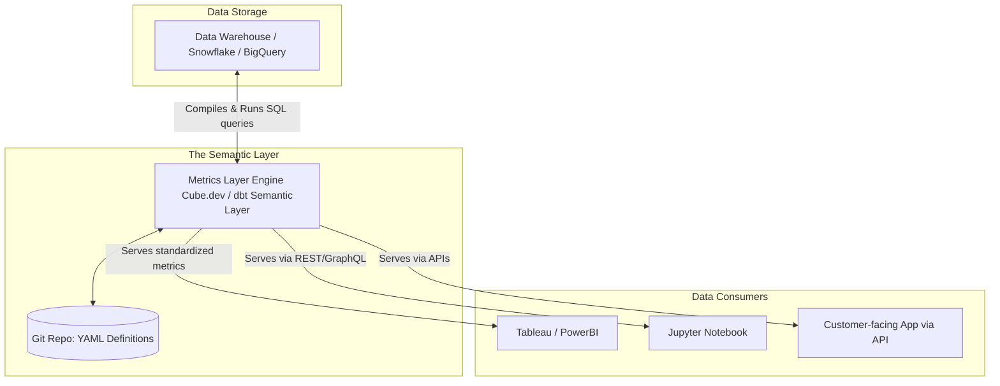

# Lớp ngữ nghĩa chỉ số - Metrics Layer

## Summary

Metrics Layer (hay Semantic Layer, Headless BI) là một lớp kiến trúc nằm giữa tầng Data Warehouse và các công cụ tiêu thụ dữ liệu (BI Tools, ML Models, SaaS Apps). Nó phục vụ như một kho lưu trữ tập trung chuyên định nghĩa logic của các chỉ số kinh doanh (Metrics) và các chiều phân tích (Dimensions). Mục tiêu của lớp này là đảm bảo "Single Source of Truth" (Nguồn sự thật duy nhất) cho các con số, khắc phục tình trạng cùng một chỉ số "Doanh thu" nhưng mỗi phòng ban lại có một cách tính và ra một kết quả khác nhau ở các công cụ BI khác nhau.

---

## Definition

**Metrics Layer** là một kho chứa code trung tâm (thường được định nghĩa bằng YAML hoặc SQL mở rộng) cho phép Data/Analytics Engineers xác định rõ ràng:
1. Định nghĩa thế nào là một "Active User", "Revenue", "Churn Rate".
2. Logic tính toán (Aggregation) là SUM, COUNT DISTINCT, hay AVERAGE.
3. Các chiều dữ liệu có thể cắt lớp (Dimensions) như Vùng miền, Thời gian, Kênh bán hàng.

Khi các ứng dụng hoặc công cụ trực quan (Tableau, PowerBI, Excel, API) muốn truy xuất chỉ số, chúng không viết câu lệnh SQL đếm dữ liệu trực tiếp từ Database. Thay vào đó, chúng truy vấn Metrics Layer. Metrics Layer sẽ biên dịch yêu cầu đó thành câu lệnh SQL chuẩn hóa, chạy trên Data Warehouse và trả về kết quả.

---

## Why it exists

Vấn đề kinh điển của các doanh nghiệp sử dụng dữ liệu là **"Sự hỗn loạn chỉ số" (Metric Sprawl / BI Sprawl)**.
* **Cảnh tượng quen thuộc**: Trong cuộc họp ban giám đốc, Giám đốc Marketing (dùng Google Looker Studio) báo cáo tổng doanh thu tháng là 10 tỷ. Giám đốc Bán hàng (dùng Tableau) lại báo cáo doanh thu là 12 tỷ. Đội Kế toán (dùng Excel) lại báo con số 9 tỷ.
* **Nguyên nhân**: Mặc dù cả ba đội đều lấy dữ liệu từ một kho Data Warehouse, nhưng logic tính toán được giấu kín (hardcoded) bên trong các biểu đồ BI. Đội Marketing loại trừ đơn hàng bị hoàn trả, đội Sales tính cả đơn đặt trước, đội Kế toán trừ đi thuế VAT.
* Mỗi lần chuyển công cụ BI mới, công ty phải viết lại toàn bộ công thức tính toán từ đầu.

Metrics Layer tồn tại để tách rời (decouple) phần **Định nghĩa chỉ số** ra khỏi **Công cụ hiển thị (BI)**.

---

## Core idea

Ý tưởng chủ đạo là "Định nghĩa một lần, sử dụng mọi nơi" (Define once, use anywhere) — còn được gọi là kiến trúc **Headless BI**.
* **Headless**: Công cụ BI (như Tableau) chỉ đóng vai trò là cái "đầu" (giao diện hiển thị biểu đồ).
* **Body**: Metrics Layer là "cơ thể" chứa não bộ tính toán.

Bằng cách mã hóa định nghĩa chỉ số vào trong kho lưu trữ Git (Git-controlled), tổ chức có thể áp dụng các quy trình phát triển phần mềm (Version Control, Code Review, Testing) cho các công thức kinh doanh. Mọi thay đổi về cách tính "Doanh thu" đều phải được review qua Pull Request, và khi thay đổi, toàn bộ các công cụ BI kết nối vào hệ thống sẽ được tự động cập nhật kết quả mới.

---

## How it works

Quy trình hoạt động cơ bản của một kiến trúc tích hợp Metrics Layer (ví dụ sử dụng dbt Semantic Layer hoặc Cube.js):

1. **Định nghĩa (Definition)**: Analytics Engineer khai báo metric trong file YAML:
   ```yaml
   metrics:
     - name: monthly_revenue
       description: Tổng doanh thu đã thanh toán thành công, trừ đi hàng hoàn.
       type: sum
       sql: amount_paid - amount_refunded
       timestamp: order_created_at
       dimensions:
         - country
         - product_category
   ```
2. **Biên dịch (Compilation)**: Một công cụ BI (hoặc API client) gửi truy vấn: *"Cho tôi monthly_revenue cắt theo country trong tháng 5"*.
3. **Thực thi (Execution)**: Metrics Layer tiếp nhận yêu cầu, kết hợp định nghĩa YAML với cấu trúc bảng (Table/View) dưới Data Warehouse để sinh ra một câu lệnh SQL phức tạp (SQL Generation), thực thi nó trực tiếp trên kho dữ liệu (như BigQuery/Snowflake) và trả kết quả về cho BI.

---

## Architecture / Flow



---

## Practical example

Một ứng dụng SaaS cung cấp Dashboard cho khách hàng xem số lượt click. Thay vì để backend app gọi SQL đếm click từng bảng một rất dễ sai sót và chậm chạp, hệ thống backend sử dụng GraphQL API gọi đến Metrics Layer (ví dụ Cube.js).

* **Truy vấn từ App**: 
  ```graphql
  query {
    clicksMetrics(
      timeDimensions: [{
        dimension: "clicks.created_at"
        dateRange: ["2026-05-01", "2026-05-31"]
      }]
    ) {
      count
    }
  }
  ```
* Metrics layer tự động phát sinh SQL kèm theo cơ chế lưu cache tinh vi (caching) để đáp ứng API cực nhanh trong vài chục mili-giây, che giấu hoàn toàn độ phức tạp của các lệnh JOIN trong Data Warehouse.

---

## Best practices

* **Quản trị phiên bản (Version Control)**: Bắt buộc quản lý mã nguồn Metrics Layer trên Git. Có cơ chế phê duyệt (Approve) từ Business Stakeholder trước khi merge các thay đổi định nghĩa.
* **Cộng tác kinh doanh**: Các định nghĩa mô tả (description) trong file cấu hình phải được viết bằng ngôn ngữ kinh doanh rõ ràng để người không chuyên kỹ thuật cũng đọc hiểu.
* **Tích hợp Cache**: Tận dụng cơ chế caching (như pre-aggregations của Cube.js) để tăng tốc độ phản hồi cho các dashboard trực tiếp đối mặt với người dùng cuối, giảm thiểu chi phí quét dữ liệu khổng lồ của DWH.

---

## Common mistakes

* **Xây dựng cả Logic ETL trong Metrics Layer**: Metrics Layer chỉ nên dùng để thực hiện các tính toán tổng hợp (Aggregation: Sum, Count, Avg) và lọc dữ liệu lúc truy vấn. Việc làm sạch, nối bảng phức tạp (Heavy JOINs, Data Cleansing) nên được thực hiện ở tầng Transformation (dbt/SQL) trước đó để tạo thành bảng Data Mart sạch sẽ.
* **Cố chấp ép mọi công cụ BI phải dùng**: Một số công cụ BI cổ điển (Legacy) có Semantic layer khép kín của riêng chúng (như PowerBI DAX hay Tableau Extracts) rất khó tích hợp trơn tru với Universal Metrics Layer bên ngoài.
* **Định nghĩa quá nhiều chỉ số rác**: Tạo hàng trăm metrics không ai dùng dẫn đến khó duy trì và bảo trì hệ thống.

---

## Trade-offs

### Ưu điểm
* **Single Source of Truth**: Loại bỏ hoàn toàn sự sai lệch số liệu giữa các phòng ban.
* **Sự tự do lựa chọn công cụ (Tool Agnostic)**: Dễ dàng chuyển đổi từ Tableau sang Looker hoặc Superset mà không phải viết lại logic kinh doanh.
* **Phục vụ đa kênh**: Cho phép không chỉ BI, mà cả Data Science Notebooks, LLM Agents hay ứng dụng nội bộ tái sử dụng chung một công thức.

### Nhược điểm
* **Độ phức tạp kiến trúc**: Thêm một lớp hệ thống cần phải duy trì, vận hành và trả phí.
* **Sự trưởng thành của công cụ**: Đây là khái niệm tương đối mới, các công cụ BI truyền thống hỗ trợ kết nối với Metrics Layer độc lập vẫn còn nhiều giới hạn hoặc yêu cầu Workarounds.
* **Đòi hỏi văn hóa Data Governance mạnh**: Nếu không có kỷ luật, cấu hình YAML lại trở thành mớ hỗn độn mới.

---

## When to use

* Khi tổ chức đang sử dụng 2-3 công cụ BI khác nhau cùng lúc (PowerBI cho Sales, Tableau cho Marketing, Metabase cho Product) và thường xuyên cãi nhau về số liệu.
* Khi bạn xây dựng ứng dụng Data-intensive nhúng (Embedded Analytics) trực tiếp vào sản phẩm của công ty cho khách hàng bên ngoài xem.
* Khi tổ chức muốn cho phép AI Chatbots/LLMs (GenAI) lấy dữ liệu chính xác — LLM hiểu các định nghĩa trong Semantic Layer tốt hơn rất nhiều so với việc bắt nó tự viết lệnh SQL thuần tuý.

## When not to use

* Tổ chức nhỏ gọn, chỉ dùng duy nhất 1 công cụ BI (như Looker - vốn đã có LookML là semantic layer riêng rất mạnh).
* Hệ thống dữ liệu quá đơn giản, báo cáo chỉ lặp lại vài bảng tính nhỏ không thay đổi định nghĩa theo thời gian.

---

## Related concepts

* Analytics Engineering
* [Data Warehouse](/concepts/data-warehouse)
* [Data Governance](/concepts/data-governance)
* Business Intelligence

---

## Interview questions

### 1. Phân biệt quá trình tính toán chỉ số (metric calculation) trong quá trình ETL (Data Transformation) và trong Metrics Layer?
* **Người phỏng vấn muốn kiểm tra**: Hiểu rõ ranh giới giữa tầng tạo dữ liệu và tầng biểu diễn dữ liệu.
* **Gợi ý trả lời (Strong Answer)**: 
  * Tính toán trong ETL/Transformation (ví dụ bằng dbt models) là quá trình "Vật lý hóa" (Pre-calculated/Materialized). Ta tính sẵn `revenue_by_day` và lưu thành bảng vật lý trong kho. Điều này cố định số chiều cắt lớp. Nếu người dùng muốn cắt theo `hour`, ta phải viết lại mô hình ETL mới.
  * Metrics Layer tính toán chỉ số một cách động (Dynamically at Query Time). Ta định nghĩa công thức cốt lõi cho `revenue` và cung cấp các `dimensions` đi kèm. Công cụ tự sinh ra câu truy vấn (Generate SQL) theo bất kỳ lát cắt nào mà người dùng yêu cầu trên giao diện, vô cùng linh hoạt mà không cần tạo thêm bảng vật lý nào ở Data Warehouse.
* **Lỗi cần tránh**: Cho rằng Data Transformation và Metrics Layer cạnh tranh hoặc thay thế hoàn toàn cho nhau (chúng thực tế bổ trợ nhau).

### 2. "Headless BI" có nghĩa là gì?
* **Người phỏng vấn muốn kiểm tra**: Hiểu biết về xu hướng phân tách phần mềm trong hệ thống phân tích.
* **Gợi ý trả lời (Strong Answer)**: Giống như "Headless CMS" trong phát triển Web, Headless BI là kiến trúc tách rời phần "đầu" (Giao diện người dùng/Dashboards hiển thị) ra khỏi phần "thân" (Logic xử lý dữ liệu và định nghĩa kinh doanh). Phần thân (Semantic Layer) đóng vai trò làm trung tâm phục vụ dữ liệu thông qua API, cho phép bất kỳ "đầu" nào (BI tools, AI, Web app) đều có thể lấy ra cùng một giá trị nhất quán.

---

## References

1. **"The Semantic Layer"** - Cẩm nang và tài liệu khái niệm từ dbt Labs, Cube.dev.
2. **Fundamentals of Data Engineering** - Joe Reis, Matt Housley (Chương về Serving Data for Analytics).

---

## English summary

The Metrics Layer (or Semantic Layer / Headless BI) is an architectural component that sits between the Data Warehouse and downstream consumption tools (BI, ML, APIs). It acts as a centralized, version-controlled repository where business logic, dimensions, and metric definitions (e.g., "Revenue", "Active Users") are standardized using code (YAML/SQL). By decoupling business definitions from visualization tools, it prevents "metric sprawl" and ensures a Single Source of Truth across the organization, allowing diverse consumers to query data dynamically without writing raw SQL or creating conflicting metrics.
