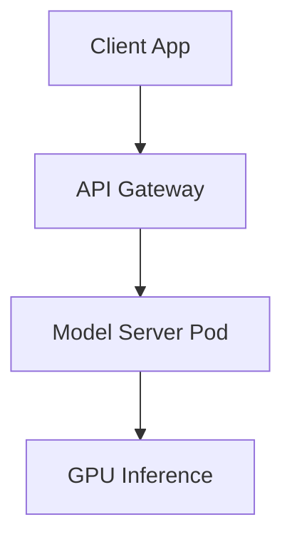

# Phục vụ mô hình (Model Serving)

## Summary

Phục vụ mô hình (Model Serving hay Model Inference Deployment) là quá trình đưa một mô hình Machine Learning hoặc Generative AI đã được huấn luyện vào môi trường thực tế (production) để nhận dữ liệu đầu vào mới và trả về kết quả dự đoán (inference). Đây là bước chuyển giao quan trọng trong vòng đời MLOps, biến một tệp tin chứa ma trận trọng số vô tri thành một dịch vụ phần mềm mang lại giá trị kinh doanh thực tế.

---

## Definition

**Model Serving** là cơ sở hạ tầng phần mềm làm nhiệm vụ cầu nối giữa quá trình Huấn luyện (Training) và quá trình Tiêu thụ (Consumption). Nó bao bọc các trọng số (weights) tĩnh và mã nguồn logic của mô hình thành một dịch vụ API (như REST/gRPC) hoặc một tác vụ luồng dữ liệu (Stream/Batch Job). 

Hệ thống Model Serving hiện đại phải đảm bảo tính mở rộng cao (scalability), khả năng chịu tải (high availability), độ trễ thấp (low latency) và tối ưu hóa việc sử dụng các phần cứng đắt tiền như GPU/TPU.

---

## Why it exists

Một mô hình Machine Learning khi huấn luyện xong thường chỉ là một tệp lưu trữ trên ổ đĩa (như `model.pkl` của Scikit-Learn, tệp `.onnx`, hoặc thư mục `safetensors` của HuggingFace). Bản thân các tệp này không thể trực tiếp tương tác với các ứng dụng Web, Mobile App hay Data Pipeline.

Để sử dụng mô hình, chúng ta không thể đơn thuần gọi nó như một hàm thư viện thông thường trong một máy chủ Web vì 3 lý do chính:
1. **Quản lý Tài nguyên (Memory Management)**: Các mô hình (nhất là LLM) rất lớn, cần phải được tải nguyên khối vào bộ nhớ RAM hoặc VRAM GPU **một lần duy nhất** khi khởi động. Nếu tải lại trong mỗi yêu cầu của người dùng, hệ thống sẽ sập ngay lập tức vì hết bộ nhớ hoặc thời gian chờ quá lâu.
2. **Khóa phần cứng (Concurrency Control)**: GPU thực hiện tính toán song song cực kỳ nhanh nhưng lại không giỏi trong việc chia sẻ tài nguyên cho nhiều yêu cầu rác rưởi riêng lẻ cùng lúc (concurrent threads).
3. **Môi trường phụ thuộc (Dependency Hell)**: Mô hình Python cực kỳ nhạy cảm với phiên bản thư viện (PyTorch, CUDA, Numpy). Cần một môi trường cô lập chặt chẽ để đảm bảo chạy mượt mà trên Production giống hệt lúc huấn luyện.

Model Serving tồn tại để xây dựng các hàng rào kiến trúc phần mềm giải quyết triệt để các bài toán này.

---

## Core idea

Cốt lõi của Model Serving là tối ưu hóa và trừu tượng hóa hàm dự đoán toán học $y = f(x)$. 

Một máy chủ Model Serving tiêu chuẩn sẽ quản lý toàn bộ vòng đời của một luồng xử lý:
1. **Dynamic Batching (Gom nhóm động)**: Tính năng quan trọng nhất. Thay vì gửi từng request vào GPU (rất lãng phí), Server sẽ chờ thêm vài mili-giây để gom 10-20 requests từ những người dùng khác nhau thành một ma trận lớn (Batch). GPU sẽ giải quyết ma trận này trong 1 lần tính toán duy nhất, cải thiện Thông lượng (Throughput) lên hàng chục lần.
2. **Serialization & Deserialization**: Dữ liệu gửi đến là JSON (text, số) được máy chủ chuyển hóa thành Tensors (ma trận đa chiều), và ngược lại Tensor đầu ra được đóng gói lại thành JSON hoặc Stream Bytes.
3. **Model Versioning & Rollout**: Hỗ trợ chạy song song phiên bản cũ (v1) và phiên bản mới (v2) của mô hình để kiểm thử A/B Testing hoặc Shadow Deployment mà không gây gián đoạn dịch vụ.

---

## How it works

Luồng hoạt động của một Server Model Serving tiêu biểu bao gồm 4 giai đoạn khi xử lý một Request:

1. **Tiếp nhận (Ingress)**: Client gửi request (ví dụ: một câu hỏi văn bản) đến API Gateway thông qua giao thức HTTP REST hoặc gRPC.
2. **Tiền xử lý (Preprocessing)**: Dữ liệu văn bản được làm sạch và chuyển thành các mã thông báo số (Tokenization) hoặc chuẩn hóa ảnh.
3. **Suy luận (Inference)**: 
   * Máy chủ Server đưa mảng số (Tensors) vào Engine Suy luận (như TensorRT, ONNX Runtime, vLLM).
   * Engine tiến hành các phép nhân ma trận trên GPU.
4. **Hậu xử lý (Postprocessing)**: Kết quả từ GPU (dạng số thực xác suất) được chuyển đổi ngược thành văn bản, nhãn phân loại (label) hoặc tọa độ khung hình.
5. **Trả về (Response)**: Máy chủ trả về JSON cho ứng dụng Client. Với GenAI (LLM), kết quả thường được trả về dưới dạng Server-Sent Events (SSE) để tạo hiệu ứng "gõ phím" từng từ (Streaming).

---

## Architecture / Flow

Sơ đồ dưới đây mô tả một kiến trúc Model Serving chuẩn với Load Balancer và hàng đợi (Queue) phục vụ Dynamic Batching:



---

## Practical example

Xét bài toán triển khai mô hình tạo sinh văn bản Llama-3-8B. Thay vì tự viết một server bằng FastAPI và PyTorch thuần túy, Data/ML Engineer sử dụng **vLLM** - một hệ thống Model Serving chuyên dụng cho GenAI.

Cách triển khai cực kỳ đơn giản qua Docker:
```bash
docker run --runtime nvidia --gpus all \
    -v ~/.cache/huggingface:/root/.cache/huggingface \
    -p 8000:8000 \
    --ipc=host \
    vllm/vllm-openai:latest \
    --model meta-llama/Meta-Llama-3-8B-Instruct \
    --max-model-len 4096
```

Lệnh trên khởi động một Inference Server mạnh mẽ. Khi Web App gọi đến cổng `:8000`, vLLM sẽ:
1. Tạo một API giả lập cấu trúc của OpenAI (`/v1/chat/completions`), giúp tương thích với mọi thư viện frontend.
2. Áp dụng kỹ thuật PagedAttention để quản lý bộ nhớ KV Cache, cho phép nhiều người dùng chat cùng lúc mà VRAM không bị phình to.
3. Stream kết quả trả về từng Token một (hiệu ứng typing).

**Ví dụ ứng dụng Web (Client) gọi API vLLM vừa khởi tạo:**

```python
import openai

# Trỏ thư viện OpenAI client về server vLLM local của bạn
client = openai.OpenAI(
    base_url="http://localhost:8000/v1",
    api_key="empty" # vLLM không yêu cầu API key mặc định
)

response = client.chat.completions.create(
    model="meta-llama/Meta-Llama-3-8B-Instruct",
    messages=[
        {"role": "user", "content": "Giải thích Model Serving là gì trong 2 câu."}
    ]
)
print(response.choices[0].message.content)
```

---

## Best practices

* **Đừng dùng API Server đa năng cho AI quy mô lớn**: Tránh dùng Flask/FastAPI/Django kết hợp với lệnh `model.predict()` trong production khi có GPU. Hãy sử dụng các Framework Model Serving chuyên dụng như: **Triton Inference Server** (Nvidia), **Ray Serve**, **TorchServe**, **TF Serving**, hoặc **vLLM/TGI** (cho LLM).
* **Tận dụng gRPC thay vì REST HTTP**: Với dữ liệu truyền vào lớn (như hình ảnh gốc, Audio), gRPC kết hợp với Protobuf có tốc độ truyền tải nhanh và tiết kiệm băng thông hơn nhiều so với JSON HTTP REST.
* **Sử dụng Định dạng Model tối ưu (Model Compilation)**: Thay vì serve trực tiếp mô hình PyTorch (tệp `.pt` hoặc `.bin`), hãy biên dịch (compile) nó sang định dạng **ONNX** hoặc **TensorRT**. Việc này giúp engine lược bỏ các phần không cần thiết và tối ưu hóa tập lệnh chạy riêng trên chip, tăng tốc độ xử lý lên nhiều lần.
* **Tách riêng Tiền xử lý (Pre-processing)**: Nếu quy trình tiền xử lý ảnh phức tạp (cắt, ghép, xoay), nên tách phần này chạy trên CPU ở một service riêng thay vì nhồi nhét chạy chung luồng GPU làm GPU bị tắc nghẽn chờ đợi dữ liệu (GPU Starvation).

---

## Common mistakes

* **Load mô hình ở mỗi request**: Một lỗi kinh điển của người mới là để lệnh `model = load_model('weight.pkl')` bên trong hàm xử lý route của API. Điều này sẽ load mô hình từ đĩa cứng vào RAM hàng nghìn lần mỗi khi có request, làm server chết ngay lập tức. Luôn load mô hình ở mức độ Global State khi server khởi động.
* **Quên cấu hình Giám sát (Monitoring)**: Dữ liệu thực tế thay đổi liên tục. Nếu không thiết lập công cụ đo lường Data Drift (độ lệch dữ liệu) hay Concept Drift, mô hình vẫn trả về HTTP 200 OK nhưng kết quả thực tế lại hoàn toàn sai lệch (Silent Failure).
* **Bỏ qua Offline/Batch Serving**: Không phải hệ thống nào cũng cần Real-time. Nếu tính năng là Gửi email gợi ý sản phẩm cho người dùng vào 8h sáng mai, hãy dùng Batch Serving (như Apache Spark, Airflow) đọc cả triệu dòng từ Data Warehouse, tính toán trong 1 giờ rồi lưu lại kết quả vào Database. Rẻ và an toàn hơn việc bắn API Real-time.

---

## Trade-offs

### Ưu điểm
* **Tách bạch (Decoupling)**: Ứng dụng Backend Web/Mobile không cần biết logic AI hay phải cài PyTorch/CUDA. Chỉ cần gửi JSON.
* **Khả năng mở rộng (Scalability)**: Khi lượng người dùng tăng vọt, chỉ cần dùng Kubernetes để spin-up thêm các Replica Pod chứa Model Server.
* **Tối ưu tài nguyên cực điểm**: Dynamic batching và PagedAttention giúp vắt kiệt công suất của từng GPU.

### Nhược điểm
* **Độ trễ mạng (Network Latency)**: Tách AI ra một server khác đồng nghĩa với việc mất thêm thời gian mạng (từ Frontend $\rightarrow$ Backend Web $\rightarrow$ Model Server).
* **Độ phức tạp hạ tầng**: Quản lý Docker/Kubernetes kết hợp với GPU, driver CUDA và Storage chia sẻ yêu cầu kỹ năng DevOps rất chuyên sâu.
* **Chi phí nhàn rỗi (Cold Start)**: Model cần tải vào RAM mất hàng chục giây. Việc scale-down về 0 để tiết kiệm tiền sẽ gây ra độ trễ cực lâu cho request đầu tiên (Cold Start).

---

## When to use

* Tích hợp AI vào sản phẩm Web, Mobile App cần phản hồi ngay lập tức (Real-time Inference).
* Cần phục vụ hàng ngàn người dùng cùng lúc với độ ổn định cao.
* Quản lý vòng đời mô hình phức tạp (Chạy A/B Testing giữa model cũ và mới để so sánh doanh thu thực tế).

## When not to use

* Đang trong giai đoạn phân tích dữ liệu, R&D hoặc chạy Jupyter Notebook.
* Các tác vụ phân tích dữ liệu khổng lồ không cần phản hồi lập tức (dự đoán churn rate khách hàng vào cuối tháng) $\rightarrow$ Nên dùng Batch Processing / Offline Serving.
* Edge Computing / On-device ML: Mô hình được nén siêu nhỏ và nhúng trực tiếp vào App chạy trên điện thoại người dùng (CoreML, TFLite), không có server tập trung.

---

## Related concepts

* MLOps
* [LLM (Large Language Models)](/concepts/llm)
* [Low-Rank Adaptation (LoRA)](/concepts/lora)
* Microservices Architecture

---

## Interview questions

### 1. Phân biệt Online/Real-time Serving và Offline/Batch Serving. Khi nào dùng cái nào?
* **Người phỏng vấn muốn kiểm tra**: Tư duy giải quyết vấn đề hệ thống dữ liệu và tối ưu chi phí.
* **Gợi ý trả lời (Strong Answer)**: 
  * *Online/Real-time Serving*: Khi ứng dụng cần phản hồi tức thì (dưới vài trăm mili-giây). Mô hình phải luôn được tải sẵn trên RAM/GPU chờ sẵn thông qua API. Tốn kém chi phí nhàn rỗi cao. Dùng cho hệ thống Gợi ý tìm kiếm, Chatbot, Anti-fraud thanh toán.
  * *Offline/Batch Serving*: Khi không có yếu tố cấp bách. Mô hình được gọi lên định kỳ (ví dụ chạy Job lúc 2h sáng), xử lý hàng triệu bản ghi từ Data Warehouse lưu lại DB, xong tắt hệ thống. Rất tiết kiệm vì dùng xong tắt máy. Dùng cho Recommendation Email Marketing, chấm điểm tín dụng cuối ngày.

### 2. Tại sao FastAPI/Flask thường không đủ tốt để Serve trực tiếp một mô hình AI có dùng GPU?
* **Người phỏng vấn muốn kiểm tra**: Hiểu biết sâu về cơ chế I/O và tối ưu GPU.
* **Gợi ý trả lời (Strong Answer)**: FastAPI/Flask rất tốt để làm Web Server nhưng thiết kế của chúng không phục vụ cho tài nguyên tính toán sâu (compute-bound) của GPU. Khi nhiều request ập tới, FastAPI sẽ spawn nhiều worker threads tranh nhau chiếm quyền đẩy Tensors vào GPU, làm gián đoạn bộ nhớ và có thể gây lỗi OOM (Out Of Memory). Ngoài ra, Flask/FastAPI thuần không có chức năng **Dynamic Batching** tự động gom nhóm nhiều request thành một ma trận lớn. Các Framework như Triton hay TorchServe sinh ra để giải quyết chính xác bài toán lập lịch cho GPU này.

### 3. Khái niệm Shadow Deployment trong Model Serving là gì?
* **Người phỏng vấn muốn kiểm tra**: Kiến thức về quy trình triển khai phần mềm (Release strategies).
* **Gợi ý trả lời (Strong Answer)**: Shadow Deployment là chiến lược triển khai ẩn. Khi bạn có mô hình V2 mới và không chắc nó có an toàn trên dữ liệu thực tế hay không. Hệ thống Load Balancer sẽ gửi (duplicate) yêu cầu của người dùng song song cho cả Mô hình V1 và V2. Người dùng sẽ luôn nhận kết quả từ V1 (đã ổn định). Kết quả của V2 chỉ được ghi lại vào log để kỹ sư đánh giá. Khi V2 chứng minh được độ chính xác và chịu tải tốt, V2 mới được thăng cấp thay thế V1 hoàn toàn.

---

## References

1. **Machine Learning Engineering in Action** - Ben Wilson (Kiến thức thực tế về triển khai và giám sát mô hình).
2. **NVIDIA Triton Inference Server Documentation** (Hệ sinh thái chuẩn công nghiệp cho Model Serving tối ưu phần cứng).
3. **vLLM: Easy, Fast, and Cheap LLM Serving** - Kwon et al. (Khái niệm PagedAttention tối ưu hóa LLM serving).
4. **Designing Machine Learning Systems** - Chip Huyen (Chương 7 & 8: Model Deployment and Prediction Service - Kiến thức nền tảng cực tốt về Online/Batch Serving).

---

## English summary

Model Serving is the critical infrastructure layer in MLOps that transitions a trained machine learning model from a static artifact into a robust, scalable production service. It wraps mathematical prediction logic within an API or stream processor, handling complex tasks such as request serialization, GPU memory management, and concurrent scaling. Key techniques like Dynamic Batching group independent requests together to maximize hardware throughput. For modern GenAI applications, specialized serving frameworks (e.g., vLLM, Triton Inference Server) are essential to mitigate memory bottlenecks like KV cache management, ensuring models deliver high throughput, low-latency predictions reliably to end-user applications.
