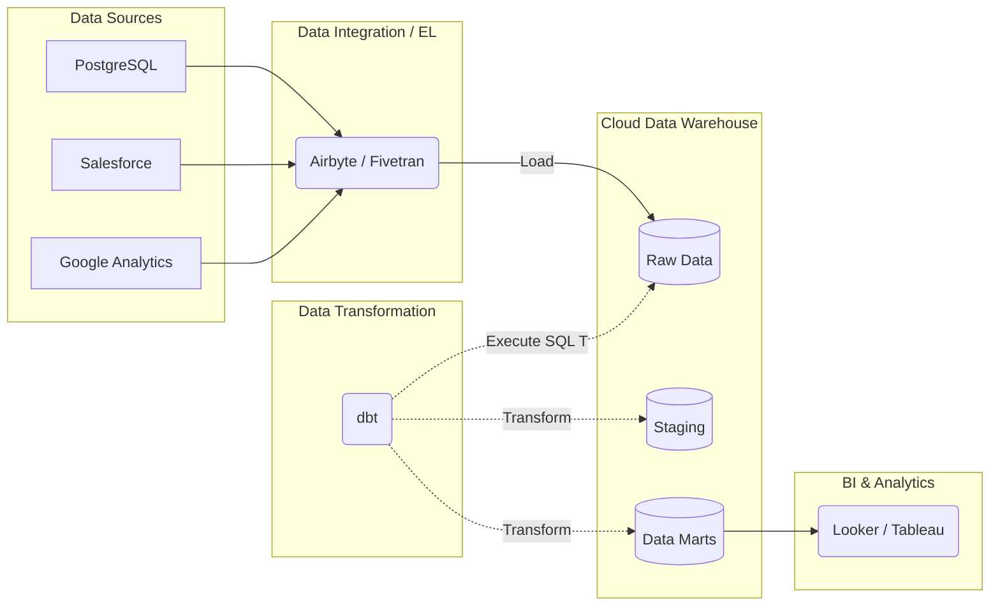

# Modern Data Stack

## Summary

Modern Data Stack (MDS) là một tập hợp các công cụ và nền tảng dữ liệu dựa trên điện toán đám mây (Cloud-native), được sử dụng để giảm bớt độ phức tạp trong việc xây dựng hệ thống phân tích doanh nghiệp. Thay vì xây dựng hoặc bảo trì phần mềm nội bộ tùy chỉnh, MDS cung cấp các giải pháp Phần mềm dạng dịch vụ (SaaS) lắp ghép được thiết kế cho người dùng chú trọng vào SQL và lấy Kho dữ liệu đám mây (Cloud Data Warehouse) làm trung tâm.

---

## Definition

**Modern Data Stack (MDS)** không phải là một công nghệ đơn lẻ, mà là một thuật ngữ chỉ hệ sinh thái các công cụ (Data tools) chuyên biệt, thường được kết nối với nhau xoay quanh một Cloud Data Warehouse trung tâm. 

Đặc trưng cốt lõi của MDS là sự thay đổi mô hình từ **ETL** (Trích xuất -> Chuyển đổi -> Nạp) sang mô hình **ELT** (Trích xuất -> Nạp -> Chuyển đổi), nơi sức mạnh tính toán khổng lồ của Cloud Data Warehouse được sử dụng để thực hiện việc chuyển đổi dữ liệu bằng ngôn ngữ SQL.

---

## Why it exists

Những năm 2010, xây dựng một hệ thống dữ liệu Hadoop On-premise đòi hỏi một đội ngũ kỹ sư phần mềm viết mã Java/Scala phức tạp, quản lý máy chủ Linux vật lý và điều phối các hệ thống phân tán khó hiểu. Việc tích hợp API từ Facebook Ads hay Salesforce đòi hỏi hàng tháng code tay.

Modern Data Stack xuất hiện nhằm **"dân chủ hóa dữ liệu" (Democratize Data)**:
1. Cho phép bất kỳ công ty nào cũng có thể có một hệ thống phân tích dữ liệu chuyên nghiệp trong vòng vài tuần (thậm chí vài ngày) thông qua các dịch vụ SaaS chỉ việc trả tiền và cấu hình.
2. Cho phép các **Data Analysts** (những người chỉ biết SQL) có thể làm công việc chuyển đổi dữ liệu của Data Engineers mà không cần biết code Python/Scala.

---

## Core idea

Ý tưởng cốt lõi của MDS là **Modularity (Tính module hóa) và Cloud-native**:
Thay vì dùng một bộ công cụ "tất cả trong một" của hãng Oracle hay IBM, MDS chia cắt quy trình ra thành các công cụ tinh gọn nhất, làm tốt nhất một nhiệm vụ duy nhất và dễ dàng kết nối với nhau.

Quy trình chuẩn của MDS (Mô hình ELT):
* **Extract & Load (EL)**: Lấy dữ liệu thô và thả thẳng vào Data Warehouse càng nhanh càng tốt.
* **Transform (T)**: Dùng SQL viết bên trong Data Warehouse để làm sạch và tổ chức dữ liệu.

---

## How it works (Các thành phần cấu trúc)

Một Modern Data Stack tiêu chuẩn bao gồm 4-5 tầng thành phần chính:

1. **Data Integration (Thu thập & Nạp dữ liệu tự động)**:
   - Các công cụ SaaS có sẵn hàng ngàn đầu nối (connectors) tới các cơ sở dữ liệu và API phổ biến. Chỉ cần điền API key, nó sẽ tự động đồng bộ data.
   - *Công cụ tiêu biểu*: Fivetran, Airbyte, Stitch.

2. **Cloud Data Warehouse (Kho lưu trữ trung tâm)**:
   - Trái tim của hệ thống. Tự động mở rộng quy mô tính toán mà không cần cấu hình cụm máy chủ phức tạp.
   - *Công cụ tiêu biểu*: Snowflake, Google BigQuery, Amazon Redshift.

3. **Data Transformation (Chuyển đổi bằng SQL)**:
   - Một công cụ quản lý các câu lệnh SQL để biến đổi dữ liệu thô thành dữ liệu mô hình báo cáo. Tích hợp kiểm soát phiên bản (Git), kiểm thử dữ liệu (Testing) theo phương pháp kỹ thuật phần mềm (Software Engineering).
   - *Công cụ tiêu biểu*: dbt (Data Build Tool), Dataform.

4. **Business Intelligence (Trực quan hóa)**:
   - Công cụ truy cập vào các bảng đã được làm sạch để vẽ biểu đồ và tạo báo cáo self-service cho quản lý kinh doanh.
   - *Công cụ tiêu biểu*: Looker, Tableau, Metabase, Superset.

5. **Data Orchestration & Observability (Điều phối và Giám sát)**:
   - Công cụ lập lịch chạy tuần tự các tác vụ trên (ví dụ chạy Fivetran trước, xong rồi chạy dbt).
   - *Công cụ tiêu biểu*: Apache Airflow, Dagster, Prefect.

---

## Architecture / Flow

---

## Practical example

Một công ty bán lẻ có dữ liệu kho ở MySQL và chi phí quảng cáo ở Facebook Ads. 
1. Họ dùng **Airbyte (EL)**: Cấu hình tài khoản Facebook và thông tin kết nối MySQL. Airbyte tự động đồng bộ hóa (replica) dữ liệu thô này vào BigQuery định kỳ 1 tiếng 1 lần.
2. Dữ liệu nằm trong **BigQuery** ở dạng JSON thô hoặc các bảng lộn xộn.
3. Kỹ sư phân tích (Analytics Engineer) viết các file SQL bằng **dbt (T)** để: JOIN bảng chi phí của Facebook với doanh thu đơn hàng kho để tính ra ROI, kiểm tra tính toàn vẹn khóa chính. dbt biên dịch và đẩy SQL vào BigQuery chạy.
4. Giám đốc xem báo cáo tỷ suất hoàn vốn ROI trực tiếp trên **Metabase (BI)** nối với bảng Data Mart cuối cùng của dbt.

Toàn bộ quy trình có thể được setup chỉ bởi 1 Kỹ sư Dữ liệu/Phân tích viên trong 1-2 tuần làm việc.

---

## Best practices

* **Tiêu chuẩn hóa với dbt**: Áp dụng quy trình kỹ thuật phần mềm vào phân tích dữ liệu: code SQL phải được quản lý trên Git, review qua Pull Request, CI/CD và viết test cases. dbt là công cụ bắt buộc phải có cho sự thành công của Modern Data Stack.
* **Tách biệt EL và T**: Tuyệt đối không viết logic xử lý dữ liệu (Transform) lồng vào trong các công cụ thu nạp (Airbyte/Fivetran). Hãy nạp dữ liệu thuần nguyên bản (raw data) vào Data Warehouse, sau đó dùng dbt xử lý để đảm bảo việc sửa lỗi logic dễ dàng.
* **Theo dõi chi phí Warehouse**: MDS dựa rất lớn vào sức mạnh tính toán của Cloud Data Warehouse. Nếu SQL viết kém hoặc lịch chạy dbt quá dày đặc (5 phút 1 lần dù báo cáo chỉ xem vào cuối ngày) sẽ sinh ra hóa đơn Cloud khổng lồ.

---

## Common mistakes

* **Quá tải SaaS (Công cụ chồng chéo)**: Có quá nhiều nhà cung cấp trong MDS khiến công ty mua hàng loạt công cụ (Reverse ETL, Data Catalog, Data Observability, Metrics Store...) dẫn đến chi phí bản quyền khổng lồ và dữ liệu bị phân mảnh.
* **Bỏ qua quản lý chi phí Compute**: Tầm nhìn của dbt là khuyến khích việc tạo bảng/views liên tục thông qua SQL (bản chất của dbt run). Nếu không có chính sách làm sạch, DWH sẽ chứa hàng ngàn view rác và sinh ra phí quét dữ liệu tốn kém.
* **Áp dụng MDS cho Real-time**: MDS là kiến trúc thiết kế để xử lý theo lô (Batch Processing). Việc cố ép Airbyte/dbt phải chạy streaming (trễ từng giây) là sai thiết kế.

---

## Trade-offs

### Ưu điểm
* **Triển khai thần tốc (Time-to-market)**: Rất dễ dàng thiết lập, phù hợp cho các doanh nghiệp vừa và nhỏ, Startup cần số liệu gấp.
* **Giảm nợ bảo trì (Low maintenance)**: Kỹ sư không phải đau đầu lo việc database server sập hay hỏng ổ đĩa, mọi thứ là SaaS và Cloud-managed.
* **Mở rộng vai trò của Data Analyst (Analytics Engineer)**: Nhà phân tích biết SQL có thể tự mình thực hiện end-to-end data pipeline.

### Nhược điểm
* **Chi phí tỷ lệ thuận với quy mô**: Khi dữ liệu lên đến ngưỡng Terabytes/Petabytes, chi phí chạy SQL trên BigQuery/Snowflake và phí trả cho Fivetran sẽ đội lên chóng mặt.
* **Vendor Lock-in (Ràng buộc nhà cung cấp)**: Bạn hoàn toàn phụ thuộc vào roadmap cập nhật của các công ty cung cấp SaaS.

---

## When to use

* Các Startup, công ty quy mô vừa (SME) và lớn, muốn nhanh chóng thiết lập hệ thống BI và báo cáo.
* Đội ngũ Kỹ thuật Dữ liệu mỏng nhưng có đội Data Analyst thạo SQL đông đảo.
* Ngân sách có thể đầu tư linh hoạt cho chi phí vận hành (OpEx) các gói SaaS đám mây.

## When not to use

* Doanh nghiệp có yêu cầu cực gắt về bảo mật, không được phép đưa dữ liệu lên Cloud (Government, Banking siêu bảo mật).
* Yêu cầu tính toán học máy phân tán khổng lồ (Spark/Databricks phù hợp hơn) hoặc xử lý thời gian thực độ trễ mili-giây (Kappa architecture, Kafka/Flink).

---

## Related concepts

* [Data Warehouse](/concepts/data-warehouse)
* [Cost Optimization](/concepts/cost-optimization)
* [Zero-Copy Cloning](/concepts/zero-copy-cloning)

---

## Interview questions

### 1. Sự chuyển dịch từ kiến trúc ETL truyền thống sang ELT trong Modern Data Stack giải quyết vấn đề gì?
* **Người phỏng vấn muốn kiểm tra**: Sự hiểu biết về kiến trúc phần mềm và động lực thị trường Cloud.
* **Gợi ý trả lời (Strong Answer)**: Trước đây hệ thống kho dữ liệu (On-premise) có phần cứng hữu hạn, do đó việc Transform (T) phải được làm bằng một máy chủ bên ngoài bằng Spark/Java để giảm tải cho kho dữ liệu (ETL). Ngày nay, nhờ Cloud Data Warehouse (Snowflake, BigQuery) tách biệt khả năng tính toán và lưu trữ, đồng thời sức mạnh xử lý song song khổng lồ, việc tải thẳng dữ liệu thô vào DWH và dùng ngay SQL của DWH để Transform (ELT) trở nên cực nhanh và rẻ. ELT còn bảo tồn toàn bộ dữ liệu gốc để có thể dễ dàng chạy lại logic bất cứ lúc nào.

### 2. dbt (Data Build Tool) là gì và tại sao nó đóng vai trò cốt lõi trong MDS?
* **Người phỏng vấn muốn kiểm tra**: Kiến thức về vai trò Analytics Engineer và công cụ Transform thế hệ mới.
* **Gợi ý trả lời (Strong Answer)**: dbt là công cụ cho phép các nhà phân tích sử dụng SQL thuần túy (với Jinja template) để thực hiện các phép biến đổi dữ liệu (Transform) bên trong kho dữ liệu. Nó quan trọng vì nó mang các phương pháp Software Engineering (như version control/Git, viết test cases kiểm tra null/unique, modularity, tự động tạo documentation lineage) vào thế giới lập trình SQL – điều mà trước đây các data analyst làm việc một cách tự do, thiếu kiểm soát.

---

## References

1. **dbt Labs Blog** - Nơi đặt nền móng và định nghĩa về Analytics Engineering và Modern Data Stack.
2. **Fundamentals of Data Engineering** - Joe Reis, Matt Housley (Chương 2 về vòng đời kỹ thuật dữ liệu).

---

## English summary

The Modern Data Stack (MDS) is a suite of modular, cloud-native SaaS tools built around a central Cloud Data Warehouse. It advocates for an ELT (Extract, Load, Transform) paradigm, where fully automated integration tools (like Fivetran or Airbyte) load raw data into cloud warehouses (like Snowflake or BigQuery), and SQL-based frameworks (such as dbt) handle the transformations. This architecture significantly lowers the barrier to entry, speeds up time-to-market, and empowers SQL-savvy analysts (Analytics Engineers) to build robust data pipelines using software engineering best practices.
