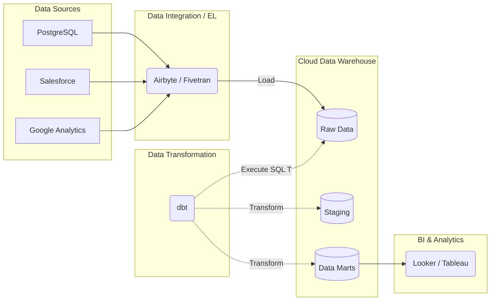

# Modern Data Stack (MDS): Hệ Sinh Thái Dữ Liệu Hiện Đại Trên Đám Mây

Cách đây khoảng một thập kỷ, việc xây dựng một hệ thống phân tích dữ liệu lớn (Big Data) cho doanh nghiệp là một nhiệm vụ vô cùng gian nan. Bạn cần một đội ngũ kỹ sư phần mềm hùng hậu để vận hành các cụm máy chủ vật lý On-premise chạy Hadoop, viết hàng ngàn dòng code Java/Scala phức tạp để xử lý dữ liệu và tự tay viết code kết nối với API của các dịch vụ như Facebook Ads hay Salesforce. 

Hôm nay, mọi thứ đã thay đổi hoàn toàn nhờ sự xuất hiện của **Modern Data Stack (MDS) - Hệ sinh thái dữ liệu hiện đại**.

Modern Data Stack không phải là một công cụ đơn lẻ, mà là một triết lý thiết kế hệ thống dữ liệu xoay quanh các dịch vụ đám mây (Cloud-native SaaS). MDS giúp đơn giản hóa tối đa quy trình thu thập, lưu trữ và biến đổi dữ liệu, cho phép các doanh nghiệp từ startup nhỏ đến tập đoàn lớn có thể xây dựng một hệ thống báo cáo BI hoàn chỉnh chỉ trong vòng vài tuần (thậm chí vài ngày) thay vì mất nhiều tháng như trước.

## Từ ETL truyền thống sang mô hình ELT hiện đại

Đặc trưng lớn nhất phân biệt Modern Data Stack với các kiến trúc cũ là sự dịch chuyển từ mô hình **ETL** (Extract - Transform - Load) sang **ELT** (Extract - Load - Transform).

* **ETL truyền thống**: Dữ liệu được trích xuất (Extract), đưa qua một máy chủ trung gian để làm sạch, biến đổi logic (Transform), rồi mới nạp (Load) vào kho dữ liệu. Nguyên nhân là do phần cứng của các Data Warehouse thế hệ cũ rất đắt đỏ và hữu hạn, không thể gánh nổi các tác vụ biến đổi dữ liệu nặng nề.
* **ELT hiện đại**: Dữ liệu thô từ các nguồn được trích xuất và nạp thẳng vào **Cloud Data Warehouse** (như Snowflake, BigQuery) mà không cần chế biến trước. Sau đó, chúng ta tận dụng sức mạnh tính toán phân tán gần như vô hạn và rẻ tiền của đám mây để thực hiện toàn bộ việc biến đổi dữ liệu bằng ngôn ngữ SQL trực tiếp bên trong kho dữ liệu.

---

## Các thành phần cốt lõi của Modern Data Stack

Một hệ thống Modern Data Stack tiêu chuẩn được xây dựng theo kiến trúc module hóa (lắp ghép các công cụ tốt nhất cho từng nhiệm vụ riêng biệt) và thường bao gồm các tầng sau:



### 1. Data Integration (Thu thập & Nạp dữ liệu tự động)
Thay vì tự viết code kết nối API, bạn sử dụng các công cụ SaaS có sẵn hàng ngàn cổng kết nối (connectors). Chỉ cần điền thông tin tài khoản và click chuột, dữ liệu sẽ tự động được đồng bộ vào kho.
* *Công cụ tiêu biểu*: Fivetran, Airbyte, Stitch.

### 2. Cloud Data Warehouse (Kho lưu trữ đám mây trung tâm)
Trái tim của toàn bộ hệ thống, nơi lưu trữ toàn bộ dữ liệu thô lẫn dữ liệu đã qua xử lý. Hệ thống tự động scale tài nguyên tính toán theo nhu cầu thực tế và tính phí theo lượng sử dụng.
* *Công cụ tiêu biểu*: Snowflake, Google BigQuery, Amazon Redshift.

### 3. Data Transformation (Chuyển đổi dữ liệu bằng SQL)
Công cụ quản lý các câu lệnh SQL để làm sạch và tổ chức dữ liệu thô thành các bảng báo cáo. Nó mang các tiêu chuẩn của kỹ nghệ phần mềm (quản lý mã nguồn bằng Git, viết test case kiểm tra chất lượng dữ liệu) áp dụng vào việc viết SQL.
* *Công cụ tiêu biểu*: dbt (Data Build Tool), Dataform.

### 4. Business Intelligence (Trực quan hóa dữ liệu)
Nơi người dùng cuối (nhân viên, ban giám đốc) truy cập để kéo thả, vẽ biểu đồ và tự phục vụ (self-service) nhu cầu phân tích số liệu của mình.
* *Công cụ tiêu biểu*: Looker, Tableau, Metabase, Superset.

### 5. Data Orchestration & Observability (Điều phối và Giám sát)
Nhạc trưởng điều phối lịch chạy tuần tự của toàn bộ hệ thống (ví dụ: kích hoạt Airbyte nạp dữ liệu xong, tự động gọi dbt chạy biến đổi, rồi gửi thông báo sang Slack nếu có lỗi).
* *Công cụ tiêu biểu*: Apache Airflow, Dagster, Prefect.

---

## Minh họa thực tế: Đường ống tính ROI quảng cáo

Hãy tưởng tượng bạn có dữ liệu bán hàng nằm ở database MySQL và chi phí chạy quảng cáo nằm ở tài khoản Facebook Ads.
1. Bạn cấu hình kết nối Facebook Ads và MySQL trên giao diện **Airbyte (EL)**. Airbyte sẽ tự động copy toàn bộ dữ liệu thô này thả vào **BigQuery (Warehouse)** sau mỗi một tiếng.
2. Tại BigQuery, dữ liệu Facebook Ads ban đầu nằm dưới dạng JSON thô rất khó đọc.
3. Analytics Engineer sẽ viết các đoạn mã SQL trong **dbt (T)** để thực hiện việc bóc tách JSON, JOIN bảng chi phí quảng cáo với bảng doanh số đơn hàng để tính toán tỷ suất hoàn vốn (ROI). dbt sẽ biên dịch đoạn code này và đẩy xuống BigQuery thực thi.
4. Cuối cùng, Giám đốc Marketing có thể mở dashboard trên **Metabase (BI)** để theo dõi hiệu quả chiến dịch một cách trực quan mà không cần biết viết một dòng code nào.

Dưới đây là một đoạn code dbt mẫu để tính toán ROI:

```sql
-- models/marts/marketing/fct_campaign_roi.sql
WITH facebook_ads AS (
    SELECT campaign_id, spend FROM {{ ref('stg_facebook_ads') }}
),
sales AS (
    SELECT campaign_id, SUM(revenue) as total_revenue FROM {{ ref('stg_sales') }} GROUP BY 1
)
SELECT 
    f.campaign_id,
    f.spend,
    COALESCE(s.total_revenue, 0) as revenue,
    (COALESCE(s.total_revenue, 0) - f.spend) / NULLIF(f.spend, 0) AS roi_percentage
FROM facebook_ads f
LEFT JOIN sales s ON f.campaign_id = s.campaign_id
```

---

## Cân nhắc ưu nhược điểm và kinh nghiệm thực chiến

### Những ưu điểm vượt trội (Pros)
* **Triển khai cực nhanh (Time-to-market)**: Rất phù hợp cho startup và các công ty vừa và nhỏ (SME) cần xây dựng nhanh hệ thống BI để ra quyết định kinh doanh.
* **Hạn chế tối đa nợ bảo trì**: Mọi công cụ cốt lõi đều là SaaS đám mây. Bạn không cần lo lắng về việc sập nguồn máy chủ hay hỏng ổ đĩa cứng.
* **Dân chủ hóa vai trò (Analytics Engineering)**: Trao quyền cho các nhà phân tích dữ liệu (chỉ cần thạo SQL) tự mình xây dựng các đường ống dữ liệu hoàn chỉnh mà không nhất thiết phải cần đến kỹ sư lập trình Python/Scala.

### Những hạn chế cần lưu ý (Cons)
* **Nguy cơ hóa đơn tăng vọt**: Vì tính phí theo lượng sử dụng, nếu bạn viết SQL cẩu thả hoặc cấu hình dbt chạy full-refresh quá liên tục (ví dụ chạy 5 phút một lần dù báo cáo chỉ xem cuối ngày) sẽ sinh ra hóa đơn Cloud khổng lồ vào cuối tháng.
* **Quá tải số lượng công cụ (Vendor Lock-in)**: Việc chia nhỏ quy trình thành nhiều công cụ chuyên biệt có thể dẫn đến việc doanh nghiệp phải trả phí bản quyền cho quá nhiều nhà cung cấp khác nhau và gặp khó khăn khi đồng bộ thông tin giữa chúng.

### Lời khuyên xương máu khi triển khai (Best Practices)
* **Tách biệt hoàn toàn nạp và biến đổi**: Đừng bao giờ viết logic làm sạch hay xử lý dữ liệu phức tạp bên trong các công cụ thu nạp như Airbyte hay Fivetran. Hãy luôn nạp dữ liệu thô nguyên bản (raw data) vào warehouse trước, sau đó mới dùng dbt để biến đổi. Điều này giúp bạn dễ dàng chạy lại (re-run) hệ thống khi có lỗi logic xảy ra.
* **Kiểm soát chi phí tính toán**: Lên lịch chạy pipeline phù hợp với nhu cầu thực tế của doanh nghiệp. Thiết lập các cảnh báo giới hạn chi phí trên Snowflake hay BigQuery để phát hiện kịp thời các truy vấn "ngốn" tiền.

---

## Khi nào nên và không nên chọn Modern Data Stack?

### Nên chọn khi:
* Doanh nghiệp đang chuyển dịch hệ thống lên Cloud hoặc xây dựng hạ tầng dữ liệu mới từ đầu.
* Bạn có đội ngũ Data Analyst thạo SQL đông đảo nhưng số lượng Kỹ sư dữ liệu (Data Engineer) còn mỏng.
* Cần tích hợp nhanh chóng hàng chục nguồn dữ liệu SaaS khác nhau để phục vụ báo cáo.

### Không nên chọn khi:
* Doanh nghiệp có yêu cầu cực kỳ khắt khe về bảo mật thông tin, không được phép đưa dữ liệu ra ngoài On-premise (như ngân hàng, quốc phòng).
* Hệ thống bắt buộc phải xử lý dữ liệu theo thời gian thực (độ trễ dưới 1 giây). MDS bản chất được thiết kế để xử lý dữ liệu theo lô (Batch Processing).

---

## Khái niệm liên quan

* [Data Warehouse](/concepts/data-warehouse)
* [Cost Optimization](/concepts/cost-optimization)
* [Zero-Copy Cloning](/concepts/zero-copy-cloning)

---

## Góc phỏng vấn: Câu hỏi thường gặp

### 1. Tại sao Modern Data Stack lại thúc đẩy sự chuyển dịch từ ETL sang ELT?
* **Mục đích của người phỏng vấn**: Đánh giá sự thấu hiểu của bạn về sự thay đổi kiến trúc phần mềm dữ liệu dưới tác động của công nghệ đám mây.
* **Gợi ý trả lời**:
  * Trước đây, tài nguyên lưu trữ và tính toán của các kho dữ liệu On-premise rất đắt đỏ và khó mở rộng. Do đó, chúng ta buộc phải trích xuất dữ liệu ra một máy chủ trung gian để lọc và biến đổi (Transform) trước khi nạp vào kho để tiết kiệm dung lượng (ETL).
  * Hiện nay, các Cloud Data Warehouse (Snowflake, BigQuery) đã tách biệt hoàn toàn bộ nhớ lưu trữ (rất rẻ) và bộ xử lý tính toán (có thể co giãn linh hoạt tức thì). Do đó, việc nạp trực tiếp dữ liệu thô vào kho rồi dùng chính SQL của kho để biến đổi (ELT) trở nên nhanh hơn, rẻ hơn và an toàn hơn rất nhiều. ELT cũng giúp bảo toàn dữ liệu gốc, giúp việc thay đổi logic kinh doanh sau này dễ dàng hơn mà không cần nạp lại dữ liệu từ nguồn.

### 2. dbt (Data Build Tool) đóng vai trò gì trong Modern Data Stack và tại sao nó lại được đánh giá cao như vậy?
* **Mục đích của người phỏng vấn**: Kiểm tra kiến thức của bạn về công cụ biến đổi dữ liệu tiêu chuẩn hiện nay.
* **Gợi ý trả lời**:
  * dbt đóng vai trò làm trung tâm của tầng biến đổi (Transform - chữ T trong ELT). Nó cho phép viết các câu truy vấn SQL lồng nhau một cách có tổ chức (nhờ cấu trúc modularity và hàm `ref()`).
  * dbt được đánh giá cao vì nó đã mang các tiêu chuẩn chất lượng của kỹ nghệ phần mềm (Software Engineering) áp dụng vào việc phân tích dữ liệu: quản lý mã nguồn bằng Git, viết test case tự động kiểm tra chất lượng dữ liệu (kiểm tra trùng lặp, giá trị null), tự động vẽ bản đồ dòng chảy dữ liệu (Data Lineage) và tự động tạo tài liệu hướng dẫn (documentation).

---

## Tài liệu tham khảo

1. **dbt Labs Blog** - *Các bài viết định hình khái niệm Analytics Engineering và MDS*.
2. **"Fundamentals of Data Engineering"** - Joe Reis & Matt Housley.

---

## English summary

The Modern Data Stack (MDS) is a suite of modular, cloud-native SaaS tools built around a central Cloud Data Warehouse. It advocates for an ELT (Extract, Load, Transform) paradigm, where fully automated integration tools (like Fivetran or Airbyte) load raw data into cloud warehouses (like Snowflake or BigQuery), and SQL-based frameworks (such as dbt) handle the transformations. This architecture significantly lowers the barrier to entry, speeds up time-to-market, and empowers SQL-savvy analysts (Analytics Engineers) to build robust data pipelines using software engineering best practices.
