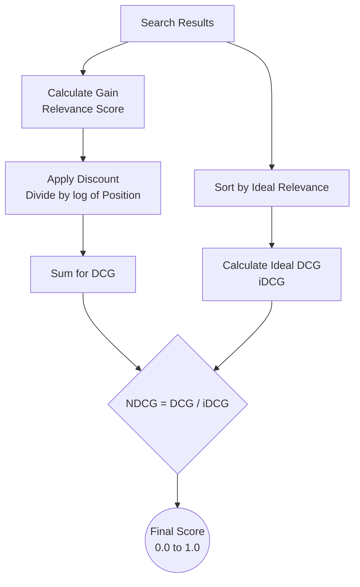

# Normalized Discounted Cumulative Gain - NDCG

## Summary

Normalized Discounted Cumulative Gain (NDCG) là một chỉ số (metric) tối quan trọng trong lĩnh vực Truy xuất Thông tin (Information Retrieval), Hệ thống Gợi ý (Recommender Systems) và Giai đoạn Reranking của RAG. Trái ngược với các chỉ số như Precision hay Recall chỉ quan tâm đến việc tài liệu có liên quan hay không (nhị phân), NDCG giải quyết hai vấn đề phức tạp hơn: mức độ liên quan (tài liệu này tốt hơn tài liệu kia) và thứ hạng (tài liệu tốt nhất PHẢI nằm ở vị trí đầu tiên). Điểm NDCG dao động từ 0 đến 1, với 1 là kết quả xếp hạng hoàn hảo.

---

## Definition

Để hiểu NDCG, ta phân tách tên gọi của nó thành các thành tố toán học cấu thành:

1. **Gain (G - Lợi ích)**: Điểm số gán cho mức độ liên quan của một tài liệu. (Ví dụ: 3=Rất liên quan, 2=Khá liên quan, 1=Hơi liên quan, 0=Không liên quan).
2. **Cumulative Gain (CG - Lợi ích tích lũy)**: Tổng điểm Gain của top K tài liệu trả về. Tuy nhiên, CG bị lỗi là nó cho rằng tài liệu nằm ở vị trí số 1 hay số 10 đều có giá trị bằng nhau.
3. **Discounted Cumulative Gain (DCG)**: Đưa thêm yếu tố "Trừng phạt thứ hạng" (Discount). Tài liệu nằm càng sâu ở dưới (rank cao) thì điểm Gain của nó càng bị giảm đi (bằng cách chia cho logarit của vị trí). Việc này ép thuật toán phải đẩy tài liệu xịn nhất lên top đầu.
4. **Normalized (N - Chuẩn hóa)**: Lấy DCG của thuật toán hiện tại chia cho DCG hoàn hảo nhất có thể (iDCG - Ideal DCG) để đưa điểm về thang đo $[0.0 \rightarrow 1.0]$. Việc chuẩn hóa giúp ta có thể so sánh độ hiệu quả trên các câu truy vấn khác nhau (có câu trả về 5 tài liệu đúng, có câu chỉ có 1).

---

## Why it exists

Tưởng tượng người dùng tìm kiếm cụm từ "iPhone 15". 
Hệ thống A trả về kết quả: [Ốp lưng iPhone 15, Cáp sạc iPhone, Điện thoại iPhone 15].
Hệ thống B trả về: [Điện thoại iPhone 15, Ốp lưng iPhone 15, Cáp sạc iPhone].

Nếu dùng chỉ số **Precision@3** (Độ chuẩn xác trong top 3), cả hai hệ thống đều đạt 100% vì cả 3 món đồ đều "có liên quan" đến truy vấn. 

Nhưng rõ ràng hệ thống B tốt hơn tuyệt đối vì nó đưa món đồ quan trọng nhất (Điện thoại) lên vị trí số 1, đúng với tâm lý người dùng (rất ít ai kiên nhẫn lướt xuống dưới). NDCG ra đời để "phạt" hệ thống A vì tội để tài liệu quan trọng nằm sai vị trí.

---

## Core idea

Ý tưởng toán học của DCG dựa trên công thức cốt lõi:

$$DCG_p = \sum_{i=1}^{p} \frac{rel_i}{\log_2(i + 1)}$$

Trong đó:
* $p$: Số lượng kết quả đang xét (Top-K).
* $rel_i$: Mức độ liên quan (Relevance grade) của kết quả ở vị trí thứ $i$.
* $\log_2(i + 1)$: Hàm phạt giảm dần. Ở vị trí số 1, mẫu số là $\log_2(2) = 1$ (không bị phạt). Ở vị trí số 3, mẫu số là $\log_2(4) = 2$ (điểm Gain bị chia đôi).

---

## How it works (Ví dụ tính toán NDCG@3)



Truy vấn: "Sửa máy tính không lên nguồn".
Giả sử ta chấm điểm dữ liệu (Ground Truth) theo thang: 0 (Sai), 1 (Liên quan ít), 2 (Giải quyết triệt để vấn đề).
Hệ thống của bạn trả về 3 tài liệu theo thứ tự điểm thực tế là: **D1 (rel=1), D2 (rel=2), D3 (rel=0)**.

**Bước 1: Tính DCG**
* Vị trí 1 ($i=1, rel=1$): Gain = $1 / \log_2(2) = 1.0$
* Vị trí 2 ($i=2, rel=2$): Gain = $2 / \log_2(3) \approx 1.26$
* Vị trí 3 ($i=3, rel=0$): Gain = $0 / \log_2(4) = 0$
* Tổng **DCG = 1.0 + 1.26 + 0 = 2.26**

**Bước 2: Tính Ideal DCG (iDCG)**
Thứ tự hoàn hảo nhất (Ideal) phải là sắp xếp giảm dần theo điểm rel: **D2 (rel=2), D1 (rel=1), D3 (rel=0)**.
* Vị trí 1 ($i=1, rel=2$): Gain = $2 / \log_2(2) = 2.0$
* Vị trí 2 ($i=2, rel=1$): Gain = $1 / \log_2(3) \approx 0.63$
* Vị trí 3 ($i=3, rel=0$): Gain = $0$
* Tổng **iDCG = 2.0 + 0.63 + 0 = 2.63**

**Bước 3: Tính Normalized DCG (NDCG)**
* $NDCG@3 = \frac{DCG}{iDCG} = \frac{2.26}{2.63} \approx \textbf{0.859}$

Kết luận: Hệ thống của bạn đạt hiệu suất xếp hạng khoảng 86% so với lý tưởng trong top 3 kết quả đầu tiên.

---

## Practical example

Trong thực tế, bạn không cần phải tính toán NDCG bằng tay. Thư viện `scikit-learn` trong Python cung cấp sẵn hàm tính toán này để đánh giá kết quả mô hình.

```python
from sklearn.metrics import ndcg_score
import numpy as np

# Điểm relevance thực tế (Ground Truth) của 3 tài liệu
true_relevance = np.asarray([[2, 1, 0]]) # D2=2, D1=1, D3=0

# Điểm số mô hình search của bạn dự đoán cho 3 tài liệu
# Mô hình rank D1 cao nhất, D2 thứ hai, D3 bét
predicted_scores = np.asarray([[0.8, 0.5, 0.1]]) 

# Tính NDCG@3
ndcg = ndcg_score(true_relevance, predicted_scores, k=3)
print(f"NDCG@3 Score: {ndcg:.3f}")
# Output: NDCG@3 Score: 0.859
```

---

## Best practices

* **Định nghĩa thang điểm cẩn thận**: NDCG yêu cầu dữ liệu phải có phân cấp độ (Graded relevance) thay vì nhị phân. Hãy xây dựng guideline chấm điểm cho người gán nhãn (ví dụ: 0 = Irrelevant, 1 = Partially Relevant, 2 = Highly Relevant, 3 = Perfect Match).
* **Kết hợp với Recall**: NDCG đánh giá xếp hạng rất tốt, nhưng nó không cho biết bạn đã "bỏ lọt" bao nhiêu tài liệu tốt ở ngoài Top-K. Luôn báo cáo NDCG@K song song với Recall@K.
* **Xử lý tài liệu bằng 0**: Khi tính iDCG, nếu toàn bộ tài liệu trong tập kết quả đều có độ liên quan bằng 0, iDCG sẽ bằng 0 gây ra lỗi chia cho 0. Cần bẫy lỗi lập trình gán NDCG = 0 trong trường hợp này.

---

## Trade-offs

### Ưu điểm
* Là thước đo sát nhất với trải nghiệm thực tế của người dùng: Người dùng thích kết quả chính xác xuất hiện ngay trên đỉnh màn hình (Above the fold).
* Đánh giá được sự đa dạng về mức độ liên quan (tài liệu này tốt hơn tài liệu kia) thay vì cào bằng tất cả thành Đúng/Sai như Precision/Recall.

### Nhược điểm
* **Khó thu thập dữ liệu (Labeling)**: Chấm điểm Nhị phân (Có/Không) rất dễ và nhanh. Yêu cầu con người chấm theo thang điểm 1-2-3-4 tốn cực kỳ nhiều thời gian và dễ mang tính chủ quan (người A cho 3 điểm, người B cho 2 điểm).
* **Không phản ánh tài liệu bị rớt**: NDCG chỉ tập trung đánh giá "những gì hệ thống đã trả về". Nếu một tài liệu đạt điểm 3 tuyệt đối nhưng nằm tuốt ở hạng thứ 1000 (hệ thống không lôi nó ra được), NDCG của các tài liệu rác xuất hiện trong top đầu có thể vẫn khá cao so với iDCG cục bộ.

---

## When to use

* Đánh giá chất lượng của mô hình [Reranking](/concepts/reranking) (Cross-Encoder) trong kiến trúc RAG.
* Làm hàm mục tiêu (Loss Function tối ưu hóa) để huấn luyện các hệ thống Learning-to-Rank (LTR).
* Đánh giá A/B Testing cho các thuật toán Search Engine (Elasticsearch vs Vector Search) hoặc thuật toán Recomendation (Gợi ý Youtube, Tiktok).

## When not to use

* Khi bài toán của bạn là bài toán phân loại thuần túy (Classification - email spam hay không spam). Dùng F1-Score/Accuracy.
* Khi bạn không có khả năng/tài chính để xây dựng bộ dữ liệu đánh giá nhiều cấp độ (Graded relevance labels). Nếu chỉ có dữ liệu nhị phân (Click/No Click), hãy dùng Mean Reciprocal Rank (MRR).

---

## Related concepts

* [Reranking](/concepts/reranking)
* [Recall](/concepts/recall)

---

## Interview questions

### 1. Sự khác biệt giữa NDCG và MRR (Mean Reciprocal Rank) là gì?
* **Người phỏng vấn muốn kiểm tra**: Sự hiểu biết về danh mục các metrics xếp hạng trong Information Retrieval.
* **Gợi ý trả lời (Strong Answer)**:
  * MRR (Mean Reciprocal Rank) chỉ quan tâm đến vị trí của tài liệu đúng ĐẦU TIÊN xuất hiện trong danh sách. Nếu kết quả đúng đứng thứ 1, điểm là 1/1. Đứng thứ 3, điểm là 1/3. Nó hoạt động trên dữ liệu Nhị phân (Đúng/Sai). Thường dùng cho các hệ thống hỏi đáp (Q&A) chỉ cần duy nhất 1 câu trả lời đúng.
  * NDCG quan tâm đến TẤT CẢ các tài liệu trong Top-K và đánh giá phân cấp (Graded). Nó không chỉ phạt vì vị trí thấp, mà còn ưu tiên tài liệu "rất đúng" lên trước tài liệu "hơi đúng". Thường dùng cho Search Engine hoặc Recommender System, nơi người dùng có thể lướt xem và nhấp vào nhiều kết quả.

### 2. Ý nghĩa của chữ "Discounted" trong DCG là gì? Nó hoạt động bằng cơ chế toán học nào?
* **Người phỏng vấn muốn kiểm tra**: Hiểu biết nền tảng toán học của công thức đo lường.
* **Gợi ý trả lời (Strong Answer)**:
  * "Discounted" (Chiết khấu / Giảm phạt) là cơ chế mô phỏng tâm lý người dùng: tài liệu nằm càng sâu thì xác suất người dùng đọc được càng giảm (sự kiên nhẫn giảm theo logarit).
  * Về mặt toán học, điểm độ liên quan (Relevance Gain) sẽ bị chia cho hàm $\log_2(\text{Vị trí} + 1)$. Do hàm Log tăng dần đặn (ví dụ $\log_2(2) = 1$, $\log_2(4) = 2$), mẫu số càng lớn khi vị trí càng sâu, làm cho điểm Gain thực tế đóng góp vào tổng bị "teo nhỏ" lại đáng kể. 

### 3. Tại sao trong công thức tính NDCG, chúng ta lại phải có bước "Normalized" (Chia cho iDCG)?
* **Người phỏng vấn muốn kiểm tra**: Kỹ năng phân tích hệ thống đo lường chéo (Cross-query evaluation).
* **Gợi ý trả lời (Strong Answer)**:
  * Vì số lượng tài liệu liên quan cho mỗi truy vấn (Query) là khác nhau. 
  * Query A chỉ có tổng cộng 1 tài liệu đúng trong toàn bộ database (điểm DCG tối đa giả sử là 3.0). Query B là một chủ đề phổ biến, có tới 20 tài liệu đúng (điểm DCG tối đa có thể lên tới 15.0).
  * Nếu ta muốn tính trung bình hiệu suất của hệ thống trên cả A và B, ta không thể cộng 3.0 và 15.0 lại chia đôi. Việc lấy DCG chia cho DCG hoàn hảo (iDCG) ép điểm của tất cả mọi truy vấn về cùng một thang đo chuẩn từ 0 đến 1. Lúc này, trung bình của các câu truy vấn (Mean NDCG) mới mang ý nghĩa thống kê hợp lý.

---

## English summary

Normalized Discounted Cumulative Gain (NDCG) is a foundational metric in Information Retrieval, Recommender Systems, and Reranking pipelines. Unlike binary metrics (Precision/Recall), NDCG evaluates ranked lists using graded relevance, asserting that highly relevant documents are more valuable than marginally relevant ones, and that top-ranked positions are significantly more critical than lower ones. It computes a ranking score by summing the relevance grades of retrieved items, heavily discounting those at lower ranks logarithmically. This sum (DCG) is then normalized against the ideal ranking score (iDCG) to yield a final value between 0 and 1, facilitating robust comparisons across different queries and serving as an optimal target function for Learning-to-Rank models.
