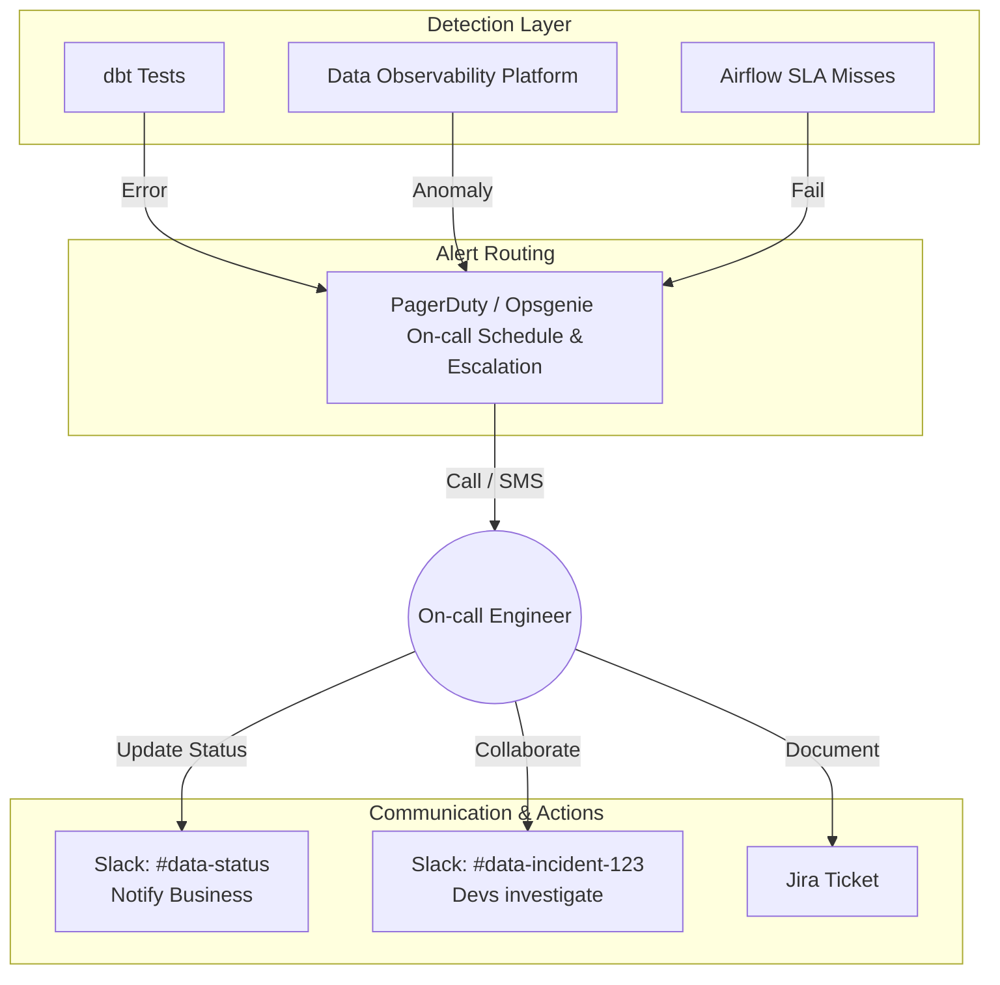

Hãy tưởng tượng bạn là một kỹ sư dữ liệu. Vào lúc 3 giờ sáng, hệ thống [dbt](/concepts/transformation-analytics/dbt/) báo lỗi đỏ rực, đường ống dẫn dữ liệu (pipeline) bị sập. Sáng hôm sau, CEO chuẩn bị bước vào cuộc họp quan quan trọng nhưng dashboard doanh thu lại hiển thị số liệu sai lệch hoặc trống trơn. Lúc này, ai sẽ là người thức dậy sửa lỗi? Làm thế nào để phân loại xem đây là lỗi khẩn cấp hay có thể đợi đến giờ hành chính? Và làm sao để báo cho các bên liên quan biết hệ thống đang được khắc phục?

Đây chính là lúc quy trình **Cảnh báo và Phản ứng sự cố (Alerting & Incident Response)** phát huy vai trò. Đây là bước hành động tiếp theo ngay sau khi hệ thống giám sát (Monitoring / Data Observability) phát hiện ra bất thường, nhằm đảm bảo mọi sự cố dữ liệu đều được nhận diện, phân công đúng người trực (on-call), giải quyết nhanh chóng và ngăn ngừa tái diễn.

## Tại sao có hệ thống giám sát tốt là chưa đủ?

Nhiều đội ngũ dữ liệu đầu tư rất nhiều tiền vào các công cụ giám sát hiện đại như Monte Carlo hay Datadog, nhưng lại bỏ quên quy trình ứng phó. Kết quả là họ thường xuyên rơi vào ba tình huống dở khóc dở cười:

1. **Hội chứng "Nhờn cảnh báo" (Alert Fatigue):** Kênh Slack `#data-alerts` nhận hàng trăm tin nhắn lỗi mỗi ngày. Vì quá nhiều thông tin rác, các kỹ sư quyết định tắt thông báo (mute) kênh. Đến khi thảm họa thực sự xảy ra (ví dụ dữ liệu thanh toán bị mất mát hoàn toàn), không một ai hay biết.
2. **Hiệu ứng người ngoài cuộc (Bystander Effect):** Cảnh báo được gửi chung vào một nhóm 10 người. Mọi người đều nghĩ *"Chắc có ai đó đang xử lý rồi"*, và cuối cùng không một ai động tay vào sửa, khiến thời gian gián đoạn dữ liệu (Data Downtime) kéo dài hàng ngày trời.
3. **Mất niềm tin từ các phòng ban (Loss of Trust):** Người dùng bên bộ phận kinh doanh phát hiện ra dashboard bị sai số và phàn nàn với đội Data trước khi đội Data tự nhận ra lỗi. Dần dần, niềm tin vào chất lượng dữ liệu của công ty bị lung lay dữ dội.

## Bốn cột trụ của một quy trình ứng phó sự cố chuẩn mực

Để xây dựng một hệ thống ứng phó chuyên nghiệp như các đội ngũ SRE (Site Reliability Engineering) thực thụ, bạn cần tập trung vào 4 yếu tố cốt lõi:

* **Phân loại độ nghiêm trọng (Severity / SEV Levels):** Không phải lỗi nào cũng khẩn cấp như nhau. Lỗi sập hệ thống thanh toán cốt lõi (SEV-1) yêu cầu gọi điện đánh thức kỹ sư ngay lập tức, trong khi lỗi định dạng của một bảng phân tích nháp (SEV-4) hoàn toàn có thể để đến sáng mai xử lý.
* **Định tuyến và Phân công trực ban (Routing & On-call Rotation):** Cảnh báo phải được gửi đích danh đến đúng đội ngũ sở hữu dữ liệu đó ([Data Ownership](/concepts/governance-metadata/data-ownership/)). Đồng thời, luôn có một người trực chính (Primary On-call) chịu trách nhiệm tiếp nhận và xử lý cảnh báo trong ca trực.
* **Giao tiếp minh bạch (Communication):** Khi sự cố nghiêm trọng xảy ra, ưu tiên hàng đầu là phải cập nhật trạng thái cho người dùng cuối (Business users) biết rằng: *"Chúng tôi đã ghi nhận sự cố sai lệch số liệu và đang tập trung khắc phục, dự kiến sẽ hoàn thành trong vòng 1 giờ nữa"*. Điều này giúp giảm thiểu sự hoang mang và phàn nàn.
* **Văn hóa họp rút kinh nghiệm không đổ lỗi (Blameless Post-mortem):** Sau khi khắc phục xong sự cố, cả đội sẽ họp lại để phân tích nguyên nhân gốc rễ (Root Cause) và đưa ra giải pháp cải tiến hệ thống, tuyệt đối không tìm người để chỉ trích hay phạt.

## Hành trình giải cứu dữ liệu: Vòng đời của một sự cố

Một sự cố dữ liệu chuẩn từ khi phát hiện đến lúc giải quyết triệt để thường đi qua 5 giai đoạn sau:

1. **Phát hiện (Detection):** Hệ thống Data Observability phát hiện bảng dữ liệu `Fact_Sales` không cập nhật đúng hạn (Freshness Anomaly).
2. **Cảnh báo và Phân luồng (Alerting & Triage):**
   * Hệ thống tự động kích hoạt cảnh báo và đẩy thông tin lên các công cụ chuyên dụng như PagerDuty hoặc Opsgenie.
   * PagerDuty tự động gọi điện hoặc nhắn tin cho kỹ sư đang trực ca đó.
   * Kỹ sư nhấn nút "Acknowledge" (Đã nhận) trên ứng dụng để xác nhận mình đang xử lý, ngăn không cho hệ thống tiếp tục gọi điện báo động cho các cấp quản lý cao hơn (Escalation).
3. **Điều tra và Khắc phục tạm thời (Investigation & Mitigation):**
   * Kỹ sư trực kiểm tra bản đồ liên kết dữ liệu (Data Lineage) và phát hiện công cụ Fivetran bị lỗi API [Token](/concepts/genai-ml/token/) nên không thể cào dữ liệu về.
   * Tiến hành cập nhật Token mới và chạy lại ([backfill](/concepts/etl-elt/backfill/)) đường ống dữ liệu để khôi phục trạng thái bình thường.
4. **Giải quyết triệt để (Resolution):** Đánh dấu sự cố là "Resolved" trên hệ thống và gửi thông báo xác nhận dữ liệu đã sạch tới các phòng ban kinh doanh.
5. **Đánh giá sau sự cố (Post-mortem):** Cả đội ngồi lại phân tích tại sao Token bị hết hạn mà không có cảnh báo trước, từ đó thiết lập thêm một cảnh báo tự động gửi email nhắc nhở trước 3 ngày khi Token chuẩn bị hết hạn.

### Sơ đồ luồng xử lý và định tuyến cảnh báo

Sơ đồ dưới đây thể hiện quy trình khép kín từ khi phát hiện lỗi đến khi điều phối kỹ sư ứng phó:



## Phân cấp độ nghiêm trọng (SEV Levels) và cách cấu hình cảnh báo thực tế

Dưới đây là một mô hình phân cấp độ nghiêm trọng phổ biến trong thực tế:

* **SEV-1 (Critical):** Sập đường ống dữ liệu cốt lõi phục vụ báo cáo tài chính hoặc các dashboard báo cáo trực tiếp cho Ban Giám đốc.
  * *Hành động:* PagerDuty tự động gọi điện 24/7. Kỹ sư trực phải phản hồi trong vòng 15 phút và cập nhật trạng thái cho doanh nghiệp mỗi 30 phút.
* **SEV-2 (High):** Dữ liệu phân tích chiến dịch Marketing hàng ngày không cập nhật, ảnh hưởng đến việc tối ưu hóa chi phí quảng cáo trong ngày.
  * *Hành động:* Gửi tin nhắn Slack kèm ping `@here`, xử lý trong vòng 2 giờ. Chỉ gọi điện nếu xảy ra trong giờ làm việc.
* **SEV-3 (Medium):** Một số trường dữ liệu phụ bị lỗi định dạng hoặc chứa giá trị NULL bất thường, nhưng không ảnh hưởng đến dòng chảy dữ liệu chính.
  * *Hành động:* Tạo một task trên Jira để đội ngũ đưa vào kế hoạch xử lý ở sprint tiếp theo.
* **SEV-4 (Low):** Lỗi ở môi trường thử nghiệm (Development).
  * *Hành động:* Ghi log hệ thống, không cần thông báo làm phiền kỹ sư.

Ví dụ về cấu hình cảnh báo trong **Prometheus Alertmanager** bằng file YAML:

```yaml
groups:
- name: DataPipelineAlerts
  rules:
  - alert: PipelineDowntime_SEV1
    expr: data_pipeline_status{job="core_finance_etl"} == 0
    for: 15m
    labels:
      severity: critical
      team: data-platform
    annotations:
      summary: "Pipeline cốt lõi đã ngừng hoạt động hơn 15 phút!"
      description: "Job core_finance_etl đã fail. Kích hoạt PagerDuty gọi on-call ngay lập tức."

  - alert: HighNullRate_SEV3
    expr: data_quality_null_percentage{table="marketing_events"} > 5
    for: 1h
    labels:
      severity: warning
      team: data-analytics
    annotations:
      summary: "Tỷ lệ NULL cao bất thường."
      description: "Cảnh báo chất lượng dữ liệu. Hãy tạo ticket Jira để kiểm tra."
```

## Những nguyên tắc vàng giúp đội ngũ trực On-call không bị "kiệt sức"

* **Cảnh báo dựa trên triệu chứng thực tế (Symptom-based Alerting):** Đừng thiết lập cảnh báo chỉ vì *"CPU của database đang chạm ngưỡng 90%"* (đây là nguyên nhân). Hãy cảnh báo khi *"Bảng báo cáo doanh thu bị chậm trễ hơn 1 giờ"* (đây là triệu chứng ảnh hưởng trực tiếp đến người dùng). Nếu CPU cao nhưng dữ liệu vẫn được xử lý đúng hạn thì không cần thiết phải gọi điện đánh thức kỹ sư vào lúc nửa đêm.
* **Tự động gom nhóm cảnh báo (Alert Grouping):** Khi một bảng dữ liệu nguồn bị lỗi, tất cả các bảng trung gian và bảng đích phía sau (downstream) sẽ đồng loạt báo lỗi theo hiệu ứng quân cờ domino. Hệ thống cảnh báo cần đủ thông minh để tự động gom hàng trăm thông báo lỗi này thành một sự cố duy nhất chỉ thẳng vào nguyên nhân gốc rễ, tránh làm spam hòm thư của kỹ sư trực.
* **Xây dựng chính sách trực On-call công bằng:** Việc trực ca đêm 24/7 rất căng thẳng và dễ gây kiệt sức (burnout). Hãy luân phiên ca trực hàng tuần giữa các thành viên, có chế độ nghỉ bù và luôn chuẩn bị sẵn quy trình chuyển tiếp lên cấp cao hơn (Escalation policy) khi gặp sự cố quá khó vượt ngoài tầm xử lý của một người.

## Những sai lầm chí mạng cần tránh

* **Sử dụng Email làm kênh cảnh báo chính cho lỗi SEV-1/SEV-2:** Hầu như không ai kiểm tra email cá nhân vào lúc 2 giờ sáng hoặc trong những ngày nghỉ cuối tuần. Email cũng rất dễ bị trôi vào mục spam. Các cảnh báo khẩn cấp bắt buộc phải dùng các kênh liên lạc trực tiếp như gọi điện (Phone call) hoặc SMS.
* **Thiếu cơ chế ngắt mạch dữ liệu (Data Circuit Breakers):** Phát hiện dữ liệu lỗi nhưng không tự động ngắt đường ống, để mặc cho dữ liệu sai chảy thẳng lên các công cụ BI. Khi người dùng nhìn thấy số liệu sai lệch, họ sẽ nghi ngờ tính chính xác của toàn bộ hệ thống. Nguyên tắc đúng là: khi phát hiện bảng nguồn bị lỗi nặng, hãy tự động ngắt kết nối không cho chạy các bảng đích phía sau.

## Được và mất khi xây dựng quy trình ứng phó bài bản

### Điểm cộng (Pros):
* Giảm đáng kể chỉ số TTR (Time-to-Resolution - Thời gian trung bình để khắc phục sự cố) từ vài ngày xuống còn vài giờ hoặc vài phút.
* Giữ gìn uy tín và tính chuyên nghiệp của đội ngũ Data trong mắt các phòng ban kinh doanh nhờ sự minh bạch và chủ động thông báo.
* Giúp tích lũy tri thức tập thể thông qua các tài liệu hướng dẫn xử lý sự cố (Playbooks) và biên bản họp rút kinh nghiệm.

### Điểm trừ (Cons):
* Yêu cầu văn hóa tổ chức phải cởi mở, chuyên nghiệp và có sự đầu tư nghiêm túc về mặt thời gian cũng như công cụ.
* Có thể gây áp lực tâm lý (on-call anxiety) cho các kỹ sư dữ liệu nếu hệ thống hiện tại còn quá nhiều lỗi và nợ kỹ thuật (technical debt) chưa được giải quyết triệt để.

## Khi nào team của bạn cần chuẩn hóa quy trình này?

Quy trình này là bắt buộc đối với bất kỳ đội ngũ dữ liệu nào từ 2 thành viên trở lên đang chịu trách nhiệm vận hành các hệ thống dữ liệu phục vụ trực tiếp cho hoạt động vận hành của doanh nghiệp. Đây là bước chuyển mình quan trọng để đưa đội ngũ của bạn từ trạng thái **"phát triển dữ liệu thuần túy"** sang mô hình vận hành tin cậy **DataOps/SRE**.

## Các khái niệm liên quan

* [Phân tích nguyên nhân gốc rễ - Root Cause Analysis (RCA)](/concepts/observability-reliability/root-cause-analysis/)
* [Data Observability](/concepts/observability-reliability/data-observability/)
* [Data Lineage](/concepts/governance-metadata/data-lineage/)

## Góc phỏng vấn: Xử lý tình huống thực tế khi "chữa cháy" dữ liệu

### 1. Alert Fatigue là gì và bạn làm thế nào để khắc phục nó trong một hệ thống dữ liệu thực tế?
* **Gợi ý trả lời:** Alert Fatigue là tình trạng các kỹ sư bị quá tải và trở nên thờ ơ, bỏ qua các cảnh báo do hệ thống gửi quá nhiều thông báo rác hoặc các cảnh báo không quan trọng (False positives). Để khắc phục, chúng ta cần: (1) Rà soát và tắt bớt các cảnh báo không cần thiết, chuyển các cảnh báo không khẩn cấp thành task trên Jira thay vì gửi thông báo chớp nháy. (2) Gom nhóm các cảnh báo liên quan theo bản đồ Lineage. (3) Định kỳ tinh chỉnh lại ngưỡng (threshold) của các chỉ số cảnh báo. (4) Áp dụng phân cấp độ ưu tiên cho các bảng dữ liệu (chỉ gửi báo động đỏ cho các bảng dữ liệu cốt lõi - Tier 1).

### 2. Giả sử bạn đang trực On-call và nhận được cảnh báo bảng doanh thu tháng bị nhân đôi số liệu. Hãy trình bày các bước bạn sẽ xử lý sự cố này?
* **Gợi ý trả lời:** Quy trình xử lý gồm 5 bước tiêu chuẩn:
  1. **Acknowledge (Ghi nhận):** Xác nhận trên PagerDuty để đồng đội biết mình đã tiếp nhận sự cố, ngăn hệ thống tiếp tục báo động lên cấp quản lý.
  2. **Containment (Cách ly):** Tạm thời treo thông báo bảo trì hoặc ẩn biểu đồ doanh thu trên Web UI để tránh việc người dùng đọc phải số liệu sai lệch đưa ra quyết định sai.
  3. **Investigation (Điều tra):** Sử dụng Data Lineage và log của Airflow để truy vết xem tác vụ nào đã chạy trùng lặp (ví dụ: Airflow tự động chạy lại do lỗi mạng dẫn đến ghi đè trùng dữ liệu).
  4. **Mitigation/Resolution (Khắc phục):** Chạy lệnh xóa dữ liệu trùng lặp (hoặc chạy lại pipeline với cơ chế ghi đè idempotent), kiểm tra lại số liệu và bật lại dashboard cho người dùng.
  5. **Post-mortem (Hậu kiểm):** Trong tuần làm việc mới, viết tài liệu phân tích nguyên nhân và thiết lập thêm ràng buộc duy nhất (Unique constraint) ở tầng [Data Warehouse](/concepts/data-warehouse/data-warehouse/) để ngăn chặn triệt để lỗi này trong tương lai.

## Tài liệu tham khảo

1. **Google SRE Book** - Chương 11: Being On-Call & Chương 15: Postmortem Culture.
2. **PagerDuty Incident Response Documentation** - Hướng dẫn tiêu chuẩn ngành về SEV levels và Triage.
3. **DataOps Cookbook** - Christopher Bergh. Hướng dẫn áp dụng triết lý sản xuất tinh gọn cho dữ liệu.

## English Summary

Alerting & Incident Response forms the operational layer of Data Observability, defining how data teams react when anomalies (like schema drifts or SLA misses) are detected. Adapting Site Reliability Engineering (SRE) practices to data workflows, it involves categorizing alerts by severity (SEV levels), establishing an on-call rotation using tools like PagerDuty to route critical alerts to accountable engineers, and ensuring transparent communication with business stakeholders. The ultimate goal is to combat "alert fatigue," drastically reduce data downtime (Time-to-Resolution), and foster a blameless post-mortem culture that focuses on systemic improvements rather than finger-pointing.
