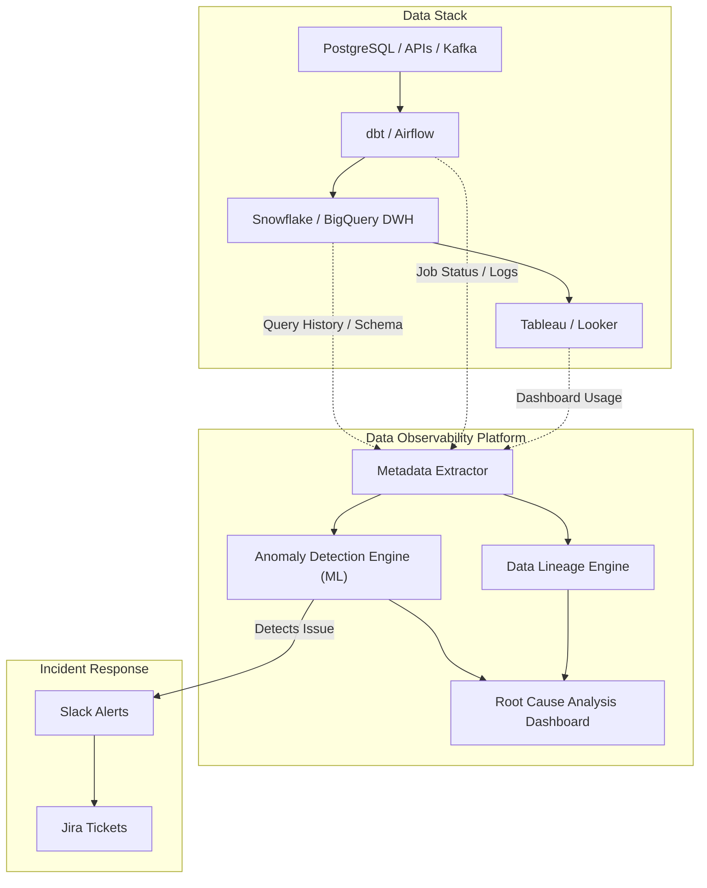

Hãy tưởng tượng bạn đang quản lý một nhà máy nước sạch cung cấp cho toàn thành phố. Sẽ ra sao nếu hệ thống không hề có cảm biến đo áp suất, không có thiết bị đo nồng độ Clo, và cách duy nhất để bạn biết nước bị bẩn là đợi người dân gọi điện lên đường dây nóng để phàn nàn?

Trong thế giới dữ liệu doanh nghiệp cũng vậy. Việc để người dùng cuối (như CEO, phòng Marketing hay Sales) phát hiện ra báo cáo bị sai lệch trước khi bạn biết là một thất bại lớn của đội ngũ kỹ sư. **Khả năng quan sát dữ liệu (Data Observability)** sinh ra để làm nhiệm vụ của những chiếc cảm biến thông minh, liên tục giám sát trạng thái sức khỏe của toàn bộ hệ sinh thái dữ liệu trước khi "thảm họa" xảy ra.

---

## Data Observability thực chất là gì?

Kế thừa từ nguyên lý **Khả năng quan sát (Observability)** trong Kỹ thuật Phần mềm (Software Engineering) - vốn tập trung vào Nhật ký hoạt động (Logs), Chỉ số đo lường (Metrics) và Dấu vết thực thi (Traces) để giám sát trạng thái hoạt động của các ứng dụng Microservices - **Data Observability** dịch chuyển trọng tâm giám sát từ *ứng dụng* sang *bản thân dữ liệu* và các *đường ống dẫn dữ liệu (Data Pipelines)*.

Nói một cách đơn giản, Data Observability là hệ thống giúp đội ngũ dữ liệu trả lời câu hỏi: Làm sao phát hiện ra đường ống (pipeline) bị chậm, dữ liệu bị trùng, bị thiếu hoặc sai định dạng **trước** khi người dùng mở dashboard ra xem?

---

## Tại sao chúng ta không thể thiếu Data Observability?

Kiến trúc dữ liệu hiện đại ngày càng phức tạp với hàng trăm luồng trích xuất, biến đổi và nạp dữ liệu (ETL/ELT) đan xen chéo nhau. Điều này dẫn đến những rủi ro tiềm ẩn luôn chực chờ phá hủy tính nhất quán của dữ liệu:

* **Sự cố âm thầm (Silent Failures)**: Đội ngũ phát triển Backend sửa một tính năng nhỏ trên ứng dụng, đổi tên cột `user_status` thành `status`. Tiến trình chạy dbt vẫn báo xanh (vì cú pháp SQL không sai), nhưng thực tế là dữ liệu cột trạng thái đã bị bỏ trống hoàn toàn trên Kho dữ liệu (Data Warehouse).
* **Hiện tượng dữ liệu mồ côi (Stale Data)**: Pipeline nạp dữ liệu báo chạy thành công ("Success"), nhưng thực chất API nguồn của bên thứ ba đã thay đổi token khiến hệ thống chỉ nhận về 0 bản ghi. Mọi chỉ số giám sát hạ tầng đều hiển thị bình thường, nhưng dữ liệu trong kho thì cũ rích.
* **Thời gian chết dữ liệu (Data Downtime)**: Đây là khoảng thời gian dữ liệu bị sai lệch, thiếu sót hoặc không khả dụng mà không ai phát hiện ra. Hậu quả của việc đưa ra các quyết định kinh doanh dựa trên đống dữ liệu sai lệch này là vô cùng nghiêm trọng đối với doanh nghiệp.

---

## Năm trụ cột cấu thành Data Observability

Để đánh giá toàn diện trạng thái của dòng chảy dữ liệu, hệ thống Observability tập trung vào 5 khía cạnh cốt lõi:

* **Độ tươi mới (Freshness)**: Dữ liệu có được cập nhật đúng lịch trình cam kết (SLA) hay không? Lần cuối cùng bảng nhận dữ liệu mới là khi nào?
* **Độ phân phối (Distribution)**: Các giá trị dữ liệu có nằm trong dải dự kiến không? Ví dụ, cột tuổi khách hàng `age` tự dưng xuất hiện giá trị âm hoặc vượt quá 200.
* **Khối lượng dữ liệu (Volume)**: Dung lượng dữ liệu đổ về có bình thường không? Nếu bình thường bảng ghi nhận 1 triệu dòng mỗi ngày, hôm nay đột ngột giảm xuống chỉ còn 500 dòng, chắc chắn có sự cố.
* **Thay đổi cấu trúc (Schema Evolution)**: Cấu trúc bảng có bị thay đổi (thêm, xóa cột, đổi kiểu dữ liệu) hay không? Ai là người thực hiện sự thay đổi đó?
* **Phả hệ dữ liệu (Data Lineage)**: Luồng đi của dữ liệu từ nguồn thô đến báo cáo cuối cùng. Nếu bảng A gặp sự cố, những dashboard hạ nguồn nào sẽ bị ảnh hưởng trực tiếp?

---

## Kiến trúc và Nguyên lý hoạt động

Dưới đây là mô hình sơ đồ dòng chảy dữ liệu được điều phối và giám sát bởi hệ thống Data Observability chuyên dụng (như Monte Carlo hay Metaplane):



1. **Thu thập siêu dữ liệu (Metadata & Logs)**: Hệ thống kết nối vào Data Warehouse, công cụ điều phối (Orchestration như Airflow) và công cụ biến đổi dữ liệu (dbt) để đọc nhật ký truy vấn (`query logs`) mà không cần can thiệp trực tiếp vào dữ liệu thô nhạy cảm.
2. **Học máy tự động (ML Profiling)**: Hệ thống tự động phân tích dữ liệu lịch sử để tìm ra "baseline" (trạng thái bình thường). Ví dụ: Hệ thống tự hiểu rằng vào ngày cuối tuần, lượng đơn hàng thường chỉ bằng 30% ngày thường.
3. **Phát hiện bất thường (Anomaly Detection)**: So sánh dữ liệu thực tế với baseline. Nếu phát hiện sai lệch vượt quá ngưỡng cho phép, hệ thống sẽ kích hoạt báo động.
4. **Cảnh báo thông minh (Alerting & Triage)**: Bắn cảnh báo chi tiết qua Slack/Teams kèm theo sơ đồ phả hệ (Data Lineage) để kỹ sư biết ngay bảng nào bị lỗi và dashboard nào sẽ bị ảnh hưởng.

---

## Ví dụ thực tế: Cấu hình giám sát dữ liệu bằng Soda

Dưới đây là một tệp YAML cấu hình cho công cụ giám sát mã nguồn mở **Soda** để tự động kiểm tra độ tươi mới, độ phân phối và khối lượng dữ liệu cho bảng giao dịch:

```yaml
# checks_dim_exchange.yml
checks for dim_exchange:
  # 1. Freshness: Cảnh báo nếu dữ liệu không được cập nhật mới trong 24 giờ qua
  - freshness(updated_at) < 24h

  # 2. Distribution: Sử dụng Machine Learning để cảnh báo nếu tỷ giá trung bình lệch bất thường
  - anomaly score for avg_currency_rate < 0.5:
      avg_currency_rate: avg(currency_rate)

  # 3. Volume: Cảnh báo nếu số dòng dữ liệu giảm hơn 10% so với tuần trước
  - row_count = last_week_count * 0.9
```

---

## Ưu nhược điểm và Đánh đổi (Pros & Cons)

### Ưu điểm (Pros):
* **Chủ động phát hiện sự cố (Proactive Detection)**: Đội ngũ dữ liệu nhận diện lỗi trước khi người dùng cuối hoặc ban giám đốc phát hiện ra trên các dashboard BI.
* **Giảm thiểu thời gian chết dữ liệu (Data Downtime)**: Nhờ có các cảnh báo tự động, thời gian từ lúc phát sinh lỗi đến lúc khắc phục được rút ngắn tối đa.
* **Phân tích nguyên nhân gốc rễ nhanh chóng (Root Cause Analysis)**: Tích hợp phả hệ dữ liệu (Data Lineage) giúp kỹ sư khoanh vùng ngay lập tức bảng nguồn nào gây ra lỗi.
* **Tự động hóa bằng Machine Learning**: Tiết kiệm công sức khi không cần phải viết hàng ngàn quy tắc kiểm thử tĩnh cho mọi bảng trong hệ thống.

### Đánh đổi và Thách thức (Cons & Trade-offs):
* **Chi phí tài nguyên và bản quyền**: Các công cụ Data Observability thương mại thường rất đắt đỏ. Ngoài ra, việc quét metadata và chạy các truy vấn giám sát liên tục cũng làm tăng hóa đơn sử dụng Data Warehouse.
* **Hội chứng mệt mỏi vì cảnh báo (Alert Fatigue)**: Nếu cấu hình không chuẩn hoặc ngưỡng cảnh báo quá nhạy, kỹ sư sẽ bị ngập trong hàng trăm tin nhắn cảnh báo mỗi ngày, dẫn đến việc bỏ qua các lỗi thực sự nghiêm trọng.
* **Độ phức tạp khi tích hợp**: Đòi hỏi thời gian cấu hình và kết nối đồng bộ giữa các tầng trong toàn bộ Data Stack.

---

## Sai lầm thường gặp và Best Practices

### Những sai lầm cần tránh (Common Pitfalls)
* **Nhầm lẫn giữa Data Quality Testing và Data Observability**: Testing (như dbt test) chỉ chạy các bài kiểm thử định sẵn cho các trường hợp bạn đã biết trước (ví dụ: kiểm tra ID không null). Data Observability đi xa hơn bằng cách dùng AI tự động phát hiện các bất thường mà bạn không thể tự nghĩ ra trước (như độ trễ lệch múi giờ, volume sụt giảm đột biến).
* **Hội chứng mệt mỏi vì cảnh báo (Alert Fatigue)**: Thiết lập cảnh báo quá nhạy trên các bảng không quan trọng khiến Slack bị ngập lụt tin nhắn mỗi ngày. Hậu quả là kỹ sư dữ liệu sẽ phớt lờ các cảnh báo, bao gồm cả những cảnh báo lỗi nghiêm trọng.

### Best Practices khi triển khai
* **Thiết lập phân tầng dữ liệu (Data Tiering)**: Đừng cố gắng giám sát hàng vạn bảng dữ liệu cùng một lúc. Hãy tập trung tài nguyên vào các bảng dữ liệu cốt lõi (Tier 1) trực tiếp nuôi các dashboard doanh thu hoặc mô hình AI quan trọng.
* **Xây dựng quy trình xử lý sự cố rõ ràng**: Một cảnh báo chỉ thực sự hữu ích khi có người chịu trách nhiệm giải quyết. Cần phân định rõ người trực on-call, các kịch bản ứng phó (playbook) và tích hợp cảnh báo với hệ thống quản lý công việc (như Jira ticket).
* **Kết hợp kiểm thử tĩnh và giám sát động**: ML rất tốt để phát hiện những lỗi không ngờ tới (Unknown Unknowns), nhưng đối với các quy chuẩn nghiệp vụ bắt buộc (như "tỷ suất lợi nhuận không được phép âm"), bạn vẫn cần duy trì các bài kiểm thử tĩnh (như dbt tests hoặc Great Expectations) làm chốt chặn đầu tiên.

---

## Góc phỏng vấn

### 1. Phân biệt sự khác nhau giữa Data Quality và Data Observability?
* **Gợi ý trả lời**: Data Quality tập trung vào trạng thái tĩnh của dữ liệu (tính chính xác, đầy đủ, hợp lệ) thông qua việc áp đặt các quy tắc kiểm thử cố định do con người viết ra. Trong khi đó, Data Observability là một khái niệm rộng hơn, giám sát toàn diện trạng thái động của cả hệ thống (dữ liệu kết hợp với pipeline). Nó không đòi hỏi con người phải viết trước tất cả các luật mà tận dụng Machine Learning để tự động phát hiện bất thường dựa trên hành vi lịch sử, đồng thời tích hợp phả hệ dữ liệu để tìm nguyên nhân gốc rễ một cách nhanh chóng.

### 2. Làm thế nào để giải quyết vấn nạn Alert Fatigue (quá tải cảnh báo) khi triển khai hệ thống Observability?
* **Gợi ý trả lời**: Chúng ta có thể áp dụng ba giải pháp phối hợp:
  1) **Data Tiering**: Chỉ bật cảnh báo tức thì (Slack/SMS) cho các bảng dữ liệu Tier 1 quan trọng, các bảng Tier thấp hơn chỉ cần gom lỗi gửi báo cáo định kỳ.
  2) **Feedback Loop**: Cấu hình cơ chế phản hồi cho mô hình ML. Khi có cảnh báo sai, kỹ sư có thể nhấn nút "Mute/Expected" để mô hình tự học lại dải dung sai mới của dữ liệu.
  3) **Alert Grouping**: Gom nhóm cảnh báo dựa trên phả hệ (Lineage). Nếu một bảng nguồn bị lỗi kéo theo 15 bảng ở hạ nguồn bị lỗi theo, hệ thống chỉ phát đi một cảnh báo duy nhất tại nguồn gốc thay vì bắn 16 tin nhắn rời rạc gây nhiễu thông tin.

### 3. Tại sao Phả hệ dữ liệu (Data Lineage) lại đóng vai trò quan trọng trong việc khắc phục sự cố dữ liệu (Root Cause Analysis)?
* **Gợi ý trả lời**: Khi một bảng dữ liệu hoặc chỉ số trên báo cáo (BI dashboard) bị sai lệch, phả hệ dữ liệu (Data Lineage) cho phép kỹ sư dữ liệu lần ngược lại luồng đi của dữ liệu (upstream) để biết dữ liệu được lấy từ nguồn nào, đi qua những bước biến đổi nào, và bảng trung gian nào bị lỗi. Ngược lại, nó cũng giúp xác định phạm vi ảnh hưởng (downstream impact) để thông báo kịp thời cho những bên sử dụng dữ liệu liên quan. Nếu không có Lineage, việc tìm ra nguyên nhân gốc rễ giống như mò kim đáy bể trong một hệ thống phức tạp.

---

## Đọc thêm và Tài liệu tham khảo
* [Metadata Management (Quản lý siêu dữ liệu)](/concepts/governance-metadata/metadata-management/) - Cách thức quản lý thông tin về dữ liệu trong hệ thống.
* [Data Lineage (Phả hệ dữ liệu)](/concepts/governance-metadata/data-lineage/) - Bản đồ mô tả dòng chảy và nguồn gốc của dữ liệu.
* **Barr Moses (Monte Carlo)** - Các tài liệu và bài phân tích tiên phong đặt nền móng cho khái niệm Data Observability.
* **Fundamentals of Data Engineering** - Joe Reis, Matt Housley (Chương về DataOps và Reliability).

---

## English Summary

**Data Observability** is an organization's capability to fully understand the health and state of its data within the system. It eliminates data downtime and blind spots by providing automated monitoring, alerting, and root cause analysis tools for data pipelines. Originating from software engineering principles, it focuses on five core pillars: Freshness, Distribution, Volume, Schema, and Lineage. Unlike static data quality testing which catches "known unknowns", Data Observability utilizes Machine Learning to profile historical metadata and proactively detect "unknown unknowns" (e.g., sudden volume drops or schema drift), enabling data teams to fix issues before they impact downstream business dashboards.
