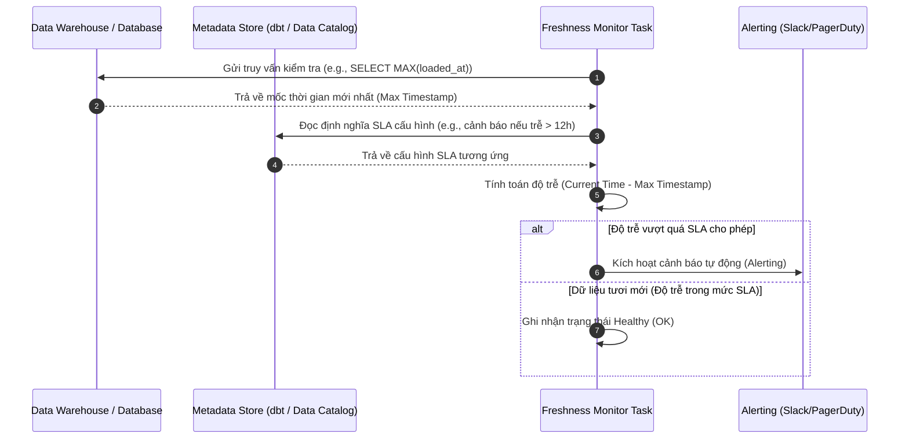

Trong thế giới kỹ thuật dữ liệu, có một câu nói nổi tiếng thế này: *"Dữ liệu đúng nhưng trễ hẹn cũng có thể coi là dữ liệu sai"* (Right data, wrong time is wrong data). Bạn có một báo cáo tài chính chính xác đến từng xu, nhưng nếu nó được gửi trễ 3 tiếng sau khi phiên giao dịch bắt đầu, giá trị của nó gần như bằng không. Để giải quyết bài toán này, các kỹ sư dữ liệu đã phát triển một trụ cột quan trọng trong hệ thống Data Observability: **Freshness Monitoring** (Giám sát độ trễ dữ liệu).

## Câu chuyện đằng sau dữ liệu "thiu" và Data SLA

Freshness Monitoring là quá trình theo dõi, đo lường và đưa ra các cảnh báo tức thời về mức độ "tươi mới" (up-to-date) của dữ liệu trong hệ thống so với cam kết chất lượng dịch vụ (Data SLA - Service Level Agreement). Bằng cách liên tục kiểm tra thời gian kể từ lần cuối cùng một bảng hoặc một tập dữ liệu (dataset) được cập nhật thành công, Freshness Monitoring giúp trả lời những câu hỏi nhức nhối như:
* *"Báo cáo doanh thu bán hàng ngày hôm qua đã có số liệu chính xác chưa?"*
* *"Bảng dữ liệu người dùng (`users`) này được cập nhật lần cuối khi nào?"*
* *"Các tác vụ trên Airflow hiện tại có đang chạy trễ so với SLA 8:00 sáng không?"*

Một hệ thống đo lường độ trễ dữ liệu hiệu quả không chỉ đơn thuần kiểm tra xem các Job chạy thành công hay thất bại, mà nó phải trực tiếp kiểm tra nội dung dữ liệu hoặc metadata thực tế của bảng để đưa ra kết luận chuẩn xác nhất.

## Tại sao chúng ta không thể tin hoàn toàn vào trạng thái xanh của Airflow?

Nếu bạn chỉ nhìn vào giao diện Airflow và thấy tất cả các task đều hiển thị màu xanh lá cây (Success) rồi an tâm ra về, bạn rất dễ rơi vào những cái bẫy "lỗi im lặng" (Silent Failure):

1. **Lỗi im lặng (Silent failure)**: Các công cụ lập lịch hoặc ETL Job báo cáo chạy thành công, nhưng do API nguồn gặp sự cố hoặc phân vùng dữ liệu trống rỗng, quá trình trích xuất chỉ lấy về được 0 dòng. Về mặt kỹ thuật không có lỗi crash nào xảy ra, nhưng thực tế dữ liệu trong kho vẫn là dữ liệu cũ kỹ từ nhiều ngày trước.
2. **Quyết định sai lầm do trễ pha thông tin**: Hãy tưởng tượng một giám đốc Marketing quyết định chi thêm ngân sách quảng cáo vì thấy hiệu quả chiến dịch rất tốt trên Dashboard. Tuy nhiên, thực chất là dữ liệu chi phí quảng cáo (Ad Spend) của ngày hôm đó chưa được tải về hệ thống. Quyết định được đưa ra dựa trên một bức tranh thiếu sót.
3. **Phá vỡ SLA cam kết**: Team dữ liệu thường cam kết với các bộ phận kinh doanh về việc cung cấp dữ liệu sạch trước một mốc thời gian cố định. Nếu không có cơ chế giám sát Freshness chủ động, các kỹ sư chỉ biết mình vi phạm SLA khi nhận được cuộc gọi phàn nàn từ phía người dùng cuối.

## Kiến trúc và Cơ chế giám sát độ tươi dữ liệu

Để giám sát độ tươi dữ liệu (Data Freshness), hệ thống kiểm tra cần liên kết chặt chẽ giữa lớp lưu trữ dữ liệu (Data Storage), lớp siêu dữ liệu (Metadata Store), và lớp lập lịch/cảnh báo (Orchestrator & Alerting).

Dưới đây là mô hình kiến trúc hoạt động của cơ chế giám sát độ tươi dữ liệu bằng cách truy vấn trực tiếp cột mốc thời gian hoặc đọc siêu dữ liệu hệ thống:



---

## Ba con đường để đo đạc độ "tươi" của dữ liệu

Tùy vào quy mô hệ thống và ngân sách tính toán, bạn có thể triển khai Freshness Monitoring theo một trong ba cách sau:

### 1. Dựa trên File / Metadata (Metadata-based)
Hệ thống sẽ truy cập vào các bảng metadata hệ thống (ví dụ `information_schema` trong PostgreSQL, hoặc `SNOWFLAKE.ACCOUNT_USAGE` trong Snowflake) để quét trường dữ liệu `last_altered` của bảng.
* **Điểm mạnh**: Cực kỳ nhanh, không tốn tài nguyên và chi phí tính toán.
* **Hạn chế**: Đôi khi không phản ánh chính xác 100% nếu có ai đó chạy lệnh thay đổi Metadata (như sửa comment, chỉnh cấu trúc cột) mà không thực sự ghi thêm dữ liệu mới.

### 2. Dựa trên Cột thời gian (Query-based / Timestamp-based)
Hệ thống sẽ định kỳ chạy một câu lệnh SQL để tìm giá trị thời gian lớn nhất thực tế của dữ liệu:
```sql
SELECT MAX(created_at) FROM my_table;
```
Sau đó, so sánh giá trị này với thời gian hiện tại. Nếu độ lệch vượt quá ngưỡng cam kết (SLA), hệ thống lập tức kích hoạt cảnh báo. Đây là cách làm thực chất và chính xác nhất vì nó nhìn thẳng vào lõi dữ liệu.

### 3. Tự động phát hiện bất thường bằng Machine Learning (Anomaly Detection)
Nền tảng giám sát sẽ tự động thu thập lịch sử cập nhật của các bảng trong quá khứ để tự tìm ra quy luật (Seasonality)## Sai lầm thường gặp và Best Practices

### Best Practices
* **Phân cấp SLA theo mức độ quan trọng (Tiering)**: Không phải bảng nào cũng cần giám sát từng phút. Một bảng phục vụ phát hiện gian lận giao dịch (Fraud Detection) cần SLA tính bằng giây/phút, nhưng một bảng tổng hợp báo cáo tài chính tháng chỉ cần SLA tính bằng ngày.
* **Giám sát ngay từ dữ liệu nguồn (Source Ingestion)**: Đừng chỉ đợi dữ liệu qua tay Spark, dbt rồi mới đo Freshness. Hãy giám sát ngay từ lớp dữ liệu thô (Staging/Raw) để phát hiện sớm các lỗi mất kết nối API từ đối tác bên thứ ba.
* **Tích hợp cơ chế ngắt mạch (Circuit Breakers)**: Nếu hệ thống phát hiện dữ liệu ở bảng nguồn bị trễ nghiêm trọng, hãy chủ động dừng hoặc bỏ qua (Skip) các tác vụ ETL phía sau. Việc này giúp ngăn ngừa dữ liệu cũ, lỗi thời lan truyền lên các Dashboard phục vụ báo cáo.

### Sai lầm thường gặp (Common Pitfalls)
* **Nhầm lẫn giữa cột thời gian sự kiện và thời gian hệ thống**: Sử dụng cột `created_at` (thời điểm khách đặt hàng) thay vì `etl_loaded_at` (thời điểm dữ liệu được nạp vào kho) để kiểm tra Freshness. Vào các ngày lễ lớn, nếu không có ai mua hàng, giá trị `MAX(created_at)` sẽ là của ngày hôm trước, dẫn đến việc hệ thống liên tục gửi cảnh báo giả (False Positive) mặc dù đường ống dữ liệu vẫn hoạt động hoàn hảo.
* **Quá tin vào trạng thái chạy của Pipeline**: Quá phụ thuộc vào trạng thái "Success" của Airflow mà bỏ quên việc kiểm tra số dòng thực tế được xử lý.

---

## Ưu nhược điểm và Đánh đổi (Pros & Cons)

### Ưu điểm (Pros)
* Đảm bảo tính minh bạch và xây dựng sự tin cậy tuyệt đối giữa đội ngũ kỹ thuật dữ liệu và người dùng kinh doanh.
* Dễ dàng triển khai bằng các câu lệnh SQL cơ bản hoặc cấu hình tích hợp sẵn trong dbt.
* Giúp phát hiện sớm các sự cố mất kết nối hoặc lỗi thu thập dữ liệu nguồn.

### Nhược điểm & Đánh đổi (Cons & Trade-offs)
* Việc liên tục chạy các truy vấn quét `SELECT MAX(timestamp)` trên các bảng dữ liệu khổng lồ không được phân vùng (partition) sẽ gây lãng phí một lượng lớn tài nguyên tính toán và chi phí đám mây.
* Cần tinh chỉnh bộ quy tắc giám sát vào những dịp nghỉ lễ hoặc cuối tuần khi hành vi nghiệp vụ thay đổi (ít phát sinh giao dịch mới), nhằm tránh cảnh báo giả gây nhiễu thông tin.

---

## Góc phỏng vấn

### 1. Phân biệt `created_at` (Event time) và `loaded_at` (Processing time) khi làm Freshness Monitoring. Sự nhầm lẫn giữa hai khái niệm này gây ra tác hại gì?
* **Mục đích câu hỏi**: Đánh giá sự hiểu biết của ứng viên về thiết kế cấu trúc dữ liệu thời gian và khả năng xử lý bài toán thực chiến.
* **Gợi ý trả lời**: `created_at` đại diện cho thời điểm sự kiện nghiệp vụ xảy ra ở hệ thống nguồn (ví dụ: người dùng thực hiện giao dịch). `loaded_at` đại diện cho thời điểm dữ liệu được tải thành công vào kho dữ liệu (Processing time). Khi giám sát hiệu năng của đường ống dữ liệu (Pipeline Freshness), chúng ta bắt buộc phải dùng `loaded_at`. Nếu dùng `created_at`, vào những thời điểm không phát sinh giao dịch (như ban đêm hoặc ngày nghỉ lễ), giá trị `MAX(created_at)` sẽ bị cũ đi, khiến hệ thống gửi cảnh báo giả dù pipeline vẫn chạy bình thường. Chúng ta chỉ dùng `created_at` khi muốn đo đạc "độ trễ nghiệp vụ" (từ lúc phát sinh đến lúc sẵn sàng phân tích mất bao lâu).

### 2. Làm cách nào để đo đạc Freshness của một bảng dữ liệu hàng tỷ dòng mà không cần chạy lệnh `SELECT MAX(timestamp)` để tối ưu hóa chi phí?
* **Mục đích câu hỏi**: Đánh giá kiến thức về tối ưu hóa chi phí đám mây (FinOps) và cách khai thác metadata nâng cao của Data Warehouse.
* **Gợi ý trả lời**: Để tránh quét qua hàng tỷ dòng dữ liệu gây tốn chi phí, chúng ta nên tận dụng các bảng metadata hệ thống được cập nhật tự động bởi Data Warehouse. Ví dụ: Trong Google BigQuery, ta có thể truy vấn view hệ thống `__TABLES__` để lấy trường `last_modified_time`. Trong Snowflake, ta có thể truy vấn từ `INFORMATION_SCHEMA.TABLES` để lấy thông tin cập nhật mới nhất. Những câu lệnh này thực thi với độ phức tạp $O(1)$, trả về kết quả ngay lập tức và hoàn toàn miễn phí quét dữ liệu. Tuy nhiên, cần lưu ý một điểm yếu là các câu lệnh DDL (như chỉnh sửa mô tả cột) cũng có thể làm thay đổi mốc thời gian này.

### 3. Bạn sẽ xử lý thế nào khi hệ thống Freshness Monitoring liên tục gửi cảnh báo giả (False Alerts/Alert Fatigue) vào cuối tuần hoặc ngày lễ?
* **Gợi ý trả lời**: Để tránh hiện tượng mệt mỏi vì cảnh báo (Alert Fatigue) khi lượng giao dịch tự nhiên sụt giảm vào cuối tuần hoặc ngày lễ, chúng ta có thể áp dụng 3 giải pháp:
  1. **Thiết lập SLA động (Dynamic SLAs)**: Sử dụng các mô hình thống kê cơ bản hoặc học máy để điều chỉnh ngưỡng cảnh báo dựa trên lịch sử dữ liệu của ngày đó trong tuần (ví dụ: Chủ nhật có thể cho phép trễ 24 tiếng thay vì 12 tiếng như ngày thường).
  2. **Phân biệt cảnh báo theo mức độ ưu tiên**: Phân tách các kênh gửi cảnh báo. Các cảnh báo về Freshness của bảng không trọng yếu có thể chỉ gửi báo cáo tổng hợp (digest) vào sáng thứ Hai, thay vì gửi tin nhắn khẩn cấp (Page) gây gián đoạn giấc ngủ của kỹ sư trực ca.
  3. **Sử dụng Ingestion Time thay cho Event Time**: Bảo đảm cấu hình kiểm tra dựa trên timestamp cập nhật hệ thống (`loaded_at`), đại diện cho việc pipeline có hoạt động hay không, thay vì phụ thuộc vào việc có dữ liệu mới phát sinh từ phía người dùng hay không.

---

## Đọc thêm và Tài liệu tham khảo

1. [Giám sát khả năng quan sát dữ liệu - Data Observability](/concepts/observability-reliability/data-observability/) - Tìm hiểu phương pháp tiếp cận toàn diện để đảm bảo sức khỏe dữ liệu.
2. [Data Quality (Chất lượng dữ liệu)](/concepts/data-quality/data-quality/) - Các chiều kích thước đo lường chất lượng dữ liệu doanh nghiệp.
3. [Change Data Capture (CDC)](/concepts/etl-elt/change-data-capture/) - Kỹ thuật đồng bộ thay đổi dữ liệu thời gian thực.
4. **dbt Docs** - Source Freshness (Hướng dẫn thực hành cấu hình freshness trên dbt).
5. **Monte Carlo Blog** - What is Data Freshness? The Pillar of Data Observability.
6. **Google Cloud Architecture Center** - Designing data pipelines with SLAs.

---

## English Summary

Freshness Monitoring is a foundational pillar of Data Observability that tracks how up-to-date a dataset is relative to its expected Service Level Agreement (Data SLA). It answers the critical question: "Has this table been updated on time?" Relying solely on pipeline success statuses (like Airflow green tasks) is dangerous due to silent failures (e.g., pulling zero records). Robust freshness checks evaluate either the physical metadata of a table or query the maximum system ingestion timestamp (`loaded_at`) to accurately determine latency. Properly implemented, it utilizes circuit breakers to stop downstream processes and alerts data engineers immediately when thresholds are breached, preventing the delivery of stale data to business dashboards.n cho thời điểm dữ liệu được tải thành công vào kho dữ liệu (Processing time). Khi giám sát hiệu năng của đường ống dữ liệu (Pipeline Freshness), chúng ta bắt buộc phải dùng `loaded_at`. Nếu dùng `created_at`, vào những thời điểm không phát sinh giao dịch (như ban đêm hoặc ngày nghỉ lễ), giá trị `MAX(created_at)` sẽ bị cũ đi, khiến hệ thống gửi cảnh báo giả dù pipeline vẫn chạy bình thường. Chúng ta chỉ dùng `created_at` khi muốn đo đạc "độ trễ nghiệp vụ" (từ lúc phát sinh đến lúc sẵn sàng phân tích mất bao lâu).

### 2. Làm cách nào để đo đạc Freshness của một bảng dữ liệu hàng tỷ dòng mà không cần chạy lệnh `SELECT MAX(timestamp)` để tối ưu hóa chi phí?
* **Mục đích câu hỏi**: Đánh giá kiến thức về tối ưu hóa chi phí đám mây (FinOps) và cách khai thác metadata nâng cao của Data Warehouse.
* **Gợi ý trả lời**: Để tránh quét qua hàng tỷ dòng dữ liệu gây tốn chi phí, chúng ta nên tận dụng các bảng metadata hệ thống được cập nhật tự động bởi Data Warehouse. Ví dụ: Trong Google BigQuery, ta có thể truy vấn view hệ thống `__TABLES__` để lấy trường `last_modified_time`. Trong Snowflake, ta có thể truy vấn từ `INFORMATION_SCHEMA.TABLES` để lấy thông tin cập nhật mới nhất. Những câu lệnh này thực thi với độ phức tạp $O(1)$, trả về kết quả ngay lập tức và hoàn toàn miễn phí quét dữ liệu. Tuy nhiên, cần lưu ý một điểm yếu là các câu lệnh DDL (như chỉnh sửa mô tả cột) cũng có thể làm thay đổi mốc thời gian này.

## Tài liệu tham khảo

1. **dbt Docs** - Source Freshness (Hướng dẫn thực hành cấu hình freshness trên dbt).
2. **Monte Carlo Blog** - What is Data Freshness? The Pillar of Data Observability.
3. **Google Cloud Architecture Center** - Designing data pipelines with SLAs.

## English Summary

Freshness Monitoring is a foundational pillar of Data Observability that tracks how up-to-date a dataset is relative to its expected Service Level Agreement (Data SLA). It answers the critical question: "Has this table been updated on time?" Relying solely on pipeline success statuses (like Airflow green tasks) is dangerous due to silent failures (e.g., pulling zero records). Robust freshness checks evaluate either the physical metadata of a table or query the maximum system ingestion timestamp (`loaded_at`) to accurately determine latency. Properly implemented, it utilizes circuit breakers to stop downstream processes and alerts data engineers immediately when thresholds are breached, preventing the delivery of stale data to business dashboards.
