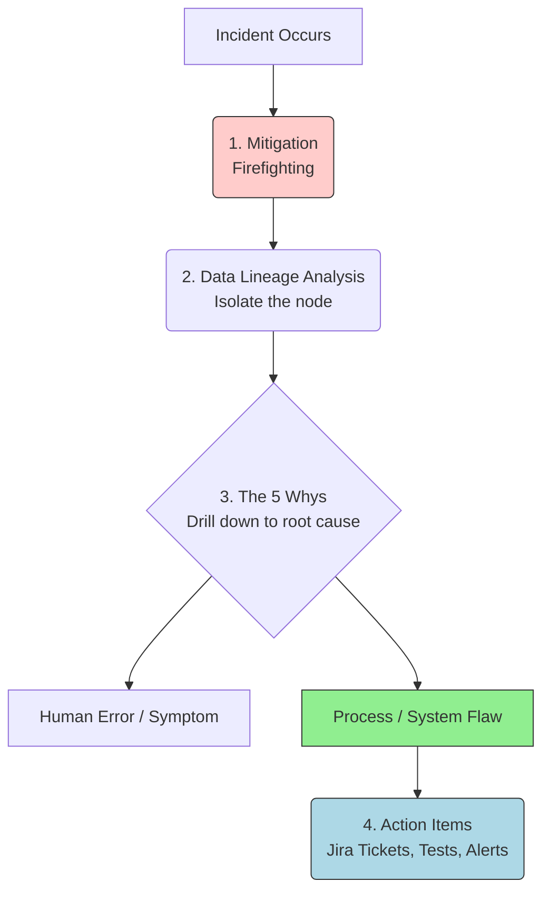

Trong quá trình vận hành các hệ thống dữ liệu, sự cố là điều không thể tránh khỏi. Một ngày đẹp trời, [data pipeline](/concepts/foundation/data-pipeline/) bỗng dưng bị sập, dữ liệu hiển thị trên dashboard bị sai lệch hoặc mô hình máy học đưa ra các dự đoán bất thường. Khi đó, phản xạ tự nhiên của chúng ta là nhanh chóng "chữa cháy" để hệ thống hoạt động trở lại. Tuy nhiên, nếu chỉ dừng lại ở đó, lỗi sẽ sớm lặp lại vào ngày mai. Để giải quyết triệt để vấn đề, chúng ta cần đến một quy trình phân tích bài bản mang tên **Root Cause Analysis (RCA) - Phân tích nguyên nhân gốc rễ**.

## Nhổ tận gốc cỏ dại: RCA là gì?

Phân tích nguyên nhân gốc rễ là một phương pháp giải quyết vấn đề có hệ thống được thực hiện sau khi sự cố đã được khắc phục tạm thời. Mục tiêu của RCA không phải là tìm ra ai đã làm sai để đổ lỗi, mà là đi tìm nguyên nhân sâu xa nhất ở tầng hệ thống và quy trình vận hành đã dẫn đến sự cố đó. Từ việc hiểu rõ nguồn gốc, chúng ta sẽ đề xuất các hành động khắc phục cụ thể nhằm đảm bảo lỗi tương tự **không bao giờ có cơ hội tái diễn**.

Trong kỹ thuật dữ liệu, quy trình xử lý sự cố luôn được chia làm 2 giai đoạn rõ rệt:
1. **Giảm thiểu thiệt hại (Mitigation)**: Hành động khẩn cấp nhằm đưa hệ thống hoạt động trở lại bình thường nhanh nhất có thể (ví dụ: chạy bù dữ liệu, khởi động lại server hoặc khôi phục phiên bản code cũ).
2. **Phân tích nguyên nhân gốc rễ (RCA)**: Khi "ngọn lửa" sự cố đã được dập tắt, đội ngũ kỹ sư sẽ ngồi lại cùng nhau điều tra xem tại sao hệ thống lại dễ bị tổn thương và tìm ra điểm đứt gãy thực sự trong toàn bộ chuỗi cung ứng dữ liệu (từ nguồn dữ liệu, logic code cho đến hạ tầng phần cứng).

## Tại sao Data Team bắt buộc phải có quy trình RCA?

*"Nếu bạn chỉ cắt phần ngọn của cỏ dại, chúng sẽ sớm mọc lại. Cách duy nhất là phải nhổ tận gốc."*

Nếu một đội ngũ dữ liệu thiếu đi văn hóa phân tích RCA bài bản, họ sẽ nhanh chóng rơi vào các cạm bẫy:
* **Vòng lặp sự cố vô tận**: Cùng một lỗi (ví dụ như API của đối tác bị mất kết nối đột ngột) xảy ra liên tục từ tháng này qua tháng khác. Kỹ sư dữ liệu phải liên tục thức giấc lúc nửa đêm chỉ để bấm nút chạy lại (Retry) thủ công.
* **Lãng phí tài nguyên chất xám**: Các kỹ sư giỏi phải dành tới 80% thời gian làm việc chỉ để đi vá các lỗi vặt cũ (Maintenance) thay vì tập trung nghiên cứu, xây dựng các tính năng mới mang lại giá trị kinh tế thực tế cho doanh nghiệp.
* **Các bản vá tạm bợ (Band-aid fixes)**: Khi thấy dữ liệu bị thiếu hụt, kỹ sư thường viết vội các câu lệnh kiểm tra kiểu `IF NULL THEN 0` ở khắp mọi nơi để che mắt người dùng. Lâu dần, kho dữ liệu ([Data Warehouse](/concepts/data-warehouse/data-warehouse/)) sẽ biến thành một đống hỗn độn, chạy chậm chạp và tích tụ lượng nợ kỹ thuật (Technical Debt) khổng lồ.

## Hai trụ cột cốt lõi của RCA

Quy trình tìm kiếm nguyên nhân gốc rễ được nâng đỡ bởi hai yếu tố quan trọng:

### 1. Các phương pháp tư duy suy luận logic
* **Phương pháp 5 Whys (5 Câu hỏi Tại sao)**: Đây là kỹ thuật vô cùng đơn giản nhưng hiệu quả được Toyota khởi xướng. Bằng cách đặt câu hỏi *"Tại sao?"* liên tục (thông thường là 5 lần) cho mỗi câu trả lời, bạn sẽ bóc tách dần các triệu chứng bề mặt để chạm tới lỗ hổng quy trình cốt lõi ở đáy cùng.
* **Biểu đồ Ishikawa (Biểu đồ xương cá)**: Giúp trực quan hóa và phân loại các nguyên nhân tiềm năng theo từng nhóm đối tượng như: Con người, Quy trình, Công nghệ, và Môi trường.

### 2. Các công cụ hỗ trợ kỹ thuật
* **Data Lineage (Phả hệ dữ liệu)**: Bản đồ trực quan mô tả đường đi và sự biến đổi của dữ liệu qua từng bước. Có Data Lineage tốt, bạn chỉ cần vài giây để khoanh vùng xem dữ liệu bị lỗi bắt đầu phát sinh từ phân đoạn nào.
* **Nhật ký truy vấn (Query Logs) & Lịch sử Git**: Giúp tra cứu xem ai đã thực hiện lệnh SQL nào, đoạn code cấu hình nào vừa được merge vào nhánh production vào thời điểm xảy ra sự cố.

## Bốn bước triển khai quy trình RCA chuẩn chỉnh



1. **Khảo sát hiện trạng (What happened?)**: Mô tả chi tiết và khách quan về sự cố (ví dụ: *"Dashboard báo cáo doanh thu ngày 07/06 hiển thị bằng 0"*). Xác định rõ mốc thời gian (Timeline) từ lúc sự cố bắt đầu phát sinh cho đến khi được khắc phục tạm thời.
2. **Khoanh vùng kỹ thuật (Isolation)**: Lần theo sơ đồ Data Lineage để đi ngược dòng dữ liệu. Nếu bảng đầu ra rỗng, ta kiểm tra bảng staging trước đó. Nếu staging vẫn có dữ liệu mà bảng đích rỗng, điểm đứt gãy chắc chắn nằm ở logic biến đổi giữa hai bảng này.
3. **Phân tích chiều sâu bằng 5 Whys**: Đặt các câu hỏi liên tục để đào sâu vấn đề từ kỹ thuật sang quy trình vận hành.
4. **Đề xuất hành động ngăn ngừa (Action Items)**: Tạo các task cụ thể trên Jira để bổ sung các bài kiểm thử dữ liệu ([Data Quality](/concepts/data-quality/data-quality/) Tests), tối ưu hóa cấu hình cảnh báo, hoặc điều chỉnh quy trình phối hợp giữa các team.

## Ví dụ thực tế: Cú sập chỉ số Churn Rate 100%

**Sự cố xảy ra**: Dashboard phân tích hiển thị tỷ lệ khách hàng rời bỏ dịch vụ (Churn Rate) đột ngột tăng lên mức 100% (toàn bộ khách hàng bỏ đi), khiến ban giám đốc vô cùng hoang mang. Kỹ sư dữ liệu đã nhanh chóng "chữa cháy" bằng cách chạy lại toàn bộ pipeline và số liệu trở lại bình thường. Sau đó, team bắt đầu thực hiện RCA.

### Áp dụng kỹ thuật 5 Whys:
* **Tại sao (1) Dashboard báo Churn Rate 100%?**
  - Vì bảng lưu trữ lịch sử thuê bao `Fact_Subscriptions` tại kho dữ liệu DWH ngày hôm qua ghi nhận toàn bộ cột trạng thái hoạt động `is_active` là `FALSE`.
* **Tại sao (2) cột `is_active` lại bị ghi nhận là `FALSE`?**
  - Vì mô hình [dbt](/concepts/transformation-analytics/dbt/) thực hiện phép nối `LEFT JOIN` với bảng thông tin người dùng `crm_users`, nhưng kết quả join bị trả về `NULL`. Logic code quy định nếu kết quả join bị `NULL` thì mặc định trạng thái hoạt động là `FALSE`.
* **Tại sao (3) phép LEFT JOIN lại trả về NULL?**
  - Vì cột khóa ngoại `user_id` ở hệ thống nguồn vừa bị thay đổi kiểu dữ liệu từ dạng số `123` sang định dạng chuỗi chứa tiền tố `'user-123'`, dẫn đến lệch kiểu dữ liệu (Type Mismatch) khi thực hiện so khớp join.
* **Tại sao (4) định dạng của `user_id` bị thay đổi ở hệ thống nguồn mà team Data không hề hay biết?**
  - Vì team Backend vừa triển khai một bản cập nhật hệ thống để đổi thư viện tạo ID nhưng quên không thông báo cho team Data về sự thay đổi cấu trúc này (hiện tượng [Schema Drift](/concepts/observability-reliability/schema-drift/)).
* **Tại sao (5) lỗi nghiêm trọng này lại có thể lọt thẳng lên môi trường Production DWH mà không bị chặn lại ở cửa ngõ?**
  - **(Root Cause - Nguyên nhân gốc)**: Vì Data Pipeline của chúng ta hiện tại chưa thiết lập các bộ kiểm tra chất lượng dữ liệu (Data Quality Tests) ở tầng dữ liệu đầu vào (Ingestion) để xác thực kiểu dữ liệu và định dạng trước khi chạy các mô hình tính toán.

### Các hành động khắc phục cụ thể (Action Items):
1. Thiết lập bài test định dạng `user_id` bằng Regex trong file cấu hình dbt. Nếu dữ liệu đầu vào không khớp định dạng, pipeline sẽ lập tức dừng chạy để bảo toàn tính đúng đắn cho dashboard.
2. Làm việc với team Backend để thống nhất áp dụng **[Data Contract](/concepts/transformation-analytics/data-contract/) (Hợp đồng dữ liệu)** – ràng buộc không tự ý thay đổi cấu trúc bảng nguồn khi chưa có sự đồng ý của các team tiêu thụ dữ liệu.

Dưới đây là file cấu hình dbt test để thực thi Action Item số 1:

```yaml
# models/staging/schema.yml
version: 2

models:
  - name: stg_crm_users
    columns:
      - name: user_id
        tests:
          - not_null
          - unique
          # Yêu cầu cột user_id bắt buộc phải là định dạng số, không chứa ký tự chữ
          - dbt_expectations.expect_column_values_to_match_regex:
              regex: "^[0-9]+$"
```

## Những nguyên tắc vàng và sai lầm thường gặp

### Các nguyên tắc vàng khi làm RCA (Best Practices)
* **Văn hóa không đổ lỗi (Blameless RCA)**: Đây là nguyên tắc quan trọng nhất. Mục tiêu của buổi họp RCA là tìm ra lỗ hổng của *hệ thống* và *quy trình*, chứ không phải tìm ra một cá nhân để khiển trách. Nếu bạn đổ lỗi cho con người (ví dụ: *"Do lập trình viên John gõ nhầm code"*), lỗi gốc thực chất nằm ở chỗ quy trình review code và hệ thống CI/CD của công ty quá lỏng lẻo để một lỗi gõ nhầm có thể dễ dàng lọt lên production. Việc đổ lỗi chỉ khiến các kỹ sư có xu hướng giấu lỗi trong tương lai.
* **Viết tài liệu lưu trữ (Incident Post-mortem)**: Mọi sự cố nghiêm trọng đều cần được ghi chép lại theo một template chuẩn hóa và lưu trữ công khai trên Wiki nội bộ của công ty. Tài liệu này sẽ là nguồn tư liệu vô giá để đào tạo và nâng cao kinh nghiệm cho các nhân sự mới.
* **Tự động hóa bằng các công cụ Observability**: Tận dụng các nền tảng Data Observability hiện đại để tự động liên kết mã nguồn, phả hệ dữ liệu và nhật ký chạy hệ thống trên cùng một giao diện, giúp giảm thiểu thời gian điều tra thủ công.

### Những sai lầm phổ biến cần tránh
* **Dừng lại quá sớm ở nguyên nhân trực tiếp (Proximate Cause)**: Khi thấy server báo lỗi tràn bộ nhớ (Out of Memory), bạn chỉ đơn thuần tăng dung lượng RAM của server lên và đóng ticket sự cố. Thực chất, nguyên nhân gốc rễ có thể nằm ở một câu lệnh SQL viết tồi chứa phép nhân vô hướng (`CROSS JOIN`) làm bùng nổ lượng dữ liệu xử lý. Việc tăng RAM chỉ giống như uống thuốc giảm đau mà không chữa dứt điểm nguồn bệnh.
* **Bỏ quên các Action Items**: Buổi họp RCA diễn ra rất sôi nổi và đưa ra nhiều ý tưởng cải tiến, nhưng sau đó không một ai tạo task để thực thi. Các kế hoạch ngăn ngừa lỗi sẽ nhanh chóng bị lãng quên dưới đáy backlog. Bạn cần xem xét các task phòng ngừa sự cố có mức độ ưu tiên ngang hàng với các task phát triển tính năng mới.

## Điểm đánh đổi thực tế

* **Ưu điểm**: Giúp giải quyết dứt điểm các lỗi hệ thống mãn tính, nâng cao chất lượng vận hành kỹ thuật của toàn đội ngũ và giảm thiểu lượng nợ kỹ thuật tích tụ theo thời gian.
* **Nhược điểm**: Đòi hỏi đầu tư thời gian và công sức đáng kể. Một buổi họp phân tích RCA chi tiết có thể tiêu tốn hàng giờ làm việc của những kỹ sư nhiều kinh nghiệm nhất trong team. Đồng thời, nó yêu cầu một môi trường văn hóa công ty cởi mở, minh bạch và tin tưởng lẫn nhau.

## Các khái niệm liên quan

* [Cảnh báo & Phản ứng sự cố - Alerting & Incident Response](/concepts/observability-reliability/alerting-incident-response/)
* [Data Observability](/concepts/observability-reliability/data-observability/)
* [Truy vết dữ liệu - Data Lineage](/concepts/governance-metadata/data-lineage/)

## Góc phỏng vấn: Tư duy vận hành và xử lý sự cố

### 1. Tại sao văn hóa "Blameless" (Không đổ lỗi) lại đóng vai trò sống còn trong việc xây dựng quy trình RCA hiệu quả tại doanh nghiệp?
* **Gợi ý trả lời**: Con người ai cũng có lúc phạm sai lầm. Nếu một doanh nghiệp có văn hóa trừng phạt hay khiển trách cá nhân khi xảy ra sự cố, các kỹ sư sẽ có xu hướng tìm cách che giấu lỗi, đổ lỗi chéo cho nhau hoặc cố gắng sửa lỗi một cách âm thầm (silent failure). Điều này khiến dữ liệu sai lệch tiếp tục âm thầm lan truyền rộng hơn, gây thiệt hại lớn cho doanh nghiệp và làm mất đi cơ hội để cải tiến quy trình hệ thống. Văn hóa Blameless khuyến khích sự trung thực, giúp mọi người tập trung hoàn toàn vào việc mổ xẻ lỗ hổng của quy trình công nghệ để cùng nhau xây dựng hệ thống tự vệ tốt hơn.

### 2. Hãy phân biệt sự khác nhau giữa "Chữa cháy" (Mitigation) và "Phân tích nguyên nhân gốc rễ" (RCA) qua một ví dụ cụ thể trong kỹ thuật dữ liệu.
* **Gợi ý trả lời**: 
  - **Mitigation** là hành động khắc phục khẩn cấp để khôi phục dịch vụ cho người dùng nhanh nhất có thể.
  - **RCA** là quá trình điều tra sâu rộng sau đó để tìm ra nguồn gốc và thiết lập giải pháp ngăn ngừa vĩnh viễn.
  - *Ví dụ thực tế*: Lúc 08:00 sáng, ổ đĩa cứng lưu trữ của Data Warehouse bị đầy 100% khiến toàn bộ pipeline bị sập. 
    + Hành động *Mitigation* là kỹ sư nhanh chóng vào xóa bỏ các bảng dữ liệu tạm (temporary tables) cũ để giải phóng không gian đĩa và bấm chạy lại pipeline để dashboard kịp hiển thị số liệu cho phiên họp sáng. 
    + Quy trình *RCA* sau đó phát hiện nguyên nhân gốc rễ do một script dbt chạy vòng lặp sinh ra file log rác khổng lồ không tự động xóa. Giải pháp ngăn ngừa (Action Item) là thiết lập cấu hình tự động dọn dẹp log (log rotation) và cài đặt hệ thống cảnh báo tự động khi dung lượng ổ đĩa vượt ngưỡng 80%.

## Tài liệu tham khảo

1. **Google SRE Book** - Chương 15: Postmortem Culture: Learning from Failure.
2. **The 5 Whys Method** - Tài liệu về phương pháp quản lý chất lượng của Toyota.
3. **DataOps Cookbook** - Christopher Bergh.

## English Summary

Root Cause Analysis (RCA) is a systematic problem-solving process used in [Data Engineering](/concepts/foundation/data-engineering/) to uncover the fundamental, underlying reasons for data incidents (e.g., pipeline failures, data anomalies), rather than merely addressing surface symptoms. Employing methodologies like the "5 Whys" and leveraging technical tools like Data Lineage, RCA aims to identify systemic or process flaws (like missing data contracts or absent CI/CD tests) that led to the failure. A critical component of Site Reliability Engineering (SRE), RCA must be conducted in a "blameless" culture to encourage honest investigation, resulting in concrete action items that "fireproof" the architecture and prevent the same issue from ever recurring.
