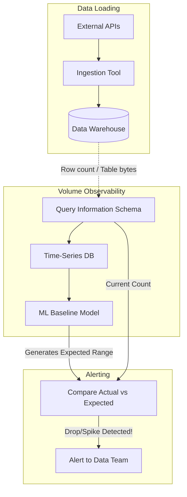

Hãy tưởng tượng bạn đang vận hành một hệ thống dữ liệu phục vụ báo cáo doanh thu hàng ngày. Sáng hôm nay, hệ thống Airflow báo tất cả các job đều "xanh rì" (Success), cấu trúc bảng (schema) không đổi, thời gian cập nhật đúng tiến độ. Nhưng khi mở Dashboard lên, biểu đồ doanh thu tụt dốc một cách khó hiểu. Hóa ra, do một lỗi kỹ thuật từ phía đối tác, lượng dữ liệu đổ về kho giảm tới 80% mà không hề báo lỗi. Đây chính là lúc chúng ta cần đến **Volume Anomalies** — một trong năm trụ cột cốt lõi của Data Observability.

Giám sát khối lượng dữ liệu (Volume Monitoring) tập trung vào việc theo dõi số lượng bản ghi (row count) hoặc kích thước tệp (byte size) được nạp vào, biến đổi hoặc xóa đi trong hệ thống dữ liệu theo thời gian. Việc này giúp đội ngũ Data Team nhanh chóng phát hiện các sự cố mất mát dữ liệu (Data Loss) hoặc bùng nổ dữ liệu (Data Duplication) một cách tự động, trước khi người dùng kịp nhận ra.

---

## Volume Anomalies thực chất là gì?

**Volume Anomalies** là tình trạng số lượng dữ liệu đầu vào hoặc đầu ra của một bảng/pipeline bị lệch một cách đáng kể (vượt ngưỡng cho phép) so với kỳ vọng lịch sử (baseline).

Khi thiết lập giám sát Volume, chúng ta thực tế đang đi tìm câu trả lời cho câu hỏi: *“Ngày hôm nay, chúng ta nhận được bao nhiêu dòng dữ liệu? Con số đó có bình thường so với các ngày thứ Hai khác trong tháng hay không?”*

Trong thực tế, bất thường về khối lượng dữ liệu thường chia làm hai nhóm chính:
* **Sự sụt giảm đột ngột (Drop Anomaly)**: Một bảng `events` hàng ngày nhận đều đặn khoảng 2 triệu dòng, hôm nay đột ngột giảm xuống chỉ còn 50,000 dòng.
* **Sự tăng vọt bất thường (Spike Anomaly)**: Một bảng `daily_transactions` bình thường nạp 10,000 dòng, hôm nay tăng vọt lên 30,000 dòng một cách vô lý.

---

## Tại sao đường ống dữ liệu lại cần giám sát khối lượng?

Biến động về khối lượng chính là những "cờ đỏ" (red flag) trực quan nhất báo hiệu hệ thống của bạn đang gặp vấn đề. Dưới đây là những tình huống thực tế thường gặp:

1. **Mất mát dữ liệu do thay đổi kỹ thuật (Data Loss)**: Đội ngũ Backend vô tình phát hành một bản cập nhật ứng dụng làm mất đi 50% sự kiện tracking click của người dùng. Hệ thống [Data Pipeline](/concepts/foundation/data-pipeline/) vẫn chạy thành công, dữ liệu vẫn mới (Freshness bình thường), cấu trúc không đổi (Schema ổn), nhưng khối lượng giảm sút nghiêm trọng.
2. **Trùng lặp dữ liệu (Data Duplication)**: Do thiết lập cấu hình chạy Airflow [backfill](/concepts/etl-elt/backfill/) sai, một khoảng thời gian dữ liệu bị tải lại 2 lần (sử dụng append thay vì merge/upsert), khiến khối lượng tăng gấp đôi.
3. **Sự cố API / Giới hạn Rate Limit**: Khi kéo dữ liệu từ API bên thứ 3 (như Facebook Ads, Salesforce), việc chạm ngưỡng rate limit hoặc [token](/concepts/genai-ml/token/) bị hết hạn giữa chừng khiến pipeline chỉ lấy được một phần dữ liệu rồi tự ngắt (Partial Load) nhưng vẫn báo hoàn thành.

Nếu không có cơ chế phát hiện sớm, những lỗi "ngầm" này sẽ trôi tuột vào các báo cáo phân tích, dẫn đến việc đưa ra các quyết định kinh doanh sai lệch dựa trên dữ liệu không hoàn chỉnh.

---

## Ý tưởng cốt lõi: Làm sao biết thế nào là "bất thường"?

Cốt lõi của giám sát khối lượng nằm ở việc thiết lập **Baseline (Đường cơ sở)**. Khối lượng dữ liệu của một doanh nghiệp hiếm khi là một hằng số tĩnh (hôm nay có thể có nhiều khách hàng mua hàng hơn hôm qua). Vì vậy, nếu bạn chỉ đặt một cảnh báo tĩnh kiểu như *"Báo lỗi nếu số dòng < 1 triệu"* thì sớm muộn gì bạn cũng sẽ bị "ngập lụt" trong đống cảnh báo giả.

Các hệ thống Data Observability hiện đại thường sử dụng các thuật toán học máy chuyên dụng cho chuỗi thời gian (Time-series Forecasting / Anomaly Detection) để giải quyết bài toán này qua các bước:
* **Nhận diện xu hướng (Trend)**: Nhận biết dữ liệu đang tăng trưởng dần theo từng tháng.
* **Nhận diện tính mùa vụ (Seasonality)**: Hiểu rằng khối lượng dữ liệu luôn thấp vào cuối tuần và cao vọt vào ngày Thứ Hai đầu tuần.

Từ đó, hệ thống sẽ tự động vẽ ra một "dải dung sai dự kiến" (expected range). Chỉ khi khối lượng thực tế rơi ra khỏi dải an toàn này, cảnh báo mới thực sự được kích hoạt.

---

## Quy trình hoạt động của hệ thống giám sát Volume

Thông thường, quá trình giám sát sẽ trải qua 4 giai đoạn chính được thể hiện qua sơ đồ dưới đây:


1. **Thu thập Metrics (Telemetry Collection)**: Mỗi khi một Data Job (Airflow, [dbt](/concepts/transformation-analytics/dbt/), Fivetran) kết thúc, hệ thống sẽ log lại thông tin `rows_inserted`, `rows_updated`, `rows_deleted` hoặc truy vấn Metadata DWH để lấy tổng số dòng hiện tại của bảng (`COUNT(*)`).
2. **Lưu trữ chuỗi thời gian (Time-Series Storage)**: Các metrics này được lưu thành chuỗi thời gian (ví dụ: `[Day 1: 1M], [Day 2: 1.1M], [Day 3: 1.05M]...`).
3. **Dự báo (Forecasting / Baseline Generation)**: Hệ thống sử dụng mô hình dự báo (như ARIMA, Prophet, hoặc Isolation Forest) để dự đoán dải giá trị kỳ vọng cho "Day 4".
4. **So sánh & Cảnh báo (Alerting)**: Khi dữ liệu Day 4 được nạp vào là `0.3M` (rơi ra ngoài dải kỳ vọng dưới), hệ thống kích hoạt Volume Drop Alert.

---

## Từ lý thuyết đến thực tế: SQL tĩnh vs. Học máy tự động

Hãy thử so sánh hai cách tiếp cận phổ biến để giám sát bảng dữ liệu `web_pageviews` (lưu lượng truy cập web mỗi ngày).

### Cách giám sát truyền thống (Dùng SQL tĩnh qua dbt tests)

Chúng ta có thể viết một câu truy vấn kiểm tra xem số bản ghi ngày hôm nay có sụt giảm quá 30% so với trung bình 7 ngày trước đó hay không:
```sql
-- Kiểm tra xem số bản ghi ngày hôm nay có giảm quá 30% so với trung bình 7 ngày trước không
WITH recent_avg AS (
    SELECT AVG(daily_count) as avg_7d
    FROM (
        SELECT DATE(event_time), COUNT(*) as daily_count
        FROM web_pageviews
        WHERE event_time >= CURRENT_DATE - 7 AND event_time < CURRENT_DATE
        GROUP BY 1
    )
),
today_count AS (
    SELECT COUNT(*) as current_count
    FROM web_pageviews
    WHERE DATE(event_time) = CURRENT_DATE
)
SELECT current_count, avg_7d
FROM today_count CROSS JOIN recent_avg
WHERE current_count < (avg_7d * 0.70) -- Báo lỗi nếu giảm trên 30%
```

### Cách giám sát hiện đại (Nền tảng Data Observability ML)

Với các công cụ hiện đại, Data Engineer không cần phải viết những câu SQL phức tạp và bảo trì chúng thủ công. Nền tảng sẽ tự động học hành vi của bảng `web_pageviews`.

Giả sử vào ngày lễ Giáng Sinh, lượng truy cập website tự nhiên giảm sút mạnh.
* Nếu dùng **cách SQL tĩnh**, hệ thống sẽ báo động lỗi giả (False Positive) vì lượng truy cập chắc chắn giảm quá 30% so với ngày thường.
* Ngược lại, **nền tảng ML** đã học được hành vi này từ lịch sử các năm trước (Seasonality), biết được đây là sự sụt giảm bình thường trong kỳ nghỉ lễ nên sẽ tự động điều chỉnh dải kỳ vọng xuống thấp hơn mà không gửi cảnh báo rác, giúp Data Team có một kỳ nghỉ yên bình.

---

## Những nguyên tắc vàng để triển khai hiệu quả (Best Practices)

Để xây dựng hệ thống giám sát khối lượng dữ liệu đáng tin cậy, bạn nên áp dụng các nguyên tắc sau:

* **Kết hợp Volume với Freshness (Độ tươi của dữ liệu)**: Khối lượng dữ liệu sụt giảm thường đi đôi với việc cập nhật bị trễ. Hãy gom các cảnh báo này lại với nhau (Incident Grouping) để nhanh chóng xác định nguyên nhân gốc rễ từ phía nguồn nạp dữ liệu.
* **Theo dõi ở mức độ chi tiết phù hợp (Granularity)**: Thay vì chỉ đo `COUNT(*)` của toàn bộ bảng (điều này có thể làm lu mờ sự cố của lượng dữ liệu mới nạp do dữ liệu lịch sử quá lớn), hãy tập trung đo lường khối lượng dữ liệu được thêm mới hoặc thay đổi theo từng phân vùng thời gian (ví dụ: số lượng dòng được insert *trong ngày hôm nay*).
* **Đo lường theo phân đoạn dữ liệu cốt lõi (Segment Volume)**: Đôi khi tổng số dòng của bảng vẫn ổn định, nhưng số lượng bản ghi từ một phân vùng quan trọng (ví dụ: đơn hàng từ khu vực `region='US'`) lại đột ngột giảm về 0. Hãy chủ động thiết lập giám sát Volume trên các chiều dữ liệu quan trọng này.

---

## Những sai lầm kinh điển dễ mắc phải

* **Bỏ qua yếu tố mùa vụ hoặc các sự kiện đặc biệt**: Việc chạy các chương trình Flash Sale có thể làm dữ liệu tăng vọt gấp 10 lần (gây Spike Anomaly). Ngay ngày hôm sau khi chương trình kết thúc, dữ liệu giảm về mức bình thường lại bị hệ thống cảnh báo sụt giảm (Drop Anomaly). Hãy chọn các công cụ cho phép cung cấp phản hồi (feedback) hoặc tạm ẩn cảnh báo (mute) trong những khoảng thời gian đặc biệt này.
* **Sử dụng truy vấn quét toàn bảng (Full Table Scan) quá thường xuyên**: Chạy `SELECT COUNT(*)` mỗi giờ trên các bảng dữ liệu có kích thước Petabytes trong Google BigQuery sẽ làm hóa đơn tiền điện toán tăng chóng mặt. Hãy ưu tiên tận dụng các bảng siêu dữ liệu của hệ thống (như `INFORMATION_SCHEMA.TABLE_STORAGE` hoặc `__TABLES__`) để lấy thông tin khối lượng với chi phí gần như bằng không.

---

## Cân nhắc hai mặt: Lợi ích và Đánh đổi

### Điểm mạnh
* Trực quan và dễ hiểu. Volume là một chỉ báo "sức khỏe" thô nhưng phản ánh cực kỳ nhanh chóng xem pipeline có đang tải thiếu dữ liệu (partial load) hay không.
* Giúp bắt được các lỗi logic khó phát hiện (như phép JOIN không chuẩn dẫn đến nhân bản dữ liệu ngoài ý muốn - Cartesian product) mà các bài test Schema hay Freshness không thể nhận diện được.

### Điểm yếu
* Dễ tạo ra nhiều cảnh báo giả nếu mô hình kinh doanh có độ biến thiên cao (ví dụ: các trang thương mại điện tử vào các đợt sale) và thuật toán dự báo baseline không đủ linh hoạt.

---

## Khi nào nên áp dụng (và khi nào không cần)?

* **Nên áp dụng**: Cho toàn bộ các bảng dữ liệu cốt lõi (Core Tables, Fact Tables) lưu trữ giao dịch, sự kiện hệ thống (Logs, Events, Telemetry) có tần suất sinh dữ liệu liên tục và tương đối ổn định.
* **Không cần thiết**: Với các bảng danh mục nhỏ, ít biến động (Reference/Dimension Tables) như bảng mã quốc gia (`Country_Codes`) hay loại tiền tệ (`Currency_Types`) vì dữ liệu của chúng hầu như không thay đổi hàng ngày.

---

## Các khái niệm liên quan

Để có cái nhìn toàn diện hơn về kiểm soát chất lượng dữ liệu, bạn có thể tham khảo thêm các bài viết sau:
* [Giám sát khả năng quan sát dữ liệu - Data Observability](/concepts/observability-reliability/data-observability/)
* [Giám sát độ trễ - Freshness Monitoring](/concepts/observability-reliability/freshness-monitoring/)
* [Data Quality](/concepts/data-quality/data-quality/)

---

## Góc phỏng vấn: Những câu hỏi thường gặp

### 1. Sự khác biệt giữa việc đo lường Data Volume bằng `COUNT(*)` và việc đọc từ Information Schema (Metadata) là gì?
* **Mục đích của người phỏng vấn**: Đánh giá hiểu biết sâu sắc về tối ưu hóa chi phí và kiến trúc của các hệ thống Cloud Data Warehouse hiện đại.
* **Gợi ý trả lời**: 
  Chạy `COUNT(*)` trực tiếp trên bảng yêu cầu hệ thống phải quét (scan) qua tài nguyên vật lý, tiêu tốn năng lực tính toán và phát sinh chi phí lớn trên các bảng kích thước lớn. 
  Ngược lại, đọc từ `Information Schema` là lấy thông số từ kho lưu trữ siêu dữ liệu (Metadata) được hệ thống cập nhật sẵn. Việc này hoàn toàn miễn phí và trả về kết quả tức thì (O(1)). Tuy nhiên, thông tin từ Metadata đôi khi có thể bị trễ vài phút so với trạng thái thực tế của bảng tùy thuộc vào cơ chế đồng bộ của từng hệ quản trị.

### 2. Làm thế nào để phát hiện tình trạng "Partial Load" (Dữ liệu tải bị thiếu một phần) khi dùng Airflow?
* **Mục đích của người phỏng vấn**: Đánh giá kinh nghiệm thực tế trong việc xử lý lỗi và xây dựng hệ thống pipeline bền bỉ.
* **Gợi ý trả lời**: 
  Trong thực tế, một Airflow Task có thể báo trạng thái thành công (Success) ngay cả khi nó chỉ kéo được 10% lượng dữ liệu từ API do bị giới hạn rate limit từ đối tác. Để phát hiện vấn đề này, ta không nên chỉ tin vào trạng thái của Task. 
  Thay vào đó, hãy chèn thêm logic kiểm tra Volume vào cuối Task: so sánh số dòng thực tế vừa tải về với ngưỡng kỳ vọng lịch sử (ví dụ trung bình 7 ngày qua). Nếu phát hiện độ lệch vượt ngưỡng cho phép, ta sẽ chủ động ném ra ngoại lệ (`raise Exception`) để đánh rớt Task đó, ngăn không cho dữ liệu bị thiếu nạp vào hệ thống và kích hoạt cảnh báo ngay lập tức.

---

## Tài liệu tham khảo

1. **Monte Carlo Blog** - The 5 Pillars of Data Observability.
2. **dbt Expectations Package** - Các macro hỗ trợ kiểm tra Volume và Data Quality tĩnh bằng SQL.
3. **Prophet by Meta (Facebook)** - Thuật toán Time-Series Forecasting phổ biến được ứng dụng nhiều trong Volume [Anomaly Detection](/concepts/data-quality/anomaly-detection/).

---

## English Summary

Volume Anomalies refer to unexpected spikes or drops in the row count or byte size of a dataset. As a core pillar of Data Observability, monitoring data volume helps detect silent pipeline failures—such as partial API loads, unintentional logic filtering, or data duplication (e.g., from an exploding JOIN)—where the pipeline execution status remains "green". Instead of relying on static thresholds which lead to alert fatigue, modern data observability platforms utilize machine learning (time-series forecasting) to understand seasonality and trends, generating dynamic baselines. Monitoring volume via metadata (rather than full-table `COUNT(*)` queries) is a highly cost-effective best practice for ensuring data completeness.