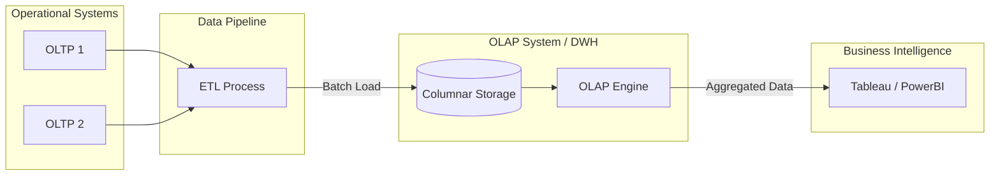

# Xử lý Phân tích Trực tuyến - OLAP

## Summary

OLAP (Online Analytical Processing) là hệ thống cơ sở dữ liệu được tối ưu hóa đặc biệt để xử lý các câu lệnh truy vấn phân tích phức tạp, tính toán tổng hợp trên một lượng dữ liệu lịch sử khổng lồ (thường lên đến Terabytes hoặc Petabytes). OLAP là công nghệ lõi đứng phía sau các Data Warehouse và các công cụ Business Intelligence (BI), giúp các nhà quản lý doanh nghiệp nhanh chóng có được cái nhìn đa chiều về dữ liệu (ví dụ: phân tích doanh thu theo khu vực, thời gian, và danh mục sản phẩm).

---

## Definition

Trái ngược với OLTP (quản lý giao dịch nhỏ, nhanh), **OLAP** được thiết kế riêng cho việc phân tích dữ liệu quy mô lớn. 
Hệ thống OLAP cung cấp khả năng trả lời các truy vấn kinh doanh nhiều lớp một cách nhanh chóng (mặc dù lượng dữ liệu quét qua có thể lên tới hàng tỷ dòng). Thuật ngữ OLAP gắn liền với khái niệm **Dimensional Modeling** (Mô hình hóa đa chiều) và **Data Cubes** (Khối dữ liệu).

Các nền tảng OLAP hiện đại tiêu biểu: Google BigQuery, Snowflake, Amazon Redshift, ClickHouse, Apache Druid.

---

## Why it exists

Thử tưởng tượng CEO yêu cầu: *"Cho tôi biết tổng doanh thu của tất cả cửa hàng tại Đông Nam Á trong quý 3 năm nay, so với cùng kỳ năm ngoái, chia theo từng ngành hàng."*
* Nếu chạy câu query này trên hệ thống OLTP (MySQL): Hệ thống sẽ bị treo vì phải gom nhóm (GROUP BY) và quét (scan) hàng trăm triệu dòng giao dịch nhỏ lẻ từ 10 bảng khác nhau được chuẩn hóa chặt chẽ.
* OLAP tồn tại để giải bài toán này. Bằng cách thiết kế lại cấu trúc lưu trữ và sử dụng bộ máy thực thi chuyên biệt, OLAP có thể trả kết quả cho CEO trong vài giây.

---

## Core idea

Ba đặc điểm kỹ thuật cốt lõi giúp OLAP có sức mạnh phân tích:
1. **Lưu trữ dạng cột (Column-oriented storage)**: Thay vì lưu theo từng dòng như OLTP, OLAP lưu toàn bộ dữ liệu của một cột (ví dụ: Cột Doanh Thu) sát cạnh nhau trên đĩa. Khi tính `SUM(Doanh Thu)`, hệ thống chỉ đọc duy nhất file chứa cột đó, bỏ qua hàng chục cột không liên quan, tăng tốc độ I/O đĩa lên hàng chục lần.
2. **Phi chuẩn hóa (Denormalization)**: Chấp nhận lưu trữ dữ liệu trùng lặp (ví dụ dùng Star Schema) để giảm bớt số lượng các phép JOIN tốn kém khi truy vấn.
3. **Pre-aggregation (Tổng hợp trước)**: OLAP Cubes truyền thống (như SSAS) tính toán sẵn kết quả tổng hợp trước khi người dùng truy vấn. Cloud OLAP hiện đại (như BigQuery) có sức mạnh máy chủ quá lớn nên thường tính toán on-the-fly (tính ngay lúc gọi).

---

## How it works

Cách thức thao tác dữ liệu đa chiều trong OLAP thường được mô tả qua các hành động trên một khối Rubik (Data Cube):
* **Roll-up (Tóm tắt)**: Di chuyển mức độ chi tiết lên cao hơn. (Ví dụ: Đang xem doanh số theo Ngày -> Roll up lên xem theo Tháng).
* **Drill-down (Khoét sâu)**: Đi sâu vào chi tiết. (Ví dụ: Đang xem doanh số theo Quốc gia -> Drill down xem doanh số theo từng Tỉnh/Thành).
* **Slice (Cắt lớp)**: Chọn ra một mặt duy nhất của khối Rubik để phân tích. (Ví dụ: Chỉ xem dữ liệu của Năm 2026).
* **Dice (Cắt khối nhỏ)**: Cắt ra một khối Rubik nhỏ hơn dựa trên nhiều chiều. (Ví dụ: Xem dữ liệu của (Năm 2026) VÀ (Sản phẩm Điện thoại)).

---

## Architecture / Flow



---

## Practical example

Một truy vấn đặc trưng của OLAP (chạy trên Data Warehouse):
Thay vì cập nhật 1 dòng, truy vấn này sẽ đọc hàng triệu dòng để ra một bảng tổng hợp báo cáo.

```sql
-- Phân tích OLAP: So sánh doanh số theo phân khúc sản phẩm giữa các quý
SELECT 
    d_date.year,
    d_date.quarter,
    d_product.category,
    SUM(f_sales.revenue) AS total_revenue,
    COUNT(DISTINCT f_sales.customer_id) AS unique_buyers
FROM fact_sales AS f_sales
JOIN dim_date AS d_date ON f_sales.date_key = d_date.date_key
JOIN dim_product AS d_product ON f_sales.product_key = d_product.product_key
WHERE d_date.year IN (2025, 2026)
GROUP BY 
    d_date.year, 
    d_date.quarter, 
    d_product.category
ORDER BY 
    total_revenue DESC;
```
Truy vấn này trên hệ thống OLAP Columnar (lưu trữ cột) chỉ tốn vài giây dù bảng `fact_sales` có 1 tỷ dòng.

---

## Best practices

* **Thiết kế Dimensional Modeling**: Luôn sử dụng Star Schema hoặc Snowflake Schema để tổ chức dữ liệu phục vụ OLAP.
* **Tối ưu hóa Partitioning**: Phân vùng dữ liệu (thường theo Ngày/Tháng). Nếu người dùng chỉ cần xem dữ liệu tháng này, OLAP engine sẽ bỏ qua (prune) việc đọc dữ liệu các tháng khác trên đĩa.
* **Sử dụng Materialized Views**: Đối với các báo cáo dashboard phức tạp mà hàng trăm người cùng mở mỗi sáng, hãy dùng Materialized Views để lưu sẵn kết quả query.

---

## Common mistakes

* **Thực hiện UPDATE/DELETE dòng đơn lẻ (Row-level updates)**: OLAP cực kỳ dở trong việc cập nhật 1 dòng dữ liệu. Việc Update/Delete phải được thực hiện theo khối lượng lớn (Batch) thông qua quá trình ETL.
* **Lưu cấu trúc OLTP trong Data Warehouse**: Copy y nguyên 30 bảng đã được chuẩn hóa 3NF từ MySQL sang BigQuery và viết truy vấn JOIN cả 30 bảng. Điều này phá hỏng sức mạnh của OLAP.

---

## Trade-offs

### Ưu điểm
* Cung cấp công cụ mạnh mẽ vô song cho việc khai phá dữ liệu (Data Mining) và BI.
* Năng lực nén dữ liệu rất cao (do lưu trữ cột, các giá trị giống nhau nằm sát nhau dễ dàng bị nén lại).

### Nhược điểm
* Dữ liệu trong OLAP thường bị "trễ" (Latency). Vì phải qua quá trình ETL, dữ liệu báo cáo thường chậm hơn thực tế từ vài phút đến 1 ngày.
* Tốc độ Ghi (Write) rất chậm so với OLTP.

---

## When to use

* Xây dựng Data Warehouse, Data Marts để cấp dữ liệu cho BI Dashboards.
* Khi có đội ngũ Data Analyst cần viết các câu lệnh SQL tự do (Ad-hoc queries) để tìm hiểu dữ liệu trên tập dữ liệu hàng chục GB trở lên.

## When not to use

* Tuyệt đối không dùng làm cơ sở dữ liệu chính (Backend) cho một website ứng dụng để xử lý giỏ hàng hay lưu trữ thông tin đăng nhập của người dùng.

---

## Related concepts

* [OLTP](/concepts/oltp)
* [Data Warehouse](/concepts/data-warehouse)
* [Columnar Storage](/concepts/columnar-storage)

---

## Interview questions

### 1. Tại sao cơ sở dữ liệu Columnar (lưu trữ cột) lại phù hợp cho hệ thống OLAP?
* **Gợi ý trả lời**: Trong truy vấn phân tích (OLAP), người dùng thường chỉ cần tính toán (Sum, Avg) trên một vài cột cụ thể (như Doanh thu) của hàng triệu dòng. Lưu trữ dạng cột lưu toàn bộ dữ liệu của 1 cột liên tiếp trên ổ đĩa. Do đó, hệ thống chỉ cần đọc chính xác file của cột Doanh thu, bỏ qua việc phải quét qua đĩa cứng để đọc các thông tin không cần thiết như Tên khách hàng, Địa chỉ (vốn chiếm nhiều dung lượng). Điều này giảm số lượng I/O ổ đĩa cực lớn, tăng tốc độ truy vấn.

### 2. Mô tả các thao tác Roll-up và Drill-down trong khối OLAP Cube.
* **Gợi ý trả lời**: 
  * Roll-up là việc giảm mức độ chi tiết của dữ liệu để có cái nhìn tổng quát hơn, thực hiện bằng cách gom nhóm lên cấp độ cao hơn (Ví dụ: từ Doanh thu theo Ngày gộp lại thành Doanh thu theo Tháng).
  * Drill-down là việc tăng mức độ chi tiết, đi sâu vào phân tích. (Ví dụ: Từ báo cáo Doanh thu theo Lục địa, người dùng click vào Châu Á để xem chi tiết Doanh thu theo từng Quốc gia).

---

## References

1. **The Data Warehouse Toolkit** - Ralph Kimball.
2. **Designing Data-Intensive Applications** - Martin Kleppmann (Chương 3 - Column-oriented Storage).

---

## English summary

OLAP (Online Analytical Processing) systems are specialized database engines designed to answer complex, multi-dimensional queries and perform high-speed aggregations across vast amounts of historical data. Operating as the backbone for Data Warehouses and BI tools, OLAP typically employs columnar storage and denormalized dimensional models (Star Schema) to optimize read-heavy analytical workloads. Unlike OLTP, OLAP is not suitable for high-frequency transactional updates, but excels at enabling analysts to slice, dice, roll-up, and drill-down into data to extract business intelligence.
