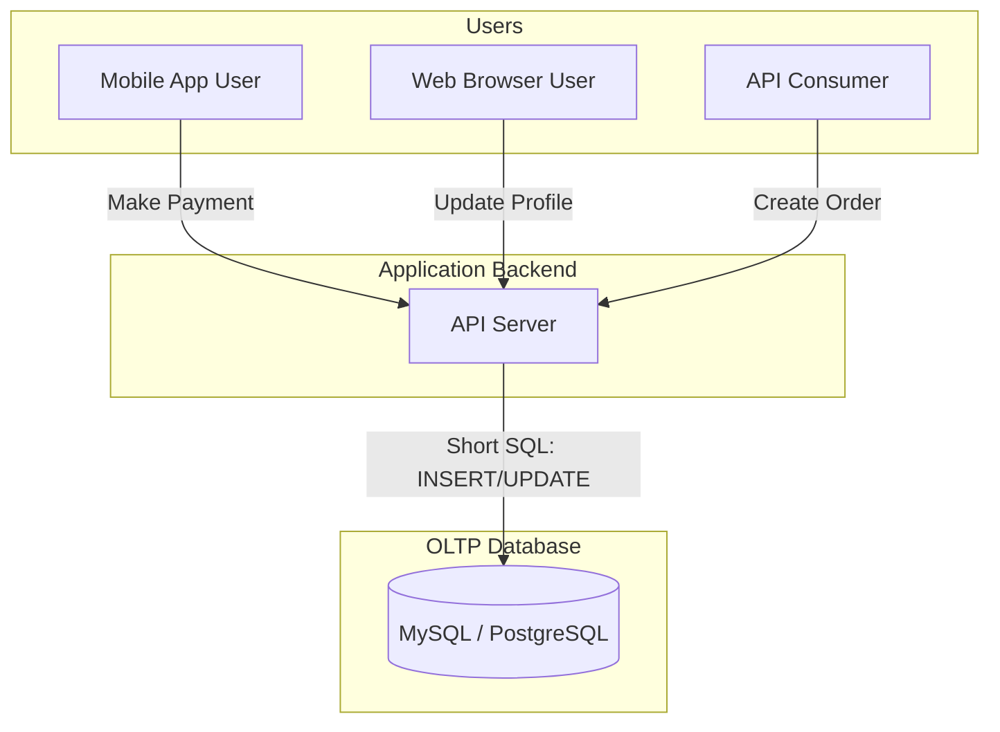

# Xử lý Giao dịch Trực tuyến - OLTP

## Summary

OLTP (Online Transaction Processing) là hệ thống cơ sở dữ liệu được thiết kế đặc biệt để quản lý và xử lý khối lượng lớn các giao dịch (transactions) ngắn, nhanh và liên tục. Đây là "xương sống" của hầu hết các ứng dụng phần mềm hướng người dùng như thương mại điện tử, hệ thống ngân hàng trực tuyến và hệ thống đặt vé. Mục tiêu tối thượng của OLTP là tính chính xác tuyệt đối, thời gian phản hồi siêu nhanh và khả năng ghi/cập nhật dữ liệu tức thì.

---

## Definition

**OLTP** đại diện cho một nhóm các hệ thống phần mềm dùng để xử lý dữ liệu giao dịch trong thời gian thực. Một "giao dịch" (transaction) thường bao gồm các lệnh `INSERT`, `UPDATE`, hoặc `DELETE` áp dụng trên một số lượng nhỏ các bản ghi (records).

Hệ thống OLTP thường được xây dựng trên các Cơ sở dữ liệu Quan hệ (RDBMS) tuân thủ chặt chẽ nguyên tắc ACID, đảm bảo rằng mỗi giao dịch đều được hoàn thành một cách toàn vẹn hoặc bị hủy bỏ hoàn toàn nếu có lỗi xảy ra.

---

## Why it exists

Mỗi giây, một trang thương mại điện tử như Amazon phải xử lý hàng nghìn người dùng thêm sản phẩm vào giỏ hàng, thanh toán và trừ kho. 
Nếu hệ thống bị trễ (latency cao) người dùng sẽ bỏ đi. Nếu hệ thống cho phép hai người cùng mua một món đồ cuối cùng trong kho (lỗi tranh chấp dữ liệu - concurrency issue), công ty sẽ gặp rắc rối lớn.
OLTP tồn tại để giải quyết bài toán: **Làm sao để phục vụ số lượng lớn người dùng cùng đọc và ghi dữ liệu đồng thời, cực nhanh (tính bằng mili-giây) mà không để xảy ra sai sót dữ liệu.**

---

## Core idea

Đặc điểm cốt lõi của một hệ thống OLTP:
* **Tần suất cao, Khối lượng nhỏ**: Hàng triệu câu lệnh SQL chạy mỗi ngày, nhưng mỗi câu lệnh thường chỉ tác động lên 1 hoặc vài dòng dữ liệu (ví dụ: Update số dư tài khoản của `user_id = 123`).
* **Thời gian thực (Real-time)**: Các giao dịch diễn ra và có kết quả ngay lập tức đối với người dùng cuối.
* **Chuẩn hóa cao (High Normalization)**: Dữ liệu thường được chuẩn hóa (đưa về 3NF) để tránh việc phải cập nhật cùng một thông tin ở nhiều nơi, giúp việc `UPDATE`/`INSERT` diễn ra nhanh nhất có thể.
* **Đọc/Ghi hỗn hợp (Read/Write Intensive)**: Tỷ lệ giữa thao tác đọc và thao tác ghi là khá cân bằng.

---

## How it works

Hệ thống OLTP hoạt động dựa trên cơ chế Khóa (Locking) và Nhật ký giao dịch (Transaction Log / Write-Ahead Log - WAL):
1. Khi một người dùng bắt đầu thanh toán, hệ thống mở một Transaction.
2. Hệ thống tìm kiếm bản ghi sản phẩm (rất nhanh nhờ Index trên `product_id`).
3. OLTP cấp một "Khóa độc quyền" (Exclusive Lock) lên dòng dữ liệu sản phẩm đó, ngăn không cho các giao dịch khác sửa nó.
4. Nó ghi thao tác `UPDATE kho_hang = kho_hang - 1` vào bộ đệm RAM và file Transaction Log trên đĩa cứng (để phòng hờ sập nguồn).
5. Khi thanh toán thành công, hệ thống gỡ Khóa (Commit), thay đổi chính thức có hiệu lực.

---

## Architecture / Flow



---

## Practical example

Một ví dụ điển hình của truy vấn OLTP trong hệ thống bán vé máy bay:

```sql
-- Giao dịch đặt vé (Chỉ tác động đến 1 User và 1 Flight)
BEGIN;

-- 1. Trừ số ghế trống của chuyến bay
UPDATE flights
SET available_seats = available_seats - 1
WHERE flight_id = 'VN247' AND available_seats > 0;

-- 2. Ghi nhận vé cho người dùng
INSERT INTO tickets (ticket_id, user_id, flight_id, status)
VALUES ('TICKET_001', 5678, 'VN247', 'CONFIRMED');

-- 3. Cập nhật số dư tài khoản
UPDATE accounts
SET balance = balance - 150.00
WHERE user_id = 5678;

COMMIT;
```
Đặc điểm: Cực nhanh, dùng Index trên các trường `flight_id` và `user_id`, thời gian thực thi < 10ms.

---

## Best practices

* **Thiết kế chuẩn hóa (3NF)**: Tránh việc cập nhật dư thừa dữ liệu. 
* **Đánh chỉ mục (Index) thông minh**: Tạo index trên các cột Khóa ngoại và các cột thường xuyên được dùng để tìm kiếm (Lookup). Tuy nhiên, không nên tạo *quá nhiều* index, vì mỗi lệnh `INSERT/UPDATE` sẽ phải cập nhật lại toàn bộ các cây index đó, làm chậm quá trình Ghi.
* **Giao dịch càng ngắn càng tốt (Short Transactions)**: Đừng bao giờ chèn một logic gọi API mạng chậm chạp vào giữa khối `BEGIN...COMMIT`. Giữ block giao dịch chạy nhanh nhất có thể để giải phóng Lock cho người khác.
* **Lưu trữ dạng Dòng (Row-based storage)**: Các RDBMS dành cho OLTP (Postgres, MySQL) lưu dữ liệu trên đĩa theo từng dòng. Điều này rất hoàn hảo vì thao tác OLTP thường cần lấy/ghi trọn vẹn thông tin của một thực thể (ví dụ lấy toàn bộ tên, tuổi, địa chỉ của 1 User).

---

## Common mistakes

* **Chạy truy vấn báo cáo nặng trên OLTP**: Data Analyst chạy câu lệnh `SELECT SUM(...) GROUP BY...` quét toàn bộ hàng triệu dòng dữ liệu trên bảng `Orders`. Câu lệnh này kéo dài vài phút, chiếm hết tài nguyên CPU và I/O, khiến ứng dụng web bị treo không thể xử lý đơn hàng mới. (Giải pháp: Chạy báo cáo trên Read Replica hoặc Data Warehouse).
* **Thiếu Archive dữ liệu cũ**: Cứ để bảng dữ liệu phình to lên hàng trăm triệu dòng trong nhiều năm. Các index trở nên quá lớn không vừa với RAM, làm hệ thống OLTP chậm dần đều.

---

## Trade-offs

### Ưu điểm
* Độ trễ cực thấp cho các thao tác đọc/ghi đơn lẻ.
* Đảm bảo tuyệt đối không có sự xung đột dữ liệu hay mất mát giao dịch nhờ ACID.

### Nhược điểm
* Hiệu suất giảm mạnh nếu thiết kế cấu trúc truy vấn không dùng Index (Full table scan).
* Không sinh ra để phục vụ các truy vấn phân tích tổng hợp (Aggregation) phức tạp trên lượng dữ liệu khổng lồ.

---

## When to use

* Bất kỳ lúc nào bạn xây dựng phần mềm tương tác trực tiếp với người dùng (Web app, Mobile app, SaaS) cần lưu trữ trạng thái người dùng.

## When not to use

* Khi bạn cần tạo một Dashboard phân tích xu hướng doanh thu của công ty trong 5 năm qua. Hãy trích xuất dữ liệu từ OLTP đưa sang OLAP.

---

## Related concepts

* [Relational Database](/concepts/relational-database)
* [OLAP](/concepts/olap)
* [Row-based Storage](/concepts/row-based-storage)

---

## Interview questions

### 1. Sự khác biệt cơ bản nhất giữa OLTP và OLAP là gì?
* **Gợi ý trả lời**: 
  * OLTP (Online Transaction Processing) tập trung vào tốc độ ghi (INSERT/UPDATE) và quản lý các giao dịch nhỏ lẻ, ngắn gọn. Nó phục vụ cho các ứng dụng vận hành (Operational). Cấu trúc thường là chuẩn hóa cao (3NF).
  * OLAP (Online Analytical Processing) tập trung vào tốc độ đọc và tính toán tổng hợp (SUM, AVG) trên lượng dữ liệu lịch sử khổng lồ. Nó phục vụ cho báo cáo (BI). Cấu trúc thường là phi chuẩn hóa (Star Schema).

### 2. Tại sao lại dùng Row-oriented storage (Lưu trữ dạng dòng) cho OLTP?
* **Gợi ý trả lời**: Trong hệ thống OLTP, các thao tác phổ biến nhất là thêm một bản ghi mới (INSERT 1 dòng) hoặc lấy thông tin chi tiết của một đối tượng cụ thể (SELECT * FROM users WHERE id=1). Lưu trữ theo dạng dòng giúp ổ đĩa đọc toàn bộ thuộc tính của một bản ghi nằm liền kề nhau trên đĩa một cách nhanh chóng nhất, tối ưu tuyệt đối cho dạng truy cập này.

---

## References

1. **Fundamentals of Data Engineering** - Joe Reis.
2. **Designing Data-Intensive Applications** - Martin Kleppmann (Chương 3 - OLTP vs OLAP).

---

## English summary

OLTP (Online Transaction Processing) refers to systems designed to handle a massive volume of short, fast, and concurrent transactions securely. Powering everyday applications like e-commerce, banking, and ticketing, OLTP relies heavily on relational databases (RDBMS) ensuring strict ACID compliance. The architecture is optimized for low-latency, real-time read and write operations on highly normalized data stored in a row-oriented format. However, OLTP is not suitable for complex analytical queries across large historical datasets, a task designated for OLAP systems.
