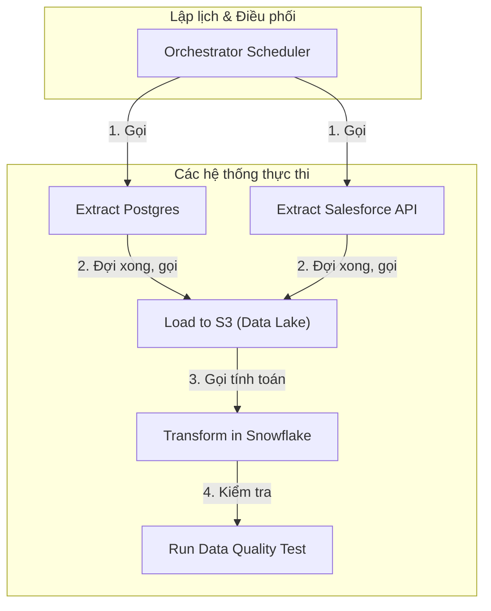

# Orchestration - Lập lịch và điều phối dữ liệu

## Summary

**Data Orchestration** (Điều phối dữ liệu) là quy trình quản lý, lập lịch (scheduling), theo dõi và kiểm soát tự động toàn bộ vòng đời của các luồng dữ liệu (Data Pipelines). Trong môi trường doanh nghiệp hiện đại, dữ liệu không tự nhiên dịch chuyển. Một hệ thống Orchestration đóng vai trò như một vị "Nhạc trưởng" (Orchestrator) đứng giữa dàn nhạc số, chỉ huy hàng chục công cụ khác nhau (Spark, Snowflake, dbt, API) thực thi các tác vụ đúng thứ tự, xử lý các sự cố đứt gãy và đảm bảo bản giao hưởng dữ liệu được hoàn thành trơn tru.

---

## Definition

Trong Data Engineering, **Orchestration** là một tập hợp các công cụ và quy trình nhằm định nghĩa các luồng công việc phức tạp dưới dạng **Đồ thị có hướng không chu trình (DAG)**. 

Orchestration thực hiện ba nhiệm vụ chính:
1. **Lập lịch (Scheduling)**: Kích hoạt tác vụ chạy vào một thời điểm cụ thể (VD: 2:00 sáng mỗi ngày).
2. **Quản lý phụ thuộc (Dependency Management)**: Đảm bảo tác vụ B chỉ chạy sau khi tác vụ A thành công. Nếu A thất bại, B sẽ không được chạy.
3. **Giám sát và Phục hồi (Monitoring & Recovery)**: Cung cấp giao diện trực quan để theo dõi trạng thái, cảnh báo qua Slack/Email khi có lỗi, và tự động thử lại (retry) các tác vụ bị lỗi mạng tạm thời.

---

## Why it exists

Thuở sơ khai, các kỹ sư dữ liệu thường sử dụng `cron` (công cụ lập lịch mặc định của Linux) để chạy các script ETL. 
Ví dụ:
* 01:00 AM: Chạy script tải dữ liệu từ MySQL về.
* 02:00 AM: Chạy script chuyển đổi dữ liệu.

Tuy nhiên, `cron` gặp phải những hạn chế chí mạng khi hệ thống lớn lên:
1. **Cron mù quáng**: Nếu script 01:00 AM bị lỗi hoặc chạy chậm mất 2 tiếng, script 02:00 AM vẫn sẽ kích hoạt đúng giờ, xử lý dữ liệu bị thiếu và làm hỏng toàn bộ báo cáo.
2. **Khó theo dõi (No Observability)**: Không có giao diện (UI) để biết luồng dữ liệu đang chạy đến đâu. Nếu lỗi xảy ra, kỹ sư phải SSH vào server và mò mẫm trong các file log văn bản.
3. **Thiếu cơ chế phục hồi (Backfill)**: Khi script bị lỗi 3 ngày liên tiếp do API bên thứ 3 hỏng, đến ngày thứ 4, việc cấu hình `cron` chạy bù lại 3 ngày trước là cực kỳ vất vả và dễ sai sót.

Orchestration ra đời để thay thế hoàn toàn `cron`, mang lại một khung quản lý công việc hướng sự kiện và có nhận thức về ngữ cảnh.

---

## Core idea

Ý tưởng cốt lõi của các công cụ Orchestration hiện đại (như Apache Airflow, Dagster, Prefect) là khái niệm **"Data Pipeline as Code"** (Đường ống dữ liệu được viết dưới dạng mã nguồn).

Thay vì kéo thả bằng giao diện đồ họa (GUI) dễ bị giới hạn logic, kỹ sư sẽ dùng mã lập trình (thường là Python) để định nghĩa cấu trúc của luồng công việc. Nhờ đó, pipeline có thể được đưa vào quản lý phiên bản (Git), review code (PR), và áp dụng CI/CD giống như một ứng dụng phần mềm thông thường. 

Hơn thế nữa, bộ orchestrator tách biệt rõ ràng giữa **Khối điều khiển (Control Plane)** – làm nhiệm vụ chỉ huy, và **Khối thực thi (Data Plane)** – nơi thực sự chạy tính toán (như AWS EMR hoặc BigQuery). Orchestrator không tự mình xử lý dữ liệu nặng, nó chỉ đưa ra mệnh lệnh.

---

## How it works

1. **Định nghĩa DAG**: Kỹ sư viết code Python để khai báo các tác vụ (Tasks) và vẽ đường mũi tên chỉ định thứ tự thực thi của chúng (DAG).
2. **Parser**: Hệ thống (VD: Airflow Scheduler) đọc file code này, phân tích cú pháp và hiển thị đồ thị lên giao diện Web UI.
3. **Trigger**: Khi đến giờ (Schedule) hoặc khi có sự kiện bên ngoài (Sensor / API), một bản sao thực thi (DAG Run) được tạo ra.
4. **Execution**: Scheduler đẩy Task đầu tiên vào hàng đợi (Queue). Các Worker nhận lệnh, kết nối đến dịch vụ ngoại vi (Spark, Snowflake) để yêu cầu tính toán, rồi chờ nhận kết quả.
5. **State Tracking**: Khi Task báo thành công, Scheduler ghi nhận vào Database (Postgres/MySQL) và đẩy Task tiếp theo vào hàng đợi. Nếu thất bại, nó thử lại (Retry) vài lần rồi gửi cảnh báo lỗi.

---

## Architecture / Flow

Dưới đây là một luồng Orchestration điển hình:


*Ghi chú: Mũi tên là logic phụ thuộc. Scheduler chỉ huy toàn bộ chứ không để các hệ thống tự gọi nhau.*

---

## Practical example

Đây là ví dụ mã nguồn Python định nghĩa một luồng công việc (DAG) cơ bản trong Apache Airflow. Pipeline này sẽ chạy lệnh extract dữ liệu, sau đó transform và cuối cùng báo cáo.

```python
from airflow import DAG
from airflow.operators.bash import BashOperator
from airflow.operators.python import PythonOperator
from datetime import datetime

with DAG('daily_sales_pipeline', start_date=datetime(2026, 6, 1), schedule_interval='@daily') as dag:
    
    extract_task = BashOperator(
        task_id='extract_sales_data',
        bash_command='python extract_sales.py --date {{ ds }}'
    )
    
    transform_task = BashOperator(
        task_id='transform_data_in_dbt',
        bash_command='dbt run --models sales_mart'
    )
    
    notify_task = PythonOperator(
        task_id='send_slack_notification',
        python_callable=lambda: print("Pipeline đã hoàn thành!")
    )
    
    # Định nghĩa luồng phụ thuộc (Dependency)
    extract_task >> transform_task >> notify_task
```

---

## Best practices

* **Thiết kế tác vụ Idempotent (Lũy đẳng)**: Đây là nguyên tắc sống còn. Đảm bảo rằng nếu một tác vụ bị lỗi nửa chừng và được Orchestrator thử chạy lại (retry) hoặc chạy bù (backfill), kết quả cuối cùng ở kho dữ liệu vẫn giống hệt như chạy 1 lần (không bị duplicate dữ liệu). Hãy dùng lệnh `UPSERT/MERGE` hoặc nguyên lý Xóa trước khi Chèn (`DELETE WHERE date = X; INSERT`).
* **Tránh xử lý dữ liệu trực tiếp trong Orchestrator**: Airflow hay Prefect không phải là Spark. Đừng tải một file CSV 10GB vào RAM của server Orchestrator để xử lý. Hãy dùng Orchestrator để gửi câu lệnh SQL vào Snowflake, hoặc gửi script Spark vào EMR. Mọi thao tác xử lý nặng phải được "đẩy xuống" (Push-down) các Data Plane.
* **Chia nhỏ DAG**: Không tạo ra một DAG khổng lồ có 500 tasks. Hãy chia nhỏ thành các DAG nhỏ lẻ theo nghiệp vụ kinh doanh và kết nối chúng bằng `TriggerDagRunOperator` hoặc Data Sensors.

---

## Common mistakes

* **Sử dụng Orchestrator như một công cụ Streaming**: Cấu hình Airflow DAG chạy mỗi phút một lần. Orchestrator được sinh ra cho Batch Processing, có overhead khởi động (khởi tạo container, đọc DB state) khoảng vài giây. Chạy mỗi phút sẽ làm tắc nghẽn Database backend của Orchestrator.
* **Hardcode mốc thời gian**: Gắn cứng logic `WHERE date = '2026-06-07'` vào trong SQL query. Điều này giết chết khả năng Backfill (chạy lại dữ liệu quá khứ). Hãy luôn sử dụng biến động của Orchestrator truyền vào (ví dụ: `{{ execution_date }}`).

---

## Trade-offs

### Ưu điểm
* **Khả năng quan sát (Observability) tuyệt vời**: Có màn hình UI trực quan, ngay lập tức biết pipeline đang kẹt ở đâu, lỗi dòng log nào.
* **Quản lý sự phụ thuộc chặt chẽ**: Đảm bảo an toàn dữ liệu, ngăn chặn việc load báo cáo nếu dữ liệu gốc bị hỏng.
* **Bảo trì dễ dàng**: Việc cấu hình chạy lại dữ liệu của 1 tháng qua (Backfill) chỉ cần vài cú click chuột.

### Nhược điểm
* **Chi phí hạ tầng và vận hành cao**: Để chạy hệ thống như Airflow cần setup Web server, Scheduler, Database (Postgres), Redis/Celery Queue. Rất nặng nề cho các dự án nhỏ.
* **Đường cong học tập (Learning Curve)**: Kỹ sư phải hiểu về DAG, khái niệm Execution Date (rất phức tạp trong Airflow), State management thay vì chỉ viết 1 file script đơn giản.

---

## When to use

* Bất kỳ Data Pipeline nào có từ 2 tác vụ trở lên phụ thuộc vào nhau.
* Khi pipeline phải chạy định kỳ (Batch) vào mỗi ngày, mỗi giờ.
* Khi làm việc trong một Data Team chuyên nghiệp cần khả năng cảnh báo (Alert) và theo dõi lịch sử chạy (Auditing) của dữ liệu.

## When not to use

* Với các ứng dụng xử lý dữ liệu thời gian thực (Real-time Streaming) có độ trễ mili-giây.
* Các đoạn script chạy một lần (One-off) hoặc hệ thống chỉ có một nguồn dữ liệu cực nhỏ với thao tác dump thẳng vào CSDL.

---

## Related concepts

* [Apache Airflow](/concepts/apache-airflow)
* [Directed Acyclic Graph (DAG)](/concepts/dag)
* [Task Dependency](/concepts/task-dependency)

---

## Interview questions

### 1. Tại sao chúng ta không nên dùng `cron` để lập lịch cho Data Pipeline?
* **Người phỏng vấn muốn kiểm tra**: Nhận thức về giới hạn của công cụ truyền thống và lý do ra đời của Orchestrator.
* **Gợi ý trả lời (Strong Answer)**: Cron chỉ là công cụ kích hoạt theo thời gian trần trụi. Nó thiếu 3 yếu tố quan trọng nhất của Data Pipeline: (1) Quản lý phụ thuộc (Dependency): Nếu task 1 chạy lố thời gian hoặc thất bại, cron vẫn sẽ chạy task 2, gây thảm họa dữ liệu. (2) Cơ chế phục hồi (Retry/Backfill): Khi có lỗi mạng, cron không tự thử lại. Nếu muốn chạy bù dữ liệu 10 ngày trước, cấu hình cron là bất khả thi. (3) Khả năng quan sát (Observability): Không có UI, không có cảnh báo tự động, khó tra cứu log tập trung. Orchestrator giải quyết toàn bộ các vấn đề này.
* **Lỗi cần tránh**: Chỉ nói "Orchestrator có giao diện đẹp hơn".

### 2. Nguyên tắc Idempotent trong Data Orchestration là gì? Tại sao nó quan trọng?
* **Người phỏng vấn muốn kiểm tra**: Kinh nghiệm thực chiến về chất lượng dữ liệu.
* **Gợi ý trả lời (Strong Answer)**: Idempotent (Lũy đẳng) là tính chất đảm bảo một tác vụ dù được chạy 1 lần hay 100 lần với cùng một tham số đầu vào (như `execution_date`), thì trạng thái cuối cùng của kho dữ liệu vẫn không thay đổi (không sinh ra dữ liệu trùng lặp). Điều này cực kỳ quan trọng trong Orchestration vì khi có lỗi xảy ra, orchestrator sẽ tự động chạy lại (retry) task đó, hoặc kỹ sư sẽ bấm nút Rerun. Nếu task không lũy đẳng (VD dùng `INSERT` mù quáng), việc retry sẽ làm nhân đôi số liệu doanh thu. Do đó phải luôn dùng cấu trúc Upsert/Merge hoặc Delete-then-Insert.

### 3. Phân biệt Control Plane và Data Plane trong ngữ cảnh của Orchestrator.
* **Người phỏng vấn muốn kiểm tra**: Sự hiểu biết về kiến trúc hệ thống hiện đại.
* **Gợi ý trả lời (Strong Answer)**: Control Plane (Mặt phẳng điều khiển) là chính hệ thống Orchestrator (như máy chủ Airflow). Nhiệm vụ của nó là theo dõi, lập lịch, quyết định khi nào task chạy, gửi cảnh báo. Data Plane (Mặt phẳng dữ liệu) là các hệ thống tính toán và lưu trữ bên ngoài (như Snowflake, Spark cluster, BigQuery). Best practice là Control Plane chỉ gửi lệnh (SQL/Script) sang Data Plane để thực thi tính toán nặng, thay vì kéo dữ liệu về xử lý ngay tại bộ nhớ của Orchestrator để tránh quá tải.

### 4. Backfill là gì trong Orchestration?
* **Người phỏng vấn muốn kiểm tra**: Thuật ngữ chuyên ngành Data Engineering.
* **Gợi ý trả lời (Strong Answer)**: Backfill (Chạy bù dữ liệu) là quá trình yêu cầu Orchestrator thực thi một chuỗi các DAG Run cho các khoảng thời gian trong quá khứ. Nó được dùng trong hai trường hợp: (1) Khi hệ thống vừa triển khai code logic mới và muốn tính toán lại kết quả cho dữ liệu của 6 tháng qua. (2) Khi hệ thống bị gián đoạn (outage) 3 ngày, sau khi sửa xong cần chạy bù các luồng của 3 ngày đó để lấp đầy lỗ hổng trong Data Warehouse. Orchestrator làm việc này tự động dựa trên tham số ngày tháng truyền vào từng task.

### 5. Sự khác nhau giữa Event-driven Orchestration và Time-based Scheduling?
* **Người phỏng vấn muốn kiểm tra**: Xu hướng Data Architecture hiện đại.
* **Gợi ý trả lời (Strong Answer)**: Time-based (Lập lịch theo thời gian) là cách truyền thống, pipeline kích hoạt theo giờ cố định (Ví dụ: chạy lúc 2h sáng). Nó có nhược điểm là tốn thời gian chờ đợi lãng phí (nếu dữ liệu gốc sẵn sàng lúc 1h sáng thì vẫn phải chờ đến 2h). Event-driven (Điều phối hướng sự kiện) là pipeline được kích hoạt ngay khi có một tín hiệu bên ngoài xảy ra (Ví dụ: một file mới vừa upload lên S3 kích hoạt hàm Lambda báo cho Orchestrator chạy DAG ngay lập tức). Event-driven giảm độ trễ dữ liệu đáng kể và phản ứng linh hoạt hơn với độ trễ của hệ thống nguồn.

---

## References

1. **Fundamentals of Data Engineering** - Joe Reis, Matt Housley (Chương 6: Data Orchestration).
2. **Data Pipelines Pocket Reference** - James Densmore.

---

## English summary

**Data Orchestration** is the centralized coordination, scheduling, and monitoring of complex data pipelines. Moving far beyond traditional, blind scheduling tools like Linux `cron`, modern orchestrators (like Apache Airflow, Dagster, or Prefect) define workflows as Directed Acyclic Graphs (DAGs) in code. They manage intricate task dependencies, execute retries gracefully upon failure, provide visual observability, and support historical data backfilling. A core principle of orchestration is maintaining the orchestrator as a control plane (managing "when" and "how" tasks run) while pushing the actual heavy data processing to specialized data planes (like Spark or Snowflake), ensuring all orchestrated tasks are strictly idempotent to prevent data duplication upon retries.
