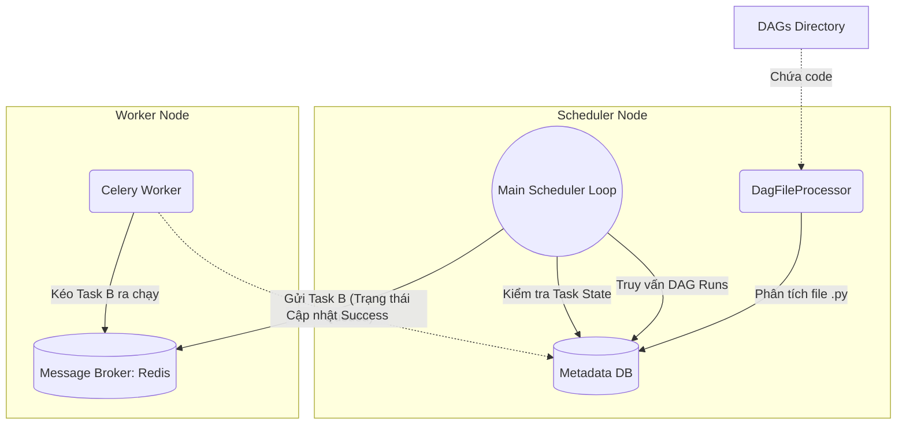

Trong hệ sinh thái Apache Airflow, nếu giao diện Web UI là gương mặt đại diện giúp bạn dễ dàng theo dõi hệ thống, các Worker là những "công nhân" chăm chỉ thực thi công việc, thì **Airflow Scheduler** chính là bộ não điều phối tối cao. 

Nó hoạt động âm thầm dưới dạng một tiến trình chạy ngầm liên tục (daemon), chịu trách nhiệm đọc và phân tích các file code Python (DAGs), theo dõi lịch trình, kiểm tra các điều kiện phụ thuộc giữa các tác vụ (Task Dependencies) và quyết định khi nào thì ném một tác vụ vào hàng đợi để các Worker xử lý.

Nếu bạn đang phải vận hành hàng trăm, hàng ngàn đường ống dẫn dữ liệu (Data Pipelines) chạy mỗi ngày, việc hiểu sâu về cơ chế hoạt động của Scheduler là chìa khóa vàng giúp bạn tối ưu hóa hiệu năng hệ thống và nhanh chóng gỡ rối (troubleshoot) khi gặp sự cố.

## Tại sao chúng ta cần Scheduler?

Một hệ thống tự động hóa không thể chạy trơn tru nếu thiếu đi một người "nhìn đồng hồ" và "ra lệnh".
* Giao diện **Webserver** thực chất chỉ làm nhiệm vụ hiển thị trực quan thông tin từ cơ sở dữ liệu meta (Metadata DB).
* Các **Worker** chỉ là những cỗ máy thực thi thụ động – chúng chỉ chạy khi được giao việc, hoàn toàn không tự biết khi nào cần bắt đầu.

Nếu không có Scheduler, các file Python định nghĩa DAG của bạn chỉ là những dòng code tĩnh vô tri vô giác nằm trên ổ đĩa. Scheduler ra đời để gánh vác toàn bộ logic phức tạp về thời gian, sự kiện và thứ tự thực thi của các tác vụ.

## Triết lý tách biệt: DagFileProcessor và Vòng lặp chính

Điểm sáng trong thiết kế của Airflow Scheduler là sự tách biệt thông minh (Decoupling) giữa hai nhiệm vụ: **Phân tích mã nguồn** và **Ra quyết định lập lịch**.

* **DagFileProcessor:** Đây là nhóm các tiến trình con có nhiệm vụ mở từng file `.py` trong thư mục DAG, biên dịch mã Python và chuyển đổi chúng thành các đối tượng DAG logic trong cơ sở dữ liệu. Công việc này cực kỳ tốn tài nguyên và dễ xảy ra lỗi nếu mã nguồn của người dùng viết chưa tối ưu (ví dụ: bị kẹt vòng lặp vô hạn hoặc cố tình kết nối cơ sở dữ liệu ngay khi khai báo DAG).
* **Vòng lặp Scheduler chính (Scheduler Loop):** Vòng lặp này chạy với tốc độ cực nhanh, chỉ tập trung tương tác với cơ sở dữ liệu (Metadata DB như Postgres/MySQL). Nó liên tục truy vấn để kiểm tra xem DAG nào đến giờ chạy, tác vụ nào đã đủ điều kiện an toàn để chuyển trạng thái sang `Scheduled` và đẩy vào hàng đợi (Queue) của Executor.

Nhờ sự phân tách này, nếu một file DAG của bạn bị lỗi cú pháp hoặc bị đơ trong quá trình dịch, nó chỉ làm ảnh hưởng đến tiến trình con `DagFileProcessor` phụ trách file đó. Vòng lặp điều phối chính của toàn bộ hệ thống vẫn hoạt động bình thường, không lo bị nghẽn hay sập nguồn.

## Một ngày làm việc của Scheduler diễn ra như thế nào?

Mỗi chu kỳ (Tick) của vòng lặp Scheduler (từ phiên bản Airflow 2.0 trở đi) diễn ra tuần tự qua các bước sau:

1. **Quét thư mục chứa code:** Tiến trình `DagFileProcessorManager` tìm kiếm các file `.py` mới hoặc có sự thay đổi, sau đó phân công cho các processor con dịch lại. Các thông tin DAG hợp lệ sẽ được chuyển sang dạng JSON (Serialize) và lưu thẳng vào Metadata DB.
2. **Tạo các lượt chạy DAG (DAG Runs):** Vòng lặp chính truy vấn cơ sở dữ liệu để tìm các DAG đang ở trạng thái hoạt động (Active) và có mốc thời gian chạy tiếp theo (`next_dagrun_create_after`) nhỏ hơn thời gian hiện tại. Hệ thống sẽ sinh ra một bản ghi DAG Run mới với trạng thái ban đầu là `Running`.
3. **Kiểm tra điều kiện phụ thuộc (Task Dependencies):** Với mỗi DAG Run đang chạy, Scheduler kiểm tra các tác vụ bên trong. Nếu Task A đã chạy thành công (`Success`) và thỏa mãn các luật kích hoạt (Trigger Rules) của Task B, Scheduler sẽ chuyển trạng thái của Task B thành `Scheduled`.
4. **Đẩy vào hàng đợi (Enqueue):** Scheduler chuyển các tác vụ đang ở trạng thái `Scheduled` sang `Queued` và đẩy chúng vào một Broker tin nhắn (ví dụ: Redis hoặc RabbitMQ khi sử dụng Celery Executor).
5. **Worker tiếp nhận:** Executor sẽ kéo các tác vụ từ Broker ra và phân phối cho các Worker đang rảnh rỗi. Trạng thái tác vụ lúc này chuyển sang `Running`.
6. **Lặp lại:** Vòng lặp này mặc định quay vòng liên tục từng giây một.

## Sơ đồ kiến trúc và luồng điều phối của Airflow

Hãy cùng nhìn vào sơ đồ dưới đây để hình dung đường đi của một tác vụ từ khi còn là code Python cho đến khi được Worker thực thi:


## Cấu hình Scheduler thực tế qua file airflow.cfg

Mặc dù Scheduler chủ yếu chạy ngầm, bạn hoàn toàn có thể tinh chỉnh hiệu năng của nó thông qua tệp cấu hình `airflow.cfg`. Dưới đây là một số cấu hình phổ biến:
```ini
[scheduler]
# Khoảng thời gian (giây) quét thư mục DAG để phát hiện file mới
dag_dir_list_interval = 30

# Số lượng tiến trình con phân tích code chạy song song
parsing_processes = 2

# Thời gian tối thiểu giữa các lần phân tích lại cùng một file DAG
min_file_process_interval = 30

# Tần số gửi nhịp tim (heartbeat) để phát hiện các tác vụ bị lỗi đột ngột (Zombie tasks)
job_heartbeat_sec = 5
zombie_detection_interval = 10
```

## Những nguyên tắc vàng giúp Scheduler chạy mượt mà

* **TUYỆT ĐỐI KHÔNG viết "Top-level code" nặng trong file DAG:** Đây là sai lầm phổ biến nhất của các lập trình viên mới. Bất kỳ dòng lệnh gọi API bên ngoài (`requests.get`) hoặc kết nối cơ sở dữ liệu (`pd.read_sql`) nằm ngoài phạm vi định nghĩa của Operator đều được coi là Top-level code. Scheduler sẽ thực thi các dòng lệnh này **mỗi khi nó quét file** (mặc định 30 giây/lần). Điều này sẽ nhanh chóng làm quá tải CPU của máy chủ Scheduler, treo Web UI và spam vô số request vô ích tới các hệ thống bên ngoài. Logic xử lý phải luôn nằm bên trong các hàm `execute` của Operator hoặc các Python callable của PythonOperator.
* **Chạy nhiều Scheduler song song (High Availability):** Từ Airflow 2.0 trở đi, Scheduler hỗ trợ chạy theo mô hình Active-Active. Bạn nên cấu hình chạy từ 2 đến 3 instance Scheduler song song. Chúng sẽ sử dụng cơ chế khóa dòng ở cấp cơ sở dữ liệu để chia sẻ công việc một cách an toàn, vừa tăng tốc độ xử lý tác vụ (throughput) vừa loại bỏ hoàn toàn điểm chết duy nhất (Single Point of Failure - SPOF).

## Những sai lầm kinh điển khiến Scheduler "khóc thét"

* **Quên bật DAG trên giao diện Web UI:** Bạn vừa viết code xong và đẩy lên hệ thống, nhưng đợi mãi không thấy Scheduler chạy. Lý do rất đơn giản: mặc định các DAG mới tạo sẽ ở trạng thái tạm dừng (Paused - nút gạt màu xám). Bạn phải gạt sang chế độ Unpaused (màu xanh) thì Scheduler mới chính thức lên lịch chạy.
* **Gặp lỗi Zombie Tasks:** Đôi khi Worker đang chạy tác vụ thì bị hệ thống tắt đột ngột do tràn bộ nhớ (Out Of Memory - OOM). Khi đó, cơ sở dữ liệu vẫn ghi nhận trạng thái tác vụ là `Running`. Nếu không có cơ chế phát hiện Zombie, tác vụ đó sẽ bị kẹt vĩnh viễn. Scheduler giải quyết điều này bằng cách kiểm tra "nhịp tim" (heartbeat) của các tác vụ. Nếu trạng thái là `Running` nhưng heartbeat đã quá hạn, Scheduler sẽ tự động đánh dấu là `Failed` để kích hoạt cơ chế chạy lại (Retry).

## Đánh đổi: Cơ chế quét liên tục (Continuous Parsing)

### Ưu điểm
Cơ chế liên tục quét thư mục DAG giúp hệ thống hỗ trợ tính năng tải nóng (Hot Reload). Khi bạn thay đổi code thông qua Git, Airflow sẽ tự động cập nhật cấu trúc DAG mới lên Web UI sau vài chục giây mà không yêu cầu bạn phải khởi động lại bất kỳ dịch vụ nào.

### Nhược điểm
Cơ chế này tiêu tốn khá nhiều tài nguyên CPU. Kể cả khi hệ thống của bạn hoàn toàn rảnh rỗi (không có tác vụ nào đang chạy), Scheduler vẫn phải liên tục đọc và biên dịch lại các file `.py` lặp đi lặp lại. So với các hệ thống dịch code một lần (như [dbt](/concepts/transformation-analytics/dbt/) hoặc Spark), Airflow yêu cầu một khoản chi phí tài nguyên duy trì (overhead) lớn hơn nhiều.

## Khi nào Scheduler là bắt buộc?

Scheduler là thành phần **bắt buộc phải có** khi vận hành Apache Airflow. Nếu không có Scheduler, bạn không thể tự động hóa việc lên lịch và chạy các đường ống dữ liệu. Đối với môi trường Production nhỏ, bạn nên cấp tối thiểu 2 vCPU và 4GB RAM cho dịch vụ này để đảm bảo hệ thống chạy ổn định.

## Các khái niệm liên quan

* [Apache Airflow](/concepts/orchestration/apache-airflow/)
* [Directed Acyclic Graph (DAG)](/concepts/orchestration/dag/)
* [Task Dependency](/concepts/orchestration/task-dependency/)

## Góc phỏng vấn: Vượt qua những câu hỏi hóc búa về Scheduler

### 1. "Top-level code" trong file DAG là gì và tại sao nó lại được ví như "sát thủ" của Airflow Scheduler?
* **Gợi ý trả lời:** Top-level code là những dòng code Python nằm ngoài phạm vi các hàm định nghĩa của các Operator (nằm ở mức thụt lề ngoài cùng). Scheduler quét và biên dịch lại toàn bộ các file `.py` trong thư mục DAG theo chu kỳ rất ngắn (khoảng 30 giây/lần). Nếu ta thực hiện các thao tác nặng như kết nối database, gọi API hoặc đọc file CSV ở mức top-level này, chúng sẽ bị thực thi lặp đi lặp lại liên tục bởi tiến trình Scheduler. Điều này làm nghẽn tiến trình quét, gây spike CPU lên 100%, làm chậm trễ việc nhận diện DAG mới và gây treo giao diện Web UI.

### 2. Sự khác biệt lớn nhất giữa phiên bản Airflow 1.x và Airflow 2.x về mặt Scheduler là gì?
* **Gợi ý trả lời:** Trong phiên bản Airflow 1.x, Scheduler là một điểm chết duy nhất (Single Point of Failure). Bạn chỉ được phép chạy duy nhất một tiến trình Scheduler tại một thời điểm; nếu chạy hai tiến trình song song, chúng sẽ tranh chấp và đẩy một tác vụ vào hàng đợi nhiều lần, gây lỗi trùng lặp. Từ phiên bản 2.0, Airflow hỗ trợ kiến trúc High Availability (HA) Active-Active. Bằng cách sử dụng cơ chế khóa dòng ở cấp cơ sở dữ liệu (`SELECT ... FOR UPDATE SKIP LOCKED`), bạn có thể chạy nhiều instance Scheduler song song cùng lúc một cách an toàn để chia tải và chống sập hệ thống.

### 3. Bạn đẩy một file DAG mới vào thư mục nhưng trên giao diện Web UI không thấy xuất hiện. Bạn sẽ debug như thế nào?
* **Gợi ý trả lời:** Quy trình debug gồm các bước: (1) Kiểm tra log của tiến trình `DagFileProcessor` xem file Python có gặp lỗi cú pháp (Syntax Error) hoặc lỗi thiếu thư viện phụ thuộc (Import Error) hay không. (2) Đảm bảo trong code file Python có chứa các từ khóa bắt buộc là `"DAG"` và `"airflow"`, vì Airflow mặc định bỏ qua các file không chứa hai từ khóa này để tối ưu hóa CPU. (3) Kiểm tra giá trị cấu hình `dag_dir_list_interval` xem chu kỳ quét thư mục có bị đặt quá dài hay không. (4) Thử khởi động lại tiến trình Scheduler để ép hệ thống quét lại từ đầu.

### 4. Scheduler của Airflow làm thế nào để phát hiện và xử lý các "Zombie Tasks"?
* **Gợi ý trả lời:** Zombie Task xuất hiện khi tiến trình Worker đang chạy tác vụ bị sập bất ngờ (do mất điện, lỗi mạng hoặc lỗi tràn bộ nhớ OOM) nên không thể gửi trạng thái thất bại về cơ sở dữ liệu. Để xử lý, các Worker đang chạy bình thường sẽ liên tục gửi nhịp tim (heartbeat) cập nhật vào DB. Scheduler chạy một tiến trình quét định kỳ: nếu phát hiện tác vụ nào ở trạng thái `Running` nhưng thời gian cập nhật heartbeat cuối cùng đã quá lâu (vượt quá cấu hình cho phép), nó sẽ xác định đó là Zombie Task, chủ động đổi trạng thái của tác vụ đó thành `Failed` và kích hoạt luồng chạy lại (Retry) nếu có cấu hình.

### 5. Tại sao chúng ta không nên gọi `Variable.get()` trực tiếp ở Top-level code? Giải pháp thay thế là gì?
* **Gợi ý trả lời:** Việc gọi `Variable.get("my_variable")` ở top-level code sẽ bắt buộc Scheduler phải tạo kết nối (session) vào Metadata DB để truy vấn biến đó mỗi khi nó quét file DAG (30 giây một lần). Khi hệ thống có nhiều DAG, việc này sẽ nhanh chóng làm cạn kiệt tài nguyên kết nối (Connection Pool) của cơ sở dữ liệu. Giải pháp khắc phục là sử dụng cơ chế Jinja Templating (ví dụ: `{{ var.value.my_variable }}`). Khi đó, Airflow chỉ thực hiện truy vấn cơ sở dữ liệu để lấy giá trị biến tại thời điểm Worker thực sự chạy tác vụ đó (Runtime), hoàn toàn không ảnh hưởng đến giai đoạn quét file của Scheduler.

## Tài liệu tham khảo

1. **Apache Airflow Documentation** - Scheduler Architecture.
2. **Airflow Summit 2021** - The Airflow 2.0 Scheduler (A Deep Dive).

## English Summary

The **Airflow Scheduler** is the persistent brain of the Apache Airflow platform. Running as an infinite loop, it decouples the heavy lifting of continuously parsing Python DAG files (handled by the DagFileProcessor) from the rapid, database-driven process of scheduling task instances. By evaluating DAG schedules, verifying upstream dependencies, and queueing ready tasks for executors, it dictates the entire flow of data [orchestration](/concepts/orchestration/orchestration/). A critical best practice is to strictly avoid placing any heavy processing, external API calls, or database connection requests at the "top-level" of DAG files; doing so forces the Scheduler to re-execute them every parsing cycle, which can quickly exhaust system CPU and crash the orchestrator.