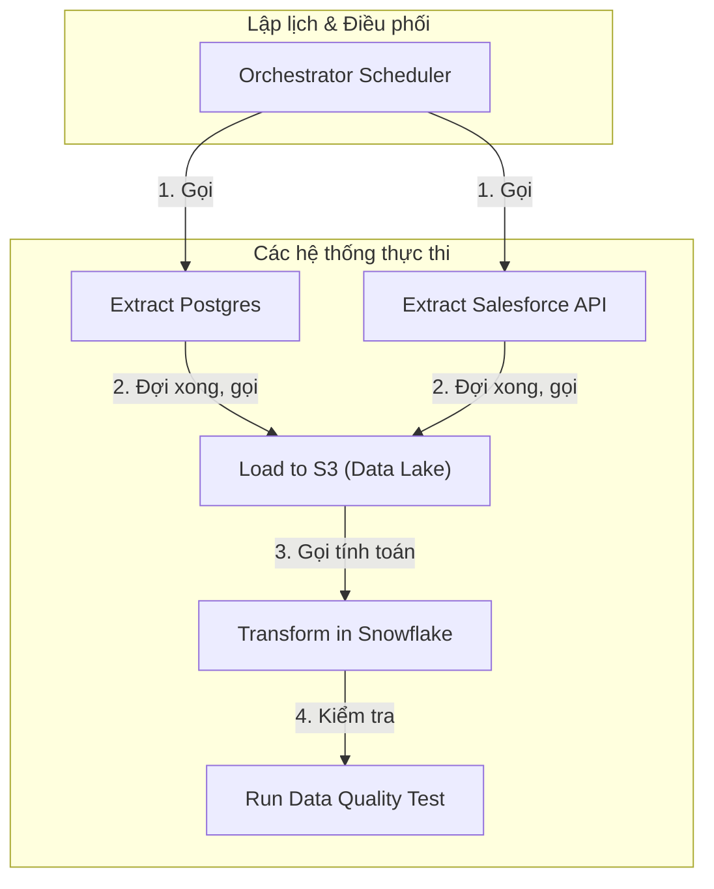

Hãy tưởng tượng bạn đang quản lý một nhà máy sản xuất. Nguyên liệu thô cần được đưa vào đúng giờ, máy trộn phải chạy xong thì máy đóng gói mới được kích hoạt, và nếu có sự cố mất điện hay kẹt máy, toàn bộ dây chuyền phải phát cảnh báo ngay lập tức. Trong thế giới [Data Engineering](/concepts/foundation/data-engineering/), **Data Orchestration** (Điều phối dữ liệu) chính là hệ thống quản lý và vận hành tự động toàn bộ dây chuyền đó. 

Dữ liệu không tự nhiên di chuyển hay tự chuyển hóa một cách hoàn hảo. Một hệ thống Orchestration đóng vai trò như một vị "Nhạc trưởng" (Orchestrator) đứng giữa dàn nhạc số, điều phối hàng chục công cụ khác nhau từ Spark, [Snowflake](/concepts/cloud-data-platform/snowflake/), [dbt](/concepts/transformation-analytics/dbt/) cho đến các API bên ngoài, đảm bảo từng tác vụ chạy đúng lúc, đúng thứ tự và xử lý êm đẹp mọi sự cố phát sinh.

## Nhạc trưởng của thế giới dữ liệu: Orchestration là gì?

Về mặt kỹ thuật, Orchestration là phương pháp định nghĩa các luồng công việc phức tạp dưới dạng **Đồ thị có hướng không chu trình** – `Directed Acyclic Graph (DAG)`. 

Một hệ thống Orchestration chuẩn chỉnh gánh vác ba nhiệm vụ cốt lõi:
1. **Lập lịch (Scheduling)**: Tự động kích hoạt các luồng công việc (pipelines) vào những thời điểm được định trước (ví dụ: cứ đúng 2:00 sáng mỗi ngày).
2. **Quản lý phụ thuộc (Dependency Management)**: Thiết lập trật tự rõ ràng cho các tác vụ. Chẳng hạn, tác vụ tổng hợp doanh thu (B) chỉ được phép chạy khi tác vụ thu thập dữ liệu thô (A) đã hoàn thành thành công. Nếu A thất bại, B sẽ lập tức bị chặn để tránh tính toán sai số liệu.
3. **Giám sát và Phục hồi (Monitoring & Recovery)**: Cung cấp một giao diện trực quan giúp các kỹ sư theo dõi sức khỏe của pipeline, gửi cảnh báo qua Slack hay Email khi xảy ra lỗi, đồng thời tự động thử lại (retry) khi gặp các sự cố mạng tạm thời.

## Sự sụp đổ của "Cron" và lý do Orchestration ra đời

Trong những ngày đầu của ngành dữ liệu, công cụ lập lịch mặc định của Linux - `cron` - là lựa chọn phổ biến nhất. Các kỹ sư thường cấu hình kiểu:
* Đúng 01:00 AM: Chạy script tải dữ liệu từ MySQL về lưu trữ.
* Đúng 02:00 AM: Chạy script chuyển đổi và làm sạch dữ liệu.

Cách tiếp cận này rất đơn giản nhưng lại tiềm ẩn những rủi ro cực kỳ lớn khi hệ thống mở rộng:

* **Tính "mù quáng" của Cron**: Nếu script lúc 01:00 AM bị chậm do nghẽn mạng và kéo dài tận 2 tiếng, script lúc 02:00 AM vẫn sẽ kích hoạt theo đúng giờ hẹn. Hậu quả là nó xử lý một tập dữ liệu chưa hoàn chỉnh, làm sai lệch toàn bộ báo cáo phía sau.
* **Không có khả năng quan sát (No Observability)**: Cron không có giao diện quản lý. Khi có lỗi, kỹ sư dữ liệu không nhận được cảnh báo trực quan mà phải tự SSH vào máy chủ, lục lọi hàng nghìn dòng log thô cực kỳ tốn thời gian.
* **Bài toán chạy bù dữ liệu ([Backfill](/concepts/etl-elt/backfill/))**: Nếu API của bên thứ ba bị sập trong 3 ngày, đồng nghĩa với việc dữ liệu bị thiếu hụt 3 ngày. Với `cron`, việc cấu hình để chạy bù thủ công cho 3 ngày đó là một cơn ác mộng và rất dễ sai sót.

Chính vì thế, các công cụ Orchestration hiện đại ra đời như một giải pháp thay thế hoàn hảo, mang lại cơ chế quản lý thông minh, linh hoạt và nhận biết được ngữ cảnh (context-aware).

## Triết lý "Pipeline as Code" và cơ chế vận hành của Orchestrator

Ý tưởng chủ đạo đứng sau các công cụ Orchestration thế hệ mới (như Apache Airflow, Dagster, Prefect) là **"[Data Pipeline](/concepts/foundation/data-pipeline/) as Code"** (Định nghĩa đường ống dữ liệu bằng mã nguồn).

Thay vì kéo thả trên giao diện đồ họa dễ bị giới hạn về mặt logic, chúng ta viết code Python để định nghĩa toàn bộ pipeline. Nhờ vậy, pipeline có thể được quản lý phiên bản dễ dàng bằng Git, được review code nghiêm ngặt thông qua Pull Request, và áp dụng quy trình CI/CD chuyên nghiệp giống như bất kỳ dự án phần mềm nào khác.

Bên cạnh đó, các hệ thống này tách biệt rõ ràng giữa:
* **Khối điều khiển (Control Plane)**: Trực điều phối, lập lịch và ra lệnh.
* **Khối thực thi (Data Plane)**: Nơi thực sự xử lý các phép toán nặng (như AWS EMR, BigQuery hay Snowflake). 

Nhờ sự phân tách này, bản thân Orchestrator luôn nhẹ nhàng vì nó chỉ làm nhiệm vụ "chỉ tay năm ngón", còn việc nặng nhọc đã được đẩy xuống các công cụ chuyên dụng khác.

### Luồng vận hành chi tiết:
1. **Khởi tạo**: Kỹ sư viết code Python để khai báo các tác vụ (Tasks) và mối quan hệ giữa chúng để tạo thành một DAG.
2. **Phân tích cú pháp (Parsing)**: Bộ điều phối (Scheduler) đọc file code này, phân tích cấu trúc và hiển thị giao diện đồ họa trực quan trên Web UI.
3. **Kích hoạt (Trigger)**: Đến mốc thời gian đã định hoặc khi nhận được tín hiệu từ sự kiện bên ngoài (Sensor hoặc API), một phiên chạy (DAG Run) sẽ được khởi tạo.
4. **Thực thi (Execution)**: Scheduler đẩy tác vụ đầu tiên vào hàng đợi (Queue). Các Worker nhận việc, gửi yêu cầu tính toán đến các dịch vụ đích (ví dụ: ra lệnh cho Snowflake chạy SQL) rồi chờ phản hồi.
5. **Cập nhật trạng thái**: Khi tác vụ hoàn thành tốt đẹp, trạng thái thành công được ghi nhận vào database metadata (Postgres/MySQL) của hệ thống. Scheduler tiếp tục đẩy tác vụ kế tiếp vào hàng đợi. Nếu xảy ra lỗi, hệ thống sẽ thực hiện thử lại (Retry) theo cấu hình hoặc gửi cảnh báo khẩn cấp.

## Kiến trúc và luồng đi của dữ liệu

Sơ đồ dưới đây minh họa cách một Orchestrator điều phối các hệ thống thực thi mà không trực tiếp can thiệp vào dữ liệu:

*Lưu ý: Các mũi tên thể hiện logic phụ thuộc. Bộ điều phối đóng vai trò trung tâm kiểm soát toàn bộ vòng đời, chứ các hệ thống thực thi không tự gọi lẫn nhau.*

## Hãy bắt tay vào viết một DAG thực tế

Dưới đây là một ví dụ đơn giản viết bằng Python để định nghĩa một luồng công việc (DAG) cơ bản trong Apache Airflow. Pipeline này sẽ trích xuất dữ liệu, thực hiện biến đổi thông qua dbt và cuối cùng gửi thông báo kết quả.
```python
from airflow import DAG
from airflow.operators.bash import BashOperator
from airflow.operators.python import PythonOperator
from datetime import datetime

with DAG('daily_sales_pipeline', start_date=datetime(2026, 6, 1), schedule='@daily') as dag:
    
    extract_task = BashOperator(
        task_id='extract_sales_data',
        bash_command='python extract_sales.py --date {{ ds }}'
    )
    
    transform_task = BashOperator(
        task_id='transform_data_in_dbt',
        bash_command='dbt run --models sales_mart'
    )
    
    notify_task = PythonOperator(
        task_id='send_slack_notification',
        python_callable=lambda: print("Pipeline đã hoàn thành!")
    )
    
    # Thiết lập luồng phụ thuộc (Dependency Flow)
    extract_task >> transform_task >> notify_task
```

## Làm sao để thiết kế pipeline chuẩn chỉnh (và những sai lầm cần tránh)

### Những nguyên tắc vàng (Best Practices)
* **Tính lũy đẳng ([Idempotency](/concepts/etl-elt/idempotency/))**: Đây là nguyên tắc tối quan trọng. Thiết kế tác vụ sao cho dù bạn có chạy lại 1 lần hay 100 lần với cùng một tham số đầu vào (ví dụ: cùng một ngày dữ liệu), kết quả cuối cùng tại kho dữ liệu vẫn không thay đổi và không bị trùng lặp. Hãy ưu tiên sử dụng các câu lệnh kiểu `UPSERT/MERGE` hoặc áp dụng chiến lược "Xóa trước khi Chèn" (`DELETE WHERE date = X` trước khi chạy `INSERT`).
* **Không biến Orchestrator thành máy tính toán**: Hãy nhớ rằng Airflow hay Prefect không phải là [Apache Spark](/concepts/batch-processing/apache-spark/). Đừng bao giờ tải một file dữ liệu lớn vào bộ nhớ RAM của server Orchestrator để xử lý. Nhiệm vụ của nó chỉ là gửi lệnh để các hệ thống khác (như Spark cluster hoặc BigQuery) làm việc nặng. Hãy luôn thiết kế theo hướng đẩy tải tính toán xuống (Push-down).
* **Chia nhỏ và trị trị (Modularize)**: Đừng cố nhồi nhét 500 tác vụ vào một DAG khổng lồ duy nhất. Hãy chia nhỏ chúng thành các DAG độc lập theo từng mảng nghiệp vụ và liên kết chúng bằng các cơ chế như `TriggerDagRunOperator` hoặc các cảm biến dữ liệu (Data Sensors).

### Những sai lầm kinh điển cần tránh
* **Dùng Orchestrator làm công cụ Streaming**: Nhiều người cấu hình Airflow DAG chạy liên tục mỗi phút một lần. Thiết kế của Orchestrator là dành cho các tác vụ Batch (xử lý theo lô) và luôn có một độ trễ khởi động nhất định (vài giây để khởi tạo container, kiểm tra database). Việc chạy với tần suất quá cao sẽ nhanh chóng làm nghẽn database quản trị của hệ thống.
* **Gắn cứng thời gian (Hardcoding)**: Việc đưa các mốc thời gian cố định như `WHERE date = '2026-06-07'` vào trong mã nguồn sẽ khiến bạn không thể thực hiện chạy bù dữ liệu (Backfill) khi cần thiết. Hãy tận dụng các biến động (context variables) do Orchestrator cung cấp, ví dụ như `{{ logical_date }} (lưu ý {{ execution_date }} đã bị loại bỏ từ Airflow 3.0)` hoặc `{{ ds }}` trong Airflow.

## Cân nhắc thực tế: Khi nào nên (và không nên) dùng?

### Lợi ích mang lại
* **Khả năng hiển thị và giám sát vượt trội**: Giao diện UI trực quan giúp bạn nắm bắt ngay lập tức pipeline đang tắc nghẽn ở bước nào, lỗi xảy ra ở dòng log nào để khắc phục nhanh chóng.
* **Quản lý phụ thuộc an toàn**: Ngăn ngừa hoàn toàn tình trạng báo cáo bị chạy đè lên dữ liệu lỗi, bảo vệ tính toàn vẹn của dữ liệu đầu ra.
* **Vận hành nhàn nhã**: Khi cần chạy lại dữ liệu của vài tháng trước, bạn chỉ cần thực hiện vài thao tác đơn giản trên giao diện thay vì phải viết lại mã nguồn.

### Điểm hạn chế cần lưu ý
* **Phức tạp về mặt hạ tầng**: Để tự vận hành một hệ thống như Airflow một cách ổn định, bạn cần thiết lập web server, scheduler, database lưu metadata, hàng đợi tin nhắn (Redis/Celery)... Điều này đòi hỏi chi phí bảo trì và vận hành không hề nhỏ.
* **Độ dốc học tập cao**: Các thành viên trong team cần thời gian để làm quen với các khái niệm như DAG, vòng đời của Task, và đặc biệt là cơ chế thời gian chạy (Execution Date/Logical Date) vốn khá lắt léo.

### Khi nào là sự lựa chọn hoàn hảo?
* Khi hệ thống có từ 2 tác vụ trở lên có quan hệ phụ thuộc lẫn nhau.
* Khi luồng dữ liệu cần được chạy định kỳ theo lô (mỗi giờ, mỗi ngày, mỗi tuần).
* Khi làm việc trong các đội ngũ dữ liệu lớn, đòi hỏi tính minh bạch, khả năng kiểm tra lịch sử (auditing) và cảnh báo tức thời.

### Khi nào không nên áp dụng?
* Khi hệ thống yêu cầu xử lý dữ liệu thời gian thực (Real-time Streaming) với độ trễ tính bằng mili-giây.
* Khi bạn chỉ cần chạy một vài script nhỏ lẻ một lần duy nhất (one-off tasks) hoặc các tác vụ chuyển đổi cực kỳ đơn giản không có sự phụ thuộc phức tạp.

## Các khái niệm liên quan

* [Apache Airflow](/concepts/orchestration/apache-airflow/)
* [Directed Acyclic Graph (DAG)](/concepts/orchestration/dag/)
* [Task Dependency](/concepts/orchestration/task-dependency/)

## Góc phỏng vấn: Những câu hỏi thường gặp

### 1. Tại sao chúng ta không nên dùng `cron` để lập lịch cho Data Pipeline?
* **Mục đích của người phỏng vấn**: Đánh giá sự hiểu biết của bạn về giới hạn của các công cụ truyền thống và lý do cần đến một hệ thống Orchestration chuyên dụng.
* **Gợi ý trả lời**: Cron chỉ đơn thuần kích hoạt tác vụ dựa trên thời gian thực tế mà hoàn toàn không có nhận thức về trạng thái của các tác vụ trước đó (Dependency). Nếu tác vụ trước bị chạy chậm hoặc lỗi, Cron vẫn kích hoạt tác vụ sau, dẫn đến dữ liệu bị lỗi hàng loạt. Ngoài ra, Cron thiếu cơ chế tự động thử lại (Retry), cực kỳ khó cấu hình khi cần chạy bù dữ liệu cũ (Backfill) và không có giao diện quản lý tập trung hay cơ chế cảnh báo lỗi trực quan.
* **Lỗi cần tránh**: Chỉ trả lời chung chung rằng "Cron cũ rồi" hoặc "Orchestrator có giao diện đẹp hơn".

### 2. Nguyên tắc Idempotent trong Data Orchestration là gì? Tại sao nó quan trọng?
* **Mục đích của người phỏng vấn**: Đo lường kinh nghiệm thực chiến của bạn trong việc đảm bảo chất lượng và tính toàn vẹn của dữ liệu.
* **Gợi ý trả lời**: Một tác vụ được coi là Idempotent (lũy đẳng) khi dù ta chạy nó bao nhiêu lần đi chăng nữa với cùng một tập tham số đầu vào, trạng thái cuối cùng của dữ liệu vẫn hoàn toàn đồng nhất. Điều này cực kỳ quan trọng vì trong thực tế, các tác vụ rất dễ bị lỗi giữa chừng và được Orchestrator tự động chạy lại (Retry), hoặc do kỹ sư chạy thủ công. Nếu tác vụ không lũy đẳng (ví dụ dùng lệnh `INSERT` thông thường), dữ liệu sẽ bị nhân đôi. Để đạt được tính lũy đẳng, ta nên áp dụng cơ chế `UPSERT` hoặc `DELETE-then-INSERT` dựa trên khóa phân vùng dữ liệu.

### 3. Phân biệt Control Plane và Data Plane trong kiến trúc Orchestration.
* **Mục đích của người phỏng vấn**: Xem xét tư duy thiết kế hệ thống phân tán của ứng viên.
* **Gợi ý trả lời**: 
  - **Control Plane** (Mặt phẳng điều khiển): Là bản thân hệ thống Orchestrator (như Airflow Webserver/Scheduler). Vai trò của nó là lập lịch, theo dõi trạng thái các tác vụ, định hướng luồng đi và gửi cảnh báo.
  - **Data Plane** (Mặt phẳng dữ liệu): Là các tài nguyên tính toán thực tế chịu trách nhiệm xử lý dữ liệu (như Spark Cluster, BigQuery, Snowflake). 
  Một thiết kế tốt là giữ cho Control Plane gọn nhẹ, chỉ đóng vai trò gửi lệnh gọi (API/SQL) sang Data Plane thực thi tính toán nặng, thay vì trực tiếp tải dữ liệu lớn về xử lý trên máy chủ Orchestrator.

### 4. Backfill là gì trong Orchestration và khi nào cần dùng?
* **Mục đích của người phỏng vấn**: Kiểm tra khả năng xử lý các tình huống vận hành dữ liệu thực tế.
* **Gợi ý trả lời**: Backfill (Chạy bù dữ liệu) là quá trình chạy lại hoặc chạy bổ sung một chuỗi các phiên làm việc (DAG Runs) cho các khoảng thời gian trong quá khứ. Chúng ta thường cần Backfill trong hai trường hợp chính: Một là khi có thay đổi trong logic code và cần tính toán lại dữ liệu lịch sử để đảm bảo tính đồng nhất; hai là khi hệ thống gặp sự cố gián đoạn (outage) trong vài ngày, sau khi khắc phục xong cần chạy bù để lấp đầy khoảng trống dữ liệu.

### 5. Sự khác biệt giữa Event-driven Orchestration và Time-based Scheduling là gì?
* **Mục đích của người phỏng vấn**: Đánh giá khả năng cập nhật và áp dụng các mô hình kiến trúc dữ liệu hiện đại.
* **Gợi ý trả lời**: Time-based Scheduling kích hoạt pipeline cố định theo giờ (ví dụ: cứ 3h sáng chạy). Nhược điểm là nếu dữ liệu nguồn đã sẵn sàng từ 1h sáng, ta vẫn phải đợi vô ích, hoặc nếu dữ liệu nguồn bị trễ sau 3h sáng thì pipeline sẽ chạy lỗi. Ngược lại, Event-driven Orchestration kích hoạt pipeline ngay khi có một sự kiện thực tế phát sinh (ví dụ: một file mới vừa được đẩy lên Amazon S3 sẽ kích hoạt một hàm Lambda gọi trực tiếp API của Orchestrator để chạy luồng xử lý). Hướng tiếp cận này giúp giảm thiểu tối đa độ trễ dữ liệu và linh hoạt hơn với các biến động của hệ thống nguồn.

## Tài liệu tham khảo

1. **Fundamentals of Data Engineering** - Joe Reis, Matt Housley (Chương 6: Data Orchestration).
2. **Data Pipelines Pocket Reference** - James Densmore.

## Tóm tắt bằng tiếng Anh (English Summary)

**Data Orchestration** is the centralized coordination, scheduling, and monitoring of complex data pipelines. Moving far beyond traditional, blind scheduling tools like Linux `cron`, modern orchestrators (like Apache Airflow, Dagster, or Prefect) define workflows as Directed Acyclic Graphs (DAGs) in code. They manage intricate task dependencies, execute retries gracefully upon failure, provide visual observability, and support historical data backfilling. A core principle of orchestration is maintaining the orchestrator as a control plane (managing "when" and "how" tasks run) while pushing the actual heavy data processing to specialized data planes (like Spark or Snowflake), ensuring all orchestrated tasks are strictly idempotent to prevent data duplication upon retries.