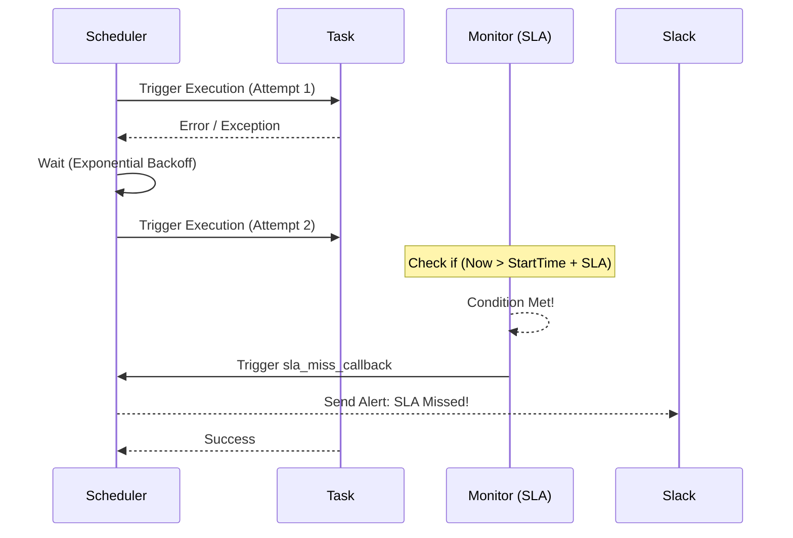

Trong thế giới kỹ thuật dữ liệu, có một chân lý bất biến: *Hạ tầng mạng luôn có thể gặp sự cố*. Một máy chủ API của đối tác có thể bị quá tải tạm thời, cơ sở dữ liệu có thể khởi động lại trong vài giây, hoặc đường truyền mạng internet có thể bị nghẽn. Một đường ống dẫn dữ liệu ([data pipeline](/concepts/foundation/data-pipeline/)) chuyên nghiệp không thể dễ dàng sụp đổ và dừng hoạt động chỉ vì một lỗi mạng gián đoạn ngắn hạn 3 giây. Để xây dựng những hệ thống tự phục hồi bền bỉ, chúng ta cần phối hợp hai công cụ quan trọng: **Retries (Cơ chế thử lại tự động)** và **SLA (Cam kết thời gian dịch vụ)**.

## Khi mạng máy tính luôn có thể chập chờn: Tại sao cần Retries và SLA?

* **Retries (Thử lại tự động)**: Là cơ chế thiết lập ở cấp độ tác vụ (task). Khi một task đang chạy bị lỗi và ném ra Exception, thay vì ngay lập tức báo đỏ và dừng toàn bộ luồng công việc, hệ thống điều phối (Orchestrator) sẽ chuyển task đó sang trạng thái chờ đợi một khoảng thời gian ngắn (Retry Delay) rồi kích hoạt chạy lại từ đầu. Quá trình này sẽ lặp lại cho đến khi task chạy thành công hoặc vượt quá số lần thử lại tối đa cho phép (`max_retries`). Đây được ví như liều thuốc "kháng sinh" giúp hệ thống tự dọn dẹp các lỗi mạng tạm thời mà không cần con người can thiệp.
* **SLA (Service Level Agreement - Cam kết cấp độ dịch vụ)**: Là một ngưỡng thời gian giới hạn nghiêm ngặt (ví dụ: *"Báo cáo doanh thu phải hoàn thành trước 07:00 AM"*). Nếu một tác vụ hoặc toàn bộ đường ống dẫn dữ liệu không kết thúc thành công trước mốc thời gian này, hệ thống sẽ kích hoạt một hàm callback để gửi email hoặc tin nhắn cảnh báo (SLA Miss) tới đội ngũ vận hành. SLA không dừng hay can thiệp vào luồng chạy, nó chỉ làm nhiệm vụ giám sát và cảnh báo.

> [!IMPORTANT]
> Trong Airflow 3.0, tính năng SLA truyền thống (`sla` và `sla_miss_callback`) đã bị loại bỏ hoàn toàn và được thay thế bằng cơ chế **Deadline Alerts** để theo dõi tiến độ một cách chủ động và ổn định hơn.

Hãy hình dung một kịch bản thực tế: Bạn có một task gọi API để lấy dữ liệu quảng cáo từ Facebook vào lúc 02:00 sáng.
* **Nếu không thiết lập Retries**: Đúng 02:00 sáng, máy chủ Facebook bị nghẽn mạng trong vòng 5 giây và trả về mã lỗi HTTP 504. Task thất bại ngay lập tức, toàn bộ pipeline phía sau bị chặn đứng. Kỹ sư trực ca phải thức dậy lúc 02:15 sáng để nhấn nút chạy lại thủ công. Khi nhấn nút, mạng đã bình thường trở lại, pipeline chạy mượt mà, nhưng giấc ngủ của kỹ sư đã bị gián đoạn vô ích.
* **Khi có Retries**: Kỹ sư thiết lập tự động thử lại 3 lần, mỗi lần cách nhau 2 phút. Lần chạy đầu tiên thất bại, hệ thống tự động thử lại lần thứ hai lúc 02:02 và thành công tốt đẹp. Không một ai bị đánh thức lúc nửa đêm.
* **Vai trò của SLA**: Giả sử đối tác gặp sự cố nghiêm trọng kéo dài suốt 5 tiếng, task liên tục thử lại 20 lần và cuối cùng thành công vào lúc 09:00 sáng. Dù task báo xanh (SUCCESS), nhưng sếp của bạn đã nổi giận vì lúc 08:00 sáng mở dashboard báo cáo ra không có số liệu để họp. SLA sinh ra để phát cảnh báo lúc 08:00 sáng: *"Pipeline đang bị trễ hạn, có nguy cơ lỡ báo cáo"*, giúp các kỹ sư chủ động nắm bắt tình hình và thông báo cho các bên liên quan thay vì đợi khách hàng phàn nàn.

## Giải pháp khắc phục thông minh: Exponential Backoff là gì?

Để cơ chế thử lại hoạt động hiệu quả và thông minh, chúng ta thường áp dụng chiến lược **Exponential Backoff (Thử lại theo cấp số nhân)**. 

Tránh việc liên tục gửi yêu cầu thử lại dồn dập tới máy chủ đối tác mỗi 1 giây một lần. Nếu máy chủ của họ đang bị quá tải, hành vi thử lại dồn dập này không khác gì một cuộc tấn công từ chối dịch vụ (DDoS) tự phát khiến máy chủ của họ sập hoàn toàn.

Thay vào đó, hãy giãn cách thời gian giữa các lần thử lại một cách thông minh: lần đầu thử lại sau 1 phút, lần thứ hai sau 2 phút, lần thứ ba sau 4 phút, lần thứ tư sau 8 phút... Sự giãn cách này tạo ra một khoảng không gian nghỉ ngơi (breathing room) để hệ thống đích kịp thời khởi động lại hoặc tự hồi phục trạng thái.

## Cơ chế vận hành thực tế trong hệ thống Orchestration

Sơ đồ dưới đây mô tả sự tương tác giữa Bộ điều phối (Scheduler), Tác vụ (Task) và Cơ chế giám sát SLA:



1. **Vòng đời của Task khi gặp lỗi**: Khi task chạy lần đầu và gặp lỗi, trạng thái của nó được chuyển thành `UP_FOR_RETRY` (chứ không phải `FAILED`). Bộ điều phối sẽ chờ đợi hết thời gian delay rồi tự động xếp lịch chạy lại. Nếu sau số lần thử tối đa cấu hình mà vẫn lỗi, task mới chính thức bị đánh dấu là `FAILED` và gửi thông báo khẩn cấp.
2. **Quy trình giám sát SLA**: Một tiến trình chạy ngầm của bộ điều phối sẽ liên tục so quét các mốc thời gian. Nếu mốc thời gian hiện tại vượt quá mốc (Giờ [DAG](/concepts/orchestration/dag/) khởi động + khoảng thời gian SLA định trước) mà task đó vẫn chưa báo trạng thái thành công (`SUCCESS`), hệ thống sẽ kích hoạt hàm `sla_miss_callback` để bắn tin nhắn cảnh báo, trong khi task vẫn được tiếp tục chạy bình thường.

## Ví dụ cấu hình: Thiết lập Retries và SLA trong Apache Airflow

Dưới đây là một ví dụ viết bằng Python để định nghĩa một đường ống dữ liệu (DAG) trong Apache Airflow, có cấu hình tính năng tự động thử lại theo cấp số nhân và giám sát thời gian SLA:

```python
from datetime import datetime, timedelta
from airflow import DAG
from airflow.operators.python import PythonOperator
from utils.slack import send_sla_miss_alert # Hàm tự viết để gửi tin nhắn Slack

# Cấu hình các tham số mặc định cho toàn bộ tasks trong DAG
default_args = {
    'owner': 'data_eng',
    'start_date': datetime(2026, 6, 1),
    
    # 1. Cấu hình tự động THỬ LẠI (RETRIES)
    'retries': 3,                           # Thử lại tối đa 3 lần nếu gặp lỗi
    'retry_delay': timedelta(minutes=1),    # Chờ 1 phút trước lần thử lại đầu tiên
    'retry_exponential_backoff': True,      # Kích hoạt cấp số nhân: 1m -> 2m -> 4m...
    'max_retry_delay': timedelta(hours=1),  # Giới hạn thời gian chờ tối đa không quá 1 tiếng
    
    # 2. Cấu hình giám sát SLA
    'sla': timedelta(hours=2),              # Toàn bộ task phải hoàn tất trong vòng 2 tiếng từ lúc DAG bắt đầu
}

with DAG(
    dag_id='mission_critical_pipeline',
    default_args=default_args,
    schedule='@daily',
    sla_miss_callback=send_sla_miss_alert   # Hàm callback được gọi khi vi phạm thời gian SLA
) as dag:

    # Nếu task huấn luyện mô hình này gặp lỗi mạng tạm thời, nó sẽ tự động chạy lại tối đa 3 lần.
    # Nếu sau 2 tiếng kể từ khi DAG chạy mà task vẫn chưa xong, cảnh báo SLA sẽ được gửi lên Slack.
    run_important_model = PythonOperator(
        task_id='train_ai_model',
        python_callable=lambda: print("Training..."),
        execution_timeout=timedelta(hours=1) # Ngắt cưỡng bức nếu một phiên chạy đơn lẻ kéo dài hơn 1 tiếng
    )
```

## Kinh nghiệm thực chiến để thiết kế hệ thống bền bỉ

### Các nguyên tắc vàng cần tuân thủ (Best Practices)
* **Tính lũy đẳng ([Idempotency](/concepts/etl-elt/idempotency/)) là điều kiện bắt buộc**: Đừng bao giờ kích hoạt tính năng tự động thử lại (Retries) nếu tác vụ của bạn chưa được thiết kế để lũy đẳng. Hãy hình dung một task thực hiện lệnh chèn dữ liệu (`INSERT`) thô vào database SQL mà không có khóa chính. Nếu task gặp sự cố ngắt kết nối mạng ở giây cuối cùng (dữ liệu thực tế đã được chèn vào database nhưng máy chủ chưa kịp báo trạng thái thành công về cho Orchestrator), việc tự động chạy lại task đó từ đầu sẽ ghi thêm một đống dữ liệu trùng lặp (duplicates) vào bảng. Do đó, hãy luôn thiết kế các tác vụ dưới dạng `UPSERT / MERGE` hoặc xóa dữ liệu cũ trước khi chèn mới.
* **Tách biệt rõ ràng SLA và Execution Timeout**: 
  - `SLA` chỉ dùng để cảnh báo tiến độ chậm trễ tổng thể của hệ thống mà không can thiệp vào trạng thái chạy của task.
  - `Execution Timeout` giống như một cầu dao điện tự động, nó sẽ giết chết (kill) trực tiếp một task đang bị kẹt vô hạn (ví dụ như kẹt khóa bảng SQL lock) để giải phóng tài nguyên hệ thống, tạo ra Exception để kích hoạt cơ chế thử lại. Hãy luôn kết hợp nhịp nhàng cả hai cấu hình này.

### Những cái bẫy thường gặp
* **Đặt số lần thử lại quá đà (Over-retrying)**: Cấu hình `retries = 100` để trốn tránh việc bảo trì hệ thống. Nếu xảy ra lỗi hệ thống nghiêm trọng (như database thay đổi mật khẩu hoặc phân quyền sai), việc đặt số lần retry quá lớn sẽ khiến hàng loạt task xếp hàng chạy lại vô tận, chiếm dụng toàn bộ tài nguyên worker của hệ thống và che lấp mất lỗi thực tế.
* **Nhầm lẫn mốc tính giờ SLA**: Trong Airflow, tham số `sla` được tính từ **thời điểm DAG bắt đầu chạy theo lịch**, chứ không phải tính từ lúc bản thân cái task đó bắt đầu được nạp vào bộ nhớ để chạy. Nếu bạn đặt SLA cho một task nằm ở cuối đường ống là 30 phút, nhưng các task đứng trước nó đã chạy mất 1 tiếng, hệ thống sẽ ngay lập tức báo lỗi SLA Miss ngay khi task cuối cùng vừa được kích hoạt.

## Cân nhắc các điểm đánh đổi

### Về cơ chế Retries
* **Ưu điểm**: Giảm thiểu tới 90% các cảnh báo lỗi rác vào ban đêm do chập chờn mạng ngắn hạn, giúp đội ngũ vận hành có thời gian nghỉ ngơi tốt hơn.
* **Nhược điểm**: Có thể che giấu các vấn đề tiềm ẩn của hạ tầng (Infrastructure masking). Ví dụ: [Data Warehouse](/concepts/data-warehouse/data-warehouse/) đang bị quá tải nên thường xuyên từ chối kết nối, nhưng việc các task liên tục thử lại và cuối cùng vẫn chạy được sẽ tạo ra ảo giác hệ thống vẫn ổn định, cho đến khi nó sụp đổ hoàn toàn.

### Về giám sát SLA
* **Ưu điểm**: Giúp nâng cao tính chuyên nghiệp và xây dựng lòng tin với các đối tác kinh doanh nhờ việc chủ động kiểm soát và thông báo rủi ro chậm trễ số liệu trước khi họ phát hiện ra.
* **Nhược điểm**: Đòi hỏi chi phí bảo trì cấu hình lớn khi lượng dữ liệu tăng trưởng theo thời gian. Một pipeline hôm nay chạy mất 1 tiếng nhưng năm sau chạy mất 2 tiếng là chuyện bình thường. Kỹ sư dữ liệu bắt buộc phải định kỳ rà soát và điều chỉnh lại các mốc SLA cho phù hợp.

## Các khái niệm liên quan

* [Task Dependency](/concepts/orchestration/task-dependency/)
* [Apache Airflow](/concepts/orchestration/apache-airflow/)

## Góc phỏng vấn: Những thử thách thực tế về xử lý lỗi và cam kết thời gian

### 1. Sự khác biệt bản chất giữa `retries`, `execution_timeout` và `SLA` trong quản lý luồng dữ liệu là gì?
* **Gợi ý trả lời**: 
  - `retries` là cơ chế tự động khởi chạy lại một tác vụ KHI và CHỈ KHI tác vụ đó đã kết thúc và ném ra lỗi (Exception).
  - `execution_timeout` là giới hạn thời gian chạy cho một phiên làm việc đơn lẻ. Nếu tác vụ chạy vượt quá thời gian này, hệ thống sẽ cưỡng bức dừng (kill) tác vụ đó, tạo ra Exception để kích hoạt cơ chế retry.
  - `SLA` là một mốc thời gian cam kết hoàn thành tĩnh. Khi vượt quá mốc này, hệ thống chỉ kích hoạt một luồng phụ để gửi cảnh báo mà không hề can thiệp hay làm ảnh hưởng đến tiến trình chạy thực tế của tác vụ.

### 2. Tại sao chúng ta nên sử dụng thuật toán Exponential Backoff khi cấu hình cơ chế Retries?
* **Gợi ý trả lời**: Phần lớn các lỗi tạm thời dẫn đến việc phải thử lại là do máy chủ đối tác hoặc hệ thống đích đang bị quá tải hoặc nghẽn kết nối mạng. Nếu chúng ta cấu hình thử lại liên tục với tần suất dày đặc (ví dụ cứ 1 giây một lần), hệ thống của chúng ta sẽ vô tình tạo ra một cơn bão yêu cầu (Retry Storm) dội thẳng vào máy chủ đang gặp sự cố, khiến nó không có cơ hội phục hồi. Thuật toán Exponential Backoff tự động kéo giãn thời gian giữa các lần thử lại sau mỗi lần lỗi, tạo ra khoảng nghỉ cần thiết để máy chủ đối tác có thể khởi động lại hoặc tự cân bằng tải.

### 3. Bạn thiết kế một tác vụ chèn dữ liệu từ file vào database. Khi tác vụ này bị đứt kết nối mạng giữa chừng và được hệ thống tự động chạy lại (Retry), làm thế nào bạn đảm bảo dữ liệu không bị ghi trùng lặp?
* **Gợi ý trả lời**: Để đảm bảo tính lũy đẳng (Idempotency) của tác vụ, chúng ta không dùng câu lệnh `INSERT INTO` thông thường. Thay vào đó, có hai cách giải quyết:
  1. *Sử dụng cơ chế Upsert/Merge*: Thiết lập khóa chính (Primary Key) cho bảng dữ liệu và sử dụng cú pháp `INSERT ... ON CONFLICT DO UPDATE` hoặc câu lệnh `MERGE` để tự động ghi đè dữ liệu nếu trùng khóa.
  2. *Sử dụng cơ chế Delete-then-Insert*: Trước khi chèn dữ liệu mới, chạy một câu lệnh xóa sạch các dữ liệu cũ của đúng phiên chạy đó (ví dụ: `DELETE FROM table WHERE partition_date = '2026-06-08'`), sau đó mới thực hiện chèn dữ liệu mới vào.

## Tài liệu tham khảo

1. **Airflow Official Documentation** - SLA and Timeout.
2. **Google Cloud Architecture Center** - Implementing retries with exponential backoff.

## English Summary

In Data [Orchestration](/concepts/orchestration/orchestration/), **Retries** and **SLA (Service Level Agreements)** are fundamental pillars for building resilient and transparent data pipelines. Network partitions and external API hiccups are inevitable; retries automatically re-trigger failed tasks without human intervention, effectively mitigating transient errors. Utilizing an "Exponential Backoff" strategy during retries prevents accidental DDoS-ing of struggling [source systems](/concepts/foundation/source-systems/). Meanwhile, an SLA is a passive monitoring threshold that alerts stakeholders if a process (or entire DAG) fails to complete by a critical business deadline. Crucially, before enabling retries, engineers must guarantee that every task is idempotent (e.g., using UPSERT operations) to prevent data duplication when a half-finished process is re-executed.
