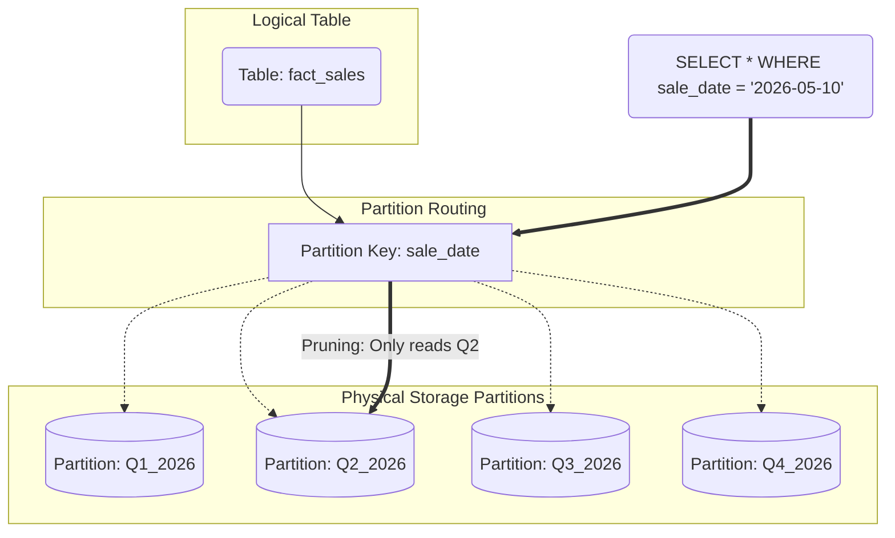

# Phân vùng Dữ liệu - Partitioning

## Summary

Phân vùng dữ liệu (Partitioning) là kỹ thuật chia một bảng dữ liệu logic khổng lồ thành các phần nhỏ hơn (gọi là các partitions) trên ổ đĩa vật lý dựa trên một bộ quy tắc nhất định (thường là theo thời gian). Đối với người dùng, họ vẫn truy vấn trên một bảng duy nhất, nhưng hệ thống cơ sở dữ liệu sẽ thông minh chỉ quét các "phân vùng" chứa dữ liệu liên quan, giúp giảm đột biến lượng I/O ổ đĩa và tăng tốc độ truy vấn lên hàng chục lần.

---

## Definition

**Partitioning** là quá trình chia tách mặt vật lý của dữ liệu. Khác với Index (tạo ra một bản sao phụ để tra cứu), Partitioning chia chính dữ liệu gốc thành các thư mục hoặc tệp tin nhỏ biệt lập. 

Ví dụ: Thay vì lưu 10 năm dữ liệu bán hàng vào một file khổng lồ `sales_data`, hệ thống sẽ chia nó thành các phân vùng theo năm `sales_2024`, `sales_2025`, `sales_2026`.

Có hai loại phân vùng chính:
* **Horizontal Partitioning (Phân vùng ngang)**: Chia theo dòng (Ví dụ: Dòng của năm 2025 vào vùng A, dòng 2026 vào vùng B). Đây là loại phổ biến nhất trong Data Warehouse.
* **Vertical Partitioning (Phân vùng dọc)**: Chia theo cột (Tách các cột ít dùng sang một bảng/vùng khác).

---

## Why it exists

Khi một bảng dữ liệu đạt đến kích thước hàng tỷ dòng (hàng Terabytes), ngay cả việc sử dụng Index (Chỉ mục) cũng trở nên kém hiệu quả vì cây B-Tree quá lớn, không thể nằm gọn trong RAM.
Nếu một Data Analyst muốn chạy báo cáo doanh thu của "Tháng này":
* Không có Partitioning: Database phải quét (Full scan) toàn bộ file khổng lồ chứa dữ liệu 10 năm để lọc ra 30 ngày gần nhất.
* Có Partitioning: Database bỏ qua dữ liệu của 9 năm 11 tháng trước, nhảy thẳng vào phân vùng của "Tháng này" và chỉ quét lượng dữ liệu nhỏ xíu đó. Cơ chế này gọi là **Partition Pruning (Tỉa phân vùng)**.

---

## Core idea

**1. Partition Key (Khóa phân vùng)**
Bạn phải chọn một cột để làm mốc chia dữ liệu. Cột thời gian (Date/Timestamp) là lựa chọn kinh điển nhất vì 90% các truy vấn phân tích đều có giới hạn thời gian (`WHERE date >= ...`).

**2. Các chiến lược phân vùng phổ biến**:
* **Range Partitioning**: Chia theo khoảng (Ví dụ: `date` từ 1/1 đến 31/1). Phổ biến nhất cho dữ liệu chuỗi thời gian (time-series).
* **List Partitioning**: Chia theo danh sách giá trị cố định (Ví dụ: `country` = 'VN', 'US', 'JP').
* **Hash Partitioning**: Áp dụng hàm Hash lên cột ID, chia đều dữ liệu vào $N$ vùng. Dùng để phân tán đều tải trọng (Load balancing).

---

## How it works

Hãy xem cách dữ liệu được tổ chức trong Data Lake (như Amazon S3):

Khi bạn lưu file Parquet có sử dụng Partitioning theo `year` và `month`, cấu trúc thư mục thực tế sẽ trông như sau:

```text
s3://my-data-lake/sales/
├── year=2025/
│   ├── month=11/ -> chứa data_part1.parquet
│   └── month=12/ -> chứa data_part2.parquet
└── year=2026/
    ├── month=01/ -> chứa data_part3.parquet
    └── month=02/ -> chứa data_part4.parquet
```

Khi bạn chạy truy vấn SQL (thông qua AWS Athena hoặc Trino):
`SELECT SUM(revenue) FROM sales WHERE year=2026 AND month=01;`

Hệ thống sẽ **Prune (cắt tỉa)** tất cả các thư mục khác, và chỉ tải đúng file `data_part3.parquet` vào RAM để tính toán. Số tiền bạn phải trả cho Cloud dựa trên số byte được quét giảm đi đáng kể.

---

## Architecture / Flow



---

## Practical example

Ví dụ tạo một bảng được phân vùng trong PostgreSQL:

```sql
-- 1. Tạo bảng cha (Master table)
CREATE TABLE measurement (
    city_id         int not null,
    logdate         date not null,
    peaktemp        int,
    unitsales       int
) PARTITION BY RANGE (logdate);

-- 2. Tạo các bảng phân vùng con (Child tables)
CREATE TABLE measurement_y2026m01 PARTITION OF measurement
    FOR VALUES FROM ('2026-01-01') TO ('2026-02-01');

CREATE TABLE measurement_y2026m02 PARTITION OF measurement
    FOR VALUES FROM ('2026-02-01') TO ('2026-03-01');

-- 3. Ghi dữ liệu
-- Khi bạn INSERT vào bảng 'measurement', PostgreSQL tự động đẩy dòng dữ liệu 
-- vào đúng bảng con dựa trên cột logdate.
```

---

## Best practices

* **Lựa chọn Partition Key cẩn thận**: Chọn cột mà hầu hết các truy vấn đều dùng trong mệnh đề `WHERE`. Nếu bạn phân vùng theo `country` nhưng query luôn tìm theo `date` mà không nhắc đến `country`, hệ thống sẽ phải quét MỌI phân vùng, làm chậm thêm.
* **Độ lớn của phân vùng (Granularity)**: Đừng phân vùng quá nhỏ (ví dụ chia theo Giờ). Nếu có quá nhiều thư mục/phân vùng (hàng chục ngàn thư mục), hệ thống sẽ bị chậm (Overhead) trong giai đoạn lên kế hoạch truy vấn (Planning phase) để duyệt qua danh sách các thư mục. Kích thước lý tưởng cho 1 phân vùng trên BigQuery/S3 là khoảng từ 1GB đến vài chục GB.

---

## Common mistakes

* **Mất cân bằng dữ liệu (Data Skew)**: Phân vùng theo Cửa hàng (`store_id`), nhưng có cửa hàng trung tâm tạo ra 90% doanh số, còn 100 cửa hàng khác gộp lại chỉ 10%. Phân vùng của cửa hàng trung tâm sẽ trở nên khổng lồ, làm mất đi ý nghĩa của việc chia nhỏ.
* **Quên thêm cột Partition vào truy vấn**: Thiết kế bảng chia theo `date_key`, nhưng Data Analyst viết query `SELECT * FROM table WHERE created_at = ...` (dùng nhầm cột). Hệ thống không nhận diện được Partition Key và quét toàn bảng (Full scan), gây tốn hàng ngàn đô la trên Cloud DWH.

---

## Trade-offs

### Ưu điểm
* **Partition Pruning**: Cắt giảm lượng dữ liệu đọc từ đĩa cứng xuống cực thấp, truy vấn siêu nhanh.
* **Quản trị dữ liệu (Data Lifecycle)**: Khi dữ liệu của năm 2020 không còn cần thiết, thay vì chạy lệnh `DELETE` hàng triệu dòng (rất chậm), quản trị viên chỉ cần `DROP PARTITION y2020` (xóa luôn file vật lý, diễn ra trong 1 giây).

### Nhược điểm
* **Ràng buộc truy vấn**: Buộc người dùng cuối (Analyst) phải luôn nhớ đưa Partition Key vào mệnh đề `WHERE`.
* Gây lỗi nếu dữ liệu rơi vào khoảng không có phân vùng định trước (nếu không định nghĩa phân vùng `DEFAULT`).

---

## When to use

* Là tiêu chuẩn vàng (Golden Standard) cho các bảng Fact (Fact tables) khổng lồ trong Data Warehouse hoặc Event logs trong Data Lake.
* Bảng lưu trữ theo kiểu chuỗi thời gian (Time-series) liên tục phình to không điểm dừng.

## When not to use

* Với các bảng Dimension nhỏ (Ví dụ bảng Danh sách 50 Quốc gia), việc tạo Partitioning là thừa thãi và làm hệ thống chậm thêm.
* Khi khối lượng dữ liệu toàn bảng chưa vượt quá mức 10GB.

---

## Related concepts

* [Clustering](/concepts/clustering)
* [Data Warehouse](/concepts/data-warehouse)

---

## Interview questions

### 1. Phân biệt Partitioning và Indexing. Khi nào dùng cái nào?
* **Gợi ý trả lời**: 
  * Indexing là tạo cấu trúc thư mục phụ (B-Tree) để trỏ đến dữ liệu. Nó tốt nhất cho các truy vấn tìm kiếm **độ chọn lọc cao (High Selectivity)**, tức là lấy ra một hoặc vài chục dòng trong hàng triệu dòng (ví dụ: tìm User ID).
  * Partitioning là cắt đứt vật lý dữ liệu gốc thành các khối riêng biệt. Nó tốt nhất cho các truy vấn **quét diện rộng (Scan)** nhưng giới hạn trong một ranh giới nhất định (ví dụ: quét tính tổng doanh thu của toàn bộ 1 tháng).
  * Thực tế, chúng thường kết hợp: Ta Partition bảng theo Tháng, và trong từng phân vùng Tháng đó, ta đánh Index cột `user_id`.

### 2. Sự cố "Data Skew" (Lệch dữ liệu) trong Partitioning là gì và cách xử lý?
* **Gợi ý trả lời**: Data Skew xảy ra khi một phân vùng nhận được lượng dữ liệu khổng lồ (ví dụ phân vùng ngày "Black Friday"), trong khi các phân vùng khác trống rỗng. Khi chạy xử lý song song (như Spark), Node chịu trách nhiệm xử lý phân vùng Black Friday sẽ chạy rất lâu, làm chậm toàn bộ hệ thống (Straggler problem). Cách giải quyết là sử dụng "Salting" (thêm một tiền tố ngẫu nhiên vào Partition Key) hoặc đổi sang Hash Partitioning thay vì List/Range để ép dữ liệu phân tán đều ra các ổ đĩa vật lý.

---

## References

1. **Google Cloud BigQuery Documentation** - Introduction to partitioned tables.
2. **Designing Data-Intensive Applications** - Martin Kleppmann (Chương 6 - Partitioning).

---

## English summary

Partitioning is the database optimization technique of dividing a large logical table into smaller, physically separate parts (partitions) based on a specific key, usually a date or timestamp. Its primary analytical benefit is "Partition Pruning": when a query filters by the partition key, the database engine skips scanning irrelevant partitions, massively reducing disk I/O and query costs. While highly effective for managing large time-series data and enforcing data lifecycle policies (by simply dropping old partitions), it requires careful selection of the partition key to avoid data skew and scanning overhead.
